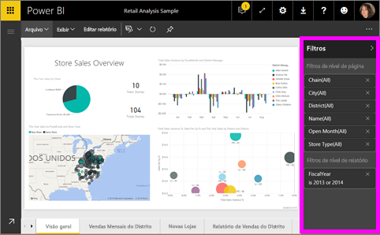
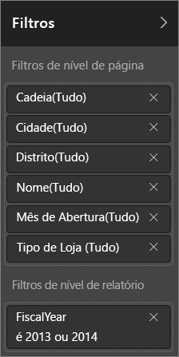
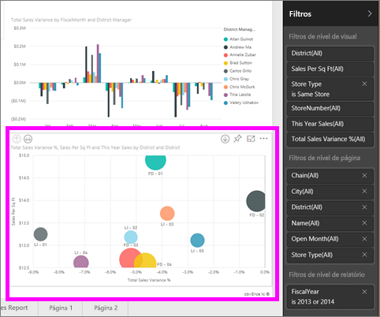

# Filtros e realce em relatórios do Power BI
 Este artigo apresenta a você a filtragem e o realce no serviço do Power BI. A experiência é quase exatamente igual no Power BI Desktop. Os *Filtros* removem tudo, menos os dados que você deseja se concentrar. *Realce* não é filtragem. Ele não remove dados, mas realça um subconjunto dos dados visíveis. Os dados não realçados permanecem visíveis, mas esmaecidos.

Há muitas maneiras diferentes de filtrar e realçar relatórios no Power BI. Colocar todas essas informações em um artigo seria confuso, portanto, nós as dividimos nessas seções:

* Introdução a filtros e realce, o artigo que você está lendo agora.
* Como [criar e usar filtros na exibição Edição](power-bi-report-add-filter.md) em relatórios no Power BI Desktop e no serviço do Power BI. Quando você tem permissões de edição para um relatório, pode criar, modificar e excluir filtros em relatórios.
* Como os visuais [filtram e realçam em um relatório compartilhado com você](consumer/end-user-interactions.md), na exibição de Leitura de relatório no serviço do Power BI. O que você pode fazer é mais limitado, mas ainda tem uma ampla variedade de opções de filtragem e realce.  
* Uma apresentação detalhada dos [controles de filtro e realce disponíveis na exibição Edição](power-bi-report-add-filter.md) no Power BI Desktop e no serviço do Power BI. O artigo faz uma análise detalhada dos tipos de filtros, como data e hora, numéricos e texto. Ele também aborda as diferenças entre as opções básica e avançada.
* Agora que você aprendeu como filtros e realce funcionam por padrão, [saiba como alterar a maneira pela qual as visualizações em uma página filtram e realçam umas às outras](service-reports-visual-interactions.md)

**Você sabia?** O Power BI tem uma nova experiência de filtro, atualmente em versão prévia. Leia mais sobre [a nova experiência de filtro em relatórios do Power BI](power-bi-report-filter.md).

## Introdução ao painel Filtros

Você pode aplicar filtros no painel **Filtros** ou [fazendo seleções na segmentação de dados](visuals/power-bi-visualization-slicers.md) diretamente no próprio relatório. O painel Filtros mostra as tabelas e os campos usados no relatório e os filtros aplicados, caso haja algum. 

Há quatro tipos de filtros.

- Um **filtro de página** se aplica a todos os visuais da página do relatório     
- Um **filtro de visual** se aplica a um único visual da página do relatório. Você só verá filtros no nível visual se tiver selecionado um visual na tela de relatório.    
- Um **filtro de relatório** se aplica a todas as páginas no relatório    
- Um **filtro de detalhamento** se aplica a uma única entidade em um relatório    

Você pode pesquisar na página, no elemento visual e nos filtros de relatório, no Modo de Exibição de Leitura ou de Edição, para localizar e selecionar o valor desejado. 

Se o filtro tiver a palavra **All** ao lado, isso significará que todos os valores no campo serão incluídos no filtro.  Por exemplo, **Chain(All)** na captura de tela abaixo informa que essa página de relatório inclui dados sobre cadeias de armazenamento.  Por outro lado, o filtro de nível de relatório ou **FiscalYear é 2013 ou 2014** informa que o relatório inclui somente dados para os anos fiscais de 2013 e 2014.

## Filtros no Modo de Exibição de Leitura ou de Edição
Há dois modos de interagir com relatórios: [Modo de Exibição de Leitura](consumer/end-user-reading-view.md) e Modo de Exibição de Edição. Os recursos de filtragem disponíveis para você dependem do modo no qual você está.

* No Modo de Exibição de Edição é possível adicionar filtros de relatório, de página, de detalhamento e de visual. Quando você salvar o relatório, os filtros serão salvos com o relatório, mesmo se você os abrir em um aplicativo móvel. Pessoas olhando para o relatório no Modo de Exibição de Leitura podem interagir com os filtros que você adicionou, mas não podem adicionar novos filtros.
* No Modo de Exibição de Leitura, você pode interagir com todos os filtros já existentes no relatório e salvar a seleção feita por você. Você não pode adicionar novos filtros.

### Filtros no Modo de Exibição de Leitura
Se você só tiver acesso a um relatório no Modo de Exibição de Leitura, o painel Filtros terá uma aparência semelhante a esta:

Então, essa página do relatório tem seis filtros de nível de página e um filtro de nível de relatório.

Cada elemento visual pode ter filtros para todos os campos no elemento visual e um autor de relatório pode adicionar mais. Na imagem abaixo, o gráfico de bolhas tem seis filtros.

No Modo de exibição de leitura, explore os dados modificando os filtros existentes. As alterações que você fizer serão salvas com o relatório, mesmo se você abrir o relatório em um aplicativo móvel. Aprenda a [fazer um tour pelo painel Filtros do relatório](consumer/end-user-report-filter.md)

Quando você sair do relatório, seus filtros serão salvos. Para desfazer a filtragem e retornar às definições padrão de filtragem, divisão, análise e classificação configuradas pelo autor do relatório, selecione **Redefinir para padrão** na barra de menus superior.

### Filtros no Modo de exibição de edição
Quando você tem permissões do proprietário para um relatório e o abre no Modo de exibição de edição, vê que **Filtros** é apenas um dos vários painéis de edição disponíveis.

No Modo de Exibição de Leitura, essa página do relatório tem seis filtros de nível de página e um filtro de nível de relatório. E ao selecionar o gráfico de bolhas, veríamos que ele tem seis filtros de nível de visual aplicados.

Podemos fazer muito mais com filtros e destaque no Modo de Exibição de Edição. Principalmente, podemos adicionar novos filtros. Saiba como [Adicionar um filtro a um relatório](power-bi-report-add-filter.md) e muito mais.

## Realce ad hoc
Selecione um rótulo de valor ou de eixo em um visual para realçar os outros elementos visuais na página. Para remover o realce, selecione o valor novamente ou selecione qualquer espaço vazio no mesmo visual. O realce é uma maneira divertida de explorar rapidamente os impactos dos dados. Para ajustar como esse tipo de realce cruzado funciona, consulte [Interações visuais](service-reports-visual-interactions.md).

## Próximas etapas

[A nova experiência de filtro em relatórios do Power BI](power-bi-report-filter.md)

[Adicionar um filtro a um relatório (no Modo de Exibição de Edição)](power-bi-report-add-filter.md)

[Faça um tour pelo painel Filtros do relatório](consumer/end-user-report-filter.md)

[Alterar como elementos visuais de relatórios executam filtro cruzado e realce cruzado entre si](consumer/end-user-interactions.md)

Mais perguntas? [Experimente a Comunidade do Power BI](http://community.powerbi.com/)

