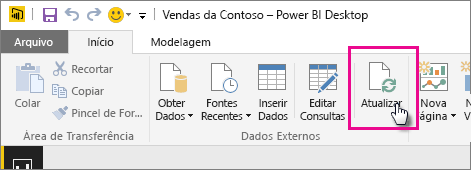
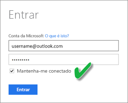

# Atualizar um conjunto de dados armazenado no OneDrive ou no SharePoint Online
Importar arquivos do OneDrive ou SharePoint Online para o serviço Power BI é uma ótima maneira de garantir que o seu trabalho no Power BI Desktop permaneça em sincronia com o serviço do Power BI.

## Vantagens de armazenar um arquivo do Power BI Desktop no OneDrive ou no SharePoint Online
Quando você armazena um arquivo do Power BI Desktop no OneDrive ou no SharePoint Online, os dados que você tiver carregado para o modelo do seu arquivo são importados para o conjunto de dados. Todos os relatórios que você criou no arquivo são carregados nos **Relatórios** no serviço do Power BI. Digamos que você faça alterações em seu arquivo no OneDrive ou no SharePoint Online. Essas alterações podem incluir a adição de novas medidas, a alteração dos nomes das colunas ou a edição de visualizações. Depois de salvar o arquivo, o serviço do Power BI também é sincronizado com essas alterações, geralmente em cerca de uma hora.

É possível realizar uma única atualização manual diretamente no Power BI Desktop selecionando **Atualizar** na faixa de opções **Início**. Ao selecionar **Atualizar**, você atualiza o modelo do arquivo com os dados atualizados da fonte de dados original. Esse tipo de atualização ocorre inteiramente no próprio aplicativo do Power BI Desktop. Ele é diferente de uma atualização manual ou agendada no Power BI, e é importante compreender a diferença.

Quando você importa o arquivo do Power BI Desktop do OneDrive ou SharePoint Online, você carrega os dados e informações sobre o modelo em um conjunto de dados no Power BI. Você desejará atualizar o conjunto de dados no serviço do Power BI, pois é nisso que seus relatórios são baseados. Como as fontes de dados são externas, é possível atualizar manualmente o conjunto de dados usando **Atualizar agora** ou configurar um agendamento de atualização usando **Agendar Atualização**. 

Quando você atualiza o conjunto de dados, o Power BI não se conecta ao arquivo no OneDrive ou SharePoint Online para consultar e verificar se há dados atualizados. Ele usa informações do conjunto de dados para conectar diretamente às fontes de dados e consultar dados atualizados. Em seguida, ele carrega esses dados no conjunto de dados. Esses dados atualizados no conjunto de dados não são sincronizados de volta com o arquivo no OneDrive ou SharePoint Online.

## O que tem suporte?
O Power BI dá suporte para **Atualizar** e **Agendar Atualização** para conjuntos de dados criados por meio de arquivos do Power BI Desktop importados de uma unidade local em que **Obter Dados** ou o **Editor de Consultas** é usado para se conectar e carregar dados de qualquer uma das seguintes fontes de dados.

### Gateway do Power BI - Pessoal
* Todas as fontes de dados online mostradas em **Obter Dados** e no **Editor de Consultas** no Power BI Desktop.
* Todas as fontes de dados locais mostradas em **Obter Dados** e no **Editor de Consultas** no Power BI Desktop, exceto o Arquivo do Hadoop (HDFS) e o Microsoft Exchange.

<!-- Refresh Data sources-->
[!INCLUDE [refresh-datasources](./includes/refresh-datasources.md)]

> [!NOTE]
> Um gateway deve ser instalado e estar em execução para que o Power BI se conecte a fontes de dados locais e atualize o conjunto de dados.
> 
> 

## OneDrive ou OneDrive for Business. Qual é a diferença?
Se você tiver um OneDrive Pessoal e um OneDrive para Empresas, você deve manter todos os arquivos que deseja importar no Power BI no OneDrive para Empresas. Eis o porquê: Você provavelmente usa duas contas diferentes para entrar neles.

Quando você se conecta ao OneDrive for Business no Power BI, a conexão é fácil porque sua conta do Power BI é geralmente a mesma conta que a conta do OneDrive for Business. Com o OneDrive pessoal, você geralmente entrará com outra [conta da Microsoft](https://account.microsoft.com).

Quando você entrar com sua conta da Microsoft, certifique-se de selecionar **Mantenha-me conectado**. O Power BI pode então sincronizar as atualizações feitas no arquivo do Power BI Desktop com conjuntos de dados no Power BI.

Se você alterou suas credenciais da Microsoft, não poderá sincronizar as alterações entre seu arquivo no OneDrive e o conjunto de dados no Power BI. Você precisa se conectar e importar seu arquivo novamente do OneDrive.

## Como faço para agendar uma atualização?
Quando você configura um agendamento de atualização, o Power BI se conecta diretamente às fontes de dados. O Power BI usa informações de conexão e credenciais no conjunto de dados para consultar dados atualizados. Em seguida, o Power BI carrega os dados atualizados no conjunto de dados. Ele então atualiza todas as visualizações e painéis baseadas nesse conjunto de dados no serviço do Power BI.

Para obter detalhes de como configurar a atualização agendada, confira [Configurar uma atualização agendada](refresh-scheduled-refresh.md).

## Quando algo dá errado
Quando algo dá errado, geralmente é porque o Power BI não pode entrar em fontes de dados. As coisas também podem dar errado se o conjunto de dados tentar se conectar a uma fonte de dados local, mas o gateway estiver offline. Para evitar esses problemas, verifique se o Power BI pode entrar em fontes de dados. Tente entrar em suas fontes de dados em **Credenciais da Fonte de Dados**. Às vezes, a senha que você usa para entrar em uma fonte de dados é alterada ou o Power BI é desconectado de uma fonte de dados.

Quando você salva suas alterações no arquivo do Power BI Desktop no OneDrive e não vê essas alterações no Power BI em uma hora, talvez seja porque o Power BI não pode se conectar ao seu OneDrive. Tente se conectar novamente ao arquivo no OneDrive. Se você for solicitado a entrar, certifique-se de selecionar **Manter-me conectado**. Como o Power BI não conseguiu se conectar ao seu OneDrive para sincronizar com o arquivo, você precisará importar o arquivo novamente.

Lembre-se de deixar a opção **Enviar email de notificação de falha de atualização para mim** marcada. Você desejará saber imediatamente de uma falha em uma atualização agendada.

## Solução de problemas
Às vezes, a atualização de dados pode não ocorrer da maneira esperada. Você normalmente se deparará com problemas de atualização de dados quando estiver conectado a um gateway. Examine os artigos de solução de problemas do gateway para ver ferramentas e problemas conhecidos.

[Solução de problemas do gateway de dados local](service-gateway-onprem-tshoot.md)

[Solução de problemas do Gateway do Power BI – Pessoal](service-admin-troubleshooting-power-bi-personal-gateway.md)

Mais perguntas? Experimente perguntar à [Comunidade do Power BI](http://community.powerbi.com/).

