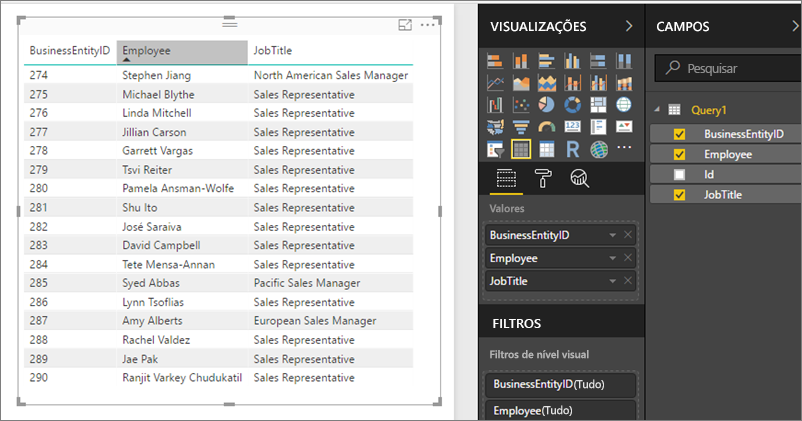

# Acessando conjuntos de dados compartilhados como feeds OData no Servidor de Relatórios do Power BI
Você pode acessar os conjuntos de dados compartilhados do Power BI Desktop com um feed OData.

1. Com a URL do feed OData, você pode conectar-se à fonte do OData.
   
    
2. Depois de colocar os dados no Power BI Desktop, será possível modificá-los no Editor de Consultas.
   
    
3. Agora você pode usar os dados na criação de relatórios.
   
    

Lembre-se de usar as **Opções Avançadas** para ativar as Colunas de Tipo Aberto e formatar as colunas adequadamente no Power Query para atender às suas necessidades.

Leia mais sobre como [conectar-se aos campos do OData no Power BI Desktop](../desktop-connect-odata.md).

Mais perguntas? [Experimente perguntar à Comunidade do Power BI](https://community.powerbi.com/)

