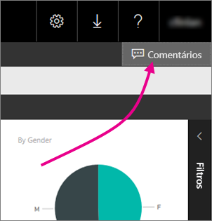
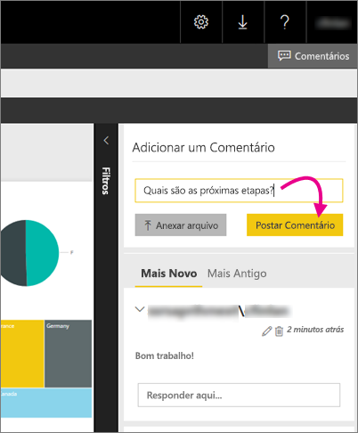

# Adicionar comentários a um relatório em um servidor de relatório – Servidor de Relatórios do Power BI
É possível adicionar comentários a relatórios, incluindo relatórios do Power BI, no portal da Web de um servidor de relatório. Os comentários permanecem com o relatório e qualquer pessoa com as permissões corretas pode ver os comentários no relatório. Veja a seção [Permissões](#permissions) abaixo para obter detalhes.

## Adicionar ou exibir comentários
1. Abra um relatório paginado ou do Power BI em um servidor de relatório.
2. No canto superior direito, selecione **Comentários**.
   
    
   
    No painel de Comentários, você pode ver os comentários existentes.
3. Escreva seu comentário e clique em **Postar Comentário**.
   
    
   
    Seu comentário é exibido painel no portal da Web, em conjunto com qualquer comentário anterior. Eles não são exibidos com o relatório nos aplicativos móveis do Power BI.
   
   > [!TIP]
   > Você sabia? É possível [anotar relatórios do Power BI nos aplicativos móveis do Power BI](../consumer/mobile/mobile-annotate-and-share-a-tile-from-the-mobile-apps.md) e compartilhar os relatórios anotados com outras pessoas.
   > 
   > 

## Permissões
Dependendo de suas permissões, você pode:

* não ver comentários.
* ver todos os comentários, postar, editar e excluir seus próprios comentários.
* ver todos os comentários; postar, editar e excluir seus próprios comentários e excluir comentários de outras pessoas.

## Próximas etapas
* [O que é o Servidor de Relatórios do Power BI?](get-started.md)  

Mais perguntas? [Experimente perguntar à Comunidade do Power BI](https://community.powerbi.com/)

