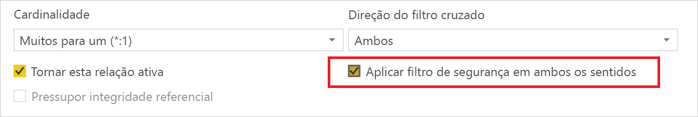
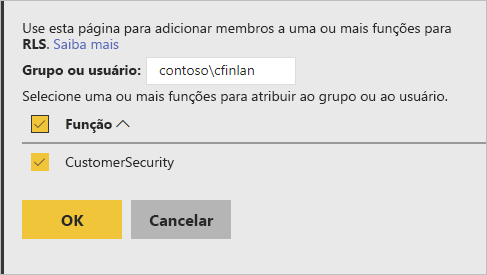
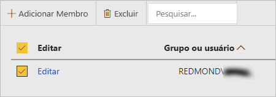

# RLS (Segurança em Nível de Linha) no Servidor de Relatórios do Power BI

Configurar a RLS (Segurança em Nível de Linha) com o Servidor de Relatórios do Microsoft Power BI pode restringir acesso a dados para determinados usuários. Os filtros restringem o acesso a dados no nível da linha e você pode definir filtros nas funções.  Se você estiver usando as permissões padrão no Servidor de Relatórios do Power BI, qualquer usuário com permissões de Publicador ou Gerenciador de Conteúdo para o relatório do Power BI poderá atribuir membros a funções para esse relatório.    

Você configura a RLS para relatórios importados para o Power BI com o Power BI Desktop. Você também pode configurar a RLS em relatórios que usam DirectQuery, tais como os do SQL Server.  Lembre-se de que a RLS não será respeitada se sua conexão de DirectQuery usar a autenticação integrada para leitores de relatórios. Para as conexões dinâmicas do Analysis Services, configure a Segurança em Nível de Linha no modelo local. A opção de segurança não é exibida para conjuntos de dados com conexão dinâmica. 

[!INCLUDE [rls-desktop-define-roles](../includes/rls-desktop-define-roles.md)]

## Filtragem cruzada bidirecional

Por padrão, a filtragem de segurança em nível de linha usa filtros unidirecionais, independentemente se as relações forem definidas para unidirecional ou bidirecional. Você pode habilitar manualmente a filtragem cruzada bidirecional com segurança em nível de linha.

- Selecione a relação e marque a caixa de seleção  **Aplicar filtro de segurança em ambos os sentidos** . 

    

Marque essa caixa ao implementar a  [segurança de nível de linha dinâmica](https://docs.microsoft.com/sql/analysis-services/supplemental-lesson-implement-dynamic-security-by-using-row-filters) com base no nome de usuário ou na ID de logon. 

Para saber mais, consulte [Filtragem cruzada bidirecional usando o DirectQuery no Power BI Desktop](../desktop-bidirectional-filtering.md) e o whitepaper técnico [Protegendo o modelo semântico de BI de tabela](http://download.microsoft.com/download/D/2/0/D20E1C5F-72EA-4505-9F26-FEF9550EFD44/Securing%20the%20Tabular%20BI%20Semantic%20Model.docx).

[!INCLUDE [rls-desktop-view-as-roles](../includes/rls-desktop-view-as-roles.md)]

## Adicionar membros a funções 

Depois de salvar seu relatório no Servidor de Relatórios do Power BI, você gerencia a segurança e adiciona ou remove membros no servidor. Somente usuários com permissões de Publicador ou de Gerenciador de Conteúdo para o relatório têm a opção de segurança de nível de linha disponível e não esmaecida.

 Se o relatório não tiver as funções necessárias, você precisará abri-lo no Power BI Desktop, adicionar ou modificar as funções e salvá-lo de volta no Servidor de Relatórios do Power BI. 

1. No Power BI Desktop, salve o relatório no Servidor de Relatórios do Power BI. Você precisa usar a versão do Power BI Desktop otimizada para o Servidor de Relatórios do Power BI.
2. No Servidor de Relatórios do Power BI, selecione as reticências (**...**) ao lado do relatório. 

3. Selecione  **Gerenciar** > **Segurança em nível de linha**. 

     

    Na página **Segurança em nível de linha**, você adiciona membros a uma função que você criou no Power BI Desktop.

5. Para adicionar um membro, selecione **Adicionar Membro**.

1. Insira o usuário ou grupo na caixa de texto no formato de nome de usuário (DOMÍNIO\usuário) e selecione as funções que você deseja atribuir a ele. Esse membro deve estar em sua organização.   

    

    Dependendo de como o Active Directory estiver configurado, inserir o nome UPN aqui também funciona. Nesse caso, o servidor de relatório mostra o nome de usuário correspondente na lista.

1. Clique em **OK** para aplicar.   

8. Para remover membros, marque a caixa ao lado de seus nomes e selecione **Excluir**.  Você pode excluir vários membros de cada vez. 

    

## UserName () e userprincipalname()

Você pode aproveitar as funções DAX username() ou userprincipalname() dentro de seu conjunto de dados. Você pode usá-las dentro de expressões no Power BI Desktop. Quando você publica seu modelo, ele é usado pelo Servidor de Relatórios do Power BI.

No Power BI Desktop, username() retorna um usuário no formato DOMÍNIO\Usuário e userprincipalname() retorna um usuário no formato user@contoso.com.

No Servidor de Relatórios do Power BI, username() e userPrincipalName() retornam o nome UPN, que é semelhante a um endereço de email.

Se você estiver usando autenticação personalizada no Servidor de Relatórios do Power BI, ele retornará o formato de nome de usuário que você configurou para os usuários.  

## Limitações 

Veja a seguir uma lista das limitações atuais da segurança em nível de linha nos modelos do Power BI. 

Os usuários que tinham relatórios usando a função DAX username() observarão agora o novo comportamento, em que o nome UPN é retornado, exceto ao usar o DirectQuery com segurança integrada.  Uma vez que a RLS não é respeitada nesse cenário, o comportamento nesse cenário não apresenta alterações.

Você pode definir a RLS somente nos conjuntos de dados criados com o Power BI Desktop. Se desejar habilitar a RLS para conjuntos de dados criados com o Excel, você deverá primeiro converter os arquivos em arquivos PBIX (Power BI Desktop). Saiba mais sobre [conversão de arquivos de Excel](../desktop-import-excel-workbooks.md).

As conexões ETL (de extração, transformação e carregamento) e DirectQuery são compatíveis usando as credenciais armazenadas. Conexões dinâmicas do Analysis Services e conexões DirectQuery usando a autenticação integrada são tratadas na fonte de dados subjacente. 

Se você estiver usando segurança integrada com o DirectQuery, seus usuários poderão observar o seguinte:
- A RLS é desabilitada e todos os dados são retornados.
- Os usuários não podem atualizar suas atribuições de função e obtêm um erro na página Gerenciar RLS.
- Para a função de nome de usuário DAX, você continua a receber o nome de usuário como DOMÍNIO\USUÁRIO. 

Os autores de relatório não têm acesso para exibir os dados de relatório no Servidor de Relatórios do Power BI até que eles próprios atribuam funções adequadamente depois de carregar o relatório. 

 

## PERGUNTAS FREQUENTES 

### Posso criar essas funções para fontes de dados do Analysis Services? 

Sim, isso é possível se você importou os dados no Power BI Desktop. Se você estiver usando uma conexão dinâmica, não poderá configurar a RLS no serviço do Power BI. A RLS é definida no modelo local do Analysis Services. 

### Posso usar a RLS para limitar as colunas ou as medidas acessíveis por meus usuários? 

Não. Se um usuário tiver acesso a uma linha específica de dados, ele poderá ver todas as colunas de dados dessa linha. 

### A RLS permite ocultar dados detalhados, mas conceder acesso aos dados resumidos nos visuais? 

Não. Você protege linhas individuais de dados, mas os usuários sempre podem ver os detalhes ou os dados resumidos. 

### Posso adicionar novas funções no Power BI Desktop se eu já tiver funções e membros atribuídos existentes? 

Sim, se você já tiver definidas as funções existentes e membros atribuídos no Servidor de Relatórios do Power BI, você poderá criar funções adicionais e republicar o relatório sem afetar as atribuições atuais. 
 

## Próximas etapas

[O que é o Servidor de Relatórios do Power BI?](get-started.md) 
[Manual do administrador](admin-handbook-overview.md)  

Mais perguntas? [Experimente perguntar à Comunidade do Power BI](https://community.powerbi.com/)