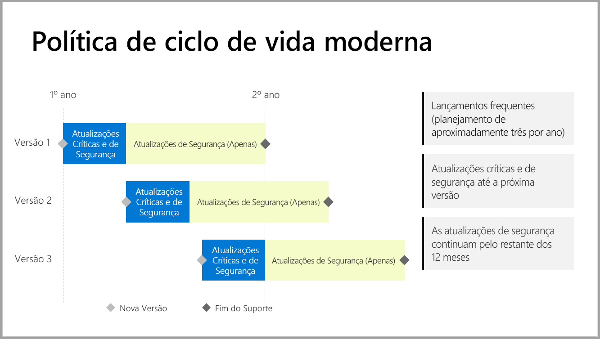

# Linha do tempo de suporte para Servidor de Relatório do Power BI

O Servidor de Relatórios do Power BI é liberado algumas vezes por ano. Atualizações críticas e de segurança estão disponíveis até que a próxima versão seja lançada para o público geral (GA). Após a próxima versão, a versão anterior continua recebendo atualizações de segurança pelo restante do tempo de vida de 12 meses da versão.

Essa política de suporte nos permite fornecer inovação para os clientes em ritmo acelerado, além de flexibilidade para os clientes adotarem a inovação em seu ritmo.

* Fase de manutenção das Atualizações críticas e de segurança – ao executar a última versão atual do Servidor de Relatórios do Power BI, você recebe atualizações críticas e de segurança.
* Fase de manutenção (somente) de atualizações de segurança – após o lançamento de uma nova versão, o suporte para versões mais antigas é reduzido às atualizações de segurança somente durante o restante do ciclo de vida de suporte de 12 meses (mostrado na figura 1).

    

## Histórico de versão

| **Versão** | **Data de disponibilidade** | **Data de término do suporte** |
| --- | --- | --- |
| Junho de 2017 |12 de junho de 2017 |Não é mais compatível |
| Outubro de 2017 |31 de outubro de 2017 | Não é mais compatível |
| Março de 2018 | 19 de março de 2018 | 19 de março de 2019 |
| Agosto de 2018 | 15 de agosto de 2018 | 15 de agosto de 2019 |
| Janeiro de 2019 | 23 de janeiro de 2019 | 23 de janeiro de 2020 |

Para baixar o Servidor de Relatório do Power BI e o Power BI Desktop otimizado para o Servidor de Relatório do Power BI, acesse [Relatórios locais com o Servidor de Relatório do Power BI](https://powerbi.microsoft.com/report-server/).

## Próximas etapas
[Novidades no Servidor de Relatório do Power BI](whats-new.md)  
[O que é o Servidor de Relatórios do Power BI?](get-started.md)
[Visão geral do administrador](admin-handbook-overview.md)  
[Instalar o Servidor de Relatório do Power BI](install-report-server.md)  

Mais perguntas? [Experimente perguntar à Comunidade do Power BI](https://community.powerbi.com/)