# Exemplo de Rentabilidade do Cliente para o Power BI: Faça um tour

## Visão geral do exemplo de Rentabilidade do Cliente
O pacote de conteúdo Exemplo de Lucratividade do Cliente contém um dashboard, um relatório e um conjunto de dados relacionado a uma empresa que fabrica materiais de marketing. Esse dashboard foi criado por uma diretora financeira para ver métricas-chave de seus cinco gerentes de unidade de negócios (ou executivos), produtos, clientes e margens brutas (GM). Ela pode ver rapidamente quais fatores estão afetando a lucratividade.

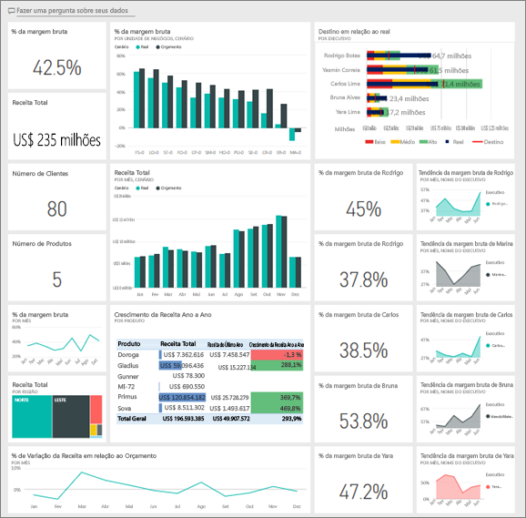

Este exemplo faz parte de uma série de exemplos que ilustra como o Power BI pode ser usado com dados, relatórios e painéis orientados aos negócios. Os exemplos foram criados usando dados reais da obviEnce ([www.obvience.com](http://www.obvience.com/)) que foram mantidos anônimos. Os dados estão disponíveis em vários formatos: aplicativo/pacote de conteúdo, a pasta de trabalho do Excel ou arquivo do Power BI Desktop .pbix. Confira [Exemplos para o Power BI](sample-datasets.md).

## Pré-requisitos
Quer me acompanhar? Este tutorial usa o serviço do Power BI e o pacote de conteúdo Exemplo de Lucratividade do Cliente. Como as experiências de relatório são muito semelhantes, você também pode acompanhar usando o Power BI Desktop e o arquivo de exemplo .pbix. Instruções para se conectar ao pacote de conteúdo e o arquivo .pbix são descritas na seção a seguir.

### Obter o pacote de conteúdo para este exemplo

1. Abra o serviço do Power BI (app.powerbi.com), entre e abra o workspace em que você deseja salvar o exemplo.

2. No canto inferior esquerdo, selecione **Obter Dados**.

    
3. Na página **Obter Dados** que aparece, selecione **Exemplos**.

4. Selecione **Exemplo de Rentabilidade do Cliente** e, em seguida, escolha **Conectar**.  

   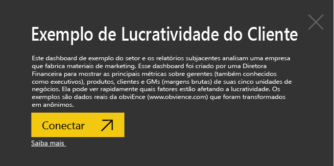
5. O Power BI importa o pacote de conteúdo e adiciona um novo dashboard, um relatório e um conjunto de dados ao seu workspace atual.

   

### Obter o arquivo. pbix para este exemplo

Como alternativa, você pode baixar o [Exemplo de Lucratividade do Cliente](http://download.microsoft.com/download/6/A/9/6A93FD6E-CBA5-40BD-B42E-4DCAE8CDD059/Customer%20Profitability%20Sample%20PBIX.pbix) como um arquivo .pbix, que é projetado para uso com o Power BI Desktop.

### Obter a pasta de trabalho do Excel para este exemplo

Se quiser exibir a fonte de dados deste exemplo, ela também está disponível como uma [Pasta de trabalho do Excel](http://go.microsoft.com/fwlink/?LinkId=529781). A pasta de trabalho contém planilhas do Power View que você pode exibir e modificar. Para ver os dados brutos, habilite os suplementos de Análise de dados e, em seguida, selecione **Power Pivot > Gerenciar**. Para habilitar os suplementos Power View e Power Pivot, confira [Dar uma olhada nos exemplos do Excel dentro do próprio Excel](sample-datasets.md#optional-take-a-look-at-the-excel-samples-from-inside-excel-itself) para obter detalhes.

## O que é nosso painel está dizendo?

No workspace em que você salvou o exemplo, localize o dashboard Rentabilidade do Cliente e selecione-o:

### Blocos de painel de toda a empresa
1. Abra o dashboard no serviço do Power BI. Esses blocos de painel dão ao nosso diretor financeiro métricas de empresa de alto nível importante para ela. Quando ela vir algo interessante, pode selecionar um bloco para examinar os dados.

2. Examine os blocos no lado esquerdo do painel.

    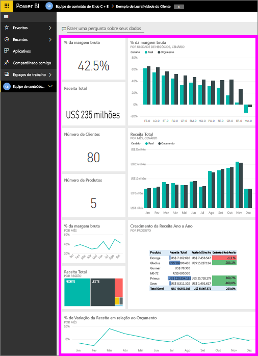

- A margem bruta da empresa é de 42,5%.
- Ele tem 80 clientes.
- Ela vende cinco produtos diferentes.
- Ela teve sua menor variação percentual de receita para o orçamento em fevereiro, seguida pela mais alta em março.
- A maioria da receita é proveniente das regiões leste e norte. A margem bruta nunca ultrapassou o orçamento, com as unidades de negócios ER-0 e MA-0 exigindo mais investigações.
- A receita total para o ano é quase o orçamento.

### Blocos do painel específico do gerente
Os blocos no lado direito do painel fornecem uma pontuação da equipe. A diretora financeira precisa manter controle de seus gerentes e esses blocos apresentam uma visão geral de alto nível do lucro usando GM %. Se a tendência de % GM é inesperada para qualquer gerenciador, poderá investigar mais.

Analisando os blocos do dashboard específicos para gerentes, podemos fazer as seguintes observações:

- Todos os executivos, exceto Carlos, já excederam suas metas de vendas. No entanto, as vendas reais de Carlos são as mais altas.
- O percentual de GM de Annelie é o mais baixo, mas podemos ver um aumento gradual desde março.
- Valery, por outro lado, teve queda na % de GM significante.
- E Andrew teve um ano volátil.

## Explore os dados subjacentes do painel
Este painel tem blocos que vinculam a um relatório e a uma pasta de trabalho do Excel.

### Abra a fonte de dados do Excel Online
Dois blocos neste dashboard, **Destino vs Real** e **Crescimento de receita ano a ano** foram fixados de uma pasta de trabalho do Excel. Quando você selecionar um desses blocos, o Power BI abrirá a fonte de dados – nesse caso, o Excel Online.

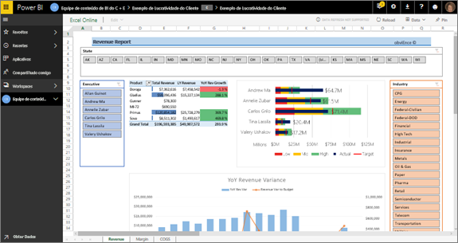

1. Selecione qualquer um dos blocos que foram fixados do Excel. O Excel Online é aberto dentro do serviço Power BI.
2. Observe que a pasta de trabalho tem três guias de dados. Abra **Receita**.
3. Vamos dar uma olhada para saber por que Carlos ainda não atingiu sua meta:  
    a. No controle deslizante **Executivo**, selecione **Carlos Grilo**.   
    b. A primeira Tabela Dinâmica informa que o crescimento de receita de Carlos para seu produto principal, Primus, diminuiu 152% com relação ao ano passado. O gráfico de Variação de receita ano a ano mostra que, na maioria dos meses, ele está abaixo do orçamento.  

    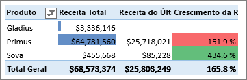

    

4. Continue a explorar. Se encontrar algo interessante, selecione **Fixar**  no canto superior direito para [fixá-lo a um dashboard](service-dashboard-pin-tile-from-excel.md).

5. Use a seta Voltar do navegador para retornar ao painel.

### Abra o relatório subjacente do Power BI
Muitos blocos no dashboard de exemplo Lucratividade do Cliente foram fixados do relatório de exemplo subjacente Lucratividade do Cliente.

1. Selecione um desses blocos para abrir o relatório no modo de exibição de leitura.

   Se o bloco foi criado em P e R, selecioná-lo abre a janela de P e R. Selecione **Sair de P e R** para voltar para o dashboard e tente um bloco diferente.

2. O relatório tem três páginas. Cada guia na parte inferior do relatório representa uma página diferente.

    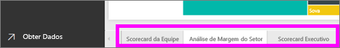

    * **Scorecard da Equipe** enfoca o desempenho dos cinco gerentes e seus registros de negócios.
    * **Análise de Margem do Setor** fornece uma maneira de analisar a rentabilidade comparado ao que está acontecendo em todo o setor.
    * **Scorecard Executivo** fornece uma visão de cada um dos gerentes formatada para exibição na Cortana.

### Página de pontuação da equipe

Vejamos os dois membros da equipe em detalhes e quais informações podem ser obtidas. Na caixa **Executivo** à esquerda, selecione nome de Andrew para filtrar a página do relatório e exibir apenas os dados sobre ele.

* Para um KPI rápido, examine o **Status de Receita (Total do Ano)** ; está verde, o que significa que ele tem um bom desempenho.
* O gráfico **% de Variação da Receita do Orçamento por Mês e Executivo** mostra que, exceto por uma queda em fevereiro, Andrew está indo bem no geral. Sua região dominante é o leste e ele lida com 49 clientes e com 5 de 7 produtos. Seu % de GM não é o mais alto nem o mais baixo.
* O gráfico **RevenueTY e % de Receita Var para Orçamento por Mês** mostra um histórico de lucratividade estável. No entanto, se filtrar selecionando o quadrado referente a **Central** no mapa de árvore da região, você descobrirá que Andrew tem receita apenas em março e apenas em Indiana. Isso é intencional ou é algo que precisa ser examinado?

Agora a diante com Valery. Na caixa **Executivo**, selecione nome de Valery para filtrar a página do relatório e exibir apenas os dados sobre ela. 

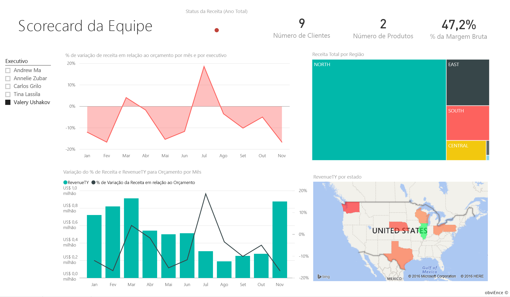

* Observe o KPI vermelho para **Status de Receita (Total do Ano)** . Este item definitivamente precisa de mais investigação.
* A variação de receita também mostra um cenário preocupante – ela não está alcançando suas margens de receita.
* Valery tem apenas nove clientes, lida com apenas dois produtos e trabalha quase exclusivamente com clientes da região norte. Essa especialização poderia explicar as amplas flutuações em sua métrica.
* Selecionar o quadrado **Norte** no mapa de árvore mostra que a margem bruta de Valery na região norte é condizente com sua margem geral.
* Selecionar outros quadrados de **Receita Total por Região** mostra uma história interessante: o % de GM dela varia de 23% a 79%. Os números de sua receita, em todas as regiões, exceto pela região norte, são extremamente sazonais.

Continue explorando para descobrir por que área de Valery não apresenta um bom desempenho. Examine as regiões, as outras unidades de negócios e a próxima página do relatório: **Análise de Margem do Setor**.

### Análise de Margem do Setor
Esta página de relatório fornece uma fatia diferente dos dados. Examina a margem bruta para todo o setor, dividido por segmento. O diretor financeiro usa essa página para comparar as métricas de unidade da empresa e comercial para métricas do setor para ajudar a explicar tendências e lucratividade. Você poderia se perguntar por que o gráfico **% de Margem Bruta por Mês e Executivo** está nesta página, já que é específico de uma equipe. Tê-la aqui, nos permite filtrar a página pelo gerente da unidade de negócios.  

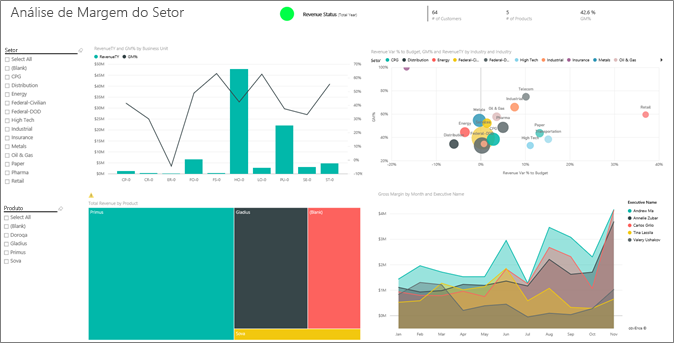

Como a lucratividade varia por setor? Como os produtos e clientes dividem por setor? Para responder a essas perguntas, selecione um ou mais setores na parte superior esquerda (comece pelo setor CPG). Para limpar o filtro, selecione o ícone de borracha.

No gráfico de bolhas ( **% de Var de Receita para Orçamento, % de GM e RevenueTY por Setor**), a diretora financeira procura as bolhas maiores, porque elas têm o maior impacto na receita. Para ver facilmente o impacto de cada gerente por setor, filtre a página clicando no nome de cada gerente no gráfico de área.

* A área de Andrew de influência abrange vários setores diferentes com diferentes amplamente % GM (a maioria do lado positivo) e % Var.
* O gráfico do Annelie é semelhante, exceto pelo fato de que ela se concentra em apenas alguns segmentos de mercado, com foco no segmento Federal e um foco no produto Gladius.
* Carlos tem um foco claro no segmento de serviços, com bom lucro. Ele aumentou bastante o % de Variação para o segmento de Alta Tecnologia e um novo segmento para ele, Industrial, executado muito bem em relação ao orçamento.
* Tina trabalha com alguns segmentos e tem % GM mais alta, mas o tamanho pequeno em grande parte das suas bolhas mostra que seu impacto sobre o resultado da empresa é mínimo.
* Valery, que é responsável por apenas um produto, trabalha apenas com cinco segmentos de mercado. Sua influência do setor é sazonal, mas sempre produz uma grande bolha, indicando um impacto significativo sobre o resultado da empresa. Os segmentos de setor explicam seu desempenho negativo?

### Scorecard Executivo
Esta página está formatada como uma página de resposta da Cortana para Cortana. Para saber mais, confira [Criar uma página de resposta personalizada para Cortana](service-cortana-answer-cards.md).

## Investigue os dados fazendo perguntas em P e R
Para nossa análise, poderia ser útil determinar qual setor gera a maior parte da receita para Valery. Vamos usar P e R.

1. Abra o relatório no modo de exibição Editar selecionado **Editar Relatório**. O modo de exibição de edição só estará disponível se você for o proprietário do relatório. Este modo de exibição às vezes é chamado de modo de **criador**. Por outro lado, se o relatório foi apenas compartilhado com você, não é possível abri-lo no modo de exibição de Edição.

2.  Na barra de menus superior, selecione **Fazer uma pergunta** para abrir a caixa de perguntas e respostas.

    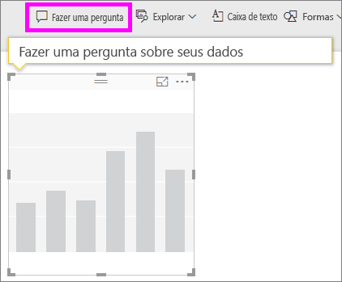

3. Digite *receita total por setor para Valery Ushakov*. Observe como a visualização atualiza conforme você digita a pergunta.

    

   Como você pode ver, o setor de Distribuição é a maior área de receita para Valery.

### Aprofunde-se adicionando filtros
Vamos dar uma olhada no setor de Distribuição.  

1. Abra a página de relatório **Análise de Margem do Setor**.
2. Sem selecionar nenhuma visualização na página do relatório, expanda o painel de filtro à direita (se já não estiver expandido). O painel **Filtros** deve exibir apenas **Filtros de nível de página**.  

   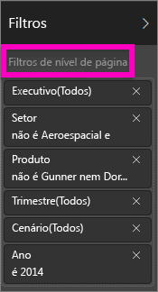
3. Localize o filtro para **Setor** e selecione a seta para expandir a lista. Vamos adicionar um filtro de página para o Setor de distribuição. Primeiro, limpe todas as seleções, desmarcando a caixa de seleção **Selecionar tudo**. Em seguida, selecione apenas **Distribuição.**  

   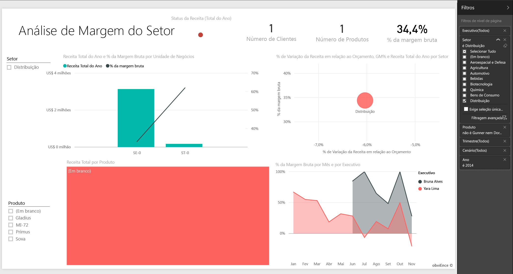
4. O gráfico **% de Margem Bruta por Mês e Executivo** informa que apenas Valery e Tina têm clientes neste setor e Valery trabalhou com o setor apenas de junho a novembro.   
5. Selecione **Tina** e, em seguida, **Valery** na legenda do gráfico **Margem Bruta por Mês e Executivo**. Observe que a parte de Tina no gráfico **Receita Total por Produto** é muito pequena se comparada à de Valery.
6. Para ver a receita real, use as perguntas e respostas para inserir *receita total da distribuição por cenário e executivo*.  

     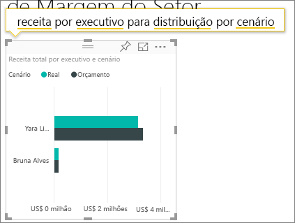

    Podemos explorar de forma semelhante a outros setores e até mesmo adicionar clientes a nossos visuais para compreender as causas para o desempenho de Valery.

Este é um ambiente seguro para experimentar. Você pode optar por não salvar as alterações. Mas se você salvá-las, sempre é possível selecionar **Obter Dados** para ter uma nova cópia deste exemplo.

Também é possível [baixar apenas o conjunto de dados (pasta de trabalho do Excel)](http://go.microsoft.com/fwlink/?LinkId=529781) para este exemplo

## Próximas etapas: Conecte-se aos seus dados
Esperamos que este tour tenha mostrado como os painéis do Power BI, perguntas e respostas, e os relatórios podem fornecer ideias sobre dados do cliente. Agora é sua vez – conecte-se aos seus próprios dados. Com o Power BI, é possível se conectar a uma grande variedade de fontes de dados. Saiba mais sobre [como começar a usar o Power BI](service-get-started.md).

[Exemplos para o Power BI](sample-datasets.md)  
