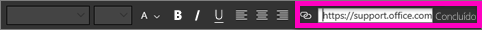
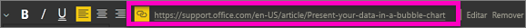
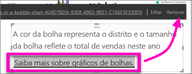

# Adicionar um hiperlink a uma caixa de texto em um relatório
Você pode adicionar caixas de texto a relatórios, fixá-las em dashboards por meio de relatórios e adicioná-las diretamente aos dashboards. Onde quer que a caixa de texto esteja, você sempre poderá adicionar um hiperlink a ela.  

> **OBSERVAÇÃO**: para saber mais sobre hiperlinks nas tabelas e matrizes do Power BI, consulte [Hiperlinks em tabelas](power-bi-hyperlinks-in-tables.md). Para obter informações sobre como adicionar caixas de texto a seu **painel**, veja [Adicionar um bloco diretamente do painel](service-dashboard-add-widget.md). 
> 
> 

<iframe width="560" height="315" src="https://www.youtube.com/embed/_3q6VEBhGew#t=0m55s" frameborder="0" allowfullscreen></iframe>

## Para adicionar um hiperlink a uma caixa de texto em um relatório
1. [Crie uma caixa de texto e adicione um texto](power-bi-reports-add-text-and-shapes.md). 
2. Selecione o texto existente ou adicione um novo texto a ser usado como hiperlink.
   
   
3. Selecione o ícone de hiperlink .
4. Digite ou cole a URL no campo hiperlink e selecione **Concluído**.
   
   
5. Teste o link.  
   
   
   
   * Coloque o cursor em qualquer lugar no texto realçado para exibir a URL.  
     
      
   * Selecione a URL para abrir a página em uma nova janela do navegador.

## Para remover o hiperlink, mas deixar o texto
1. Na caixa de texto, selecione o hiperlink para realçá-lo,
   
     
2. Escolha **Remover**. 

## Próximas etapas
[Caixas de texto nos relatórios do Power BI](power-bi-reports-add-text-and-shapes.md)

Mais perguntas? [Experimente a Comunidade do Power BI](http://community.powerbi.com/)

