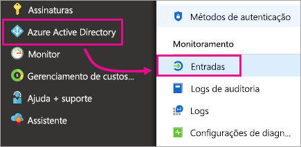
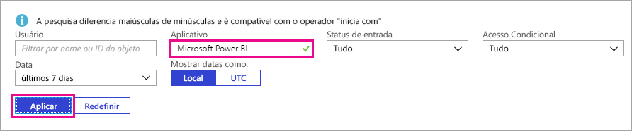

# Encontrar usuários do Power BI que entraram

Se for um administrador de locatários e quiser ver quem entrou no Power BI, use os [relatórios de acesso e uso do Azure Active Directory](/azure/active-directory/reports-monitoring/concept-sign-ins) para ter essa visibilidade.

<iframe width="640" height="360" src="https://www.youtube.com/embed/1AVgh9w9VM8?showinfo=0" frameborder="0" allowfullscreen></iframe>

> [!NOTE]
> O relatório de atividade fornece informações úteis, mas não identifica o tipo de licença que cada usuário tem. Use o centro de administração do Microsoft 365 para ver as licenças.

## Requisitos

Qualquer usuário (inclusive os não administradores) pode ver um relatório de suas próprias entradas, mas você deve atender aos requisitos a seguir para ver um relatório para todos os usuários.

* Seu locatário deve ter uma licença do Azure AD Premium associada a ele.

* Você deve ter uma das seguintes funções: Administrador Global, Administrador de Segurança ou Leitor de Segurança.

## Usar o Portal do Azure para exibir entradas

Para exibir a atividade de entrada, siga estas etapas.

1. No **Portal do Azure**, selecione **Azure Active Directory**.

1. Em **Monitoramento**, selecione **Entradas**.
   
    

1. Filtre o aplicativo segundo **Microsoft Power BI** ou **Power BI Gateway** e selecione **Aplicar**.

    O **Microsoft Power BI** filtra a atividade de entrada relacionada ao serviço, enquanto o **Power BI Gateway** filtra atividades de entrada específicas para o gateway de dados local.
   
    

## Exportar os dados

Você tem duas opções para exportar os dados de entrada: baixe um arquivo csv ou use o PowerShell. Na parte superior do relatório de entrada, selecione uma das seguintes opções:

* **Download** para baixar um arquivo csv com os dados filtrados no momento.

* **Script** para baixar um script do PowerShell para os dados filtrados no momento. Você pode atualizar o filtro no script conforme o necessário.

## Retenção de dados

Dados relacionados às entradas estão disponíveis por até 30 dias. Para obter mais informações, consulte [Políticas de retenção de relatórios do Azure Active Directory](/azure/active-directory/reports-monitoring/reference-reports-data-retention).

## Próximas etapas

[Usando a auditoria em sua organização](service-admin-auditing.md)

Mais perguntas? [Experimente perguntar à Comunidade do Power BI](https://community.powerbi.com/)

