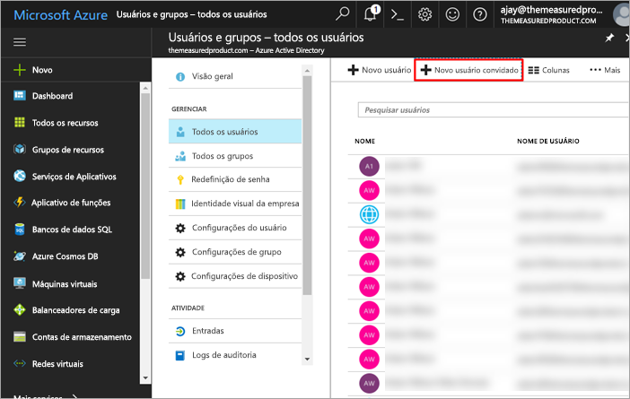
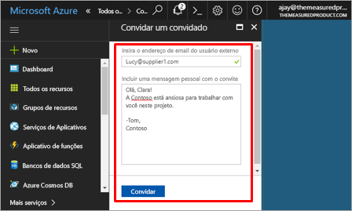
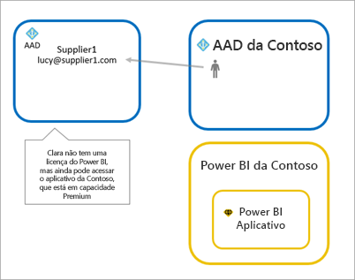
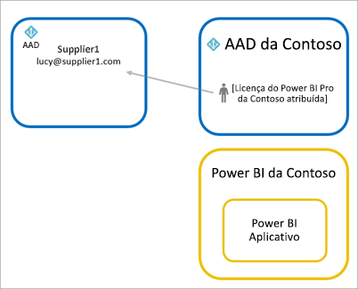
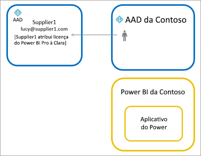

# Distribuir o conteúdo do Power BI para usuários convidados externo com o Azure AD B2B

O Power BI integra-se ao Azure AD B2B (Azure Active Directory business-to-business) para permitir distribuição segura do conteúdo do Power BI aos usuários convidados fora da sua organização, enquanto ainda mantém controle sobre os dados internos.

## Habilitar acesso

Habilite o recurso de [configurações de exportação e compartilhamento](service-admin-portal.md#export-and-sharing-settings) no portal de administração do Power BI antes de convidar usuários.

## Que você pode convidar?

Você pode convidar usuários que usam qualquer endereço de email, incluindo contas pessoais como gmail.com, outlook.com e hotmail.com. No Azure AD B2B, esses endereços são chamados de *identidades sociais*.

## Convidar usuários convidados

É necessário usar convites apenas na primeira vez que um usuário externo é convidado à sua organização. Há duas maneiras de convidar usuários: convites planejados e convites ad-hoc.

### Convites planejados

Use um convite planejado se souber quais usuários vai convidar. Envie o convite pelo Portal do Azure ou pelo PowerShell. Você deve ser administrador de locatários para convidar pessoas.

Execute estas etapas para enviar um convite no Portal do Azure.

1. No [Portal do Azure](https://portal.azure.com), selecione **Azure Active Directory**.

1. Em **Gerenciar**, acesse **Usuários** > **Todos os usuários** > **Novo usuário convidado**.

    

1. Insira um **endereço de email** e **mensagem pessoal**.

    

1. Selecione **Convidar**.

Para convidar mais de um usuário convidado, use o PowerShell. Para saber mais, confira [Amostras do código de colaboração e do PowerShell no Azure AD B2B](/azure/active-directory/b2b/code-samples/).

O usuário convidado precisa selecionar **Introdução** no convite que recebeu por email. O usuário convidado é adicionado ao locatário.

### Convites ad hoc

Para fazer um convite em qualquer momento, adicione o usuário externo ao dashboard ou relatório por meio da interface do usuário de compartilhamento, ou em seu aplicativo, por meio da página de acesso. Aqui está um exemplo de como convidar um usuário externo para usar um aplicativo.

O usuário convidado receberá um email indicando que o aplicativo foi compartilhado com ele.

O usuário convidado deverá entrar com o endereço de email da organização. Será necessário aceitar o convite depois de entrar. Depois de entrar, o usuário convidado é redirecionado para o conteúdo do aplicativo. Para retornar ao aplicativo, basta marcar o link ou salvar o email.

## Licenças

O usuário convidado precisa ter a licença correta em vigor para ver o aplicativo compartilhado. Há três opções para fazer isso: usar o Power BI Premium; atribuir uma licença do Power BI Pro; ou usar a licença do Power BI Pro do convidado.

### Usar o Power BI Premium

A atribuição do espaço de trabalho do aplicativo à [capacidade do Power BI Premium](service-premium.md) permite que o usuário convidado use o aplicativo sem precisar de uma licença do Power BI Pro. O Power BI Premium também permite que aplicativos aproveitem outros recursos, como taxas mais altas de atualização, capacidade dedicada e tamanhos grandes de modelos.

### Atribuir uma licença do Power BI Pro ao usuário convidado

A atribuição de uma licença do Power BI Pro ao usuário convidado, dentro do locatário, permite que o usuário convidado veja o conteúdo no locatário.

### O usuário convidado traz a própria licença do Power BI Pro

O usuário convidado já tem uma licença do Power BI Pro atribuída em seu locatário.

## Considerações e limitações

* Convidados de B2B externos são limitados somente para consumo de conteúdo. Convidados de B2B externos podem exibir aplicativos, dashboards, relatórios, exportar dados e criar assinaturas de email para dashboards e relatórios. Eles não podem acessar os workspaces ou publicar seu próprio conteúdo.

* Este recurso não está disponível atualmente com os aplicativos móveis do Power BI. Em um dispositivo móvel, é possível exibir o conteúdo do Power BI compartilhado usando B2B do Azure AD em um navegador.

* Este recurso não está disponível atualmente com a web part de relatório do Power BI para o SharePoint Online.

## Próximas etapas

Para saber mais, incluindo como funciona a segurança no nível da linha, confira o white paper: [Distribuir conteúdo do Power BI para usuários externos convidados usando o Azure AD B2B](https://aka.ms/powerbi-b2b-whitepaper).

Para saber mais sobre o Azure AD B2B, confira [O que é a colaboração do Azure AD B2B?](/azure/active-directory/active-directory-b2b-what-is-azure-ad-b2b/).
