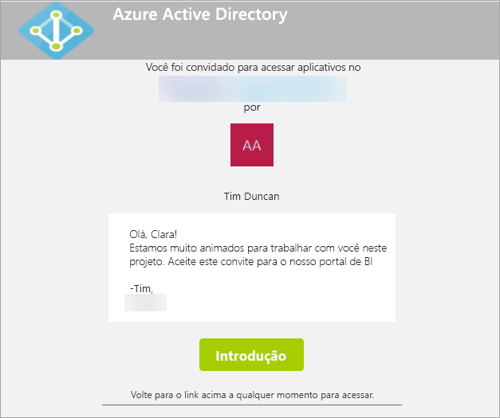
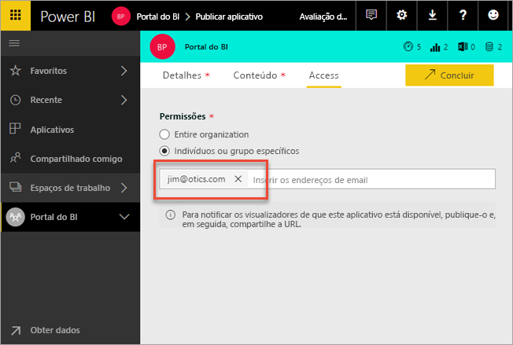
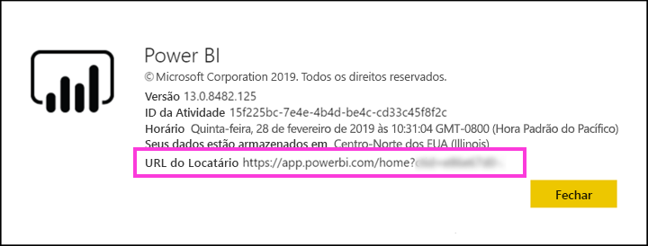

# Distribuir o conteúdo do Power BI para usuários convidados externo com o Azure AD B2B

O Power BI integra-se ao Azure AD B2B (Azure Active Directory business-to-business) para permitir distribuição segura do conteúdo do Power BI aos usuários convidados fora da sua organização, enquanto ainda mantém controle sobre os dados internos.  

Além disso, você pode permitir que usuários convidados fora da sua organização editem e gerenciem o conteúdo dentro de sua organização.

## Habilitar acesso

Certifique-se de ativar o recurso [Compartilhar conteúdo com usuários externos](service-admin-portal.md#export-and-sharing-settings) no portal de administração do Power BI antes de convidar usuários.

Você também pode usar o recurso [Permitir que os usuários externos convidados editem e gerenciem o conteúdo da organização](service-admin-portal.md#allow-external-guest-users-to-edit-and-manage-content-in-the-organization). Ele permite selecionar qual usuário convidado pode ver e criar conteúdo em espaço de trabalhos, incluindo a navegação do Power BI da organização.

## Que você pode convidar?

Você pode convidar usuários que usam qualquer endereço de email, incluindo contas pessoais como gmail.com, outlook.com e hotmail.com. O Azure AD B2B chama esses endereços de *identidades sociais*.

## Convidar usuários convidados

Os usuários convidados só precisam de convites na primeira vez que você os convida para sua organização. Há duas maneiras de convidar usuários: convites planejados e convites ad-hoc.

### Convites planejados

Use um convite planejado se souber quais usuários vai convidar. Envie o convite pelo Portal do Azure ou pelo PowerShell. Você deve ser administrador de locatários para convidar pessoas.

Execute estas etapas para enviar um convite no Portal do Azure.

1. No [Portal do Azure](https://portal.azure.com), selecione **Azure Active Directory**.

1. Em **Gerenciar**, selecione **Usuários** > **Todos os usuários** > **Novo usuário convidado**.

    

1. Insira um **endereço de email** e **mensagem pessoal**.

    

1. Selecione **Convidar**.

Para convidar mais de um usuário convidado, use o PowerShell. Para saber mais, confira [Amostras do código de colaboração e do PowerShell no Azure AD B2B](/azure/active-directory/b2b/code-samples/).

O usuário convidado precisa selecionar **Introdução** no convite que recebeu por email. O usuário convidado é adicionado ao locatário.

### Convites ad hoc

Para convidar um usuário externo a qualquer momento, adicione-o ao seu painel ou informe-o por meio da interface compartilhada ou do aplicativo por meio da página de acesso. Aqui está um exemplo de como convidar um usuário externo para usar um aplicativo.

O usuário convidado receberá um email indicando que você compartilhou o aplicativo com ele.

O usuário convidado deverá entrar com o endereço de email da organização. Eles receberão uma solicitação para aceitar o convite depois de entrar. Depois de entrar, o aplicativo é aberto para o usuário convidado. Para retornar ao aplicativo, basta marcar o link ou salvar o email.

## Licenças

O usuário convidado precisa ter a licença correta em vigor para ver o conteúdo compartilhado. Existem três maneiras de garantir que o usuário tenha uma licença adequada: usar o Power BI Premium, atribuir uma licença do Power BI Pro ou usar a licença do Power BI Pro do convidado.

Ao usar o recurso [Permitir que os usuários externos convidados editem e gerenciem o conteúdo da organização](service-admin-portal.md#allow-external-guest-users-to-edit-and-manage-content-in-the-organization), usuários convidados que contribuem com conteúdo para os workspaces ou compartilham conteúdo com outras pessoas exigem uma licença do Power BI Pro.

### Usar o Power BI Premium

A atribuição do espaço de trabalho do aplicativo à [capacidade do Power BI Premium](service-premium-what-is.md) permite que o usuário convidado use o aplicativo sem precisar de uma licença do Power BI Pro. O Power BI Premium também permite que aplicativos aproveitem outros recursos, como taxas mais altas de atualização, capacidade dedicada e tamanhos grandes de modelos.

### Atribuir uma licença do Power BI Pro ao usuário convidado

A atribuição de uma licença do Power BI Pro ao usuário convidado, dentro do locatário, permite que o usuário convidado veja o conteúdo no locatário.

### O usuário convidado traz a própria licença do Power BI Pro

O usuário convidado já tem uma licença do Power BI Pro atribuída em seu locatário.

## Usuários convidados que podem editar e gerenciar conteúdo 

Ao usar o recurso [Permitir que os usuários externos convidados editem e gerenciem o conteúdo da organização](service-admin-portal.md#allow-external-guest-users-to-edit-and-manage-content-in-the-organization), os usuários convidados especificados obtêm acesso ao Power BI. Eles podem ver qualquer conteúdo para o qual tenham permissão. Eles podem acessar a página inicial, navegar por espaço de trabalhos, instalar aplicativos, ver onde estão na lista de acesso e contribuir com conteúdo para os espaço de trabalhos. Eles podem ser administradores de workspaces que usam a nova experiência de workspace e até mesmo criar tais workspaces. Algumas limitações se aplicam. A seção Considerações e Limitações lista essas restrições.
 
Para ajudar esses usuários a fazerem logon no Power BI, forneça a eles a URL do locatário. Para localizar a URL do locatário, siga estas etapas.

1. No serviço do Power BI, no menu superior, selecione a Ajuda ( **?** ), em seguida, **Sobre o Power BI**.

2. Procure o valor ao lado de **URL do locatário**. O valor é a URL do locatário que você pode compartilhar com seus usuários convidados.

    

## Considerações e limitações

* Por padrão, o Azure AD B2B externo limita os convidados ao consumo apenas de conteúdo. Os convidados de Azure AD B2B externos podem exibir aplicativos, painéis, relatórios, exportar dados e criar assinaturas de email para painéis e relatórios. Eles não podem acessar os workspaces ou publicar seu próprio conteúdo. No entanto, essas restrições não se aplicam a usuários convidados que obtêm acesso por meio do recurso [Permitir que os usuários externos convidados editem e gerenciem o conteúdo da organização](service-admin-portal.md#allow-external-guest-users-to-edit-and-manage-content-in-the-organization).

* Algumas experiências não estão disponíveis para usuários convidados habilitados por meio do recurso [Permitir que os usuários externos convidados editem e gerenciem o conteúdo da organização](service-admin-portal.md#allow-external-guest-users-to-edit-and-manage-content-in-the-organization). Para atualizar ou publicar relatórios, eles precisarão usar a interface do usuário da Web do serviço do Power BI, incluindo Obter Dados para carregar arquivos do Power BI Desktop.  Não há suporte para as seguintes experiências:
    * Publicação direta do Power BI Desktop para o serviço do Power BI
    * Os usuários convidados não podem usar o Power BI Desktop para se conectar a conjuntos de dados de serviço no serviço do Power BI
    * Workspaces clássicos associados a Grupos do Office 365:
        * O usuário convidado não pode criar ou ser administrador dessas áreas de trabalho
        * Os usuários convidados podem ser membros
    * O envio de convites ad-hoc para listas de acesso do espaço de trabalho não é uma ação compatível
    * O Power BI Publisher para Excel não é compatível com usuários convidados
    * Os usuários convidados não podem instalar um Power BI Gateway e conectá-lo à sua organização
    * Os usuários convidados não podem instalar aplicativos e publicá-los para toda a organização
    * Os usuários convidados não podem usar, criar, atualizar ou instalar pacotes de conteúdo organizacional
    * Os usuários convidados não podem usar o Analisar no Excel
    * Os usuários convidados não podem ser @mentioned em comentários
    * Os usuários convidados não podem usar assinaturas
    * Usuários convidados que usam essa funcionalidade devem ter uma conta corporativa ou de estudante. Os usuários convidados usando contas pessoais terão mais limitações devido a restrições de entrada.

* No momento, este recurso não está disponível com a web part de relatório do Power BI para o SharePoint Online.

* Há configurações do Active Directory que podem limitar o que os usuários convidados externos podem fazer dentro de sua organização em geral. Elas também se aplicam ao seu ambiente do Power BI. A documentação a seguir descreve as configurações:
    * [Gerenciar configurações de colaboração externa](/azure/active-directory/b2b/delegate-invitations#configure-b2b-external-collaboration-settings)
    * [Permitir ou bloquear convites para usuários B2B de organizações específicas](https://docs.microsoft.com/azure/active-directory/b2b/allow-deny-list)  

## Próximas etapas

Para obter mais informações, incluindo sobre como funciona a segurança de linha, confira o white paper: [Distribuir o conteúdo do Power BI para usuários convidados externo com o Azure AD B2B](https://aka.ms/powerbi-b2b-whitepaper).

Para saber mais sobre o Azure AD B2B, confira [O que é a colaboração do Azure AD B2B?](/azure/active-directory/active-directory-b2b-what-is-azure-ad-b2b/).
