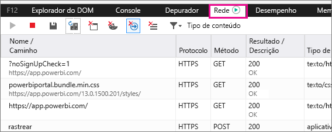
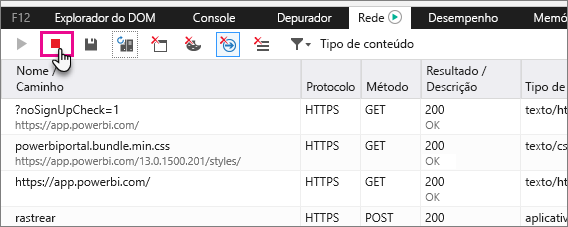
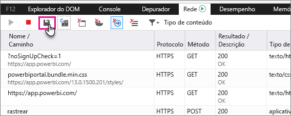

# Capturar informações de diagnóstico adicionais para o Power BI

Este artigo fornece instruções para coletar manualmente as informações adicionais de diagnóstico do cliente web do Power BI.

1. Navegue até [Power BI](https://app.powerbi.com) com Microsoft Edge ou Internet Explorer.

1. Pressione **F12** para abrir as ferramentas de desenvolvedor do Microsoft Edge.

   

1. Selecione a guia **Rede**. Ele listará o tráfego que já foi capturado.

   

    Você pode:

    * Navegar na janela e reproduzir qualquer problema que você pode se deparar com.

    * Ocultar e mostrar o desenvolvedor ferramentas janela a qualquer momento durante a sessão pressionando F12.

1. Para interromper a sessão de criação de perfil, você pode selecionar o quadrado vermelho sobre o **rede** área de ferramentas da guia do desenvolvedor.

   

1. Selecione o ícone de disquete para exportar os dados como um arquivo do arquivo morto HTTP (HAR).

   

1. Forneça um nome de arquivo e salve o arquivo HAR.

    O arquivo HAR contém todas as informações sobre solicitações de rede entre a janela do navegador e incluindo o Power BI:

    * As IDs de atividade para cada solicitação.

    * O carimbo de hora preciso para cada solicitação.

    * Qualquer informação de erro é retornado ao cliente.

    Este rastreamento também conterá os dados usados para preencher os elementos visuais mostrados na tela.

1. Você pode fornecer o arquivo HAR para dar suporte à análise.

Mais perguntas? [Experimente perguntar à Comunidade do Power BI](http://community.powerbi.com/)
