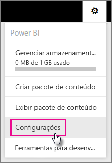
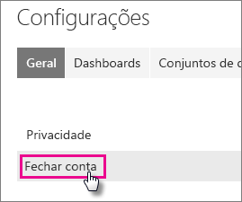
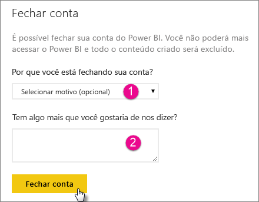
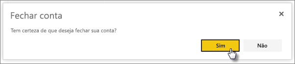
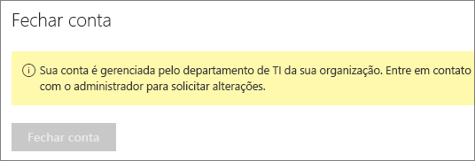

# Fechando a sua conta do Power BI

Se você não quiser mais usar o Power BI, feche sua conta do Power BI.  Depois que sua conta estiver fechada, você não poderá mais entrar no Power BI. Todos os dados do cliente carregados ou criados no Power BI são excluídos de acordo com a política de retenção de dados nos Termos de Serviço do Power BI.

## Usuários individuais do Power BI

Se você se inscreveu no Power BI como um indivíduo, poderá fechar sua conta na tela **Configurações**.

1. No Power BI, selecione o ícone de engrenagem no canto superior direito e escolha **Configurações**.

    

1. Na guia **Geral**, selecione **Fechar Conta**.

    

1. Selecione um motivo para fechar a conta (1). Você também pode fornecer mais informações (2). Em seguida, selecione **Fechar conta**.

    

1. Confirme que você deseja fechar sua conta.

    

    Você deverá ver uma confirmação de que a sua conta está fechada. Reabra a sua conta aqui se precisar.

    

## Usuários de locatário gerenciado

Se a sua organização inscreveu você no Power BI, entre em contato com seu administrador de locatário. Peça que retire a licença da sua conta.

Mais perguntas? [Experimente perguntar à Comunidade do Power BI](http://community.powerbi.com/)