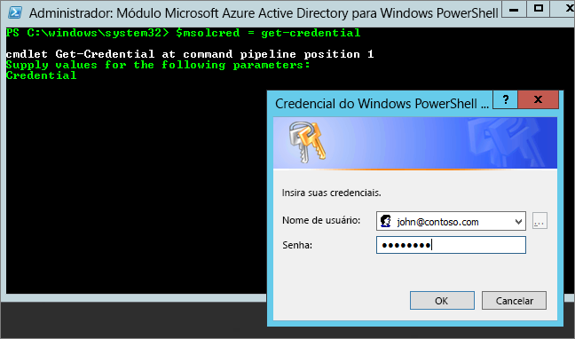

# <a name="administering-power-bi---frequently-asked-questions-faq"></a>Administrando o Power BI – perguntas frequentes

Este artigo aborda perguntas frequentes sobre a administração do Power BI. Para obter uma visão geral da administração do Power BI, confira [O que é administração do Power BI?](service-admin-administering-power-bi-in-your-organization.md).

## <a name="whats-in-this-article"></a>O que você encontrará neste artigo

### <a name="sign-up-for-power-bi-section"></a>Inscrever-se no serviço do Power BI

* [Usar o PowerShell](#using-powershell)
* [Como os usuários podem se inscrever no Power BI?](#how-do-users-sign-up-for-power-bi)
* [Como usuários individuais em minha organização podem se inscrever?](#how-do-individual-users-in-my-organization-sign-up)
* [Como impedir que os usuários ingressem em meu locatário existente do Office 365?](#how-can-i-prevent-users-from-joining-my-existing-office-365-tenant)
* [Como permitir que usuários ingressem em meu locatário existente do Office 365?](#how-can-i-allow-users-to-join-my-existing-office-365-tenant)
* [Como posso verificar se tenho o bloqueio ativado em meu locatário?](#how-do-i-verify-if-i-have-the-block-on-in-the-tenant)
* [Como impedir que meus usuários existentes comecem a usar o Power BI?](#how-can-i-prevent-my-existing-users-from-starting-to-use-power-bi)
* [Como posso permitir que meus usuários existentes se inscrevam no Power BI?](#how-can-i-allow-my-existing-users-to-sign-up-for-power-bi)

### <a name="administration-of-power-bi-section"></a>Seção Administração do Power BI

* [Como isso mudará minha maneira de gerenciar identidades dos usuários em minha organização hoje?](#how-will-this-change-the-way-i-manage-identities-for-users-in-my-organization-today)
* [Como podemos gerenciar o Power BI?](#how-do-we-manage-power-bi)
* [Qual é o processo para gerenciar um locatário criado pela Microsoft para meus usuários?](#what-is-the-process-to-manage-a-tenant-created-by-microsoft-for-my-users)
* [Se eu tiver vários domínios, poderei controlar o locatário do Office 365 ao qual os usuários serão adicionados?](#if-i-have-multiple-domains-can-i-control-the-office-365-tenant-that-users-are-added-to)
* [Como remover o Power BI para usuários que já se inscreveram?](#how-do-i-remove-power-bi-for-users-that-already-signed-up)
* [Como posso saber se novos usuários ingressaram em meu locatário?](#how-do-i-know-when-new-users-have-joined-my-tenant)
* [Devo estar preparado para outras questões?](#are-there-any-additional-things-i-should-be-prepared-for)
* [Onde está localizado meu locatário do Power BI?](#where-is-my-power-bi-tenant-located)
* [O que é o SLA (Contrato de Nível de Serviço) do Power BI?](#what-is-the-power-bi-sla)
* [Como o Power BI lida com alta disponibilidade e failover?](#how-does-power-bi-handle-high-availability-and-failover)

### <a name="security-in-power-bi-section"></a>Seção Segurança no Power BI

* [O Power BI atende aos requisitos de conformidade regional, nacional e específicos do setor?](#does-power-bi-meet-national-regional-and-industry-specific-compliance-requirements)
* [Como funciona a segurança no Power BI?](#how-does-security-work-in-power-bi)

## <a name="sign-up-for-power-bi"></a>Inscrever-se no Power BI

### <a name="using-powershell"></a>Usar o PowerShell

Alguns dos procedimentos nesta seção exigem scripts do Windows PowerShell. Se você não estiver familiarizado com o PowerShell, recomendamos o [guia de Introdução ao PowerShell](http://go.microsoft.com/fwlink/p/?LinkID=286814). Para executar os scripts, primeiro instale a versão mais recente de 64 bits do [Azure Active Directory PowerShell para Graph](/powershell/azure/active-directory/).

### <a name="how-do-users-sign-up-for-power-bi"></a>Como os usuários podem se inscrever para obter o Power BI?

Como administrador, você pode se inscrever no Power BI no [site do Power BI](https://powerbi.microsoft.com) ou na página [Comprar serviços](https://admin.microsoft.com/AdminPortal/Home#/catalog) do Centro de administração do Office 365. Quando um administrador se inscreve para o Power BI, ele pode atribuir licenças de usuário para usuários que devem ter acesso.

Além disso, usuários individuais em sua organização poderão se inscrever no Power BI por meio do [site do Power BI](https://powerbi.microsoft.com). Quando um usuário de sua organização se inscreve para o Power BI, ele recebe automaticamente uma licença do Power BI. Para saber mais, confira [Inscrever-se no Power BI como um indivíduo](service-self-service-signup-for-power-bi.md) e [licenciamento do Power BI em sua organização](service-admin-licensing-organization.md).

### <a name="how-do-individual-users-in-my-organization-sign-up"></a>Como usuários individuais em minha organização podem se inscrever?

Há três cenários que podem se aplicar aos usuários em sua organização:

* **Cenário 1**: sua organização já tem um ambiente existente do Office 365 e o usuário que está se inscrevendo no Power BI já tem uma conta do Office 365.
    Neste cenário, se um usuário já tiver uma conta corporativa ou de estudante no locatário (por exemplo, contoso.com), mas ainda não tiver o Power BI, a Microsoft simplesmente ativará o plano para essa conta, e o usuário receberá uma notificação automática sobre como usar o serviço do Power BI.

* **Cenário 2**: sua organização tem um ambiente existente do Office 365, mas o usuário que está se inscrevendo no Power BI não tem uma conta do Office 365.
    Nesse cenário, o usuário tem um endereço de email no domínio da sua organização (por exemplo, contoso.com), mas ainda não tem uma conta do Office 365. Nesse caso, o usuário pode se inscrever no Power BI e receber automaticamente uma conta. Isso permite o acesso do usuário ao serviço do Power BI. Por exemplo, se uma funcionária chamada Nancy usar seu email de trabalho (por exemplo, nancy@contoso.com) para se inscrever, a Microsoft adicionará automaticamente a Nancy como usuário no ambiente do Office 365 do Contoso e ativará o Power BI para essa conta.

* **Cenário 3**: sua organização não tem um ambiente do Office 365 conectado ao seu domínio de email.
    Sua organização não precisa tomar ações administrativas para tirar proveito do Power BI. Os usuários são adicionados a um novo diretório de usuário somente na nuvem, e você tem a opção de assumir o controle como administrador do locatário e gerenciá-los.

> [!IMPORTANT]
> Se sua organização tiver vários domínios de email e você preferir que todas as extensões de endereço de email estejam no mesmo locatário, adicione todos os domínios de endereço de email a um locatário do Azure Active Directory antes de todos os usuários se inscreverem. Não há nenhum mecanismo automatizado para mover os usuários entre locatários depois que eles foram criados. Para saber mais sobre esse processo, confira [Se eu tiver vários domínios, posso controlar o locatário do Office 365 ao qual os usuários são adicionados?](#if-i-have-multiple-domains-can-i-control-the-office-365-tenant-that-users-are-added-to) posteriormente neste artigo, e [Adicionar um domínio ao Office 365](/office365/admin/setup/add-domain/).

### <a name="how-can-i-prevent-users-from-joining-my-existing-office-365-tenant"></a>Como impedir que os usuários ingressem em meu locatário existente do Office 365?

Há etapas que você pode tomar, como administrador, para impedir que os usuários ingressem em seu locatário existente do Office 365. Se você bloquear o acesso, as tentativas de inscrição dos usuários falharão e eles serão orientados a entrar em contato com o administrador da organização. Você não precisa repetir esse processo se já tiver desabilitado a distribuição automática de licenças (por exemplo, pelo Office 365 educacional para estudantes, docentes e funcionários).

Use o seguinte script do PowerShell para impedir que novos usuários ingressem em um locatário gerenciado. ([Saiba mais sobre o PowerShell][1]).

```powershell
$msolcred = get-credential
connect-msolservice -credential $msolcred

Set-MsolCompanySettings -AllowEmailVerifiedUsers $false
```

> [!NOTE]
> O bloqueio de acesso impede que novos usuários em sua organização se inscrevam no Power BI. Os usuários que se inscreverem no Power BI antes da desabilitação de novas inscrições para sua organização ainda manterão suas licenças. Para remover um usuário, confira [Como faço para remover o Power BI para usuários que já se inscreveram?](#how-do-i-remove-power-bi-for-users-that-already-signed-up) mais adiante neste artigo.

### <a name="how-can-i-allow-users-to-join-my-existing-office-365-tenant"></a>Como permitir que usuários ingressem em meu locatário existente do Office 365?

Use o script do PowerShell a seguir para permitir que novos usuários ingressem em um locatário gerenciado. ([Saiba mais sobre o PowerShell][1]).

```powershell
$msolcred = get-credential
connect-msolservice -credential $msolcred

Set-MsolCompanySettings -AllowEmailVerifiedUsers $true
```

### <a name="how-do-i-verify-if-i-have-the-block-on-in-the-tenant"></a>Como posso verificar se tenho o bloqueio ativado em meu locatário?

Use o seguinte script do PowerShell para verificar as configurações. *AllowEmailVerifiedUsers* deve ser false. ([Saiba mais sobre o PowerShell][1]).

```powershell
$msolcred = get-credential
connect-msolservice -credential $msolcred

Get-MsolCompanyInformation | fl allow*
```

### <a name="how-can-i-prevent-my-existing-users-from-starting-to-use-power-bi"></a>Como impedir que meus usuários existentes comecem a usar o Power BI?

A configuração do Azure AD que controla isso é **AllowAdHocSubscriptions**. Essa configuração está definida como true para a maioria dos locatários, o que significa que ela está habilitada. Se você adquiriu o Power BI por meio de um parceiro, ela pode estar definida como false, o que significa que ela está desabilitada.

Use o seguinte script do PowerShell para desabilitar assinaturas ad hoc. ([Saiba mais sobre o PowerShell][1]).

1. Entre no Azure Active Directory usando suas credenciais do Office 365. A primeira linha do script do PowerShell a seguir solicita suas credenciais. Na segunda linha, você será conectado ao Azure Active Directory.

    ```powershell
     $msolcred = get-credential
     connect-msolservice -credential $msolcred
    ```

   

1. Depois de entrar, execute o comando a seguir para ver para como seu locatário está configurado atualmente.

    ```powershell
     Get-MsolCompanyInformation | fl AllowAdHocSubscriptions
    ```
1. Execute o comando a seguir para habilitar ($true) ou desabilitar ($false) o **AllowAdHocSubscriptions**.

    ```powershell
     Set-MsolCompanySettings -AllowAdHocSubscriptions $false
    ```

> [!NOTE]
> O sinalizador AllowAdHocSubscriptions é usado para controlar vários recursos de usuários em sua organização, inclusive a capacidade de inscrição dos usuários no Serviço do Rights Management. Alterar esse sinalizador afetará todos esses recursos.

### <a name="how-can-i-allow-my-existing-users-to-sign-up-for-power-bi"></a>Como posso permitir que meus usuários existentes se inscrevem no Power BI?

Para permitir que os usuários existentes se inscrevam no Power BI, execute o comando listado para a pergunta anterior, mas em vez de false, passe true na última etapa.

## <a name="administration-of-power-bi"></a>Administração do Power BI

### <a name="how-will-this-change-the-way-i-manage-identities-for-users-in-my-organization-today"></a>Como isso mudará minha maneira de gerenciar identidades dos usuários em minha organização hoje?

Há três cenários que podem se aplicar aos usuários em sua organização:

* **Cenário 1**: se a sua organização já tem um ambiente existente do Office 365, e todos os usuários na organização têm contas do Office 365, o gerenciamento de identidades não muda.

* **Cenário 2**: se a sua organização já tem um ambiente existente do Office 365, mas nem todos os usuários na organização têm contas do Office 365, criaremos um usuário no locatário e atribuiremos licenças com base no endereço de email corporativo ou de estudante do usuário.

    Isso significa que o número de usuários que você está gerenciando em qualquer momento específico crescerá conforme os usuários em sua organização se inscreverem no serviço.

* **Cenário 3**: se sua organização não tem um ambiente do Office 365 conectado ao domínio de email, não há alteração na forma de gerenciar identidades.

    Os usuários são adicionados a um novo diretório de usuário somente na nuvem, e você tem a opção de assumir o controle como administrador do locatário e gerenciá-los.

### <a name="how-do-we-manage-power-bi"></a>Como podemos gerenciar o Power BI?

O Power BI fornece um portal de administração que permite que você exiba estatísticas de uso, fornece um link para o Centro de administração do Office 365 para gerenciar usuários e grupos e fornece a capacidade de controlar configurações de locatário.

Para acessar o Portal de administração do Power BI, sua conta deve ser marcada como **Administrador Global** no Office 365 ou no Azure Active Directory ou ter recebido a função de administrador de serviços do Power BI. Para saber mais, confira [Noções básicas sobre a função de administrador do Power BI](service-admin-role.md) e [Portal de administração do Power BI](service-admin-portal.md).

### <a name="what-is-the-process-to-manage-a-tenant-created-by-microsoft-for-my-users"></a>Qual é o processo para gerenciar um locatário criado pela Microsoft para meus usuários?

Quando um usuário de autoatendimento se inscreve para um serviço de nuvem que usa o Azure AD, ele é adicionado a um diretório não gerenciado do Azure AD com base no domínio de email. É possível declarar e gerenciar o locatário que foi criado usando um processo conhecido como *tomada de controle do administrador*. O tipo de tomada de controle que você realiza depende da existência de um locatário gerenciado associado com seu domínio:

* Use uma *tomada de controle interna* para criar um novo locatário gerenciado para o domínio.

* Use uma *tomada de controle externa* para mover o domínio para um locatário gerenciado existente.

Para saber mais, veja [Tomar o controle em um diretório não gerenciado como administrador no Azure Active Directory](/azure/active-directory/users-groups-roles/domains-admin-takeover).

Quando você executa uma tomada de controle externa, o conteúdo do Power BI que foi criado antes da tomada de controle é colocado em um [Espaço de trabalho arquivado do Power BI](service-admin-power-bi-archived-workspace.md). Você deve migrar manualmente todo conteúdo que deseja usar no novo locatário.

### <a name="if-i-have-multiple-domains-can-i-control-the-office-365-tenant-that-users-are-added-to"></a>Se eu tiver vários domínios, poderei controlar o locatário do Office 365 ao qual os usuários serão adicionados?

Se você não fizer nada, um locatário será criado para cada domínio de email de usuário e subdomínio. Se você quiser que todos os usuários estejam no mesmo locatário independentemente de suas extensões de endereço de email: Crie um locatário de destino antecipadamente ou use um locatário existente e adicione todos os domínios e subdomínios existentes que você quer que sejam consolidados nesse locatário. Em seguida, todos os usuários com endereços de email que terminam com esses domínios e subdomínios ingressam automaticamente no locatário de destino ao se inscreverem.

> [!IMPORTANT]
> Não há nenhum mecanismo automatizado com suporte para mover os usuários entre locatários depois que eles foram criados. Para saber mais sobre a adição de domínios a um único locatário do Office 365, consulte [Adicionar usuários e domínio ao Office 365](/office365/admin/setup/add-domain/).

### <a name="how-do-i-remove-power-bi-for-users-that-already-signed-up"></a>Como remover o Power BI para usuários que já se inscreveram?

Se um usuário se inscrever no Power BI, mas você não quiser mais que ele tenha acesso ao Power BI, remova a licença do Power BI desse usuário.

1. Navegue até o [Centro de administração do Office 365](https://admin.microsoft.com/AdminPortal/Home#/homepage).

1. Na barra de navegação à esquerda, selecione **Usuários** > **Usuários ativos**.

1. Localize o usuário cuja licença você quer remover e selecione o nome dele.

    Você também pode executar o gerenciamento de licenças em massa a usuários. Para fazer isso, selecione vários usuários e selecione **Editar licenças de produto**.

1. Na página de detalhes do usuário, ao lado de **Licenças de produto**, selecione **Editar**.

1. Defina **Power BI (Gratuito)** ou **Power BI Pro** como **Desativado**, dependendo de qual licença é aplicada à conta.

1. Selecione **Salvar**.

### <a name="how-do-i-know-when-new-users-have-joined-my-tenant"></a>Como posso saber se novos usuários ingressaram em meu locatário?

Os usuários que ingressarem em seu locatário como parte desse programa receberão uma licença exclusiva, que você poderá filtrar dentro no painel do usuário ativo, no painel do administrador. Para criar essa nova exibição, execute estas etapas.

1. Navegue até o [Centro de administração do Office 365](https://admin.microsoft.com/AdminPortal/Home#/homepage).

1. Na barra de navegação à esquerda, selecione **Usuários** > **Usuários ativos**.

1. No menu **Modos de exibição**, selecione **Adicionar modo de exibição personalizado**.

1. Nomeie o novo modo de exibição e, em **Licença de produto atribuída**, selecione **Power BI (Gratuito)** ou **Power BI Pro**.

    Você só pode ter uma licença por exibição. Se você tiver as licenças **Power BI (Gratuito)** e **Power BI Pro** em sua organização, poderá criar dois modos de exibição.

1. Insira quaisquer outras condições desejadas e selecione **Adicionar**.

1. Após a criação do novo modo de exibição, ele estará disponível no menu **Modos de exibição**.

### <a name="are-there-any-additional-things-i-should-be-prepared-for"></a>Devo estar preparado para outras questões?

Você pode perceber um aumento nas solicitações de redefinição de senha. Para obter informações sobre esse processo, consulte [Redefinir a senha do usuário](/office365/admin/add-users/reset-passwords).

Você pode remover um usuário do seu locatário pelo processo padrão no centro de administração do Office 365. No entanto, se o usuário ainda tiver um endereço de email ativo de sua organização, ele poderá reingressar, a menos que você bloqueie o ingresso de todos os usuários.

### <a name="where-is-my-power-bi-tenant-located"></a>Onde está localizado meu locatário do Power BI?

Para saber em qual região de dados seu locatário do Power BI está, consulte [Onde está localizado meu locatário do Power BI?](service-admin-where-is-my-tenant-located.md).

### <a name="what-is-the-power-bi-sla"></a>O que é o SLA do Power BI?

Para saber mais sobre o SLA (Contrato de Nível de Serviço) do Power BI, consulte o artigo [Termos de licenciamento e documentação](http://www.microsoftvolumelicensing.com/DocumentSearch.aspx?Mode=3&DocumentTypeId=37) na seção **Licenciamento** do site de Licenciamento da Microsoft.

### <a name="how-does-power-bi-handle-high-availability-and-failover"></a>Como o Power BI lida com alta disponibilidade e failover?

Para obter informações sobre a alta disponibilidade e o failover, veja [Perguntas frequentes de recuperação de desastre, failover e alta disponibilidade do Power BI](service-admin-failover.md).

## <a name="security-in-power-bi"></a>Segurança no Power BI

### <a name="does-power-bi-meet-national-regional-and-industry-specific-compliance-requirements"></a>O Power BI atende aos requisitos de conformidade regional, nacional e específicos do setor?

Para saber mais sobre a conformidade do Power BI, consulte o [Microsoft Trust Center](https://www.microsoft.com/TrustCenter/CloudServices/business-application-platform/default.aspx).

### <a name="how-does-security-work-in-power-bi"></a>Como funciona a segurança no Power BI?

O Power BI foi criado de acordo com a base do Office 365, que por sua vez baseia-se nos serviços do Azure, como o Azure Active Directory. Para obter uma visão geral da arquitetura do Power BI, consulte [Segurança do Power BI](service-admin-power-bi-security.md).

## <a name="next-steps"></a>Próximas etapas

[Portal de administração do Power BI](service-admin-portal.md)  
[Noções básicas sobre a função de administrador do Power BI](service-admin-role.md)  
[Inscrição de autoatendimento no Power BI](service-self-service-signup-for-power-bi.md)  
[Compra do Power BI Pro](service-admin-purchasing-power-bi-pro.md)  
[O que é o Power BI Premium?](service-premium.md)  
[Como comprar o Power BI Premium](service-admin-premium-purchase.md)  
[White paper do Power BI Premium](https://aka.ms/pbipremiumwhitepaper)  
[Gerenciar seu grupo no Power BI e no Office 365](service-manage-app-workspace-in-power-bi-and-office-365.md)  
[Gerenciamento de contas de usuário do Office 365](/office365/servicedescriptions/office-365-platform-service-description/user-account-management/)  
[Gerenciamento de grupo do Office 365](/office365/admin/email/create-edit-or-delete-a-security-group/)  

Mais perguntas? [Experimente perguntar à Comunidade do Power BI](http://community.powerbi.com/)

[1]: https://docs.microsoft.com/powershell/scripting/overview