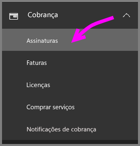
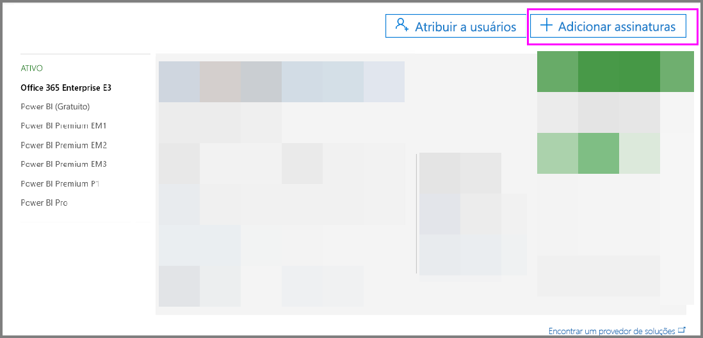
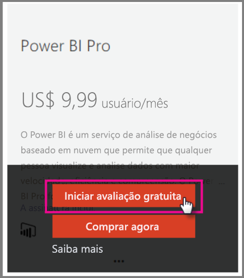
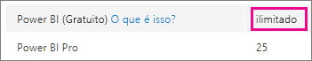
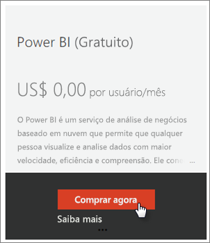
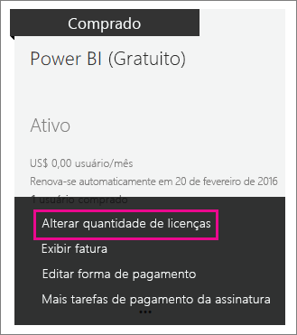

# <a name="power-bi-licensing-in-your-organization"></a>Licenciamento do Power BI na sua organização

[!INCLUDE [license-capabilities](includes/license-capabilities.md)]

Este artigo se concentra no licenciamento por usuário de uma perspectiva do administrador.

## <a name="manage-power-bi-pro-licenses"></a>Gerenciar licenças do Power BI Pro

Como administrador, você pode comprar e atribuir licenças do Power BI Pro e inscrever-se para uma avaliação do Power BI Pro para sua organização. Indivíduos também podem se inscrever para uma avaliação do Power BI Pro.

### <a name="purchase-power-bi-pro"></a>Comprar o Power BI Pro

Licenças do Power BI Pro são adquiridas por meio do Microsoft Office 365 ou de um parceiro certificado da Microsoft. Depois de comprar as licenças, você pode atribuí-las a cada usuário. Para obter mais informações, consulte [Comprar e atribuir licenças do Power BI Pro](service-admin-purchasing-power-bi-pro.md).

### <a name="power-bi-pro-license-expiration"></a>Validade da licença do Power BI Pro

Há um período de carência após a expiração de uma licença do Power BI Pro. Para licenças que fazem parte de uma compra de licença de volume, o período de carência é de 90 dias. Se você adquiriu a licença diretamente, o período de carência é de 30 dias.

O Power BI Pro tem o mesmo ciclo de vida de assinatura que o Office 365. Para obter mais informações, consulte [o que acontece com meus dados e o acesso quando termina minha Office 365 para a assinatura de negócios?](https://support.office.com/article/What-happens-to-my-data-and-access-when-my-Office-365-for-business-subscription-ends-4436582f-211a-45ec-b72e-33647f97d8a3).

### <a name="power-bi-pro-trial-for-individuals"></a>Avaliação do Power BI Pro para indivíduos

Os indivíduos da sua organização podem se inscrever para uma avaliação do Power BI Pro. Para obter mais informações, consulte [Inscrever-se no Power BI como indivíduo](service-self-service-signup-for-power-bi.md).

Os usuários que aproveitam esta avaliação do Power BI Pro dentro do produto não aparecem no Centro de administração do Microsoft 365 como usuários da Avaliação do Power BI Pro (eles aparecem como usuários da versão gratuita do Power BI). No entanto, eles aparecerão como usuários da versão de Avaliação do Power BI Pro na página de gerenciamento do armazenamento do Power BI.

### <a name="power-bi-pro-trial-for-organizations"></a>Avaliação do Power BI Pro para organizações

Se você deseja adquirir e implantar licenças de avaliação do Power BI para vários usuários na sua organização sem que os usuários individuais aceitem os termos da avaliação individualmente, inscreva-se para uma avaliação do Power BI Pro para sua organização.

Tenha em mente o seguinte antes de seguir as etapas para se inscrever:

* Para inscrever-se, você precisa ser um membro da função [**Administrador global** ou **Administrador de cobrança**](https://support.office.com/article/about-office-365-admin-roles-da585eea-f576-4f55-a1e0-87090b6aaa9d) no Office 365.

* Há um limite de uma avaliação organizacional por locatário. Isso significa que se alguém já aplicou a Avaliação do Power BI Pro para o seu locatário, você não poderá aplicar novamente. Se precisar de assistência com isso, contate o [Suporte de cobrança do Office 365](https://support.office.microsoft.com/article/contact-support-for-business-products-admin-help-32a17ca7-6fa0-4870-8a8d-e25ba4ccfd4b?CorrelationId=552bbf37-214f-4202-80cb-b94240dcd671).

1. Navegue até o [Centro de administração do Microsoft 365](https://portal.office.com/adminportal/home#/homepage).

1. No painel de navegação esquerdo, selecione **Cobrança** e, em seguida, **Assinaturas**.

   

1. No lado direito, selecione **Adicionar assinaturas**.

   

1. Em **Outros planos**, passe o mouse sobre as reticências ( **. . .** ) para o Power BI Pro e selecione **Iniciar avaliação gratuita**.

    

1. Na tela de confirmação do pedido, selecione **Experimente agora**.

1. No recibo do pedido, selecione **Continuar**.

Também é possível [atribuir licenças no Office 365](https://support.office.com/article/assign-licenses-to-users-in-office-365-for-business-997596b5-4173-4627-b915-36abac6786dc).

## <a name="manage-power-bi-free-licenses"></a>Gerenciar licenças gratuitas do Power BI

Os usuários da sua organização podem obter acesso a licenças gratuitas do Power BI de duas maneiras diferentes:

* É possível atribuir uma licença do Power BI a eles no Centro de administração do Microsoft 365.

* Se um usuário [se inscrever para uma versão de avaliação do Power BI Pro](service-self-service-signup-for-power-bi.md) e a avaliação expirar, ele receberá uma licença gratuita.

### <a name="requesting-and-assigning-free-licenses"></a>Solicitar e atribuir licenças gratuitas

Se planeja gerenciar solicitações de licença e atribuições de forma centralizada, verifique primeiro se você já tem o bloco de licença ilimitado do Power BI (Gratuito).

Este bloco de licenças estará disponível após a primeira vez que alguém se inscrever no Power BI como um indivíduo. Durante esse processo, este bloco de licenças será anexado à sua organização e uma licença será atribuída ao usuário que está se inscrevendo.

1. No Centro de administração do Microsoft 365, em **Cobrança** > **Licenças**, procure **Ilimitado**.

    

1. Se o bloco estiver disponível, agora você poderá [atribuir licenças do Office 365](https://support.office.com/article/assign-licenses-to-users-in-office-365-for-business-997596b5-4173-4627-b915-36abac6786dc). Se o bloco não estiver disponível, você terá duas opções:

    * Instruir um membro da sua organização a inscrever-se individualmente, o que disparará a criação do bloco ilimitado.

    * Prosseguir para o próximo procedimento, em que você poderá se inscrever para um número fixo de licenças.

Se o bloco de licenças ilimitado do Power BI (Gratuito) não estiver disponível e você não quiser realizar uma inscrição individual, siga este procedimento.

1. Navegue até o [Centro de administração do Microsoft 365](https://portal.office.com/admin/default.aspx).

1. No painel de navegação esquerdo, selecione **Cobrança** > **Assinaturas**.

1. No lado direito, selecione **Adicionar assinaturas +** .

1. Em **Outros planos**, passe o mouse sobre as reticências ( **. . .** ) para o Power BI (Gratuito) e selecione **Comprar agora**.

    

1. Insira o número de licenças que você deseja adicionar e selecione **Finalizar compra agora** ou em **Adicionar ao carrinho**.

1. Insira as informações necessárias no fluxo de finalização de compra.

    Não há nenhuma compra ao usar essa abordagem, embora seja necessário inserir suas informações de cartão de crédito para cobrança ou optar por ser faturado.

1. Agora também é possível [atribuir licenças no Office 365](https://support.office.com/article/assign-licenses-to-users-in-office-365-for-business-997596b5-4173-4627-b915-36abac6786dc).

1. Se você decidir posteriormente que deseja adicionar mais licenças, pode voltar para **Adicionar assinaturas**, e selecionar **Alterar a quantidade de licenças** para o Power BI (gratuito).

    

### <a name="enable-or-disable-individual-user-sign-up-in-azure-active-directory"></a>Habilitar ou desabilitar a inscrição de usuários individuais no Azure Active Directory

Como administrador, você pode optar por habilitar ou desabilitar as inscrições de usuários individuais por meio do AAD (Azure Active Directory). Esta seção do artigo mostra como gerenciar inscrições com comandos do PowerShell. Para obter mais informações sobre o Azure PowerShell, consulte [Visão geral do Azure PowerShell](/powershell/azure/overview).

A configuração do AAD que controla a inscrição é **AllowAdHocSubscriptions**. Na maioria dos locatários, isso estará definido como *true*, o que significa que ela está habilitada. Se você adquiriu o Power BI por meio de um parceiro, ela pode estar definida como *false*, o que significa que ela está desabilitada. Se você alterar a configuração de *true* para *false*, novos usuários na sua organização serão impedidos de se inscreverem individualmente. Os usuários que se inscreveram para o Power BI antes da alteração da configuração manterão suas licenças.

1. Entre no Azure Active Directory usando suas credenciais do Office 365. A primeira linha do script do PowerShell a seguir solicita suas credenciais. Na segunda linha, você será conectado ao Azure Active Directory.

    ```powershell
     $msolcred = get-credential
     connect-msolservice -credential $msolcred
    ```

   

1. Depois de entrar, execute o comando a seguir para ver para como seu locatário está configurado atualmente. (Observe que 'fl' abaixo usa a letra "l", não o número 1).

    ```powershell
     Get-MsolCompanyInformation | fl AllowAdHocSubscriptions 
    ```
1. Execute o comando a seguir para habilitar ($true) ou desabilitar ($false) o **AllowAdHocSubscriptions**.

    ```powershell
     Set-MsolCompanySettings -AllowAdHocSubscriptions $true
    ```

> [!NOTE]
> O sinalizador AllowAdHocSubscriptions é usado para controlar vários recursos de usuários em sua organização, inclusive a capacidade de inscrição dos usuários no Serviço do Rights Management. Alterar esse sinalizador afetará todos esses recursos.

## <a name="next-steps"></a>Próximas etapas

[Inscrição de autoatendimento no Power BI](service-self-service-signup-for-power-bi.md)  

[Comprar e atribuir licenças do Power BI Pro](service-admin-purchasing-power-bi-pro.md)

Mais perguntas? [Experimente perguntar à Comunidade do Power BI](http://community.powerbi.com/)