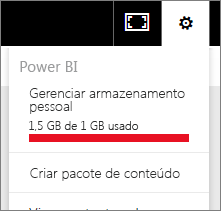

# Gerenciar o armazenamento de dados em workspaces do Power BI

Saiba como você pode gerenciar seu armazenamento de dados em seu espaço de trabalho individual ou do aplicativo para garantir que possa continuar publicando relatórios e conjuntos de dados.

Os usuários e os espaços de trabalho do aplicativo têm suas próprias capacidades de dados:

* Todos os usuários têm no máximo 10 GB de armazenamento de dados.
* Os usuários com uma licença do Power BI Pro podem criar workspaces de aplicativo, com no máximo 10 GB de armazenamento de dados cada.
* Um workspace de aplicativo na capacidade Premium não conta para o armazenamento de um usuário do Power BI Pro.

No nível do locatário, o uso total não pode exceder 10 GB por usuário Pro em todos os usuários Pro e workspaces do aplicativo no locatário.

Leia sobre outros recursos do [modelo de preços do Power BI](https://powerbi.microsoft.com/pricing).

No armazenamento de dados estão incluídos seus próprios conjuntos de dados e relatórios do Excel e os itens que alguém compartilhou com você. Os conjuntos de dados são as fontes de dados que você carregou ou às quais se conectou. Essas fontes de dados incluem os arquivos do Power BI Desktop e as pastas de trabalho do Excel que você está usando. O exemplo a seguir também está incluído em sua capacidade de dados.

* Intervalos do Excel fixados no painel.
* Visualizações locais do Reporting Services fixadas em um painel do Power BI.
* Imagens carregadas.

O tamanho de um dashboard que você compartilha varia dependendo do que é fixado a ele. Por exemplo, se você fixar itens de dois relatórios que façam parte de dois conjuntos de dados diferentes, o tamanho incluirá os dois conjuntos de dados.

<a name="manage"/>

## Gerenciar os itens que você tem

Veja a quantidade de armazenamento de dados que você está usando em sua conta do Power BI e gerencie sua conta.

1. Para gerenciar seu próprio armazenamento, acesse **Meu Workspace** no painel de navegação à esquerda.
   
    
2. Selecione o ícone de engrenagem  no canto superior direito \> **Gerenciar armazenamento pessoal**.
   
    A barra superior mostra o limite de armazenamento que você usou.
   
    
   
    Os conjuntos de dados e os relatórios são separados em duas guias:
   
    **Pertencente a mim:** Você carregou esses relatórios e conjuntos de dados em sua conta do Power BI, incluindo os conjuntos de dados de serviço, como o Salesforce e o Dynamics CRM.  
    **Pertencente a outros:** Outras pessoas compartilharam esses relatórios e conjuntos de dados com você.
1. Para excluir um conjunto de dados ou um relatório, selecione o ícone de lixeira .

Tenha em mente que você ou outra pessoa pode ter relatórios e painéis com base em um conjunto de dados. Se você excluir o conjunto de dados, os relatórios e painéis de controle não funcionarão mais.

## Gerenciar o workspace do aplicativo
1. Selecione a seta ao lado de **Workspaces**\> selecione o nome do workspace do aplicativo.
   
    
2. Selecione o ícone de engrenagem  no canto superior direito \> **Gerenciar armazenamento de grupo**.
   
    A barra superior mostra o limite de armazenamento de grupo que você usou.
   
    
   
    Os conjuntos de dados e os relatórios são separados em duas guias:
   
    **Pertencente a nós:** Você ou outra pessoa carregou esses relatórios e conjuntos de dados para a conta do Power BI do grupo, incluindo os conjuntos de dados de serviço, como o Salesforce e o Dynamics CRM.
    **Pertencente a outros:** Outras pessoas compartilharam esses relatórios e conjuntos de dados com seu grupo.
3. Para excluir um conjunto de dados ou um relatório, selecione o ícone de lixeira .
   
   > [!NOTE]
   > Qualquer membro, com permissões de edição, de um workspace do aplicativo tem permissões para excluir conjuntos de dados e relatórios do workspace do aplicativo.
   > 
   > 

Tenha em mente que você ou outra pessoa do grupo pode ter relatórios e painéis com base em um conjunto de dados. Se você excluir o conjunto de dados, os relatórios e painéis de controle não funcionarão mais.

## Limites de conjunto de dados
Há um limite de 1 GB por conjunto de dados que é importado para o Power BI. Se você optou por manter a experiência do Excel em vez de importar os dados, o limite será de 250 MB para o conjunto de dados.

## O que acontece quando você atinge um limite
Ao atingir o limite da capacidade de dados daquilo que você pode fazer, serão exibidos avisos dentro do serviço. 

Ao selecionar o ícone de engrenagem , será exibida uma barra vermelha indicando que você está acima do limite da capacidade de dados.

Esse limite também é indicado em **Gerenciar armazenamento pessoal**.

 

 Quando você tentar executar uma ação que atingirá um dos limites, será exibida uma mensagem informando que você está acima do limite. Você pode [gerenciar](#manage) o armazenamento para reduzir a quantidade de armazenamento e ultrapassar o limite.

 

 Mais perguntas? [Experimente perguntar à Comunidade do Power BI](http://community.powerbi.com/)

