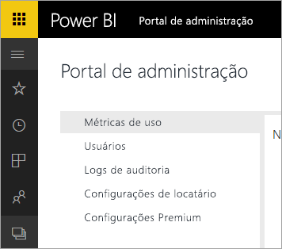

# O Power BI para Office 365 foi desativado
O Power BI para Office 365, uma versão anterior do Power BI, foi transferido para a versão atual do [Power BI](https://powerbi.microsoft.com). Os usuários que usaram uma vez o **Power BI para Office 365** podem usar a versão atual do Power BI. [Saiba mais sobre o Power BI](service-get-started.md).

## O Portal de Administração
O acesso ao portal de administração **Power BI para Office 365** não está mais disponível. Os administradores podem usar o novo [Portal de Administração](https://app.powerbi.com/admin-portal) para gerenciar a assinatura do Power BI da organização.

Para obter mais informações, consulte [Portal de administração do Power BI](service-admin-portal.md).

## Próximas etapas
[O que é o Power BI?](power-bi-overview.md)

[O que é o Power BI Desktop?](desktop-what-is-desktop.md)

[Administração do Power BI em sua organização](service-admin-administering-power-bi-in-your-organization.md)
