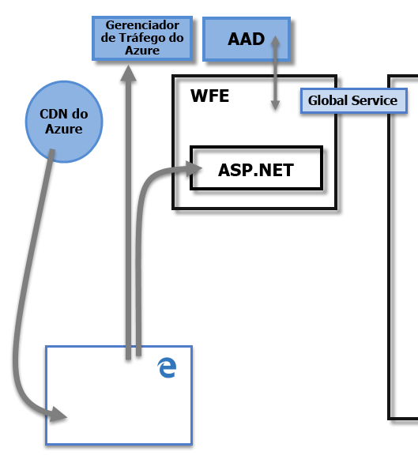
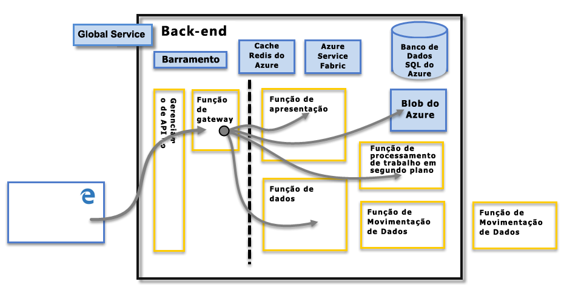

# Segurança do Power BI
Para obter uma explicação detalhada sobre a segurança do Power BI, [baixe o white paper intitulado Segurança do Power BI](http://go.microsoft.com/fwlink/?LinkId=829185):

O serviço do Power BI se baseia no **Azure**, que é a plataforma e infraestrutura de computação em nuvem da Microsoft. A arquitetura do serviço do Power BI se baseia em dois clusters – o cluster da Web de Front-End (**WFE**) e o cluster de **Back-End**. O cluster WFE gerencia a conexão inicial e a autenticação do serviço do Power BI; uma vez autenticado, o Back-End trata de todas as interações de usuário subsequentes. O Power BI usa o Azure Active Directory (AAD) para armazenar e gerenciar identidades de usuário e gerencia o armazenamento de dados e metadados pelo uso de BLOB do Azure e Banco de Dados SQL do Azure, respectivamente.

## Arquitetura do Power BI
Cada implantação do Power BI consiste de dois clusters – um cluster da Web de Front-End (**WFE**) e um cluster de **Back-End**.

O cluster **WFE** gerencia o processo de conexão e autenticação inicial para o Power BI, usando AAD para autenticar clientes e fornecer tokens para conexões de cliente subsequentes ao serviço do Power BI. O Power BI também usa o ATM ( **Gerenciador de Tráfego do Azure** ) para direcionar o tráfego de usuário para o datacenter mais próximo, determinado pelo registro DNS do cliente buscando conectar-se, para o processo de autenticação e para baixar conteúdo estático e arquivos. O Power BI usa a CDN ( **Rede de Distribuição de Conteúdo** ) para distribuir de modo eficiente os arquivos e o conteúdo estático necessários aos usuários, com base na localidade geográfica.

O cluster de **Back-End** é como os clientes autenticados interagem com o serviço do Power BI. O cluster de **Back-End** gerencia visualizações, dashboards do usuário, conjuntos de dados, relatórios, armazenamento de dados, conexões de dados, a atualização de dados e outros aspectos de interação com o serviço do Power BI. A **Função do Gateway** age como um gateway entre solicitações do usuário e o serviço do Power BI. Os usuários não interagem diretamente com nenhuma função, exceto a **Função do Gateway**. **Gerenciamento de API do Azure** eventualmente tratará da **Função do Gateway**.

> [!IMPORTANT]
> É fundamental observar que somente as funções de APIM (**Gerenciamento de API do Azure**) e GW (**Gateway**) podem ser acessadas pela Internet pública. Elas fornecem autenticação, autorização, proteção DDoS, Limitação, Balanceamento de Carga, Roteamento e outros recursos.
> 
> 

## Segurança de Armazenamento de Dados
O Power BI usa dois repositórios primários para armazenar e gerenciar dados: os dados carregados por usuários são enviados normalmente ao armazenamento de **BLOB do Azure** , enquanto todos os metadados e também os artefatos para o próprio sistema são armazenados no **Banco de Dados SQL do Azure**.

A linha pontilhada na imagem do cluster de **Back-End**, representada acima, esclarece o limite entre apenas dois componentes que podem ser acessados por usuários (à esquerda da linha pontilhada) e funções que só podem ser acessadas pelo sistema. Quando um usuário autenticado se conecta ao Serviço do Power BI a conexão, assim como qualquer solicitação feita pelo cliente, é aceita e gerenciada pela **Função do Gateway** (para ser eventualmente tratada pelo **Gerenciamento de API do Azure**), que então interage em nome do usuário com o restante do Serviço do Power BI. Por exemplo, quando um cliente tenta exibir um painel, a **Função do Gateway** aceita a solicitação e envia separadamente uma solicitação para a **Função de Apresentação** para recuperar os dados necessários para que o navegador renderize o painel.

## Autenticação de Usuário
O Power BI usa o [AAD](http://azure.microsoft.com/services/active-directory/) (Azure Active Directory) para autenticar os usuários que fazem logon no serviço do Power BI e, em seguida, usa as credenciais de logon do Power BI sempre que um usuário tenta acessar recursos que exigem autenticação. Os usuários fazem logon no serviço do Power BI usando o endereço de email usado para estabelecer sua conta do Power BI; o Power BI usa esse email de logon como o *usuário efetivo*, que é passado para os recursos sempre que um usuário tenta se conectar a dados. O *nome de usuário efetivo* é então mapeado para um *UPN* ([Nome UPN](https://msdn.microsoft.com/library/windows/desktop/aa380525\(v=vs.85\).aspx)) e resolvido para a conta de domínio do Windows associada, na qual a autenticação é aplicada.

Para organizações que usaram emails de trabalho para o logon do Power BI (como <em>david@contoso.com</em>), o mapeamento de *usuário efetivo* para UPN é simples. Para organizações que não usaram emails de trabalho para efetuar logon no Power BI (como <em>david@contoso.onmicrosoft.com</em>), o mapeamento entre o AAD e as credenciais locais exigirá que a [sincronização de diretório](https://technet.microsoft.com/library/jj573653.aspx) funcione corretamente.

A segurança da plataforma para o Power BI também inclui a segurança do ambiente multilocatário, a segurança de rede e a capacidade de adicionar medidas de segurança adicionais baseadas no AAD.

## Segurança do Serviço e de Dados
Para obter mais informações, visite a [Central de Confiabilidade da Microsoft](https://www.microsoft.com/trustcenter).

Conforme descrito anteriormente neste artigo, o logon do Power BI de um usuário é usado por servidores locais do Active Directory para realizar o mapeamento de um UPN para determinadas credenciais. No entanto, é **importante** observar que os usuários são responsáveis pelos dados que compartilham: se um usuário se conecta a fontes de dados usando suas credenciais e compartilha um relatório (ou um painel ou conjunto de dados) com base nesses dados, os usuários com quem o painel é compartilhado não são autenticados em relação à fonte de dados original; nesse caso, acesso ao relatório será concedido a esses usuários.

Uma exceção ocorre no caso de conexões ao **SQL Server Analysis Services** usando o **gateway de dados local**. Os dashboards são armazenados em cache no Power BI, mas o acesso aos relatórios ou aos conjuntos de dados subjacentes inicia a autenticação para o usuário que está tentando acessar o relatório (ou o conjunto de dados), sendo que o acesso só será concedido se o usuário tiver credenciais suficientes para acessar os dados. Para obter mais informações, veja [Detalhes sobre o gateway de dados local](service-gateway-onprem-indepth.md).

## Impor o uso de versão do TLS

Administradores de rede e de TI podem impor como requisito o uso do protocolo TLS atual para qualquer comunicação protegida na rede. O Windows é compatível com as versões do TLS no Microsoft Schannel Provider, como [descrito no artigo de SSP de Schannel TLS](https://docs.microsoft.com/windows/desktop/SecAuthN/protocols-in-tls-ssl--schannel-ssp-).

Essa imposição pode ser feita definindo administrativamente chaves do Registro. A imposição é descrita no [artigo Gerenciar protocolos SSL no AD FS](https://docs.microsoft.com/windows-server/identity/ad-fs/operations/manage-ssl-protocols-in-ad-fs). 

O **Power BI Desktop** respeita as configurações de chave do Registro descritas nesses artigos e apenas as conexões criadas usando a versão do TLS permitida com base nessas configurações do Registro, quando existirem.

Para obter mais informações sobre como definir essas chaves do Registro, confira o artigo [Configurações de Registro do TLS](https://docs.microsoft.com/windows-server/security/tls/tls-registry-settings).

