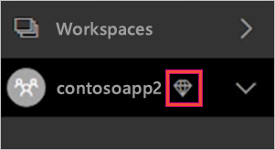
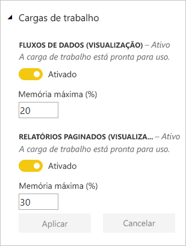
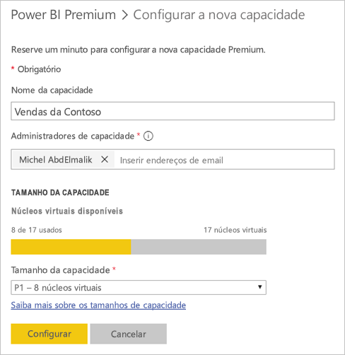
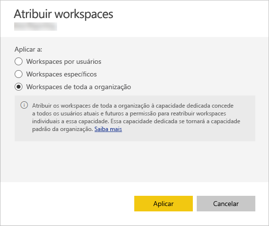

# Gerenciar capacidades no Power BI Premium e no Power BI Embedded

Saiba como gerenciar as capacidades do Power BI Premium e do Power BI Embedded, que oferecem recursos dedicados ao seu conteúdo.

## O que é capacidade?

A *capacidade* é a essência das ofertas do Power BI Premium e do Power BI Embedded. É o conjunto de recursos reservados para uso exclusivo pela sua organização. Ter capacidade dedicada permite publicar dashboards, relatórios e conjuntos de dados para usuários de toda a organização sem precisar comprar licenças por usuário para eles. Ela também oferece desempenho confiável e consistente para o conteúdo hospedado na capacidade. Para obter mais informações, consulte [O que é Power BI Premium?](service-premium.md).

### Administradores de capacidade

Quando você é atribuído a uma capacidade como *administrador de capacidade*, você tem controle total sobre a capacidade e seus recursos administrativos. No portal de administração do Power BI, é possível adicionar mais administradores de capacidade ou dar aos usuários permissões de atribuição de capacidade. É possível atribuir workspaces em massa a uma capacidade e exibir métricas de uso em uma capacidade.

> [!NOTE]
> Para o Power BI Embedded, os administradores de capacidade são definidos no portal do Microsoft Azure.

Cada capacidade tem seus próprios administradores. Atribuir um administrador de capacidade para uma capacidade não lhe concede acesso a todas as capacidades em sua organização. Os administradores de capacidade não têm acesso a todas as áreas de administração do Power BI por padrão, como as métricas de uso, os logs de auditoria ou as configurações do locatário. Os administradores de capacidade também não têm permissões para configurar novas capacidades ou alterar o SKU das capacidades existentes. Somente Administradores Globais do Office 365 ou administradores de serviço do Power BI têm acesso a esses itens.

Todos os Administradores Globais do Office 365 e os administradores de serviço do Power BI são automaticamente administradores de capacidade do Power BI Premium e do Power BI Embedded.

## Compre capacidade

Para aproveitar a capacidade dedicada, você deve comprar o Power BI Premium no centro de administração do Office 365 ou criar um recurso do Power BI Embedded no portal do Microsoft Azure. Para obter mais informações, consulte os seguintes artigos:

* **Power BI Premium:** [Como comprar o Power BI Premium](service-admin-premium-purchase.md)

* **Power BI Embedded:** [Criar capacidade do Power BI Embedded no portal do Azure](https://docs.microsoft.com/azure/power-bi-embedded/create-capacity)

Quando você compra SKUs do Power BI Premium ou Embedded, seu locatário recebe o número de núcleos virtuais correspondentes para uso nas capacidades em execução. Por exemplo, a compra de um SKU P3 do Power BI Premium fornece ao locatário 32 núcleos virtuais. Para obter mais informações sobre SKUs, confira [Nós de capacidade Premium](service-premium.md#premium-capacity-nodes).

## Qual é a aparência do Premium para os usuários

Para a maior parte, os usuários nem não precisam saber que estão em uma capacidade Premium. Seus dashboards e relatórios apenas funcionam. Como uma dica visual, há um ícone de losango ao lado dos workspaces que estão em uma capacidade Premium.

## Configurar cargas de trabalho

Por padrão, as capacidades do Power BI Premium e do Power BI Embedded são compatíveis apenas com a carga de trabalho associada à execução de consultas no Power BI na nuvem. Agora oferecemos compatibilidade em versão prévia para duas cargas de trabalho adicionais: **Relatórios paginados** e **Fluxos de dados**. Para obter mais informações, consulte [Cargas de trabalho na capacidade Premium](service-premium.md#workloads-in-premium-capacity).

Para habilitar as cargas de trabalho no Portal de Administração do Power BI, siga estas etapas.

1. Em **Configurações de capacidade**, selecione uma capacidade.

1. Em **MAIS OPÇÕES**, expanda **Cargas de trabalho**.

1. Habilite uma ou mais cargas de trabalho e defina um valor para **Memória Máxima**.

    

1. Selecione **Aplicar**.

## Monitorar o uso de capacidade

O Power BI fornece um aplicativo para monitorar o uso da capacidade. Para saber mais, confira [Monitorar capacidades do Power BI Premium em sua organização](service-admin-premium-monitor-capacity.md).

## Gerenciar a capacidade

Após a compra de nós de capacidade no Office 365, configure a capacidade no portal de administração do Power BI. Você gerencia as capacidades do Power BI Premium na seção **Configurações de capacidade** do portal.

Gerencie uma capacidade selecionando o nome dela. Isso leva você para a tela de gerenciamento de capacidade.

Se nenhum workspace tiver sido atribuído à capacidade, você verá uma mensagem sobre [como atribuir um workspace à capacidade](#assign-a-workspace-to-a-capacity).

### Configurar uma nova capacidade (Power BI Premium)

O portal de administração mostra o número de *núcleos virtuais* (v-cores) que você usou e que ainda tem disponível. O número total de núcleos baseia-se nas SKUs Premium que você comprou. Por exemplo, comprar um P3 e um P2 resulta em 48 núcleos disponíveis – 32 do P3 e 16 do P2.

Se você tiver núcleos virtuais disponíveis, configure a nova capacidade seguindo estas etapas.

1. Selecione **Configurar nova capacidade**.

1. Dê um nome à sua capacidade.

1. Defina quem é o administrador para essa capacidade.

1. Selecione o tamanho da capacidade. As opções disponíveis dependem de quantos núcleos virtuais disponíveis você tem. Não é possível selecionar uma opção maior que a que está disponível.

    

1. Selecione **Configurar**.

    

Administradores de capacidade, bem como administradores do Power BI e Administradores Globais do Office 365, verão a capacidade listada no portal do administrador.

### Configurações de capacidade

1. Na tela de gerenciamento de capacidade Premium, em **Ações**, selecione o **ícone de engrenagem** para examinar e atualizar as configurações. 

    

1. Você pode ver quem são os administradores de serviço, a SKU/o tamanho da capacidade e em qual região a capacidade está.

    

1. Você também pode renomear ou excluir uma capacidade.

    

> [!NOTE]
> As configurações de capacidade do Power BI Embedded são gerenciadas no portal do Microsoft Azure.

### Alterar tamanho da capacidade

Administradores do Power BI e Administradores Globais do Office 365 podem alterar a capacidade do Power BI Premium. Os administradores de capacidade que não são administradores do Power BI ou Administradores Globais do Office 365 não têm essa opção.

1. Selecione **Alterar o tamanho da capacidade**.

    

1. Na tela **Alterar tamanho da capacidade**, atualize ou faça downgrade de sua capacidade conforme apropriado.

    

    Os administradores são livres para criar, redimensionar e excluir nós, desde que tenham o número necessário de núcleos virtuais.

    Não é possível fazer downgrade de SKUs P para SKUs EM. É possível focalizar as opções de desabilitadas para ver uma explicação.

### Gerenciar permissões de usuário

É possível atribuir administradores de capacidade adicionais, bem como atribuir usuários que tenham permissões de *atribuição de capacidade*. Os usuários que tiverem permissões de atribuição poderão atribuir um workspace do aplicativo a uma capacidade se eles forem administradores desse workspace. Eles também podem atribuir o *Meu workspace* pessoal à capacidade. Os usuários com permissões de atribuição não têm acesso ao portal de administração.

> [!NOTE]
> Para o Power BI Embedded, os administradores de capacidade são definidos no portal do Microsoft Azure.

Em **Permissões do usuário**, expanda **Usuários com permissões de atribuição** e, em seguida, adicione usuários ou grupos conforme apropriado.

## Atribuir um workspace a uma capacidade

Há duas maneiras de atribuir um workspace a uma capacidade: no portal de administração e em um workspace do aplicativo.

### Atribuir do portal de administração

Os administradores de capacidade, juntamente com os administradores do Power BI e os Administradores Globais do Office 365, podem atribuir workspaces em massa na seção de gerenciamento da capacidade Premium do portal de administração. Ao gerenciar uma capacidade, você verá uma seção **Workspaces** que permite atribuir workspaces.

1. Selecione **Atribuir workspaces**. Essa opção está disponível em vários locais.

1. Selecione uma opção para **Aplicar a**.

    

   | Selection | Descrição |
   | --- | --- |
   | **Workspaces por usuários** | Quando você atribui workspaces por usuário ou grupo, todos os workspaces pertencentes a esses usuários são atribuídos à capacidade Premium, incluindo o workspace pessoal do usuário. Tais usuários obtêm permissões de atribuição de workspace automaticamente. Isso inclui workspaces já atribuídos a uma capacidade diferente. |
   | **Workspaces específicos** | Insira o nome do workspace específico para atribuir à capacidade selecionada. |
   | **Workspaces de toda a organização** | Atribuir workspaces de toda a organização à capacidade Premium atribuirá todos os workspaces do aplicativo e Meus Workspaces em sua organização a essa capacidade Premium. Além disso, todos os usuários atuais e futuros terão permissão para reatribuir workspaces individuais a essa capacidade. |
   | | |

1. Selecione **Aplicar**.

### Atribuir das configurações de workspace de aplicativo

Também é possível atribuir um workspace do aplicativo a uma capacidade Premium das configurações desse workspace. Para mover um workspace para uma capacidade, é necessário ter permissões de administrador para esse workspace e também permissões de atribuição de capacidade para essa capacidade. Note que os administradores de workspace podem sempre remover um workspace da capacidade Premium.

1. Edite um workspace do aplicativo selecionando as reticências (**…**) e então **Editar workspace**.

    

1. Em **Editar workspace**, expanda **Avançado**.

1. Selecione a capacidade à qual você deseja atribuir esse workspace do aplicativo.

    

1. Selecione **Salvar**.

Depois de salvo, o workspace e todo o seu conteúdo serão movidos para a capacidade Premium sem qualquer interrupção para os usuários finais.

## Chave do produto (Product Key) do Servidor de Relatório do Power BI

Na guia **Configurações de capacidade** do portal de administração do Power BI, você terá acesso à sua chave do produto (Product Key) do Servidor de Relatórios do Microsoft Power BI. Isso estará disponível somente para os administradores Globais ou usuários atribuídos à função de administrador do serviço do Power BI e se você tiver comprado um SKU do Power BI Premium.

Selecionar **chave do Servidor de Relatório do Power BI** exibirá uma caixa de diálogo que contém a chave do produto (Product Key). É possível copiá-la e usá-la com a instalação.

Para obter mais informações, consulte [Instalar o Servidor de Relatório do Power BI](report-server/install-report-server.md).

## Próximas etapas

Compartilhe aplicativos publicados com usuários. Para obter mais informações, consulte [Criar e distribuir um aplicativo no Power BI](service-create-distribute-apps.md).

Mais perguntas? [Experimente perguntar à Comunidade do Power BI](http://community.powerbi.com/)
