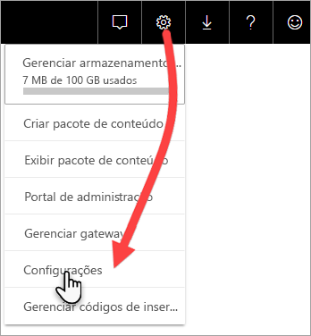

# Monitorar as capacidades Premium com o aplicativo

Monitorar suas capacidades é essencial para tomar decisões bem informadas sobre a melhor maneira de utilizar os recursos de capacidade Premium. Você pode monitorar as capacidades no portal do Administrador ou com o aplicativo **Métricas de Capacidade do Power BI Premium**. Este artigo descreve como usar o aplicativo de métricas de capacidade Premium. O aplicativo fornece informações mais detalhadas do desempenho de suas capacidades. Para uma visão geral mais detalhada das métricas de uso médio nos últimos sete dias, você pode usar o portal de Administração. Para saber mais sobre o monitoramento no portal, veja [monitorar capacidades Premium no portal de Administração](service-admin-premium-monitor-portal.md).

O aplicativo é atualizado regularmente com novos recursos e funcionalidades. Verifique se que você está executando a versão mais recente.
**A versão mais recente do aplicativo é 1.10.1.1 (5 de fevereiro de 2019)**.   
Se você tem uma versão anterior do aplicativo já instalada, é melhor excluí-la de seus aplicativos e, em seguida, pressionar CTRL+F5 para atualizar. 

## Instalar o aplicativo

Você pode ir diretamente para [aplicativo de Métricas de Capacidade Premium](https://app.powerbi.com/groups/me/getapps/services/capacitymetrics) ou instalá-lo como faz com outros aplicativos no Power BI.

1. No Power BI, clique em **Aplicativos**.   
    

2. No lado direito, clique em **Obter aplicativos**.
3. Na categoria **Aplicativos**, pesquise por **Aplicativo de Métricas de Capacidade do Power BI Premium**.
4. Inscreva-se para instalar o aplicativo.

Seja paciente. Demora alguns minutos para instalar e atualizar as métricas. Se o aplicativo mostrar métricas em branco, pressione F5 para atualizar seu navegador.

## Obter histórico de atualização de aplicativo

Para verificar a última vez em seu aplicativo de Métricas de Capacidade Premium foi atualizado, clique em **Configurações** > **Conjuntos de Dados** > **Métricas de Capacidade do Power BI Premium** > **Histórico de Atualização**. 

A última atualização é mostrada, ou clique em **Histórico de atualização** para ver atualizações agendadas e por demanda.

## Monitorar uma capacidade com o aplicativo

Agora que você instalou o aplicativo, pode ver as métricas das capacidades em sua organização. Vamos conferir algumas das principais métricas que estão disponíveis.

### Dashboard de métricas

Quando você abre o aplicativo, primeiro ele mostra um painel com um resumo de todas as capacidades para as quais você tem direitos de administrador.

O dashboard inclui as seguintes métricas:

| **Seção de relatório** | **Métricas** |
| --- | --- |
| **Resumo do sistema** |  Versão do aplicativo   Número de capacidades das quais você é administrador   Número de workspaces em suas capacidades que estão relatando métricas   O consumo médio da memória em GB nos últimos sete dias   O consumo máximo da memória em GB nos últimos sete dias   Hora local em que ocorreu o consumo máximo da memória   O número de vezes que a CPU excedeu 80% dos limites nos últimos sete dias, divididos em buckets de três minutos   A maioria das vezes em que a CPU excedeu 80% nos últimos sete dias, divididas em buckets de uma hora   Hora local em que a CPU excedeu 80% mais vezes em uma hora |
| **Resumo do conjunto de dados** |  Número total de conjuntos de dados em todos os workspaces em suas capacidades   O número de vezes que as conexões de Consulta direta/dinâmica excederam 80% dos limites nos últimos sete dias, divididas em buckets três minutos   A maioria das vezes em que as conexões de Consulta direta/dinâmicas excederam 80% nos últimos sete dias, divididas em buckets de uma hora   Hora local em que as conexões de consulta direta/dinâmicas excederam 80% mais vezes em uma hora   Número total de atualizações nos últimos sete dias   Tempo de espera médio da atualização – a latência média entre o horário agendado e o início da atualização, em minutos   Duração média da atualização – o tempo necessário para concluir a atualização, em minutos   Número total de consultas executadas nos últimos sete dias   Tempo médio de espera da consulta – o tempo que uma consulta aguardou em recursos de sistema antes de iniciar a execução, em milissegundos   A duração média da consulta – o tempo necessário para concluir a consulta, em milissegundos   Número total de modelos removidos devido à pressão da memória   Tamanho médio dos conjuntos de dados    Contagem média de conjuntos de dados carregados na memória |
| **Resumo do fluxo de dados** |  Número total de fluxos de dados em todos os workspaces em suas capacidades   Número total de atualizações nos últimos sete dias   Tempo de espera médio da atualização – a latência média entre o horário agendado e o início da atualização, em minutos   Duração média da atualização – o tempo necessário para concluir a atualização, em minutos |
| **Resumo do relatório paginado** |  Número total de relatórios paginados em todos os workspaces em suas capacidades   Total de vezes que todos os relatórios foram exibidos pelos usuários   Total de linhas de dados em todos os relatórios   Tempo total necessário para todas as fases (recuperação, processamento e renderização de dados) de todos os relatórios, em milissegundos |
|  |  |

### Relatório de métricas

Clique no painel para ir para o relatório subjacente. Na parte inferior do relatório, há cinco guias:

* [**Conjuntos de dados**](#datasets) – as métricas detalhadas sobre a integridade dos conjuntos de dados do Power BI nas suas capacidades.

* [**Relatórios paginados**](#paginated-reports) – as métricas detalhadas sobre a integridade dos relatórios paginados nas suas capacidades.

* [**Fluxos de dados**](#dataflows) – as métricas de atualização detalhadas para fluxos de dados em suas capacidades.

* [**Consumo de recursos**](#resource-consumption) – métricas de capacidade geral, incluindo memória e alta utilização da CPU.

* [**IDs e informações**](#ids-and-info) – os nomes, as IDs e os proprietários para cargas de trabalho, workspaces e capacidades.

Em cada guia, é possível filtrar as métricas por capacidade e por intervalo de datas. Se nenhum filtro for selecionado, por padrão, o relatório mostrará métricas da semana passada para todas as capacidades que estão relatando métricas. 

#### Conjuntos de dados

Use os botões na parte superior da guia **Conjuntos de dados** para navegar até diferentes áreas: **Atualizações**, **Durações da consulta**, **Esperas de consulta** e **Conjuntos de dados**.

##### Área de Atualizações

A área **Atualizações** contém as métricas a seguir.

| **Seção de relatório** | **Métricas** |
| --- | --- |
| **Atualização de confiabilidade** |  Contagem total: o total é atualizado para cada conjunto de dados   Confiabilidade: o percentual de atualizações concluídas para cada conjunto de dados   Tempo de espera médio: a latência média entre o horário agendado e o início de uma atualização para o conjunto de dados, em minutos   Tempo de espera máximo: o tempo de espera máximo para o conjunto de dados, em minutos    Duração média: a duração média da atualização para o conjunto de dados, em minutos   Duração máxima: a duração da atualização de execução mais longa para o conjunto de dados, em minutos |
| **Os cinco principais conjuntos de dados por duração de atualização média** |  Os cinco conjuntos de dados com a duração média mais longa de atualização, em minutos |
| **Os cinco principais conjuntos de dados por tempo médio de espera** |  Os cinco conjuntos de dados com o tempo de espera médio mais longo de atualização, em minutos |
| **Tempos médios de espera de atualização por hora** |  O tempo de espera médio de atualização, dividido em buckets de uma hora, relatados no horário local. Vários picos elevados de tempo de espera de atualização são uma indicação de que a capacidade de execução está sobrecarregada. |
| **Contagem de atualização por hora e consumo de memória** |  Sucessos, falhas e consumo de memória, dividido em buckets de uma hora, relatado em hora local |
|  |  |

##### Área Durações de Consulta

A área **Durações de Consulta** contém as métricas a seguir.

| **Seção de relatório** | **Métricas** |
| --- | --- |
| **Durações de Consulta** |  Os dados nessa seção são divididos por conjuntos de dados, workspace e intervalos por hora nos últimos sete dias   Total: o número total de consultas executadas para o conjunto de dados   Média: a duração média de consulta do conjunto de dados, em milissegundos   Máx.: a duração da consulta de execução mais longa no conjunto de dados, em milissegundos|
| **Distribuição de duração da consulta** |  O histograma da duração da consulta é dividido em intervalos de consulta em milissegundos nas seguintes categorias: <= 30 ms, 30-100 ms, 100-300 ms, 300 ms-1 s, 1-3 s, 3-10 s, 10-30 s e > 30 segundos. Longas durações de consulta e longos tempos de espera indicam que a capacidade está se aproximando do limite. Também pode indicar que um único conjunto de dados está causando problemas e mais investigação é necessária. |
| **Os cinco principais conjuntos de dados por duração média** |  Os cinco conjuntos de dados com a duração de consulta média mais longa, em milissegundos |
| **Consulta direta/conexões dinâmicas (> 80% da utilização)** |  As ocasiões em que uma consulta direta ou conexão dinâmica excedeu 80% da utilização da CPU, dividido em buckets de uma hora, relatado em hora local |
| **Distribuições de duração da consulta por hora** |  Contagens de consultas e duração média (em milissegundos) vs. consumo de memória em GB divididos em buckets de uma hora relatados no horário local |
|  |  |

##### Área Esperas de Consulta

A área **Esperas de Consulta** contém as métricas a seguir.

| **Seção de relatório** | **Métricas** |
| --- | --- |
| **Horas de Esperas de Consulta** |  Os dados nessa seção são divididos por conjuntos de dados, workspace e intervalos por hora nos últimos sete dias   Total: o número total de consultas executadas para o conjunto de dados   Contagem de espera: o número de consultas no conjunto de dados que aguardou recursos do sistema antes de iniciar a execução    Média: o tempo médio de espera para o conjunto de dados, em milissegundos   Máx.: a duração da consulta de espera mais longa no conjunto de dados, em milissegundos|
| **Distribuição do tempo de espera** |  O histograma da duração da consulta é dividido por durações de consulta (em milissegundos) nas seguintes categorias: intervalos de <= 50 ms, 50-100 ms, 100-200 ms, 200-400 ms, 400 ms-1 s, 1-5 s e > 5 segundos |
| **Os cinco principais conjuntos de dados por tempo médio de espera** |  Os cinco conjuntos de dados com o maior tempo médio de espera para iniciar a execução de uma consulta, em milissegundos |
| **Contagens de espera de consulta e horas por hora** |  Contagens de esperas de consultas e tempo de espera médio (em milissegundos) vs. consumo de memória em GB divididos em buckets de uma hora relatados no horário local |
|  |  |

##### Área de Conjuntos de Dados

A área **Conjuntos de Dados** contém as métricas a seguir.

| **Seção de relatório** | **Métricas** |
| --- | --- |
| **Contagens de remoção do conjunto de dados** |  Total: o número total de *remoções* de conjunto de dados para cada capacidade. Quando uma capacidade enfrenta a pressão de memória, o nó remove um ou mais conjuntos de dados da memória. Conjuntos de dados que estão inativos (sem nenhuma operação de atualização/consulta em execução no momento) são removidos primeiro. Em seguida, a ordem de remoção se baseia em uma medida de LRU (“menos utilizado recentemente”).|
| **Remoções de conjunto de dados e consumo de memória por hora** |  Remoções de conjunto de dados versus consumo de memória em GB, dividido em buckets de uma hora, relatado em hora local |
| **Contagens de conjunto de dados carregados por hora** |  Número de conjuntos de dados carregados na memória versus o consumo de memória em GB, dividido em buckets de uma hora, relatados na hora local |
| **Percentuais de Memória Consumida** |  Total de conjuntos de dados ativos na memória como um percentual do total de memória. O delta entre o Active Directory e Todos define os conjuntos de dados que podem ser removidos. Mostrado por hora para os sete dias anteriores. |
| **Tamanhos de dados**  |  Tamanho máximo: o tamanho máximo do conjunto de dados em MB para o período exibido |
|  |  |

#### Relatórios paginados

A guia **Relatórios paginados** mostra métricas detalhadas sobre a integridade dos relatórios paginados nas suas capacidades.

| **Seção de relatório** | **Métricas** |
| --- | --- |
| **Uso geral** |  Total de exibições: o número de vezes que o relatório foi exibido pelos usuários   Contagem de linhas: o número de linhas de dados no relatório   Recuperação (méd.): a quantidade média de tempo que leva para recuperar dados para o relatório, em milissegundos. Durações longas podem indicar consultas lentas ou outros problemas de fonte de dados.    Processamento (méd.): a quantidade média de tempo que leva para processar os dados para um relatório, em milissegundos  Renderização (méd.): a quantidade média de tempo necessária para renderizar um relatório no navegador, em milissegundos   Tempo total: o tempo necessário para todas as fases do relatório, em milissegundos|
| **Os cinco principais relatórios por tempo médio de recuperação de dados** |  Os cinco relatórios com o tempo de recuperação de dados médio mais longo, em milissegundos |
| **Os 5 principais relatórios por tempo médio de processamento de relatório** |  Os cinco relatórios com o tempo de processamento médio mais longo, em milissegundos |
| **Durações por hora** |  Recuperação de dados versus tempo de renderização e processamento, dividido em buckets de uma hora, relatado em hora local |
| **Resultados por hora** |  Sucessos, falhas e consumo de memória, dividido em buckets de uma hora, relatado em hora local |
|  |  |

#### Fluxos de dados

A guia **Fluxos de dados** mostra métricas de atualização detalhadas para fluxos de dados em suas capacidades.

| **Seção de relatório** | **Métricas** |
| --- | --- |
| **Atualizar** |  Total: o total é atualizado para cada fluxo de dados   Confiabilidade: o percentual de atualizações que concluídas para cada fluxo de dados   Tempo de espera médio: a latência média entre o horário agendado e o início de uma atualização para o fluxo de dados, em minutos   Tempo de espera máximo: o tempo de espera máximo para o fluxo de dados, em minutos    Duração média: a duração média da atualização para o fluxo de dados, em minutos   Duração máxima: a duração da atualização de execução mais longa para o fluxo de dados, em minutos |
| **Os cinco principais fluxos de dados por duração de atualização média** |  Os cinco fluxos de dados com a duração média mais longa de atualização, em minutos |
| **Os cinco principais fluxos de dados por tempo médio de espera** |  Os cinco fluxos de dados com o tempo de espera mais longo de atualização, em minutos |
| **Tempos médios de espera de atualização por hora** |  O tempo de espera médio de atualização, dividido em buckets de uma hora, relatados no horário local. Vários picos elevados de tempo de espera de atualização são uma indicação de que a capacidade de execução está sobrecarregada. |
| **Contagem de atualização por hora e consumo de memória** |  Sucessos, falhas e consumo de memória, dividido em buckets de uma hora, relatado em hora local |
|  |  |

#### Consumo de recursos

A guia **Consumo de recursos** mostra o consumo de CPU e memória em todas as capacidades e cargas de trabalho.

| **Seção de relatório** | **Métricas** |
| --- | --- |
| **Consumo da CPU** |  Consumo por carga de trabalho como um percentual da capacidade total da CPU. Mostrado por hora para os sete dias anteriores. |
| **Consumo de memória** |  Consumo de memória em GB por carga de trabalho (linhas sólidas) sobreposta com os limites de carga de trabalho (linha pontilhada). Mostrado por hora para os sete dias anteriores. |
|  |  |

#### IDs e informações

A guia **IDs e informações** contém nomes, informações e proprietários para cargas de trabalho, workspaces e capacidades.

## Monitorar a capacidade do Power BI Embedded

Você pode usar o aplicativo de Métricas de Capacidade do Power BI Premium para monitorar capacidades de *SKU A* no Power BI Embedded. Essas capacidades aparecerão no relatório contanto que você seja um administrador de capacidade. No entanto, a atualização do relatório falhará, a menos que você concede determinadas permissões ao Power BI sobre as SKUs A:

1. Abra a capacidade no portal do Azure.

1. Clique em **Controle de acesso (IAM)** e adicione o aplicativo "Power BI Premium" à função de leitor. Se não for possível encontrar o aplicativo por nome, você também poderá adicioná-lo pela Id do cliente: cb4dc29f-0bf4-402a-8b30-7511498ed654.

    

> [!NOTE]
> Você pode monitorar a utilização da capacidade do Power BI Embedded no aplicativo ou no portal do Azure, mas não no portal de administração do Power BI.

## Próximas etapas

> [!div class="nextstepaction"]
> [Otimização e gerenciamento de recursos da capacidade do Power BI Premium](service-premium-understand-how-it-works.md)
