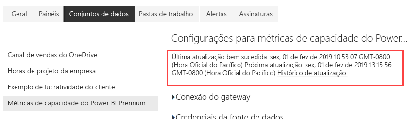

# Monitorar as capacidades Premium com o aplicativo

Monitorar suas capacidades é essencial para tomar decisões bem informadas sobre a melhor maneira de utilizar os recursos de capacidade Premium. Você pode monitorar as capacidades no portal do Administrador ou com o aplicativo **Métricas de Capacidade do Power BI Premium**. Este artigo descreve como usar o aplicativo de métricas de capacidade Premium. O aplicativo fornece informações mais detalhadas do desempenho de suas capacidades. Para uma visão geral mais detalhada das métricas de uso médio nos últimos sete dias, você pode usar o portal de Administração. Para saber mais sobre o monitoramento no portal, veja [monitorar capacidades Premium no portal de Administração](service-admin-premium-monitor-portal.md).

O aplicativo é atualizado regularmente com novos recursos e funcionalidades. Verifique se você está executando a última versão. Se você tem uma versão anterior do aplicativo já instalada, é melhor excluí-la de seus aplicativos e, em seguida, pressionar CTRL+F5 para atualizar. 

## Instalar o aplicativo

Você pode ir diretamente para [aplicativo de Métricas de Capacidade Premium](https://app.powerbi.com/groups/me/getapps/services/capacitymetrics) ou instalá-lo como faz com outros aplicativos no Power BI.

1. No Power BI, clique em **Aplicativos**.   
    

2. No lado direito, clique em **Obter aplicativos**.
3. Na categoria **Aplicativos**, pesquise por **Aplicativo de Métricas de Capacidade do Power BI Premium**.
4. Inscreva-se para instalar o aplicativo.

Seja paciente. Demora alguns minutos para instalar e atualizar as métricas. Se o aplicativo mostrar métricas em branco, pressione F5 para atualizar seu navegador.

## Obter histórico de atualização de aplicativo

Para verificar a última vez em seu aplicativo de Métricas de Capacidade Premium foi atualizado, clique em **Configurações** > **Conjuntos de Dados** > **Métricas de Capacidade do Power BI Premium** > **Histórico de Atualização**. 

A última atualização é mostrada, ou clique em **Histórico de atualização** para ver atualizações agendadas e por demanda.

## Monitorar capacidades com o aplicativo

Agora que você instalou o aplicativo, pode ver as métricas das capacidades em sua organização. O aplicativo fornece um Dashboard com resumos de métricas e Relatórios de métricas detalhadas.

### Dashboard

Para ver um painel que resume as principais métricas para as capacidades das quais você é administrador, em **Painéis**, clique em **Métricas de capacidade do Power BI Premium**. Um painel é exibido.

O dashboard inclui as seguintes métricas:

#### Principais

| Métrica | Descrição |
| --- | --- |
| Versão | Versão do aplicativo. | 
| Capacidades | Número de capacidades das quais você é administrador. | 
| Workspaces | Número de espaços de trabalho em suas capacidades que estão relatando métricas.|
|||

#### Resumo do sistema

| Métrica | Descrição |
| --- | --- |
| Maior capacidade de utilização da CPU | Capacidade com o número máximo de vezes que a CPU excedeu 80% dos limites nos últimos sete dias. |
| Maior contagem de utilização da CPU | Número de vezes que a CPU da capacidade nomeada excedeu 80% dos limites nos últimos sete dias. | 
| Capacidade de utilização máxima de memória | Capacidade com o número máximo de vezes que o limite máximo de memória foi atingido nos últimos sete dias, dividido em buckets de três minutos.  |
| Contagem de utilização máxima de memória| Número de vezes que a capacidade nomeada atingiu o limite máximo de memória nos últimos sete dias, dividido em buckets de três minutos. |
|||

#### Resumo do conjunto de dados

| Métrica | Descrição |
| --- | --- |
| Conjuntos de dados | Número total de conjuntos de dados em todos os espaços de trabalho em suas capacidades.|
| Tamanho médio dos conjuntos de dados (MB) | Tamanho médio dos conjuntos de dados em todos os espaços de trabalho em suas capacidades.|  
| Contagem média de conjunto de dados carregados | Contagem média de conjuntos de dados carregados na memória. |  
| Conjuntos de Dados – média de conjunto de dados ativos (%)| Média dos conjuntos de dados ativos nos últimos sete dias. Um conjunto de dados é definido como ativo se o usuário interagiu com visuais nos últimos três minutos. |
| CPU – Máximo de conjuntos de dados (%)| Consumo máximo de CPU por carga de trabalho do conjunto de dados nos últimos sete dias. |
| CPU – Média de conjuntos de dados (%)| Consumo médio de CPU por carga de trabalho do conjunto de dados nos últimos sete dias. |
| Memória – Média de conjuntos de dados (GB) | Consumo médio de memória por carga de trabalho do conjunto de dados nos últimos sete dias. |
| Memória – Máximo de conjuntos de dados (GB) | Consumo máximo de memória por carga de trabalho do conjunto de dados nos últimos sete dias.|
| Remoções de conjuntos de dados | Número total de conjuntos de dados removidos devido à pressão da memória. |
| Contagem de alta utilização dinâmica/DirectQuery| O número de vezes que as conexões dinâmicas/DirectQuery excederam 80% dos limites nos últimos sete dias, divididas em buckets de três minutos. |
| Contagem de máxima utilização dinâmica/DirectQuery| A maioria das vezes em que as conexões dinâmicas/DirectQuery excederam 80% nos últimos sete dias, divididas em buckets de uma hora. |
| Alta utilização máxima dinâmica/DirectQuery | O número máximo de vezes que as conexões dinâmicas/DirectQuery excederam 80% dos limites nos últimos sete dias, divididas em buckets de três minutos.|
| Tempo máximo ocorrido dinâmico/DirectQuery | A hora UTC em que as conexões dinâmicas/DirectQuery excederam 80% mais vezes em uma hora. |
| Total de atualizações | Número total de atualizações nos últimos sete dias. |
| Atualização de confiabilidade (%) | Número de atualizações bem-sucedidas dividido pelo número total de atualizações nos últimos sete dias. |
| Duração média das atualizações (minutos) | Valor médio de tempo para completar a atualização. |
| Tempo de espera médio das atualizações (minutos)| Valor médio de tempo antes de iniciar a atualização. |
| Total de consultas |  Número total de consultas executadas nos últimos sete dias. |
| Contagem total de espera de consultas | Número total de consultas que tiveram que esperar antes de serem executadas. |
| Duração média das consultas (MS) | Tempo médio necessário para concluir as consultas. |
| Tempo médio de espera das consultas (MS) | Tempo médio que as consultas esperaram pelos recursos do sistema antes de serem executadas. |
|||

#### Resumo do fluxo de dados

| Métrica | Descrição |
| --- | --- |
| Fluxos de dados |  Número total de fluxos de dados em todos os espaços de trabalho em suas capacidades.|
| Total de atualizações | Número total de atualizações nos últimos sete dias.|  
| Duração média das atualizações (minutos) | O tempo necessário para concluir a atualização. |
| Tempos de espera médio das atualizações (minutos) | A latência entre o horário agendado e o início real da atualização.|
| CPU – Máximo de fluxos de dados (%) | Consumo máximo de CPU por carga de trabalho dos fluxos de dados nos últimos sete dias. |
| CPU – Média dos fluxos de dados (%) | Consumo médio de CPU por carga de trabalho dos fluxos de dados nos últimos sete dias. |
| Memória – Máximo de fluxos de dados (GB) | Consumo máximo de memória por carga de trabalho dos fluxos de dados nos últimos sete dias. |
| Memória – Média dos fluxos de dados (GB) | Consumo médio de memória por carga de trabalho dos fluxos de dados nos últimos sete dias. |
|||

#### Resumo do relatório paginado

| Métrica | Descrição |
| --- | --- |
| Relatórios paginados |  Número total de relatórios paginados em todos os espaços de trabalho em suas capacidades. |
| Total de exibições | Total de vezes que todos os relatórios foram exibidos pelos usuários. | 
| Total de linhas | Total de linhas de dados em todos os relatórios.|
| Tempo Total | Tempo total necessário para todas as fases (recuperação de dados, processamento e renderização) de todos os relatórios, em milissegundos. |
| CPU – Máximo de relatórios paginados (%) | Consumo máximo de CPU por carga de trabalho de relatório paginado nos últimos sete dias. |
| CPU – Média de relatórios paginados (%) | Consumo médio de CPU por carga de trabalho de relatório paginado nos últimos sete dias. |
| Memória – Máximo de relatórios paginados (GB) | Consumo máximo de memória por carga de trabalho de relatório paginado nos últimos sete dias. |
| Memória – Média de relatórios paginados (GB) | Consumo médio de memória por carga de trabalho de relatório paginado nos últimos sete dias. |
|||

#### Resumo sobre IA

| Métrica | Descrição |
| --- | --- |
| Execução da função de IA | Número total de execuções nos últimos sete dias. |
| Confiabilidade da execução da função de IA (%) | Número de execuções bem-sucedidas dividido pelo número total de execuções nos últimos sete dias. |
| Máximo de CPU (%)| Consumo máximo de CPU por carga de trabalho de IA nos últimos sete dias. |
| Memória máxima (GB) | Consumo máximo de memória por carga de trabalho de IA nos últimos sete dias.|
| Tempo de espera máximo da execução da função de IA (MS) | Tempo máximo antes do início da execução. |
| Tempo de espera médio da execução da função de IA (MS)| Tempo médio antes do início da execução. |
| Duração máxima da execução da função de IA (MS) | Tempo máximo de conclusão da execução. |
| Duração média da execução da função de IA (MS)| Tempo médio de conclusão da execução. |
| | |

### Relatórios

Os relatórios fornecem métricas mais detalhadas. Para ver os relatórios de capacidades das quais você é administrador, em **Relatórios**, clique em **Métricas de capacidade do Power BI Premium**. Ou, no painel, clique na célula da métrica para acessar o relatório subjacente. 

Na parte inferior do relatório, há cinco *guias*:

[**Conjuntos de Dados**](#datasets) – fornece as métricas detalhadas sobre a integridade dos conjuntos de dados do Power BI nas suas capacidades.
[**Relatórios Paginados**](#paginated-reports) – fornece as métricas detalhadas sobre a integridade dos relatórios paginados nas suas capacidades.
[**Fluxos de Dados**](#dataflows) – fornece as métricas de atualização detalhadas para fluxos de dados em suas capacidades.
[**IA**](#ai) – fornece métricas detalhadas sobre a integridade das funções de IA usadas nas capacidades.
[**Consumo de Recursos**](#resource-consumption) – fornece recursos detalhados das métricas, incluindo alta utilização de CPU e de memória.
[**IDs e informações**](#ids-and-info) – os nomes, as IDs e os proprietários para cargas de trabalho, workspaces e capacidades.

Cada guia abre uma página na qual é possível filtrar as métricas por capacidade e por intervalo de datas. Se nenhum filtro for selecionado, por padrão, o relatório mostrará métricas da semana passada para todas as capacidades que estão relatando métricas. 

### Conjuntos de dados

A página Conjuntos de Dados tem diferentes *áreas*, que incluem **Atualizações**, **Durações de Consulta**, **Esperas de Consulta** e **Conjuntos de Dados**. Use os botões na parte superior da página para navegar até diferentes áreas.

#### Área de Atualizações

| Seção de relatório | Métricas |
| --- | --- |
| Atualizações |  Contagem total: o total é atualizado para cada conjunto de dados.   Confiabilidade: O percentual de atualizações concluídas para cada conjunto de dados.   Tempo de espera médio: a latência média entre o horário agendado e o início de uma atualização para o conjunto de dados, em minutos.   Tempo de espera máximo: o tempo de espera máximo para o conjunto de dados, em minutos.   Duração média: a duração média da atualização para o conjunto de dados, em minutos.   Duração máxima: a duração da atualização de execução mais longa para o conjunto de dados, em minutos. |
| Os cinco principais conjuntos de dados por duração média (minutos) |  Os cinco conjuntos de dados com a duração média mais longa de atualização, em minutos. |
| Os cinco principais conjuntos de dados por tempo médio de espera (minutos) |  Os cinco conjuntos de dados com o tempo de espera médio mais longo de atualização, em minutos. |
| Contagem de atualizações por hora e consumo de memória (GB) |  Os sucessos, as falhas e o consumo de memória, divididos em buckets de uma hora, relatados na hora UTC. |
| Tempo de espera médio de atualização por hora (minutos) |  O tempo de espera médio de atualização, dividido em buckets de uma hora, relatados na hora UTC. Vários picos elevados de tempo de espera de atualização são uma indicação de que a capacidade de execução está sobrecarregada. |
|  |  |

#### Área Durações de Consulta

| Seção de relatório | Métricas |
| --- | --- |
| Durações das consultas |  Os dados nessa seção são divididos por conjuntos de dados, espaço de trabalho e buckets de uma hora nos últimos sete dias.   Total: o número total de consultas executadas para o conjunto de dados.   Média: a duração média de consulta do conjunto de dados, em milissegundos   Máx.: a duração da consulta de execução mais longa no conjunto de dados, em milissegundos.|
| Distribuição de duração da consulta |  O histograma da duração da consulta é dividido em intervalos de consulta em milissegundos nas seguintes categorias: <= 30 ms, 30-100 ms, 100-300 ms, 300 ms-1 s, 1-3 s, 3-10 s, 10-30 s e > 30 segundos. Longas durações de consulta e longos tempos de espera indicam que a capacidade está se aproximando do limite. Também pode indicar que um único conjunto de dados está causando problemas e mais investigação é necessária. |
| Os cinco principais conjuntos de dados por duração média |  Os cinco conjuntos de dados com a duração de consulta média mais longa, em milissegundos. |
| Distribuições de duração da consulta por hora |  Contagens de consultas e duração média (em milissegundos) versus consumo de memória em GB divididos em buckets de uma hora relatados na hora UTC. |
| Conexões dinâmicas/DirectQuery (> 80% da utilização) |  As ocasiões em que uma conexão dinâmica ou DirectQuery excedeu 80% da utilização da CPU divididos em buckets de uma hora, relatado em hora UTC. |
|  |  |

#### Área Esperas de Consulta

| Seção de relatório | Métricas |
| --- | --- |
| Tempos de espera de consulta |  Os dados nessa seção são divididos por conjuntos de dados, espaço de trabalho e buckets de uma hora nos últimos sete dias.   Total: o número total de consultas executadas para o conjunto de dados.   Contagem de espera: o número de consultas no conjunto de dados que aguardou recursos do sistema antes de iniciar a execução.   Média: o tempo médio de espera da consulta para o conjunto de dados, em milissegundos.   Máx.: a duração da consulta de espera mais longa no conjunto de dados, em milissegundos.|
| Os cinco principais conjuntos de dados por tempo médio de espera |  Os cinco conjuntos de dados com o maior tempo médio de espera para iniciar a execução de uma consulta, em milissegundos. |
| Distribuições do tempo de espera |  O histograma da duração da consulta é dividido em intervalos de consulta em milissegundos nas seguintes categorias: <= 50 ms , 50-100 ms , 100-200 ms , 200-400 ms 400 ms-1 s, 1-5 s e > 5 segundos. |
| Distribuições de tempo de espera de consulta por hora |  As contagens de esperas de consultas e tempo de espera médio (em milissegundos) versus o consumo de memória em GB divididos em buckets de uma hora relatados na hora UTC. |
|  |  |

#### Área de Conjuntos de Dados

| **Seção de relatório** | **Métricas** |
| --- | --- |
| Tamanhos de conjunto de dados  |  Tamanho máximo: o tamanho máximo do conjunto de dados em MB para o período exibido. |
| Contagens de remoção do conjunto de dados |  Total: o número total de *remoções* de conjunto de dados para cada capacidade. Quando uma capacidade enfrenta a pressão de memória, o nó remove um ou mais conjuntos de dados da memória. Conjuntos de dados que estão inativos (sem nenhuma operação de atualização/consulta em execução no momento) são removidos primeiro. Em seguida, a ordem de remoção se baseia em uma medida de LRU (“menos utilizado recentemente”).|
| Contagens de conjunto de dados carregados por hora |  O número de conjuntos de dados carregados na memória versus o consumo de memória em GB, dividido em buckets de uma hora, relatados na hora UTC. |
| Remoções de conjunto de dados e consumo de memória por hora |  As remoções de conjunto de dados versus consumo de memória em GB, divididos em buckets de uma hora, relatado em hora UTC. |
| Percentuais de memória consumida |  Total de conjuntos de dados ativos na memória como um percentual do total de memória. O delta entre o Active Directory e Todos define os conjuntos de dados que podem ser removidos. Mostrado por hora para os sete dias anteriores. |
|  |  |

### Relatórios paginados

| **Seção de relatório** | **Métricas** |
| --- | --- |
| Uso geral |  Total de exibições: o número de vezes que o relatório foi exibido pelos usuários.   Contagem de linhas: o número de linhas de dados no relatório.   Recuperação (méd.): a quantidade média de tempo que leva para recuperar dados para o relatório, em milissegundos. Durações longas podem indicar consultas lentas ou outros problemas de fonte de dados.    Processamento (méd.): a quantidade média de tempo que leva para processar os dados para um relatório, em milissegundos.  Renderização (méd.): a quantidade média de tempo necessária para renderizar um relatório no navegador, em milissegundos.   Tempo total: o tempo necessário para todas as fases do relatório, em milissegundos. |
| Os cinco principais relatórios por tempo médio de recuperação de dados |  Os cinco relatórios com o tempo de recuperação de dados médio mais longo, em milissegundos. |
| Os cinco principais relatórios por tempo médio de processamento de relatório |  Os cinco relatórios com o tempo de processamento médio mais longo, em milissegundos. |
| Resultados por hora |  Os sucessos, as falhas e o consumo de memória, divididos em buckets de uma hora, relatados na hora UTC. |
| Durações por hora |  A recuperação de dados versus o tempo de renderização e o processamento, divididos em buckets de uma hora, relatados na hora UTC. |
|  |  |

### Fluxos de dados

| **Seção de relatório** | **Métricas** |
| --- | --- |
| Atualizações |  Total: o total é atualizado para cada fluxo de dados.   Confiabilidade: O percentual de atualizações que foram concluídas para cada fluxo de dados.   Tempo de espera médio: a latência média entre o horário agendado e o início de uma atualização para o fluxo de dados, em minutos.   Tempo de espera máximo: o tempo de espera máximo para o fluxo de dados, em minutos.   Duração média: a duração média da atualização para o fluxo de dados, em minutos.   Duração máxima: a duração da atualização de execução mais longa para o fluxo de dados, em minutos. |
| Os cinco principais fluxos de dados por duração média de atualização |  Os cinco fluxos de dados com a duração média mais longa de atualização, em minutos. |
| Os cinco principais fluxos de dados por tempo médio de espera |  Os cinco fluxos de dados com o tempo de espera médio mais longo de atualização, em minutos. |
| Tempo médio de espera de atualização por hora |  O tempo de espera médio de atualização, dividido em buckets de uma hora, relatados na hora UTC. Vários picos elevados de tempo de espera de atualização são uma indicação de que a capacidade de execução está sobrecarregada. |
| Contagem de atualização por hora e Consumo da memória |  Os sucessos, as falhas e o consumo de memória, divididos em buckets de uma hora, relatados na hora UTC. |
|  |  |

### IA

| **Seção de relatório** | **Métricas** |
| --- | --- |
| Consumo da memória de IA | Consumo da memória em GB, divididos em buckets de uma hora, relatado no horário UTC. |
| Tempo de espera médio e execução da função de IA por hora | Tempo de espera médio e execuções de IA, em milissegundos, divididos em buckets de uma hora, relatado no horário UTC. |
| Uso geral | Contagem total: Número de funções de IA em um workspace ou fluxo de dados.   Confiabilidade do sistema: O percentual de execuções concluídas.  Méd. Tempo de espera: O retardo médio entre o horário agendado e o início de uma execução, em milissegundos.  Tempo de espera máximo: O tempo de espera máximo, em milissegundos.  Méd. Duração: A duração média de uma execução, em milissegundos.  Duração máxima: A duração da execução mais longa, em milissegundos.  Tamanho total médio: O tamanho médio, em bytes, dos dados de entrada e saída para a função de IA. |
| | |

### Consumo de recursos

| **Seção de relatório** | **Métricas** |
| --- | --- |
| Consumo da CPU |  Consumo por carga de trabalho como um percentual da capacidade total da CPU. Mostrado por hora para os sete dias anteriores. |
| Consumo da memória |  Consumo de memória em GB por carga de trabalho (linhas sólidas) sobreposta com os limites de carga de trabalho (linha pontilhada). Mostrado por hora para os sete dias anteriores. |
|  |  |

### IDs e informações

A guia **IDs e Informações** contém áreas para **Capacidades**, **Espaços de Trabalho**, **Conjuntos de Dados**, **Relatórios Paginados** e **Fluxos de Dados**.

#### Área de capacidades

| Seção de relatório | Métricas |
| --- | --- |
| SKU e Informações de carga de trabalho | Configurações de SKU e da carga de trabalho para a capacidade. |
| Administradores | Nomes dos administradores da capacidade. |
|||

#### Área Espaços de trabalho

| Seção de relatório | Métricas |
| --- | --- |
| Workspaces | Os nomes e IDs para todos os espaços de trabalho. |
|||

#### Área de Conjuntos de Dados

| Seção de relatório | Métricas |
| --- | --- |
| Conjuntos de dados | Os nomes e IDs do espaço de trabalho para todos os conjuntos de dados. |
|||

#### Área de relatórios paginados

| Seção de relatório | Métricas |
| --- | --- |
| Relatórios paginados | Nomes, nomes do espaço de trabalho e IDs para todos os relatórios paginados. |
|||

#### Área de fluxos de dados

| Seção de relatório | Métricas |
| --- | --- |
| Fluxos de dados | Nomes de fluxo de dados, nomes de espaço de trabalho e IDs para todos os fluxos de dados. |
|||

## Monitorar a capacidade do Power BI Embedded

Você pode usar o aplicativo de Métricas de Capacidade do Power BI Premium para monitorar capacidades de *SKU A* no Power BI Embedded. Essas capacidades aparecerão no relatório contanto que você seja um administrador de capacidade. No entanto, a atualização do relatório falhará, a menos que você concede determinadas permissões ao Power BI sobre as SKUs A:

1. Abra a capacidade no portal do Azure.

1. Clique em **Controle de acesso (IAM)** e adicione o aplicativo **Power BI Premium** à função de leitor. Se não for possível encontrar o aplicativo pelo nome, também será possível adicioná-lo pelo identificador do cliente: `cb4dc29f-0bf4-402a-8b30-7511498ed654`.

    

> [!NOTE]
> Você pode monitorar a utilização da capacidade do Power BI Embedded no aplicativo ou no portal do Azure, mas não no portal de administração do Power BI.

## Próximas etapas

> [!div class="nextstepaction"]
> [Como otimizar as capacidades Premium do Power BI](service-premium-capacity-optimize.md)
