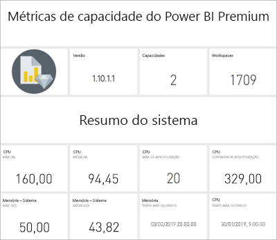
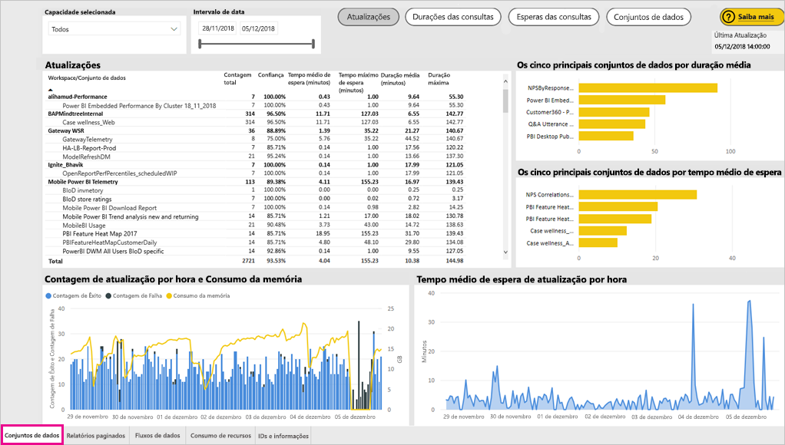
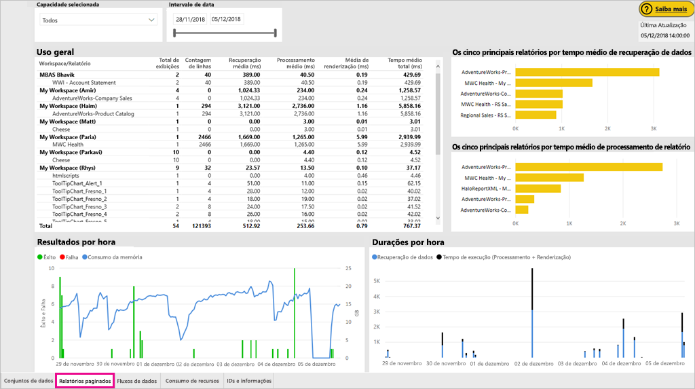
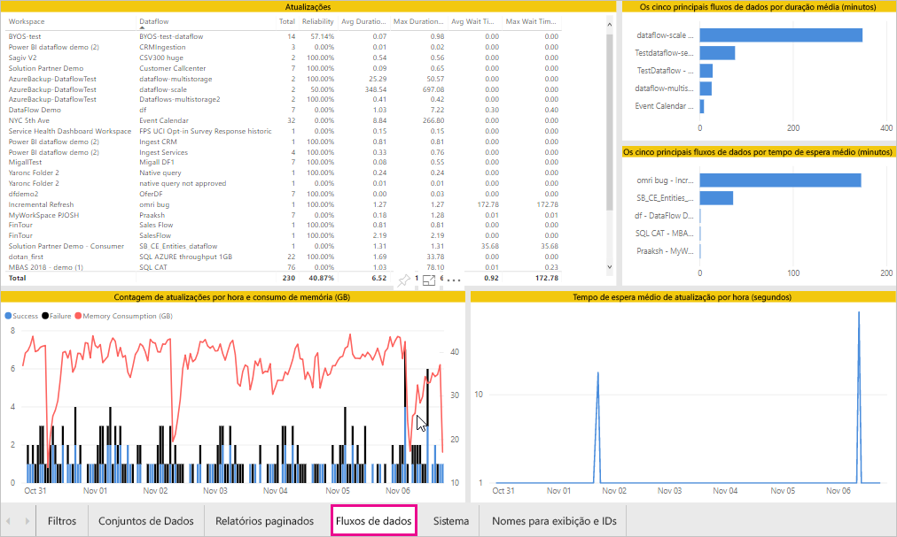
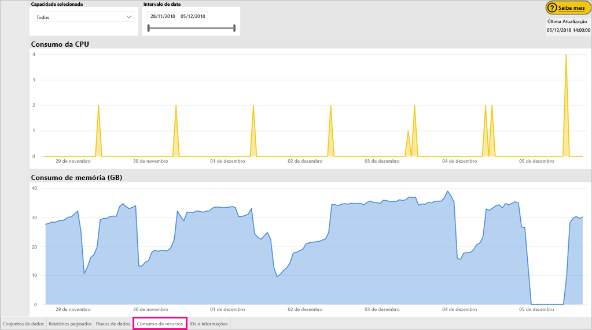
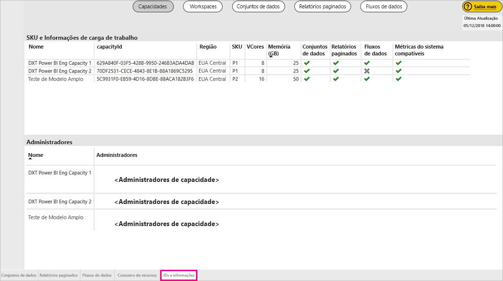
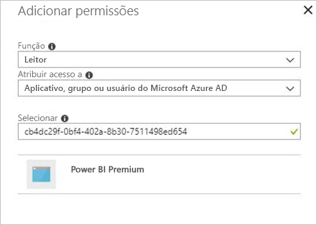
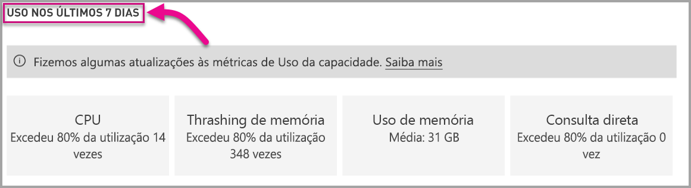

# Monitorar as capacidades do Power BI Premium e do Power BI Embedded

Este artigo fornece uma visão geral do monitoramento de métricas para suas capacidades do Power BI Premium. O monitoramento do uso da capacidade permite que você adote uma abordagem embasada para gerenciar suas capacidades.

Você pode monitorar a capacidade com o aplicativo de Métricas de Capacidade do Power BI Premium ou no portal de administração. É recomendável usar o aplicativo, pois ele fornece muito mais detalhes, mas este artigo aborda as duas opções.

**A versão atual do aplicativo é 1.10 (lançada em 13 de dezembro de 2018).**

.

<iframe width="560" height="315" src="https://www.youtube.com/embed/UgsjMbhi_Bk?rel=0&amp;showinfo=0" frameborder="0" allowfullscreen></iframe>

## Instalar o aplicativo de Métricas de Capacidade Premium

Você pode ir diretamente para o [aplicativo de Métricas de Capacidade Premium](https://app.powerbi.com/groups/me/getapps/services/capacitymetrics) ou instalá-lo como faz com outros aplicativos no Power BI.

1. No Power BI, clique em **Aplicativos**.

    

1. No lado direito, clique em **Obter aplicativos**.

1. Na categoria **Aplicativos**, pesquise por **Aplicativo de Métricas de Capacidade do Power BI Premium**.

1. Inscreva-se para instalar o aplicativo.

Agora que você instalou o aplicativo, pode ver as métricas sobre as capacidades em sua organização. Vamos conferir algumas das principais métricas que estão disponíveis.

## Usar o aplicativo de métricas

### Dashboard de métricas

Quando você abre o aplicativo, primeiro ele mostra um painel com um resumo de todas as capacidades para as quais você tem direitos de administrador.

O dashboard inclui as seguintes métricas.

| **Seção de relatório** | **Métricas** |
| --- | --- |
| **Resumo do sistema** | * Versão do aplicativo  * Número de capacidades das quais você é administrador  * Número de workspaces em suas capacidades que estão relatando métricas  * O consumo médio da memória em GB nos últimos sete dias  * O consumo máximo da memória em GB nos últimos sete dias  * Hora local em que ocorreu o consumo máximo da memória  * O número de vezes que a CPU excedeu 80% dos limites nos últimos sete dias, divididos em buckets de três minutos  * A maioria das vezes em que a CPU excedeu 80% nos últimos sete dias, divididas em buckets de uma hora  * Hora local em que a CPU excedeu 80% mais vezes em uma hora |
| **Resumo do conjunto de dados** | * Número total de conjuntos de dados em todos os workspaces em suas capacidades  * O número de vezes que as conexões de Consulta direta/dinâmica excederam 80% dos limites nos últimos sete dias, divididas em buckets três minutos  * A maioria das vezes em que as conexões de Consulta direta/dinâmicas excederam 80% nos últimos sete dias, divididas em buckets de uma hora  * Hora local em que as conexões de consulta direta/dinâmicas excederam 80% mais vezes em uma hora  * Número total de atualizações nos últimos sete dias  * Tempo de espera médio da atualização – a latência média entre o horário agendado e o início da atualização, em minutos  * Duração média da atualização – o tempo necessário para concluir a atualização, em minutos  * Número total de consultas executadas nos últimos sete dias  * Tempo médio de espera da consulta – o tempo que uma consulta aguardou em recursos de sistema antes de iniciar a execução, em milissegundos  * A duração média da consulta – o tempo necessário para concluir a consulta, em milissegundos  * Número total de modelos removidos devido à pressão da memória  * Tamanho médio dos conjuntos de dados   * Contagem média de conjuntos de dados carregados na memória |
| **Resumo do fluxo de dados** | * Número total de fluxos de dados em todos os workspaces em suas capacidades  * Número total de atualizações nos últimos sete dias  * Tempo de espera médio da atualização – a latência média entre o horário agendado e o início da atualização, em minutos  * Duração média da atualização – o tempo necessário para concluir a atualização, em minutos |
| **Resumo do relatório paginado** | * Número total de relatórios paginados em todos os workspaces em suas capacidades  * Total de vezes que todos os relatórios foram exibidos pelos usuários  * Total de linhas de dados em todos os relatórios  * Tempo total necessário para todas as fases (recuperação, processamento e renderização de dados) de todos os relatórios, em milissegundos |
|  |  |

### Relatório de métricas

Clique no painel para ir para o relatório subjacente. O relatório tem cinco guias, que descrevemos em mais detalhes nas seções a seguir.

* **Conjuntos de dados**: as métricas detalhadas sobre a integridade dos conjuntos de dados do Power BI nas suas capacidades.

* **Relatórios paginados**: as métricas detalhadas sobre a integridade dos relatórios paginados nas suas capacidades.

* **Fluxos de dados**: as métricas de atualização detalhadas para fluxos de dados em suas capacidades.

* **Consumo de recursos**: métricas de capacidade geral, incluindo memória e alta utilização da CPU.

* **IDs e informações**: os nomes, as IDs e os proprietários para cargas de trabalho, workspaces e capacidades.

Em cada guia, é possível filtrar as métricas por capacidade e por intervalo de datas. Se nenhum filtro for selecionado, por padrão, o relatório mostrará métricas da semana passada para todas as capacidades que estão relatando métricas.

#### Guia Conjuntos de dados

Use os botões na parte superior da guia **Conjuntos de dados** para navegar até diferentes áreas: **Resumo**, **Atualizações**, **Durações da consulta**, **Esperas de consulta** e **Conjuntos de dados**.

##### Área de Atualizações

A área **Atualizações** contém as métricas a seguir.

| **Seção de relatório** | **Métricas** |
| --- | --- |
| **Atualização de confiabilidade** | * Contagem total: o total é atualizado para cada conjunto de dados  * Confiabilidade: a porcentagem de atualizações que é concluída para cada conjunto de dados  * Tempo de espera médio: a latência média entre o horário agendado e o início de uma atualização para o conjunto de dados, em minutos  * Tempo de espera máximo: o tempo de espera máximo para o conjunto de dados, em minutos   * Duração média: a duração média da atualização para o conjunto de dados, em minutos  * Duração máxima: a duração da atualização de execução mais longa para o conjunto de dados, em minutos |
| **Os cinco principais conjuntos de dados por duração de atualização média** | * Os cinco conjuntos de dados com a duração média mais longa de atualização, em minutos |
| **Os cinco principais conjuntos de dados por tempo médio de espera** | * Os cinco conjuntos de dados com o tempo de espera médio mais longo de atualização, em minutos |
| **Tempos médios de espera de atualização por hora** | * O tempo de espera médio de atualização, dividido em buckets de uma hora, relatados no horário local. Vários picos elevados de tempo de espera de atualização são uma indicação de que a capacidade de execução está sobrecarregada. |
| **Contagem de atualização por hora e consumo de memória** | * Sucessos, falhas e consumo de memória, dividido em buckets de uma hora, relatado em hora local |
|  |  |

##### Área Durações de Consulta

A área **Durações de Consulta** contém as métricas a seguir.

| **Seção de relatório** | **Métricas** |
| --- | --- |
| **Durações de Consulta** | * Os dados nessa seção são divididos por conjuntos de dados, espaço de trabalho e intervalos por hora nos últimos sete dias  * Total: o número total de consultas executadas para o conjunto de dados  * Média: a duração média de consulta do conjunto de dados, em milissegundos  * Máx.: a duração da consulta de execução mais longa no conjunto de dados, em milissegundos|
| **Distribuição de duração da consulta** | * O histograma da duração da consulta é dividido em intervalos de consulta em milissegundos nas seguintes categorias: <= 30 ms, 30-100 ms, 100-300 ms, 300 ms-1 s, 1-3 s, 3-10 s, 10-30 s e > 30 segundos. Longas durações de consulta e longos tempos de espera indicam que a capacidade está se aproximando do limite. Também pode indicar que um único conjunto de dados está causando problemas e mais investigação é necessária. |
| **Os cinco principais conjuntos de dados por duração média** | * Os cinco conjuntos de dados com a duração de consulta média mais longa, em milissegundos |
| **Consulta direta/conexões dinâmicas (> 80% da utilização)** | * As ocasiões em que uma consulta direta ou conexão dinâmica excedeu 80% da utilização da CPU, dividido em buckets de uma hora, relatado em hora local |
| **Distribuições de duração da consulta por hora** | * Contagens de consultas e duração média (em milissegundos) vs. consumo de memória em GB divididos em buckets de uma hora relatados no horário local |
|  |  |

##### Área Esperas de Consulta

A área **Esperas de Consulta** contém as métricas a seguir.

| **Seção de relatório** | **Métricas** |
| --- | --- |
| **Horas de Esperas de Consulta** | * Os dados nessa seção são divididos por conjuntos de dados, espaço de trabalho e intervalos por hora nos últimos sete dias  * Total: o número total de consultas executadas para o conjunto de dados  * Contagem de espera: o número de consultas no conjunto de dados que aguardou recursos do sistema antes de iniciar a execução   * Média: o tempo médio de espera para o conjunto de dados, em milissegundos  * Máx.: a duração da consulta de espera mais longa no conjunto de dados, em milissegundos|
| **Distribuição do tempo de espera** | * O histograma da duração da consulta é dividido em intervalos de consulta em milissegundos nas seguintes categorias: <= 50 ms , 50-100 ms , 100-200 ms , 200-400 ms 400 ms-1 s, 1-5 s e > 5 segundos |
| **Os cinco principais conjuntos de dados por tempo médio de espera** | * Os cinco conjuntos de dados com o maior tempo médio de espera para iniciar a execução de uma consulta, em milissegundos |
| **Contagens de espera de consulta e horas por hora** | * Contagens de esperas de consultas e tempo de espera médio (em milissegundos) vs. consumo de memória em GB divididos em buckets de uma hora relatados no horário local |
|  |  |

##### Área de Conjuntos de Dados

A área **Conjuntos de Dados** contém as métricas a seguir.

| **Seção de relatório** | **Métricas** |
| --- | --- |
| **Contagens de remoção do conjunto de dados** | * Total: o número total de *remoções* de conjunto de dados para cada capacidade. Quando uma capacidade enfrenta a pressão de memória, o nó remove um ou mais conjuntos de dados da memória. Conjuntos de dados que estão inativos (sem nenhuma operação de atualização/consulta em execução no momento) são removidos primeiro. Em seguida, a ordem de remoção se baseia em uma medida de LRU (“menos utilizado recentemente”).|
| **Remoções de conjunto de dados e consumo de memória por hora** | * Remoções de conjunto de dados versus consumo de memória em GB, dividido em buckets de uma hora, relatado em hora local |
| **Contagens de conjunto de dados carregados por hora** | * Número de conjuntos de dados carregados na memória versus o consumo de memória em GB, dividido em buckets de uma hora, relatados na hora local |
| **Tamanhos de dados**  | * Tamanho máximo: o tamanho máximo do conjunto de dados em MB para o período exibido |
|  |  |

#### Guia Relatórios paginados

A guia **Relatórios paginados** mostra métricas detalhadas sobre a integridade dos relatórios paginados nas suas capacidades.

A guia **Relatórios paginados** contém as métricas a seguir.

| **Seção de relatório** | **Métricas** |
| --- | --- |
| **Uso geral** | * Total de exibições: o número de vezes que o relatório foi exibido pelos usuários  * Contagem de linhas: o número de linhas de dados no relatório  * Recuperação (méd.): a quantidade média de tempo que leva para recuperar dados para o relatório, em milissegundos. Durações longas podem indicar consultas lentas ou outros problemas de fonte de dados.   * Processamento (méd.): a quantidade média de tempo que leva para processar os dados para um relatório, em milissegundos * Renderização (méd.): a quantidade média de tempo necessária para renderizar um relatório no navegador, em milissegundos  * Tempo total: o tempo necessário para todas as fases do relatório, em milissegundos|
| **Os cinco principais relatórios por tempo médio de recuperação de dados** | * Os cinco relatórios com o tempo de recuperação de dados médio mais longo, em milissegundos |
| **Os 5 principais relatórios por tempo médio de processamento de relatório** | * Os cinco relatórios com o tempo de processamento médio mais longo, em milissegundos |
| **Durações por hora** | * Recuperação de dados versus tempo de renderização e processamento, dividido em buckets de uma hora, relatado em hora local |
| **Resultados por hora** | * Sucessos, falhas e consumo de memória, dividido em buckets de uma hora, relatado em hora local |
|  |  |

#### Guia Fluxo de dados

A guia **Fluxos de dados** mostra métricas de atualização detalhadas para fluxos de dados em suas capacidades.

A guia **Fluxos de dados** contém as métricas a seguir.

| **Seção de relatório** | **Métricas** |
| --- | --- |
| **Atualizar** | * Total: o total é atualizado para cada fluxo de dados  * Confiabilidade: a porcentagem de atualizações que é concluída para cada fluxo de dados  * Tempo de espera médio: a latência média entre o horário agendado e o início de uma atualização para o fluxo de dados, em minutos  * Tempo de espera máximo: o tempo de espera máximo para o fluxo de dados, em minutos   * Duração média: a duração média da atualização para o fluxo de dados, em minutos  * Duração máxima: a duração da atualização de execução mais longa para o fluxo de dados, em minutos |
| **Os cinco principais fluxos de dados por duração de atualização média** | * Os cinco fluxos de dados com a duração média mais longa de atualização, em minutos |
| **Os cinco principais fluxos de dados por tempo médio de espera** | * Os cinco fluxos de dados com o tempo de espera mais longo de atualização, em minutos |
| **Tempos médios de espera de atualização por hora** | * O tempo de espera médio de atualização, dividido em buckets de uma hora, relatados no horário local. Vários picos elevados de tempo de espera de atualização são uma indicação de que a capacidade de execução está sobrecarregada. |
| **Contagem de atualização por hora e consumo de memória** | * Sucessos, falhas e consumo de memória, dividido em buckets de uma hora, relatado em hora local |
|  |  |

#### Guia Consumo de recursos

A guia **Consumo de recursos** mostra o consumo de CPU e memória em todas as capacidades e cargas de trabalho.

A guia **Consumo de recursos** contém as métricas a seguir.

| **Seção de relatório** | **Métricas** |
| --- | --- |
| **Consumo da CPU** | * O número de vezes que a CPU excedeu 80% dos limites nos últimos sete dias, divididas em buckets de três minutos |
| **Consumo de memória** | * Consumo de memória nos últimos sete dias, dividido em buckets de três minutos |
|  |  |

#### Guia IDs e informações

A guia **IDs e informações** contém nomes, informações e proprietários para cargas de trabalho, workspaces e capacidades.

## Monitorar a capacidade do Power BI Embedded

Você também pode usar o aplicativo de Métricas de Capacidade do Power BI Premium para monitorar capacidades de *SKU A* no Power BI Embedded. Essas capacidades aparecerão no relatório contanto que você seja um administrador de capacidade. No entanto, a atualização do relatório falhará, a menos que você concede determinadas permissões ao Power BI sobre as SKUs A:

1. Abra a capacidade no portal do Azure.

1. Clique em **Controle de acesso (IAM)** e adicione o aplicativo "Power BI Premium" à função de leitor. Se não for possível encontrar o aplicativo por nome, você também poderá adicioná-lo pela Id do cliente: cb4dc29f-0bf4-402a-8b30-7511498ed654.

    

> [!NOTE]
> Você pode monitorar a utilização da capacidade do Power BI Embedded no aplicativo ou no portal do Azure, mas não no portal de administração do Power BI.

## Monitoramento básico no portal de administração

A área **Configurações de capacidade** do portal do administrador fornece quatro medidores que indicam as cargas adotadas e os recursos utilizados pela capacidade nos últimos sete dias. Esses quatro blocos funcionam em uma janela de tempo por hora que indica o número de horas nos últimos sete dias em que a métrica correspondente ficou acima de 80%. Essa métrica indica uma degradação potencial para a experiência do usuário final.

| **Métrica** | **Descrição** |
| --- | --- |
| CPU |O número de vezes que a CPU excedeu 80% de utilização. |
| Thrashing de memória |Representa a pressão de memória em seus núcleos de back-end. Especificamente, essa é uma métrica de quantas vezes os conjuntos de dados são removidos da memória devido à pressão de memória do uso de vários conjuntos de dados. |
| Uso de memória |Uso médio de memória, representado em gigabytes (GB). |
| DQ/s | Número de vezes em que a consulta direta e as conexões dinâmicas excederam 80% do limite.   * Limitamos o número total de consultas DirectQuery e de conexão dinâmica por segundo. * Os limites são 30/s para P1, 60/s para P2 e 120/s para P3. * A contagem de consultas diretas e de consultas de conexão somam-se à limitação acima. Por exemplo, se houver 15 DirectQueries e 15 conexões dinâmicas em um segundo, você atingirá a restrição * Isso se aplica igualmente a conexões locais e de nuvem. |
|  |  |

As métricas refletem o uso na semana passada.  Se você quiser ver uma exibição mais detalhada das métricas, faça isso clicando em um dos blocos de resumo.  Você acessará gráficos detalhados para cada uma das métricas de capacidade Premium. O gráfico a seguir mostra os detalhes para a métrica da CPU.

Esses gráficos são resumidos por hora para a semana passada e podem ajudar a isolar quando eventos relacionados ao desempenho específicos que possam ter ocorrido na semana passada em sua capacidade premium.

Você também pode exportar os dados subjacentes de qualquer métrica para um arquivo csv.  Essa exportação fornecerá informações detalhadas em intervalos de três minutos para cada dia da semana passada.

## Próximas etapas

Agora que você entende como monitorar as capacidades do Power BI Premium, saiba mais sobre como otimizar as capacidades.

> [!div class="nextstepaction"]
> [Otimização e gerenciamento de recursos da capacidade do Power BI Premium](service-premium-understand-how-it-works.md)
