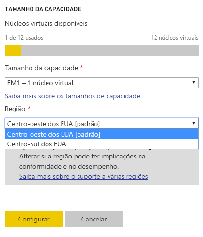
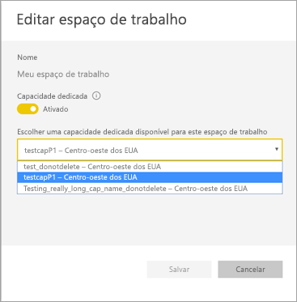
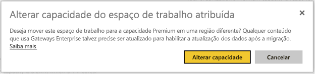
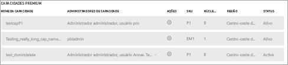

# Suporte Multi-Geo no Power BI Premium (versão prévia)
O Multi-Geo é um recurso do Power BI Premium que ajuda os clientes multinacionais a atender os requisitos de residência de dados organizacionais, regionais ou específicos do setor. Como cliente Power BI Premium, você pode implantar conteúdos em data centers nas regiões que não sejam a região de residência do locatário do Power BI. É possível optar por implantar o conteúdo em qualquer uma das áreas geográficas a seguir:

- Estados Unidos 
- Canadá 
- Reino Unido 
- Brasil 
- Europa 
- Japão 
- Índia 
- Pacífico Asiático 
- Austrália 

Uma área geográfica (geografia) pode conter mais de uma região. Por exemplo, os Estados Unidos é uma área geográfica e o Centro-Oeste dos EUA e o Centro-Sul dos EUA são regiões nos Estados Unidos. 

O Multi-Geo não está disponível no Power BI Alemanha, no Power BI China operado pela 21Vianet nem no Power BI para o governo dos EUA.

## Uso do Multi-Geo

Para novas capacidades, habilite o Multi-Geo selecionando uma região diferente da padrão na lista suspensa.  Cada capacidade disponível mostra a região em que está localizada, como **Centro-Oeste dos EUA**.

  
Após criar a capacidade, ela permanece nessa região e todo espaço de trabalho criado terá o conteúdo armazenado nessa região. É possível migrar os espaços de trabalho de uma região para outra por meio do menu suspenso na tela de configurações do espaço de trabalho.

Esta mensagem aparece para confirmar a alteração. 

Neste momento, não é preciso redefinir as credenciais de gateway durante a migração.  Após serem armazenadas na região de capacidade Premium, será preciso redefini-las no término da migração.
   
Durante a migração, pode haver falhas em certas operações, como a publicação de novos conjuntos de dados ou a atualização agendada de dados.  

Os itens a seguir são armazenados na região Premium quando o Multi-Geo está habilitado:
 
- Modelos (arquivos .ABF) para importação e conjuntos de dados de consulta direta
- Cache de consulta
- Imagens R

Os próximos itens permanecem na região de residência do locatário:

- Conjuntos de dados por push
- Pastas de trabalho do Excel
- Metadados do painel/relatório: por exemplo, nomes de blocos, consultas de blocos
- Barramentos de serviço para consultas de gateway ou trabalhos de atualização agendada
- Permissões
- Credenciais de conjunto de dados
 
## Exibir Regiões de capacidade

No Portal de administração, você pode exibir todas as capacidades do locatário do Power BI e as regiões em que estão atualmente localizadas.

 

## Alterar a região de conteúdo existente

Se for preciso alterar a região de um conteúdo existente, existem duas opções.

- Criar uma segunda capacidade e transferir os espaços de trabalho. Os usuários gratuitos não enfrentarão qualquer tempo de inatividade, contanto que o locatário tenha núcleos virtuais sobressalentes.
- Se a criação de uma segunda capacidade não for viável, é possível transferir temporariamente o conteúdo de volta para uma capacidade compartilhada do Premium. Não são necessários núcleos extras, mas os usuários gratuitos terão algum tempo de inatividade.

## Transferir o conteúdo para fora do Multi-Geo  

É possível levar os espaços de trabalho para fora da capacidade do Multi-Geo de duas maneiras:

- Excluir a capacidade atual em que o espaço de trabalho está localizado.  Isso vai transferir o espaço de trabalho de volta para a capacidade compartilhada na região de residência.
- Migre os espaços de trabalho individuais de volta para a capacidade Premium localizada no locatário de residência.

## Limitações e considerações

Confirme que toda movimentação iniciada entre as regiões seguem todos os requisitos de conformidade corporativos e governamentais antes de iniciar a transferência de dados.

Uma consulta em cache armazenada em uma região remota permanece nessa região em repouso. No entanto, outros dados em trânsito podem ir e voltar entre várias regiões geográficas. 

Ao mover dados de uma região para outra em um ambiente Multi-Geo, os dados de origem podem permanecer na região da qual foram movidos por até 30 dias. Durante esse período, os usuários finais não terão acesso a eles. Eles foram removidos desta região e destruídos durante o período de 30 dias.

O Multi-Geo não resulta em um melhor desempenho no geral. O carregamento de relatórios e painéis ainda envolve solicitações de metadados para a região de residência.

## Próximas etapas

[Power BI Premium: o que é?](service-premium.md)

Mais perguntas? [Experimente perguntar à Comunidade do Power BI](http://community.powerbi.com/)
