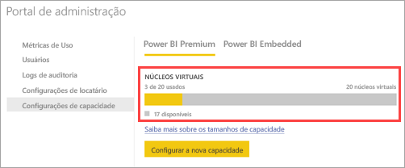

# Como comprar o Power BI Premium

> [!NOTE]
> Este artigo está sendo atualizado no momento para descrever novos recursos, fornecer mais detalhes e melhorar a legibilidade. 

Este artigo descreve como comprar capacidade do Power BI Premium (P1-P3) para sua organização. Você compra a capacidade do Power BI Premium no Centro de administração do Office 365 e gerencia suas capacidades no portal de administração do Power BI. Para obter informações atualizadas sobre preço e planejamento, confira a [Página de preços do Power BI](https://powerbi.microsoft.com/pricing/) e a [Calculadora Power BI Premium](https://powerbi.microsoft.com/calculator/).

Criadores de conteúdo ainda precisam de uma licença do Power BI Pro mesmo que sua organização use o Power BI Premium. Compre pelo menos uma licença do Power BI Pro para sua organização.

Se uma assinatura Premium expirar, você terá 30 dias de acesso completo à sua capacidade. Depois disso, seu conteúdo é revertido para uma capacidade compartilhada. Não há suporte para modelos maiores que 1 GB na capacidade compartilhada.

## Criar um novo locatário com o Power BI Premium P1

Caso você não tenha um locatário e deseje criar um, poderá comprar o Power BI Premium ao mesmo tempo. O link a seguir orienta você pelo processo de criação de um novo locatário e permite que você compre o Power BI Premium: [oferta do Power BI Premium P1](https://signup.microsoft.com/Signup?OfferId=b3ec5615-cc11-48de-967d-8d79f7cb0af1). Quando você cria seu locatário, é automaticamente atribuído à função de Administrador Global do Office 365 para esse locatário.

## Comprar uma capacidade do Power BI Premium para uma organização existente

Se você tiver uma organização existente (locatário), deverá estar na função de Administrador Global do Office 365 ou na função de Administrador de Cobrança para comprar licenças e assinaturas. Para obter mais informações, consulte [About Office 365 admin roles (Sobre funções de administrador do Office 365)](https://support.office.com/article/About-Office-365-admin-roles-da585eea-f576-4f55-a1e0-87090b6aaa9d).

Para comprar capacidade Premium, siga estas etapas.

1. No serviço do Power BI, escolha Seletor de aplicativo do Office 365 e, em seguida **Admin**.

    

    Como alternativa, é possível navegar até o Centro de Administração do Office 365. Para isso, acesse https://portal.office.com e selecione **Administrador**.

1. Selecione **Cobrança** > **Serviços de compra**.

1. Em **Outros planos**, procure ofertas do Power BI Premium. Isso listará como P1 até o P3, EM3 e P1 (mês a mês).

1. Passe o mouse sobre as reticências (**…**) e, em seguida, selecione **Comprar agora**.

    

1. Siga as etapas para concluir a compra.

Depois de concluir a compra, a página **Serviços de compra** mostrará que o item foi comprado e está ativo.

## Capacidades adicionais de compra

Agora que você tem uma capacidade, pode adicionar mais conforme suas necessidades. Você pode usar qualquer combinação de SKUs de capacidade Premium (P1 até P3) dentro de sua organização. As diferentes SKUs fornecem funcionalidades de recurso diferentes.

1. No Centro de Administração do Office 365, selecione **Cobrança** > **Comprar Serviços**.

1. Localize o item do Power BI Premium do qual você deseja adquirir mais em **Outros planos**.

1. Passe o mouse sobre as **reticências (...)** e, em seguida, selecione **Alterar quantidade de licenças**.

    

1. Altere o número de instâncias que você deseja ter para esse item. Em seguida, selecione **Enviar** quando terminar.

   > [!IMPORTANT]
   > Selecionar **Enviar** cobra do cartão de crédito no arquivo.

Em seguida, a página **Serviços de compra** indicará o número de instâncias que você tem. No portal de administração do Power BI, nas **Configurações de capacidade**, os núcleos virtuais disponíveis correspondem à nova capacidade comprada.

## Cancelar sua assinatura

Cancele sua assinatura no centro de administração do Office 365. Para cancelar sua assinatura Premium, faça o seguinte.

1. Acesse o centro de administração do Office 365.

1. Selecione **Cobrança** > **Assinaturas**.

1. Selecione sua assinatura do Power BI Premium na lista.

1. Selecione **Mais ações** > **Cancelar assinatura**.

1. A página **Cancelar assinatura** indicará se você é responsável ou não por uma [taxa de término antecipado](https://support.office.com/article/early-termination-fees-6487d4de-401a-466f-8bc3-c0beb5cc40d3). Essa página também permitirá saber quando os dados serão excluídos da assinatura.

1. Leia as informações e, caso deseje continuar, selecione **Cancelar assinatura**.

### No cancelamento ou expiração da assinatura

Ao cancelar sua assinatura Premium ou se sua licença de capacidade expirar, você poderá continuar acessando as capacidades Premium por um período de 30 dias a partir da data do cancelamento ou da expiração da licença. Após 30 dias, você já não poderá acessar suas capacidades ou workspaces Premium nelas.

## Próximas etapas

[Página de preços do Power BI](https://powerbi.microsoft.com/pricing/)   
[Calculadora Power BI Premium](https://powerbi.microsoft.com/calculator/)   
[Perguntas frequentes sobre o Power BI Premium](service-premium-faq.md)   
[Planejando um white paper de implantação do Power BI Enterprise](https://aka.ms/pbienterprisedeploy)

Mais perguntas? [Experimente perguntar à Comunidade do Power BI](http://community.powerbi.com/)