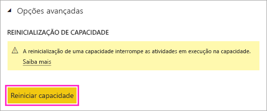

# Reiniciar uma capacidade do Power BI Premium

Como administrador do Power BI, talvez você precise reiniciar uma capacidade Premium. Este artigo explica como reiniciar uma capacidade e aborda várias perguntas sobre desempenho e reinicialização.

## Por que o Power BI fornece essa opção?

O Power BI fornece aos usuários a capacidade de executar análises complexas em grandes quantidades de dados. Infelizmente, os usuários podem causar problemas de desempenho ao sobrecarregar o serviço do Power BI com trabalhos, criando consultas excessivamente complexas, criando referências circulares e assim por diante.

A capacidade compartilhada do Power BI oferece uma proteção contra esses casos, impondo limites de tamanhos de arquivos, agendas de atualização e outros aspectos do serviço. Em uma capacidade do Power BI Premium, por outro lado, a maioria desses limites é elevada. Como resultado, um único relatório com uma expressão DAX incorreta ou um modelo muito complexo pode causar problemas significativos de desempenho. Quando processado, o relatório pode consumir todos os recursos disponíveis na capacidade. 

O Power BI está melhorando constantemente em relação à maneira de proteger os usuários da capacidade Premium contra esses problemas. Também estamos capacitando os administradores com ferramentas para analisar quando e porque as capacidades estão sobrecarregadas. Para obter mais informações, confira a [sessão de treinamento curto](https://www.youtube.com/watch?v=UgsjMbhi_Bk&feature=youtu.be) e a [sessão de treinamento mais demorado](https://www.microsoft.com/businessapplicationssummit/video/BAS2018-2174). Ao mesmo tempo, você precisa ter a capacidade de atenuar problemas significativos quando eles ocorrerem. A maneira mais rápida de atenuar esses problemas é a capacidade de reiniciar.

## O processo de reinicialização é seguro? Perderei dados?

Todos os dados, as definições, os relatórios e os dashboards salvos em sua capacidade permanecem totalmente intactos após a reinicialização. Quando você reinicia uma capacidade, todas as atualizações agendadas e ad hoc em andamento são interrompidas. O serviço tentará repetir atualizações quando a capacidade esteja disponível. Os usuários que estiverem interagindo com a capacidade perderão o trabalho não salvo. Eles deverão atualizar seus navegadores após a conclusão da reinicialização.

## Como reiniciar uma capacidade?

Siga estas etapas para reiniciar uma capacidade.

1. No portal de administração do Power BI, na guia **Configurações de Capacidade**, navegue até sua capacidade. 

1. Adicione o *sinalizador de recurso* **CapacityRestart** à URL da capacidade: https://app.powerbi.com/admin-portal/capacities/<YourCapacityId>?capacityRestartButton=true.

1. Em **Configurações Avançadas** > **REINICIAR CAPACIDADE**, selecione **Reiniciar capacidade**.

    

1. Na caixa de diálogo **Reinicialização de capacidade**, selecione **Sim, reiniciar capacidade**.

    

## Como evitar que os problemas aconteçam no futuro?

A melhor maneira de evitar problemas é ensinar os usuários a realizarem uma modelagem de dados eficiente. Para obter mais informações, confira a [sessão de treinamento](https://www.microsoft.com/businessapplicationssummit/video/BAS2018-2170).

Também recomendamos que você [monitore suas capacidades](service-admin-premium-monitor-capacity.md) regularmente para procurar tendências que indicam problemas subjacentes. Planejamos liberações periódicas do aplicativo de monitoramento e outras ferramentas para que você possa monitorar e gerenciar suas capacidades com mais eficiência.

## Próximas etapas

[O que é o Power BI Premium?](service-premium-what-is.md)

Mais perguntas? [Experimente perguntar à Comunidade do Power BI](http://community.powerbi.com/)
