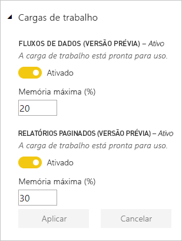

# Configurar cargas de trabalho em uma capacidade Premium

Este artigo descreve como habilitar e configurar cargas de trabalho para as capacidades Premium do Power BI. Por padrão, as capacidades dão suporte apenas à carga de trabalho associada à execução de consultas do Power BI. Habilite e configure também as cargas de trabalho adicionais para **[IA (Serviços Cognitivos)](service-cognitive-services.md)**, **[Fluxos de dados](service-dataflows-overview.md#dataflow-capabilities-on-power-bi-premium)** e **[Relatórios paginados](paginated-reports-save-to-power-bi-service.md)**.

## Configurações de memória padrão

As cargas de trabalho de consulta são otimizadas para os recursos determinados pelo SKU da capacidade Premium e limitadas por esses recursos. As capacidades Premium também dão suporte a cargas de trabalho adicionais que podem usar seus recursos de capacidade. Os valores de memória padrão para essas cargas de trabalho se baseiam nos nós de capacidade disponíveis para o SKU. As configurações de memória máxima não são cumulativas. A memória até o valor máximo especificado é alocada dinamicamente para IA e fluxos de dados, mas é alocada estaticamente para relatórios paginados. 

### SKUs do Microsoft Office para cenários SaaS (Software como Serviço)

|                     | EM2                      | EM3                       | P1                      | P2                       | P3                       |
|---------------------|--------------------------|--------------------------|-------------------------|--------------------------|--------------------------|
| IA (Serviços Cognitivos) | Padrão de 20%; min TBD| Padrão de 20%; min TBD | Padrão de 20%; min TBD | Padrão de 20%; min TBD | Padrão de 20%; min TBD |
| Fluxos de dados | N/A |Padrão de 20%; mínimo de 12%  | Padrão de 20%; mínimo de 5%  | Padrão de 20%; mínimo de 3% | Padrão de 20%; mínimo de 2%  |
| Relatórios paginados | N/A |N/A | Padrão de 20%; mínimo de 10% | Padrão de 20%; mínimo de 5% | Padrão de 20%; mínimo de 2,5% |
| | | | | | |

### SKUs do Microsoft Azure para cenários PaaS (Plataforma como Serviço)

|                  | A1                       | A2                       | A3                      | A4                       | A5                      | A6                        |
|-------------------|--------------------------|--------------------------|-------------------------|--------------------------|-------------------------|---------------------------|
| IA (Serviços Cognitivos) | N/A                      | Padrão de 20%; min TBD                      | Padrão de 20%; min TBD                     | Padrão de 20%; min TBD | Padrão de 20%; min TBD | Padrão de 20%; min TBD |
| Fluxos de dados         | Padrão de 40%; mínimo de 40% | Padrão de 24%; mínimo de 24% | Padrão de 20%; mínimo de 12% | Padrão de 20%; mínimo de 5%  | Padrão de 20%; mínimo de 3% | Padrão de 20%; mínimo de 2%   |
| Relatórios paginados | N/A                      | Não aplicável                      | N/A                     | Padrão de 20%; mínimo de 10% | Padrão de 20%; mínimo de 5% | Padrão de 20%; mínimo de 2,5% |
| | | | | | |

## Configurar cargas de trabalho

Maximize os recursos disponíveis da sua capacidade, habilitando as cargas de trabalho somente se elas forem usadas. Altere as configurações de memória apenas quando tiver determinado que as configurações padrão não estão atendendo aos requisitos de recursos de capacidade.  

### Para configurar cargas de trabalho no portal de administração do Power BI

1. Em **Configurações de capacidade** > **CAPACIDADES PREMIUM**, selecione uma capacidade.

1. Em **MAIS OPÇÕES**, expanda **Cargas de trabalho**.

1. Habilite uma ou mais cargas de trabalho e defina um valor para **Memória Máxima**.   

    
    

1. Clique em **Aplicar**.

> [!NOTE]
> Se você habilitar a carga de trabalho de relatórios paginados, os relatórios paginados permitirão executar seu próprio código ao renderizar um relatório (como a alteração dinâmica da cor do texto com base no conteúdo). O Power BI Premium executa relatórios paginados em um espaço contido dentro da capacidade. A memória máxima especificada para esse espaço é usada, independentemente de a carga de trabalho estar ativa. Se você usar relatórios ou fluxos de dados do Power BI na mesma capacidade, defina uma memória baixa o suficiente para relatórios paginados de modo que ela não afete negativamente outras cargas de trabalho. em circunstâncias raras, a carga de trabalho de relatórios paginados pode se tornar indisponível. Nesse caso, a carga de trabalho mostra o estado de erro no Portal de Administração, e os usuários veem tempos limite para renderização de relatório. Para atenuar esse problema, desabilite a carga de trabalho e habilite-a novamente.

### API REST

As cargas de trabalho podem ser habilitadas e atribuídas a uma capacidade usando as APIs REST de [Capacidades](https://docs.microsoft.com/rest/api/power-bi/capacities).

## Monitoramento de cargas de trabalho

O [aplicativo de Métricas de capacidade do Power BI Premium](service-admin-premium-monitor-capacity.md) fornece o conjunto de dados, os fluxos de dados e as métricas de relatórios paginados para monitorar as cargas de trabalho habilitadas para suas capacidades. 

## Próximas etapas

[Gerenciamento otimização de recursos de capacidade do Power BI Premium](service-premium-understand-how-it-works.md)   
[Preparação de dados de autoatendimento no Power BI com Fluxos de dados](service-dataflows-overview.md)   
[O que são os relatórios paginados no Power BI Premium?](paginated-reports-report-builder-power-bi.md)   

Mais perguntas? [Perguntar à Comunidade do Power BI](http://community.powerbi.com/)