# Comprar e atribuir licenças do Power BI Pro

O Power BI Pro é uma licença individual que permite acesso a todo o conteúdo e a todas as funcionalidades no serviço do Power BI, incluindo a capacidade de compartilhar conteúdo e colaborar com outros usuários do Pro. Somente usuários Pro podem publicar e consumir conteúdo de workspaces do aplicativo, compartilhar dashboards e assinar dashboards e relatórios. Para obter mais informações, consulte [Recursos do Power BI por tipo de licença](service-features-license-type.md).

Este artigo explica como comprar licenças do Power BI Pro no Office 365. O artigo explica as duas opções disponíveis para atribuir essas licenças a usuários individuais: Office 365 e Azure (escolha uma delas).

## Pré-requisitos

Você deve ser um membro da função [**Administrador global** ou **Administrador de cobrança**](https://support.office.com/article/about-office-365-admin-roles-da585eea-f576-4f55-a1e0-87090b6aaa9d) no Office 365.

Para atribuir licenças no Azure, você precisa ser um proprietário da assinatura do Azure que o Power BI usa para realizar pesquisas no Active Directory.

## Comprar licenças no Office 365

Siga estas etapas para comprar licenças do Power BI Pro:

1. Abra o [Centro de administração do Microsoft 365](https://portal.office.com/adminportal/home#/homepage).

2. No painel de navegação esquerdo, selecione **Cobrança** > **Assinaturas**.

    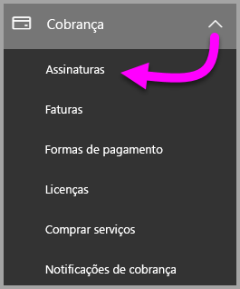

3. No canto superior direito da página **Assinaturas**, selecione **Adicionar assinaturas**.

    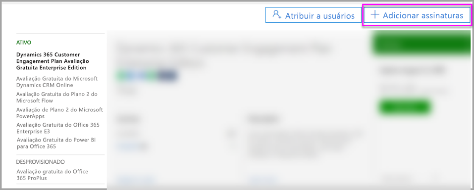

4. Localize a oferta de assinatura desejada:

    Em **Enterprise Suite**, selecione **Office 365 Enterprise E5**.

    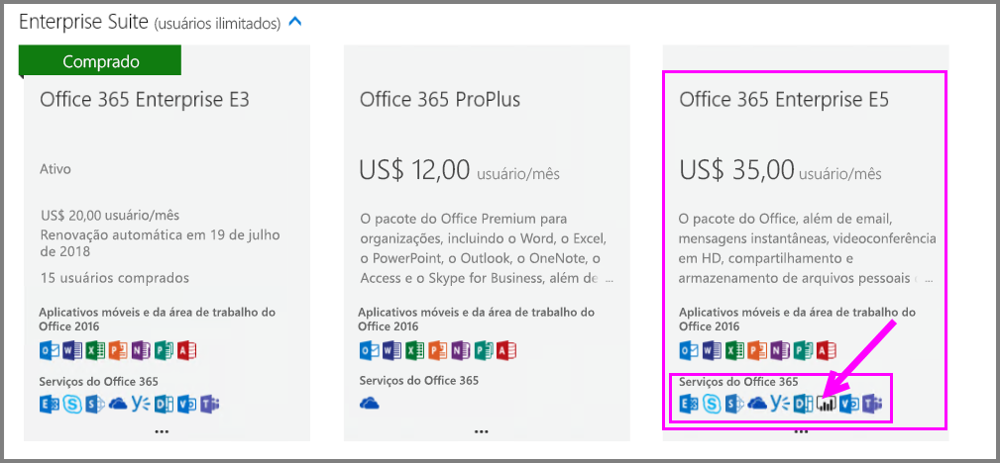

    Em **Outros Planos**, selecione **Power BI Pro**.

    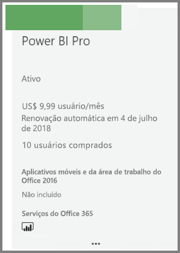

5. Passe o mouse sobre as reticências (**. . .**) para a assinatura desejada e selecione **Comprar agora**.

    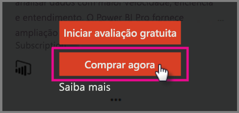

6. Escolha **Pagar mensalmente** ou **Pagar por um ano inteiro**, de acordo com sua preferência de cobrança.

7. Em **Quantos usuários você deseja?**, insira a quantidade de licenças desejada e, em seguida, selecione **Fazer check-out agora** para concluir a transação.

8. Verifique se a assinatura adquirida agora está listada na página **Assinaturas**.

   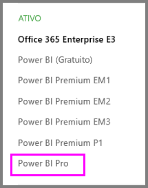

9. Para adicionar mais licenças após a compra inicial, selecione **Power BI Pro** na página **Assinaturas** e, em seguida, selecione **Adicionar/Remover licenças**.

## Atribuir licenças no Office 365

Siga estas etapas para atribuir licenças do Power BI Pro a contas de usuário individuais:

1. Abra o [Centro de administração do Microsoft 365](https://portal.office.com/adminportal/home#/homepage).

2. No painel de navegação à esquerda, expanda **Usuários** e, em seguida, selecione **Usuários ativos**.

    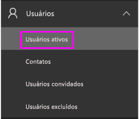

3. Selecione um usuário. Em seguida, em **Licenças de produto**, selecione **Editar**.

    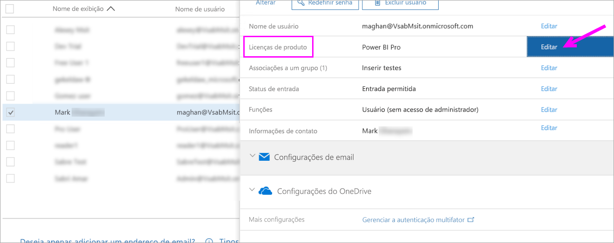

4. No **Power BI Pro**, mude a configuração para **Ativa** e, em seguida, selecione **Salvar**.

    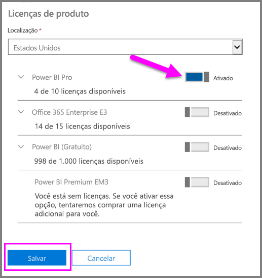

5. Em **Status** para a conta selecionada, verifique se a licença do Power BI Pro foi atribuída com êxito.

    

## Atribuir licenças no Azure

Siga estas etapas para atribuir licenças do Power BI Pro a contas de usuário individuais:

1. Abra o [portal do Azure](https://ms.portal.azure.com/#@microsoft.onmicrosoft.com/dashboard/private/39bc3cf7-31a4-43f6-954c-f2d69ca2f0).

2. Na barra de navegação esquerda, selecione **Azure Active Directory**.

    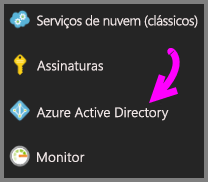

3. Em **Azure Active Directory**, selecione **Licenças**.

    

4. Em **Licenças**, selecione **Todos os produtos** e selecione **Power BI Pro** para ver a lista de usuários licenciados.

    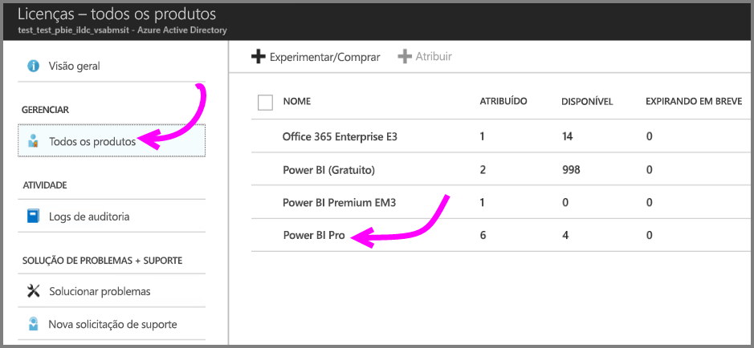

5. Selecione **Atribuir** para adicionar uma licença do Power BI Pro a uma conta de usuário adicional.

    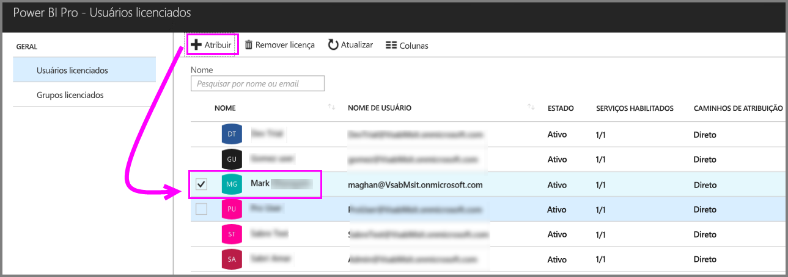

## Próximas etapas

Agora que você atribuiu licenças, saiba mais sobre o Power BI Pro.

[Licenciamento do Power BI na sua organização](service-admin-licensing-organization.md)

[Encontrar usuários do Power BI que entraram](service-admin-access-usage.md)

Mais perguntas? [Experimente perguntar à Comunidade do Power BI](https://community.powerbi.com/)
