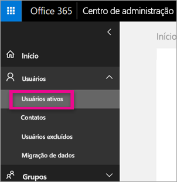
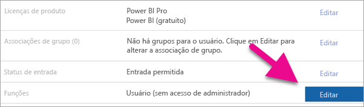
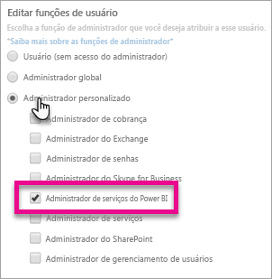
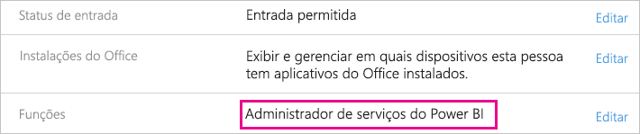

# <a name="understanding-the-power-bi-service-administrator-role"></a>Noções básicas sobre a função de administrador de serviços do Power BI

Saiba como você pode usar a função de administrador de serviços do Power BI em sua organização. Os usuários nessa função têm controle total sobre um locatário do Power BI e seus recursos administrativos, com exceção de licenciamento.

<iframe width="640" height="360" src="https://www.youtube.com/embed/PQRbdJgEm3k?showinfo=0" frameborder="0" allowfullscreen></iframe>

A função de administrador de serviços do Power BI pode ser atribuída aos usuários que precisam de acesso ao Portal de Administração do Power BI, sem conceder a esses usuários acesso administrativo do Office 365.

Os administradores de gerenciamento de usuário do Office 365 atribuem usuários à função de administrador de serviços do Power BI no Centro de administração do Microsoft 365, ou usando um script do PowerShell. Quando um usuário for atribuído, ele poderá acessar o [Portal de administração do Power BI](service-admin-portal.md). Lá, ele terá acesso às métricas de uso de todo o locatário e poderá controlar todo o uso que o locatário faz dos recursos do Power BI.

## <a name="limitations-and-considerations"></a>Limitações e considerações

A função do administrador de serviço do Power BI não fornece os seguintes recursos:

* Capacidade de modificar usuários e licenças no Centro de administração do Microsoft 365,

* Acesso aos logs de auditoria. Para obter mais informações, consulte [Usando a auditoria na organização](service-admin-auditing.md).

## <a name="assign-users-to-the-admin-role-in-office-365"></a>Atribuir usuários à função de administrador no Office 365

Para atribuir usuários à função de administrador do Power BI no Centro de administração do Microsoft 365, siga estas etapas.

1. No [Centro de administração do Microsoft 365](https://portal.office.com/adminportal/home#/homepage), selecione **usuários** > **usuários ativos**.

    

1. Selecione o usuário ao qual deseja atribuir a função.

1. Em **Funções**, selecione **Editar**.

    

1. Selecione **Administrador personalizado** > **Administrador de serviços do Power BI**.

    

1. Selecione **Salve**, em seguida, **Fechar**.

Deverá aparecer **Administrador de serviços do Power BI** listado para a função desse usuário.



## <a name="assign-users-to-the-admin-role-with-powershell"></a>Atribuir usuários à função de administrador com o PowerShell

Você também pode atribuir usuários a funções usando o PowerShell. Os usuários são gerenciados no Azure Active Directory (Azure AD). Se você ainda não tiver o módulo PowerShell do Azure AD, [baixe e instale a versão mais recente](https://www.powershellgallery.com/packages/AzureAD/).

1. Primeiro, conecte-se ao AD do Azure:
   ```
   PS C:\Windows\system32> Connect-AzureAD
   ```

1. Em segundo lugar, obtenha o **ObjectId** para o **administrador de serviço do Power BI** função. Você pode executar [Get-AzureADDirectoryRole](/powershell/module/azuread/get-azureaddirectoryrole) para obter a **ObjectId**

    ```
    PS C:\Windows\system32> Get-AzureADDirectoryRole

    ObjectId                             DisplayName                        Description
    --------                             -----------                        -----------
    00f79122-c45d-436d-8d4a-2c0c6ca246bf Power BI Service Administrator     Full access in the Power BI Service.
    250d1222-4bc0-4b4b-8466-5d5765d14af9 Helpdesk Administrator             Helpdesk Administrator has access to perform..
    3ddec257-efdc-423d-9d24-b7cf29e0c86b Directory Synchronization Accounts Directory Synchronization Accounts
    50daa576-896c-4bf3-a84e-1d9d1875c7a7 Company Administrator              Company Administrator role has full access t..
    6a452384-6eb9-4793-8782-f4e7313b4dfd Device Administrators              Device Administrators
    9900b7db-35d9-4e56-a8e3-c5026cac3a11 AdHoc License Administrator        Allows access manage AdHoc license.
    a3631cce-16ce-47a3-bbe1-79b9774a0570 Directory Readers                  Allows access to various read only tasks in ..
    f727e2f3-0829-41a7-8c5c-5af83c37f57b Email Verified User Creator        Allows creation of new email verified users.
    ```

    Nesse caso, a **ObjectId** da função é 00f79122-c45d-436d-8d4a-2c0c6ca246bf.

1. Em seguida, obtenha o **ObjectId** do usuário. Ele pode ser descoberto executando [Get-AzureADUser](/powershell/module/azuread/get-azureaduser).

    ```
    PS C:\Windows\system32> Get-AzureADUser -ObjectId 'tim@contoso.com'

    ObjectId                             DisplayName UserPrincipalName      UserType
    --------                             ----------- -----------------      --------
    6a2bfca2-98ba-413a-be61-6e4bbb8b8a4c Tim         tim@contoso.com        Member
    ```

1. Para adicionar o membro à função, execute [Add-AzureADDirectoryRoleMember](/powershell/module/azuread/add-azureaddirectoryrolemember).

    | Parâmetro | Descrição |
    | --- | --- |
    | ObjectId |A ObjectId da função. |
    | RefObjectId |A ObjectId dos membros. |

    ```powershell
    Add-AzureADDirectoryRoleMember -ObjectId 00f79122-c45d-436d-8d4a-2c0c6ca246bf -RefObjectId 6a2bfca2-98ba-413a-be61-6e4bbb8b8a4c
    ```

## <a name="next-steps"></a>Próximas etapas

[Administração do Power BI em sua organização](service-admin-administering-power-bi-in-your-organization.md)  
[Portal de administração do Power BI](service-admin-portal.md)  

Mais perguntas? [Experimente perguntar à Comunidade do Power BI](http://community.powerbi.com/)