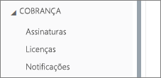
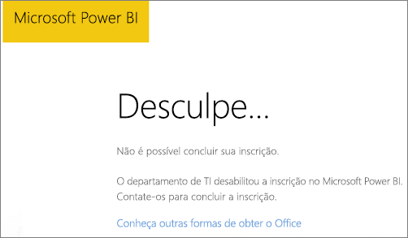
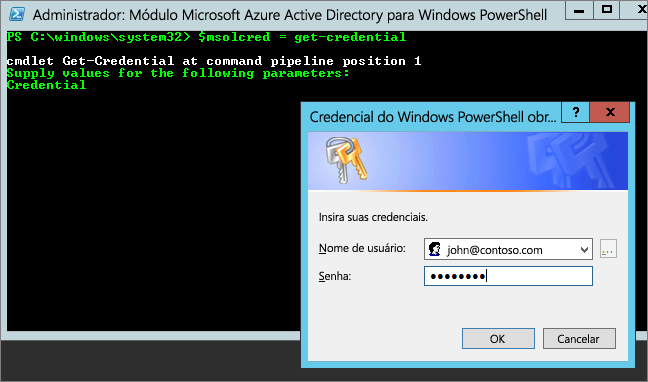

# <a name="unable-to-add-power-bi-to-office-365-partner-subscription"></a>Não é possível adicionar o Power BI a uma assinatura de parceiro do Office 365

O Office 365 permite que as empresas o revendam acompanhado e integrado às suas próprias soluções, fornecendo aos clientes finais um único ponto de contato para compra, cobrança e suporte.

Se estiver interessado em adquirir o Power BI, juntamente com sua assinatura do Office 365, recomendamos que entre em contato com seu parceiro. Se o seu parceiro não oferecer o Power BI, há opções diferentes que você pode considerar.

## <a name="work-with-your-partner-to-purchase-power-bi"></a>Trabalhe com seu parceiro para comprar o Power BI

Se quiser comprar uma assinatura do Power BI Pro ou do Power BI Premium, fale com seu parceiro para considerar as opções disponíveis:

* Seu parceiro concorda em adicionar o Power BI ao portfólio dele para que você possa fazer compras com ele.

* Seu parceiro consegue fazer sua transição para um modelo de onde você poderá comprar o Power BI diretamente da Microsoft ou de outro parceiro que ofereça o Power BI.

## <a name="purchase-from-microsoft-or-another-channel"></a>Comprar da Microsoft ou de outro canal

Dependendo da relação com seu parceiro, talvez você possa comprar o Power BI diretamente da Microsoft ou de outro parceiro. Verifique se é possível adicionar assinaturas do Power BI no Portal de administração do Office 365 (exige associação na função Administrador Global ou Administrador de Cobrança).

1. Acesse o [portal de administração do Office 365](https://admin.microsoft.com/AdminPortal/Home#/homepage).

1. No menu esquerdo, abra **Cobrança**:

    * Se você vir **Assinaturas**, poderá adquirir o serviço diretamente da Microsoft, ou poderá entrar em contato com outro parceiro que ofereça o Power BI.

        

    * Se você não vir **Assinaturas**, não poderá comprar diretamente da Microsoft ou de outro parceiro.

Se o seu parceiro não oferecer o Power BI e você não puder comprar diretamente da Microsoft ou de outro parceiro, considere a inscrição em uma avaliação gratuita.

## <a name="sign-up-for-a-free-trial"></a>Inscrever-se em uma avaliação gratuita

Inscreva-se para uma avaliação gratuita do Power BI Pro. Se você não comprar o Power BI Pro ao final do período de avaliação, ainda terá uma licença gratuita que oferece muitos recursos do Power BI. Para saber mais, confira [Recursos do Power BI por tipo de licença](service-features-license-type.md).

### <a name="enable-ad-hoc-subscriptions"></a>Habilitar assinaturas ad-hoc

Por padrão, inscrições individuais (também conhecidas como assinaturas ad hoc) estão desabilitadas. Nesse caso, você vê a seguinte mensagem quando tentar se inscrever: *O departamento de TI desativou a inscrição no Microsoft Power BI*.



Para habilitar assinaturas ad hoc, entre em contato com seu parceiro solicitando a ativação delas. Se você for um administrador de seu locatário e souber como usar comandos do PowerShell no Azure Active Directory, poderá habilitar assinaturas ad hoc por conta própria. [Azure Active Directory PowerShell para Graph](/powershell/azure/active-directory/install-adv2/)

1. Entre no Azure Active Directory usando suas credenciais do Office 365. A primeira linha do script abaixo solicita suas credenciais. Na segunda linha, você será conectado ao Azure Active Directory.

    ```powershell
    $msolcred = get-credential
    connect-msolservice -credential $msolcred
    ```

    

1. Depois de entrar, execute o comando a seguir para verificar a configuração atual de `AllowAdHocSubscriptions`.

    ```powershell
    Get-MsolCompanyInformation
    ```

1. Execute o seguinte comando para habilitar inscrições gratuitas.

    ```powershell
    Set-MsolCompanySettings -AllowAdHocSubscriptions $true
    ```

## <a name="next-steps"></a>Próximas etapas

[Licenciamento do Power BI na sua organização](service-admin-licensing-organization.md)

Mais perguntas? [Experimente perguntar à Comunidade do Power BI](http://community.powerbi.com/)