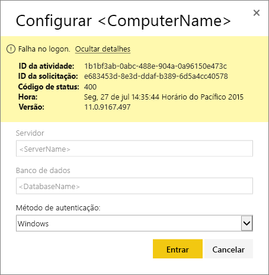
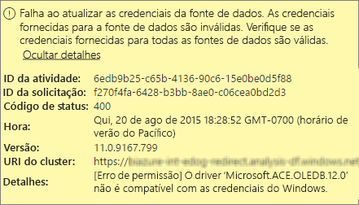
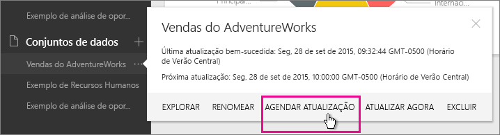
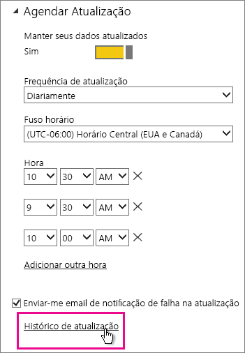
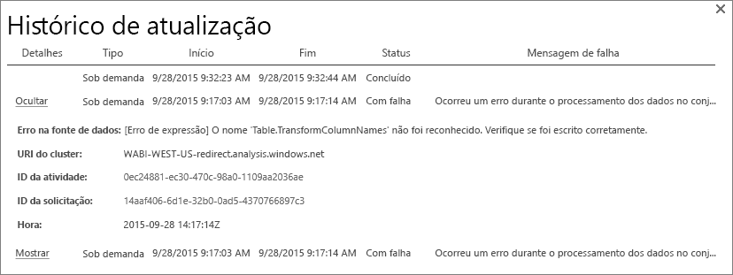
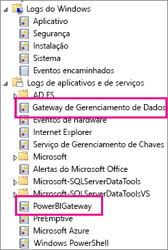
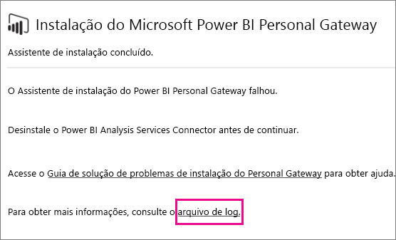
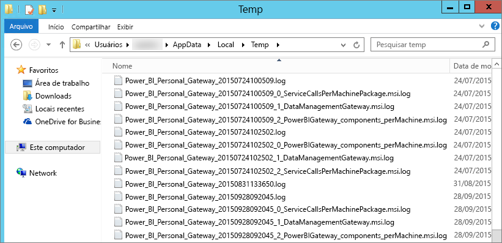

# Solucionando problemas do Power BI Gateway - Personal

[!INCLUDE [gateway-rewrite](includes/gateway-rewrite.md)]

As seções a seguir mostram alguns problemas comuns que você poderá ter ao usar o Power BI Gateway – Personal.

## Atualize para a versão mais recente

A versão atual do gateway para uso pessoal é **Gateway de dados local (pessoal)** . Atualize sua instalação para usar essa versão.

Muitos problemas podem surgir quando a versão do gateway está desatualizada.  É uma boa prática geral ter certeza que você está com a versão mais recente. Se você não tiver atualizado o gateway por um mês ou mais, considere instalar a versão mais recente do gateway. Em seguida, veja se você pode reproduzir o problema.

## Instalação
**O gateway pessoal é de 64 bits** – se o computador for de 32 bits, você não poderá instalar o gateway pessoal. Seu sistema operacional precisa ser da versão de 64 bits. Instale uma versão de 64 bits do Windows ou instale o gateway pessoal em um computador de 64 bits.

**Falha na instalação do gateway pessoal como serviço, mesmo que você seja um administrador local do computador** – A instalação poderá falhar se o usuário estiver no grupo do Administrador local do computador, mas a política de grupo não permitir que esse nome de usuário se conecte como um serviço. No momento, assegure que a política de grupo permita que um usuário se conecte como um serviço. Estamos trabalhando para encontrar uma correção para esse problema. [Saiba mais](https://technet.microsoft.com/library/cc739424.aspx)

**Tempo limite da operação atingido** – essa mensagem será comum se o computador (computador físico ou VM) no qual o gateway pessoal está sendo instalado tiver um processador de núcleo único. Feche todos os aplicativos, desligue todos os processos não essenciais e tente instalar novamente.

**O Gateway de Gerenciamento de Dados ou o Analysis Services Connector não pode ser instalado no mesmo computador que o gateway pessoal** – se já tiver um Analysis Services Connector ou Gateway de Gerenciamento de Dados instalado, você deverá primeiro desinstalar o Connector ou o gateway. Em seguida, tente instalar o gateway pessoal.

> [!NOTE]
> Se você tiver algum problema durante a instalação, os logs de instalação poderão fornecer informações para ajudá-lo a resolver o problema. Para obter mais informações, consulte [Logs de instalação](#SetupLogs).
> 
> 

 **Configuração de proxy** – você poderá ter problemas com a configuração do gateway pessoal se o seu ambiente precisar usar um proxy. Para saber mais sobre como configurar informações de proxy, consulte [Definir as configurações de proxy para o gateway de dados local](/data-integration/gateway/service-gateway-proxy).

## Agendar atualização
**Erro: As credenciais armazenadas na nuvem estão ausentes.**

Você poderá obter esse erro nas configurações de \<conjunto de dados\> se tiver uma atualização agendada e tiver desinstalado e reinstalado o gateway pessoal. Ao desinstalar um gateway pessoal, as credenciais da fonte de dados de um conjunto de dados que foram configuradas para atualização são removidas do serviço do Power BI.

**Solução:** No Power BI, vá para as configurações de atualização de um conjunto de dados. Em Gerenciar Fontes de Dados, para qualquer fonte de dados com um erro, selecione **Editar credenciais** e entre novamente na fonte de dados.

**Erro: As credenciais fornecidas para o conjunto de dados são inválidas. Atualize as credenciais por meio de uma atualização ou no diálogo Configurações de Fonte de Dados para continuar.**

**Solução**: Se você receber uma mensagem de credenciais, isso pode significar:

* Verifique se os nomes de usuário e as senhas usados para entrar nas fontes de dados estão atualizados. No Power BI, vá para as configurações de atualização do conjunto de dados. Em Gerenciar Fontes de Dados, selecione **Editar credenciais** para atualizar as credenciais da fonte de dados.
* Os mashups entre uma fonte de nuvem e uma fonte local, em uma única consulta, falharão em ser atualizados no gateway pessoal se uma das fontes estiver usando o OAuth para autenticação. Um exemplo desse problema é um mashup entre o CRM Online e um SQL Server local. O mashup falha porque o CRM Online exige o OAuth.
  
  Esse erro é um problema conhecido e está sendo analisado. Para resolver o problema, tenha uma consulta separada para a fonte de nuvem e a fonte local. Em seguida, use uma consulta de mesclagem ou de acréscimo para combiná-las.

**Erro: Fonte de dados sem suporte.**

**Solução:** Se você receber uma mensagem informando que não há suporte para a fonte de dados nas configurações Agendar Atualização, isso pode significar que: 

* Atualmente, a atualização da fonte de dados no Power BI não é um procedimento compatível. 
* A pasta de trabalho do Excel não contém um modelo de dados, somente os dados de planilha. O Power BI atualmente dá suporte apenas à atualização se a pasta de trabalho do Excel carregada contiver um modelo de dados. Quando você importa dados usando o Power Query no Excel, lembre-se de escolher a opção de Carregar os dados para o modelo de dados. Essa opção garante que os dados sejam importados em um modelo de dados. 

**Erro: [não é possível combinar dados] &lt;A parte da consulta&gt;/&lt;…&gt;/&lt;…&gt; está acessando fontes de dados com níveis de privacidade que não podem ser usados em conjunto. Recompile esta combinação de dados.**

**Solução**: Esse erro ocorre devido a restrições no nível de privacidade e aos tipos de fonte de dados que estão sendo usados.

**Erro: Erro na fonte de dados: não é possível converter o valor "\[Table\]" no tipo Tabela.**

**Solução**: Esse erro ocorre devido a restrições no nível de privacidade e aos tipos de fonte de dados que estão sendo usados.

**Erro: Não há espaço suficiente para esta linha.**

Esse erro ocorrerá se você tiver uma única linha com um tamanho maior que 4 MB. Encontre a linha da fonte de dados e tente filtrá-la ou reduzir seu tamanho.

## Fontes de dados
**Provedor de dados ausente** – o gateway pessoal existe apenas na versão de 64 bits. Ele exige a instalação de uma versão de 64 bits dos provedores de dados no mesmo computador em que o gateway pessoal está instalado. Por exemplo, se a fonte de dados no conjunto de dados for o Microsoft Access, será necessário instalar o provedor ACE de 64 bits no mesmo computador em que o gateway pessoal está instalado.  

>[!NOTE]
>Se você tiver o Excel com a versão de 32 bits, não será possível instalar um provedor ACE com a versão de 64 bits no mesmo computador.

**Não há suporte à autenticação do Windows para o banco de dados do Access** – No momento, o Power BI dá suporte apenas à autenticação anônima para o banco de dados do Access. Estamos trabalhando para habilitar a autenticação do Windows para o banco de dados do Access.

**Erro de início de sessão ao inserir as credenciais de uma fonte de dados** – se você receber um erro semelhante a esse ao inserir as credenciais do Windows de uma fonte de dados, isso significa que talvez você ainda esteja usando uma versão mais antiga do gateway pessoal. [Instale a versão mais recente do Power BI Gateway - Personal](https://powerbi.microsoft.com/gateway/).

  

**Erro: Erro de início de sessão ao selecionar a autenticação do Windows para uma fonte de dados usando o ACE OLEDB**; se você receber o seguinte erro ao inserir as credenciais para uma fonte de dados usando o provedor ACE OLEDB:

O Power BI atualmente não dá suporte à autenticação do Windows para uma fonte de dados usando o provedor ACE OLEDB.

**Solução:** Para solucionar esse erro, você pode selecionar **Autenticação anônima**. Para o provedor ACE OLEDB herdado, as credenciais Anônimas são equivalentes a credenciais do Windows.

## Atualização de bloco
Se você estiver recebendo um erro com a atualização de blocos do dashboard, consulte o artigo a seguir.

[Solução de problemas de erros de bloco](refresh-troubleshooting-tile-errors.md)

## Ferramentas para solução de problemas
### Histórico de atualização
O **Histórico de Atualização** poderá ajudá-lo a ver quais erros ocorreram, além de fornecer dados úteis se você precisar criar uma solicitação de suporte. É possível exibir atualizações agendadas e sob demanda. Eis aqui como você pode acessar o **Histórico de atualização**.

1. No painel de navegação do Power BI, em **Conjuntos de Dados**, selecione um conjunto de dados &gt; Abrir Menu &gt; **Agendar Atualização**.
   
1. Em **Configurações para...** , selecione **Histórico de Atualização**.  
   
   
   

### Logs de eventos
Vários logs de eventos podem fornecer informações. Os dois primeiros, **gateway de gerenciamento de dados** e **PowerBIGateway**, estarão presentes se você for um administrador no computador.  Se não for um administrador e estiver usando o gateway pessoal, você verá as entradas de log dentro do log de **Aplicativo**.

O **Gateway do Gerenciamento de Dados** e os logs do **PowerBIGateway** estiverem presentes nos **logs de aplicativos e serviços**.

### Rastreamento do Fiddler
[Fiddler](http://www.telerik.com/fiddler) é uma ferramenta gratuita da Telerik que monitora o tráfego HTTP. Você pode ver a comunicação com o serviço do Power BI do computador cliente. Essa comunicação pode mostrar erros e outras informações relacionadas.

### Logs de configuração
Em caso de falha na instalação do **gateway pessoal**, você verá um link para exibir o log de instalação. O log de instalação pode mostrar detalhes sobre a falha. Esses logs são os logs de instalação do Windows, também conhecidos como logs do MSI. Eles podem ser bastante complexos e de difícil leitura. Normalmente, o erro resultante é mostrado na parte inferior, mas não é comum determinar a causa do erro. Ele pode ser resultado de erros em um log diferente ou de um erro mostrado acima no log.

Como alternativa, você pode ir para a **pasta temporária** (%temp%) e procurar arquivos que começam com **Power\_BI\_** .

> [!NOTE]
> Ir para %temp% poderá levá-lo a uma subpasta de temp. Os arquivos do **Power\_BI\_** estarão na raiz do diretório temporário.  Talvez seja necessário subir um nível ou dois.
> 
> 

## Próximas etapas
[Definindo as configurações de proxy do gateway de dados locais](/data-integration/gateway/service-gateway-proxy)  
[Atualização de dados](refresh-data.md)  
[Gateway do Power BI – Pessoal](service-gateway-personal-mode.md)  
[Solução de problemas de erros de bloco](refresh-troubleshooting-tile-errors.md)  
[Solução de problemas do gateway de dados local](service-gateway-onprem-tshoot.md)  
Mais perguntas? [Experimente a Comunidade do Power BI](http://community.powerbi.com/)

