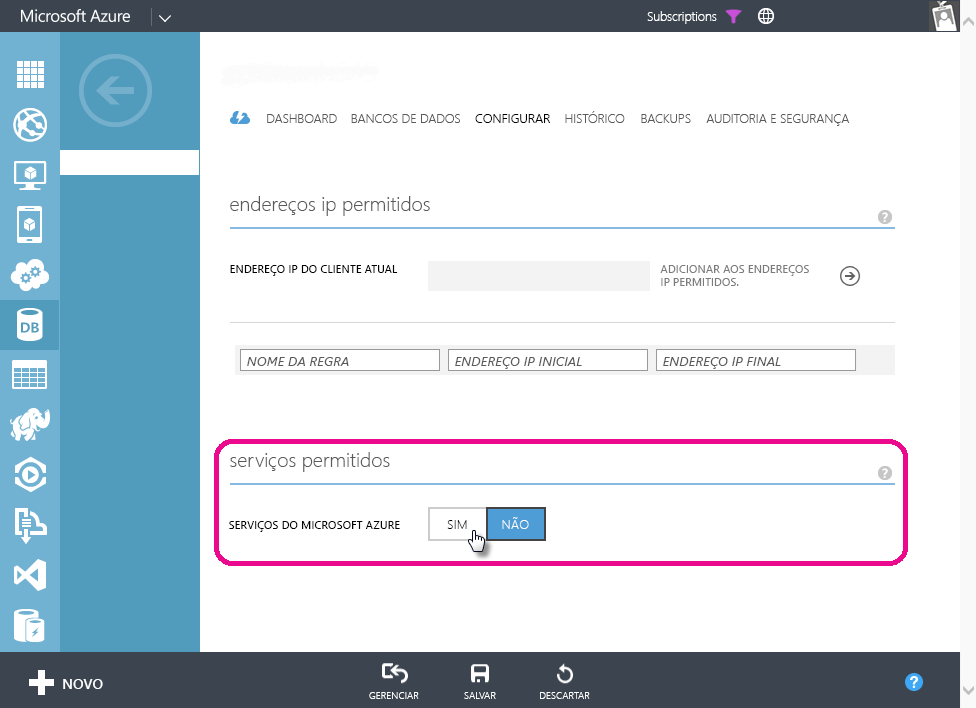

# Solucionando problemas em atualização agendada para bancos de dados SQL Azure no Power BI
Para obter etapas detalhadas sobre como configurar a atualização agendada, certifique-se de ver [Atualizar dados no Power BI](refresh-data.md).

Ao configurar a atualização agendada para o banco de dados SQL Azure, se você receber um erro com o código de erro 400 durante a edição de credenciais, tente o seguinte para configurar a regra de firewall apropriada:

1. Entre no Portal de Gerenciamento do Azure
2. Vá ara o servidor SQL Azure no qual você está configurando a atualização
3. Ative “Serviços do Windows Azure” na seção de serviços permitidos

  

Mais perguntas? [Experimente a Comunidade do Power BI](http://community.powerbi.com/)

