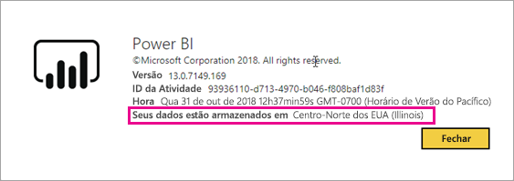
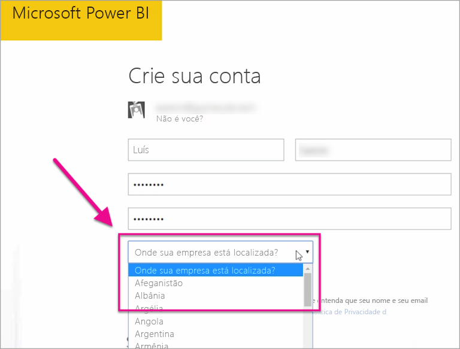

# Onde está localizado meu locatário do Power BI?

<iframe width="560" height="315" src="https://www.youtube.com/embed/0fOxaHJPvdM?showinfo=0" frameborder="0" allowfullscreen></iframe>

Saiba onde está localizado seu locatário do Power BI e como essa localização é selecionada. O local é importante, porque isso pode afetar as interações de aprendizado você tem com o serviço.

## Como determinar onde se encontra o seu locatário do Power BI

Para localizar em qual região seu locatário está, execute estas etapas.

1. No serviço do Power BI, no menu superior, selecione a Ajuda ( **?** ), em seguida, **Sobre o Power BI**.

1. Procure o valor ao lado de **Seus dados são armazenados em**. É a região onde seu locatário está localizado. O valor também é a região onde os dados estão armazenados, a menos que você está usando as capacidades de dedicado em regiões diferentes para seus espaços de trabalho.

    

## Como a região de dados é selecionada

A região de dados tem base no país selecionado quando você cria o locatário. A seleção se aplica para se inscrever para ambos os Office 365 e ao Power BI, pois essas informações são compartilhadas. Se esse for um novo locatário, selecione o país apropriado na lista quando você se inscrever.

Power BI seleciona uma região de dados mais próxima de sua seleção, que determina onde os dados são armazenados para seu locatário.

> [!IMPORTANT]
> Você não pode alterar a seleção depois de criar o locatário.

Mais perguntas? [Experimente a Comunidade do Power BI](http://community.powerbi.com/)

