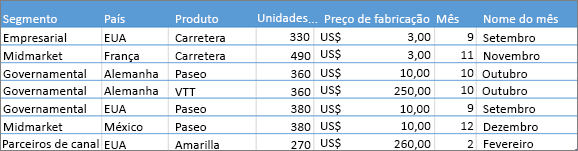
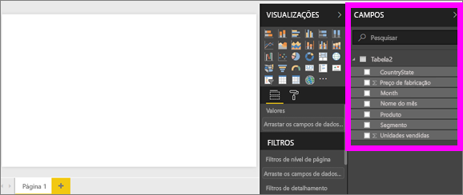
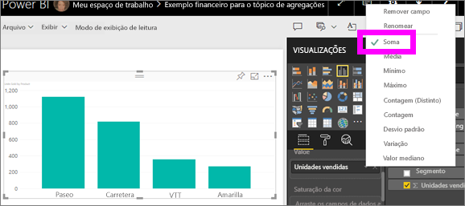
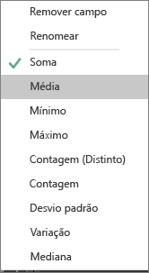
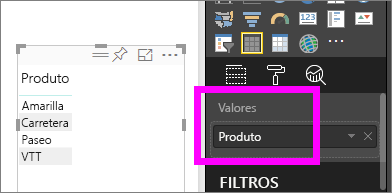
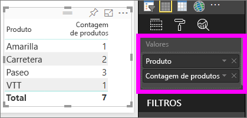

# Trabalhar com agregações (soma, média e assim por diante) no serviço do Power BI

## O que é uma agregação?

Às vezes, você deseja combinar matematicamente valores nos dados. A operação matemática pode ser soma, média, máximo, contagem e assim por diante. Quando você combina valores nos seus dados, ele é chamado *agregando*. O resultado dessa operação matemática é um *agregado*.

Quando o serviço do Power BI e o Power BI Desktop criam visualizações, eles podem agregar os dados. Geralmente, a agregação é exatamente o que você precisa, mas outras vezes, talvez você deseje agregar os valores de maneira diferente.  Por exemplo, uma soma em vez de uma média. Há várias maneiras diferentes de gerenciar e alterar a agregação que usa o Power BI em uma visualização.

Primeiro, vamos dar uma olhada em dados *tipos* porque o tipo de dados determina como e se, o Power BI poder agregá-lo.

## Tipos de dados

A maioria dos conjuntos de dados tem mais de um tipo de dados. Nível mais básico, os dados são numéricos ou não. Power BI pode agregar dados numéricos, usando uma soma, média, contagem, mínimo, variação e muito mais. O serviço ainda pode agregar dados textuais, geralmente chamados de *categóricos* dados. Se você tentar agregar um campo de categoria, colocando-o em um bucket somente numérico, como **valores** ou **dicas de ferramenta**, Power BI serão as ocorrências de cada categoria ou as ocorrências distintas de cada categoria. Tipos especiais de dados, como datas, têm algumas das suas próprias opções de agregação: mais recente, o mais recente, primeiro e último.

No exemplo abaixo:

- **Unidades Vendidas** e **Preço de Fabricação** são colunas que contêm dados numéricos

- **Segmento**, **País**, **Produto**, **Mês** e **Nome do Mês** contêm dados categóricos

   

Ao criar uma visualização no Power BI, o serviço irá agregar campos numéricos (o padrão é *soma*) em um campo categórico.  Por exemplo, "unidades vendidas ***por produto***", "unidades vendidas ***por mês***" e "preço de fabricação ***por segmento***". Power BI refere-se a alguns campos numéricos como **medidas**. É fácil identificar medidas no editor de relatório do Power BI – o **campos** lista mostra as medidas com o símbolo ∑ ao lado deles. Consulte [o editor de relatório... Faça um tour pelo](service-the-report-editor-take-a-tour.md) para obter mais informações.

## Por que as agregações não funcionam do jeito que eu quero?

Trabalhar com agregações no Power BI service pode ser confuso. Talvez você tenha um campo numérico e o Power BI não permitirá que você altere a agregação. Ou talvez você tenha um campo, como um ano, e você não deseja agregá-lo, apenas contar o número de ocorrências.

Normalmente, o problema subjacente é a definição de campo no conjunto de dados. Talvez o proprietário do conjunto de dados definido pelo campo como texto e isso explica por que o Power BI não é possível somar ou média. Infelizmente, [somente o proprietário do conjunto de dados pode alterar a maneira como um campo é categorizado](desktop-measures.md). Portanto, se você tiver permissões de proprietário para o conjunto de dados, na área de trabalho ou o programa usado para criar o conjunto de dados (por exemplo, Excel), você pode corrigir esse problema. Caso contrário, precisará entrar em contato com o proprietário do conjunto de dados para obter ajuda.  

Há uma seção especial no final deste artigo chamada [ **considerações e solução de problemas**](#considerations-and-troubleshooting). Ele fornece dicas e diretrizes. Se você não encontrar a resposta nessa, envie sua pergunta para o [Fórum da comunidade do Power BI](http://community.powerbi.com). Você obterá uma resposta rápida diretamente da equipe do Power BI.

## Mudar a forma como um campo numérico é agregado

Digamos que você tenha um gráfico que soma as unidades vendidas para produtos diferentes, mas preferiria ter a média.

1. Criar uma **gráfico de colunas clusterizado** que usa uma medida e uma categoria. Neste exemplo, estamos usando Unidades Vendidas por Produto.  Por padrão, o Power BI cria um gráfico que soma as unidades vendidas (arraste a medida na **valor** bem) para cada produto (arraste categoria para o **eixo** também).

   

1. No **visualizações** painel, a medida com o botão direito e selecione o tipo de agregação necessário. Nesse caso, vamos selecionar **médio**. Se você não vir a agregação necessário, consulte a [ **considerações e solução de problemas** ](#considerations-and-troubleshooting) seção.

   

   > [!NOTE]
   > As opções disponíveis na lista suspensa variam dependendo 1) o campo selecionado e 2) a maneira como o proprietário do conjunto de dados categorizados nesse campo.

1. A visualização agora usa agregados por média.

   

## Maneiras de agregar os dados

Algumas das opções que podem estar disponíveis para um campo de agregação:

- **Não resumir**. Com essa opção escolhida, o Power BI trata cada valor nesse campo separadamente e não resumi-los. Use esta opção se você tiver uma coluna de ID numérica que o serviço não deve somar.

- **Soma**. Adiciona todos os valores nesse campo.

- **Média**. Usa uma média aritmética dos valores.

- **Mínimo**. Mostra o menor valor.

- **Máximo**. Mostra o maior valor.

- **Contagem (Não em branco).** Conta o número de valores no campo que não estão em branco.

- **Contagem (Distinto).** Conta o número de valores diferentes nesse campo.

- **Desvio padrão.**

- **Variação**.

- **Mediana**.  Mostra o valor mediano (meio). Esse valor tem o mesmo número de itens acima e abaixo.  Se houver duas medianas, o Power BI obterá suas médias.

Por exemplo, esses dados:

| País | Quantidade |
|:--- |:--- |
| EUA |100 |
| REINO UNIDO |150 |
| Canadá |100 |
| Alemanha |125 |
| França | |
| Japão |125 |
| Austrália |150 |

Daria os seguintes resultados:

- **Não resumir**: cada valor é exibido separadamente

- **Soma**: 750

- **Média**: 125

- **Máximo**:  150

- **Mínimo**: 100

- **Contagem (não em branco):** 6

- **Contagem (distinta):** 4

- **Desvio padrão:** 20,4124145...

- **Variação:** 416,666...

- **Valor mediano:** 125

## Criar uma agregação usando um campo de categoria (texto)

Você também pode agregar um campo não numérico. Por exemplo, se tiver um campo de nome do produto, poderá adicioná-lo como um valor e, em seguida, defini-lo como **Contagem**, **Contagem distinta**, **Primeiro** ou **Último**.

1. Arraste o **produto** campo para o **valores** bem. O **valores** também é normalmente usado para campos numéricos. O Power BI reconhece que este campo é um campo de texto, define a agregação como **não resumir**e apresenta a você uma tabela de coluna única.

   

1. Se você alterar a agregação do padrão **não resumir** à **contagem (distinta)** , Power BI contará o número de produtos diferentes. Nesse caso, há quatro.
  
   

1. Se você alterar a agregação para **Contagem**, o Power BI contará o número total. Nesse caso, há sete entradas para **produto**.

   

1. Arrastando o mesmo campo (neste caso **produto**) para o **valores** bem e deixando a agregação padrão **não resumir**, Power BI divide a contagem por produto.

   

## Considerações e solução de problemas

P:  Por que não vejo uma opção **Não resumir**?

R:  O campo selecionado provavelmente é uma medida calculada ou uma medida avançada criada no Excel ou no [Power BI Desktop](desktop-measures.md). Cada medida calculada tem sua própria fórmula embutida em código. Você não pode alterar a agregação que usa o Power BI. Por exemplo, se ela for uma soma, só poderá ser uma soma. O **campos** lista mostra *medidas calculadas* com o símbolo de calculadora.

P:  Meu campo **é** numérico. Por que as únicas opções exibidas são **Contagem** e **Contagem distinta**?

R1:  A explicação provável é que o proprietário do conjunto de dados *não* classificou o campo como um número. Por exemplo, se um conjunto de dados tem um **ano** campo, o proprietário do conjunto de dados poderá categorizar o valor como texto. É mais provável que o Power BI contará o **ano** campo (por exemplo, número de pessoas nascidos em 1974). É menos provável que a do Power BI soma ou média. Se você for o proprietário, você pode abrir o conjunto de dados no Power BI Desktop e usar o **modelagem** tab para alterar o tipo de dados.

R2: Se o campo tem um ícone de Calculadora, isso significa que é um *medida calculada*. Cada medida calculada tem sua própria fórmula embutida em que somente o proprietário do conjunto de dados pode ser alterados. O cálculo que do Power BI usa pode ser uma agregação simples como uma média ou soma. Ele também pode ser algo mais complicado, como um "percentual de contribuição para a categoria pai" ou "total acumulado desde o início do ano". Power BI não vai somar nem obter a média dos resultados. Em vez disso, ele será simplesmente recalcular (usando a fórmula embutido em código) para cada ponto de dados.

R3:  Outra possibilidade é que você soltou o campo em um *bucket* que permite somente valores categóricos.  Nesse caso, as únicas opções serão contagem e contagem distinta.

R4:  E uma quarta possibilidade é que você estiver usando o campo para um eixo. Em um eixo de gráfico de barras, por exemplo, o Power BI mostra uma barra para cada valor distinto – ele não agrega os valores de campo.

>[!NOTE]
>A exceção a essa regra são os gráficos de dispersão, que *exigem* valores agregados para os eixos X e Y.

P:  Por que não é possível agregar campos de texto de fontes de dados do SSAS (SQL Server Analysis Services)?

R:  As conexões dinâmicas com modelos multidimensionais do SSAS não permitem nenhuma agregação do lado do cliente, incluindo primeiro, último, média, mínimo, máximo e soma.

P:  Tenho um gráfico de dispersão e *não* quero que meu campo seja agregado.  Como posso fazer isso?

R:  Adicione o campo ao bucket **Detalhes** e não aos buckets dos eixos X ou Y.

P:  Quando adiciono um campo numérico a uma visualização, a maioria deles usa soma como padrão, mas outros usam média ou contagem ou alguma outra agregação como padrão.  Por que a agregação padrão nem sempre é a mesma?

R:  Os proprietários de conjunto de dados podem definir o resumo padrão para cada campo. Se você for um proprietário de conjunto de dados, altere o resumo padrão na **modelagem** guia do Power BI Desktop.

P:  Sou o proprietário de um conjunto de dados e quero garantir que um campo nunca é agregado.

R:  No Power BI Desktop, na guia **Modelagem**, defina **Tipo de dados** como **Texto**.

P:  Não vejo **não resumir** como uma opção na minha lista suspensa.

R:  Tente remover o campo e adicioná-lo novamente.

Mais perguntas? [Experimente a Comunidade do Power BI](http://community.powerbi.com/)