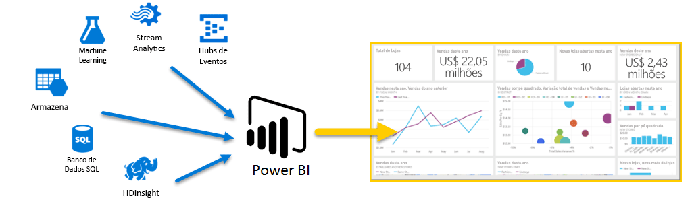
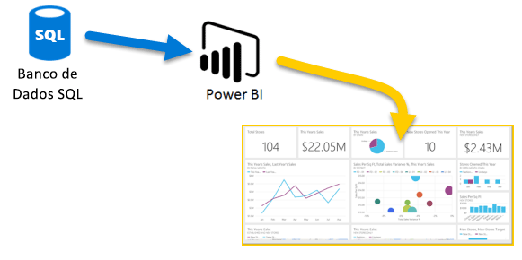
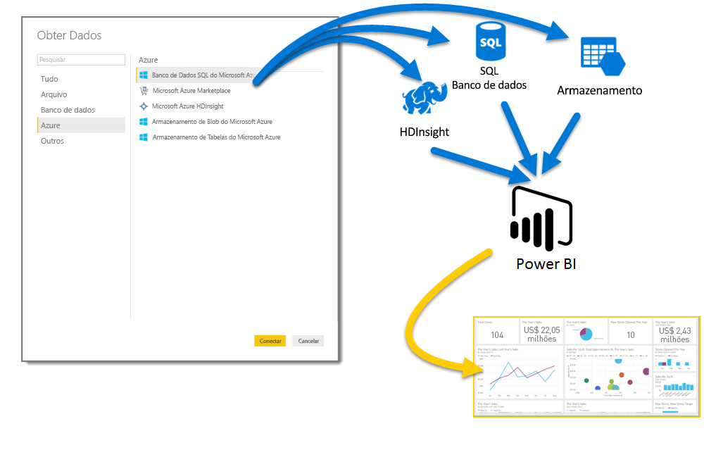
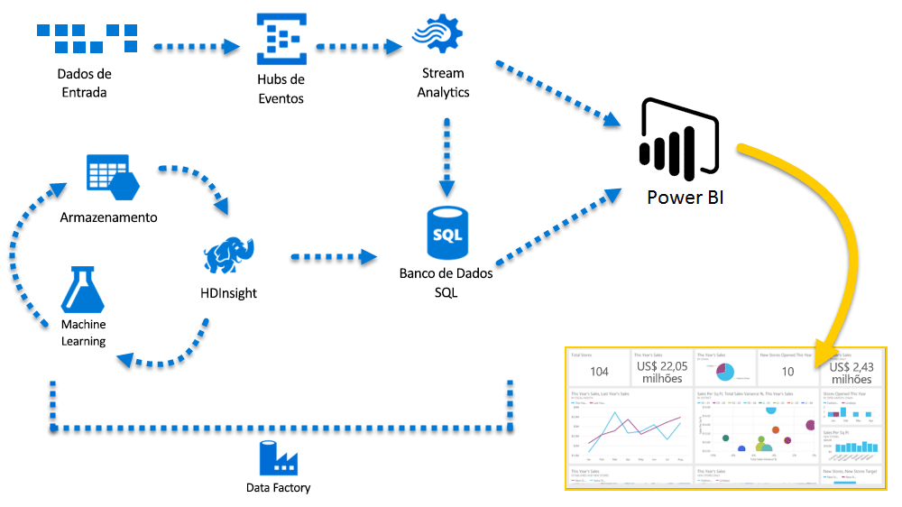

# Azure e Power BI

Com os serviços do **Azure** e o **Power BI**, você pode transformar seus esforços de processamento de dados em análises e relatórios que fornecem informações em tempo real sobre a sua empresa. Se o processamento de dados é baseado em nuvem ou local, simples ou complexo, de única fonte ou altamente escalonado, armazenado ou em tempo real, o Azure e o Power BI têm a conectividade interna e a integração para dar vida aos seus esforços de business intelligence.

O Power BI tem uma grande quantidade de conexões do Azure disponíveis, e as soluções de business intelligence que você pode criar com esses serviços são tão exclusivas quanto a sua empresa. Você pode conectar apenas uma ou várias fontes de dados do Azure e formatar e refinar seus dados para criar relatórios personalizados.

## Banco de Dados SQL do Azure e Power BI

Você pode iniciar uma conexão simples com um Banco de Dados SQL do Azure e criar relatórios para monitorar o progresso de sua empresa. Com o [Power BI Desktop](desktop-getting-started.md), é possível criar relatórios que identificam tendências e indicadores chave de desempenho que promovem a sua empresa.

Há muito mais informações para descobrir sobre o [Banco de Dados SQL do Azure](http://azure.microsoft.com/services/sql-database/).

## Transforme, formate e mescle seus dados na nuvem

Você tem dados mais complexos e todos os tipos de fontes? Sem problemas. Com o **Power BI Desktop** e os serviços do Azure, as conexões podem ser acessadas no diálogo **Obter Dados** com apenas um toque. Na mesma Consulta, você pode se conectar ao seu **Banco de Dados SQL do Azure**, sua fonte de dados do **Azure HDInsight** e seu **Armazenamento de Blob do Azure** (ou **Armazenamento de Tabela do Azure**) e selecionar apenas os subconjuntos dentro de cada um deles de que você precisa e refiná-los daí.

É possível criar relatórios diferentes para públicos-alvo diferentes usando as mesmas conexões de dados e até mesmo a mesma Consulta. Apenas crie uma nova página de relatório, refine suas visualizações para cada público-alvo e acompanhe-as para que sua empresa fique bem informada.

Para obter mais informações, veja os seguintes recursos:

* [Banco de dados SQL do Azure](http://azure.microsoft.com/services/sql-database/)
* [Azure HDInsight](http://azure.microsoft.com/services/hdinsight/)
* [Armazenamento do Azure](http://azure.microsoft.com/services/storage/) (Armazenamento de blob e Armazenamento de tabela)

## Aprofunde-se (e fique à frente) usando os Serviços do Azure e o Power BI

Você pode expandir conforme as suas necessidades com o Azure e o Power BI. Aproveite o processamento de dados de várias fontes, use grandes sistemas em tempo real, use o [Stream Analytics](http://azure.microsoft.com/services/stream-analytics/)e os [Hubs de Eventos](http://azure.microsoft.com/services/event-hubs/) e reúna seus diversos serviços de SaaS em relatórios de business intelligence que oferecem à sua empresa uma excelente vantagem.

## Insights de contexto com análises do Power BI Embedded

Insira visualizações de dados interativas e incríveis em aplicativos, em sites, em portais e muito mais para aproveitar seus dados corporativos. Com o [Power BI Embedded como um recurso no Azure](https://azure.microsoft.com/services/power-bi-embedded/), você pode facilmente inserir relatórios e painéis para que seus usuários possam aproveitar experiências consistentes de alta fidelidade em diversos dispositivos.  O Power BI usado com a incorporação de análises é para ajudá-lo em sua jornada desde Dados -> Conhecimento -> Insights -> Ações.  Além disso, você pode estender o valor do Power BI e Azure inserindo análise nos [portais e aplicativos internos da sua organização](https://powerbi.microsoft.com/developers/embedded-analytics/organization/).

Há várias informações sobre as APIs do Power BI no [Portal do Desenvolvedor do Power BI](http://dev.powerbi.com).

Para saber mais, confira [O que os desenvolvedores podem fazer com o Power BI?](developer/what-can-you-do.md).

## Inserir seus dados do Power BI no seu aplicativo

Insira visualizações de dados interativas e incríveis em aplicativos, em sites, em portais e muito mais para demonstrar seus dados corporativos no contexto. Usando o [Power BI Embedded no Azure](https://azure.microsoft.com/services/power-bi-embedded/) você pode facilmente inserir relatórios e painéis para que seus usuários possam aproveitar experiências consistentes de alta fidelidade em diversos dispositivos.

## O que você pode fazer com o Azure e o Power BI?

Existem todos os tipos de cenários em que o **Azure** e o **Power BI** podem ser combinados - as possibilidades e oportunidades são tão exclusivas quanto a sua empresa. Para obter mais informações sobre os **serviços do Azure**, confira esta [página de visão geral](https://docs.microsoft.com/azure/machine-learning/team-data-science-process/plan-your-environment), que descreve os **Cenários de análise de dados com o Azure**, e saiba como transformar suas fontes de dados em inteligência que conduz sua empresa para o sucesso.