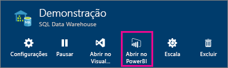
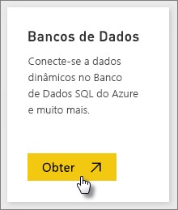
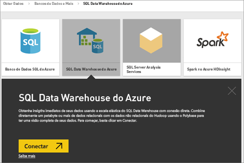
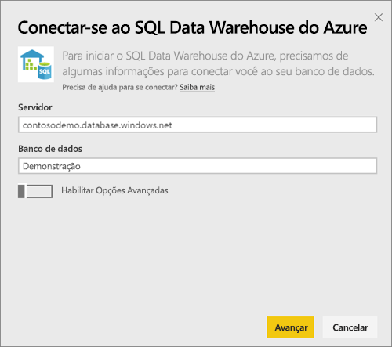
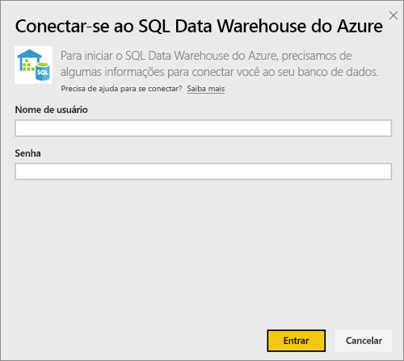
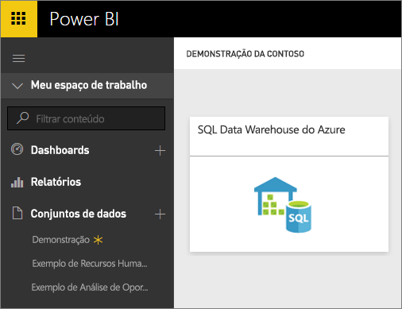
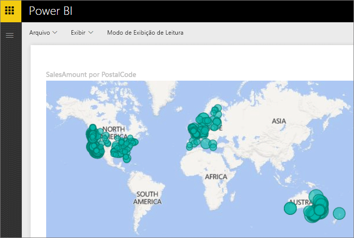
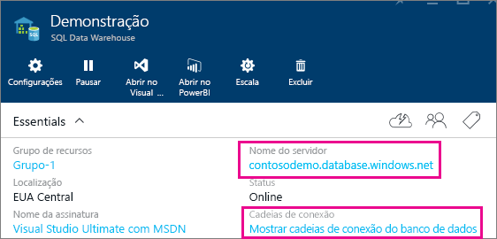

# SQL Data Warehouse do Azure com DirectQuery

O SQL Data Warehouse do Azure com o DirectQuery permite criar relatórios dinâmicos com base nos dados e nas métricas que você já tem no SQL Data Warehouse do Azure. Com o DirectQuery, as consultas são enviadas de volta para o SQL Data Warehouse do Azure em tempo real conforme você explora os dados. As consultas em tempo real, aliadas à escala do SQL Data Warehouse, permitem aos usuários criar, em minutos, relatórios dinâmicos referentes a terabytes de dados. Além disso, a introdução do botão **Abrir no Power BI** permite que os usuários conectem diretamente o Power BI ao seu SQL Data Warehouse sem precisar especificar manualmente as informações.

Ao usar o conector do SQL Data Warehouse:

* Especifique o nome do servidor totalmente qualificado ao estabelecer a conexão (veja abaixo para obter mais detalhes)
* Assegure que as regras de firewall para o servidor estão configuradas para “Permitir acesso aos serviços do Azure”
* Toda ação, como selecionar uma coluna ou adicionar um filtro, consultará diretamente o data warehouse
* Os blocos são configurados para atualizar aproximadamente a cada 15 minutos e a atualização não precisa ser agendada.  A atualização poderá ser ajustada nas Configurações avançadas quando você se conectar.
* As P e R não estão disponíveis para conjuntos de dados do DirectQuery
* As alterações de esquema não são aplicadas automaticamente

Essas restrições e observações podem mudar conforme continuamos a aprimorar as experiências. As etapas para conectar são detalhadas abaixo.

## Usando o botão 'Abrir no Power BI'

> [!Important]
> Estamos aperfeiçoando nossa conectividade com o SQL Data Warehouse do Azure.  Para obter a melhor experiência para se conectar à fonte de dados do SQL Data Warehouse do Azure, use o Power BI Desktop.  Depois de criar seu modelo e relatório, você poderá publicá-los no serviço do Power BI.  O conector direto para o SQL Data Warehouse do Azure no serviço do Power BI foi preterido.

A maneira mais fácil de alternar entre o SQL Data Warehouse e o Power BI é com o botão **Abrir no Power BI** no Portal do Azure. Esse botão permite que você comece diretamente a criar novos painéis no Power BI.

1. Para começar, navegue até sua instância do SQL Data Warehouse no Portal do Azure. No momento, o SQL Data Warehouse tem apenas uma presença na Versão Prévia do Portal do Azure.

2. Clique no botão **Abrir no Power BI**

    

3. Se não for possível conectá-lo diretamente ou se você não tiver uma conta do Power BI, você precisará entrar.

4. Você será direcionado para a página de conexão do SQL Data Warehouse, com as informações do seu SQL Data Warehouse pré-preenchidas. Insira suas credenciais e selecione conectar para criar uma conexão.

## Conectando-se por meio do Power BI

O SQL Data Warehouse também está listado na página Obter Dados do Power BI. 

1. Selecione **Obter Dados** na parte inferior do painel de navegação esquerdo.  

    

2. Em **Bancos de dados**, selecione **Obter**.

    

3. Selecione **SQL Data Warehouse** \> **Conectar**.

    

4. Insira as informações necessárias para se conectar. A seção **Localizando Parâmetros** a seguir mostra onde esses dados podem estar localizados em seu Portal do Azure.

    

    

    

   > [!NOTE]
   > O nome de usuário será um usuário definido na instância do SQL Data Warehouse do Azure.

5. Analise o conjunto de dados selecionando o novo bloco ou o conjunto de dados recém-criado, indicado pelo asterisco. Esse conjunto de dados terá o mesmo nome do banco de dados.

    

6. Você pode explorar todas as tabelas e colunas. Selecionar uma coluna resultará no envio de uma consulta de volta para a fonte, criando dinamicamente seu visual. Filtros também serão convertidos em consultas de volta para o data warehouse. Esses elementos visuais podem ser salvos em um novo relatório e fixados de volta em seu painel.

    

## Localizando Valores de Parâmetro

Seu nome do servidor totalmente qualificado e o nome do banco de dados podem ser encontrados no Portal do Azure. No momento, o SQL Data Warehouse tem apenas uma presença na Versão Prévia do Portal do Azure.

> [!NOTE]
> Se o seu locatário do Power BI estiver na mesma região que o SQL Data Warehouse do Azure, não haverá nenhum encargo pela saída. Você pode descobrir onde seu locatário do Power BI está localizado usando [estas instruções](https://docs.microsoft.com/power-bi/service-admin-where-is-my-tenant-located).

## Próximas etapas

* [O que é o Power BI?](power-bi-overview.md)  
* [Obter dados para o Power BI](service-get-data.md)  
* [SQL Data Warehouse do Azure](/azure/sql-data-warehouse/sql-data-warehouse-overview-what-is/)

Mais perguntas? [Experimente a Comunidade do Power BI](http://community.powerbi.com/)