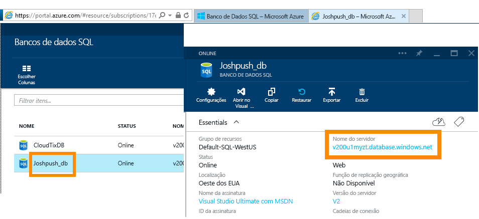
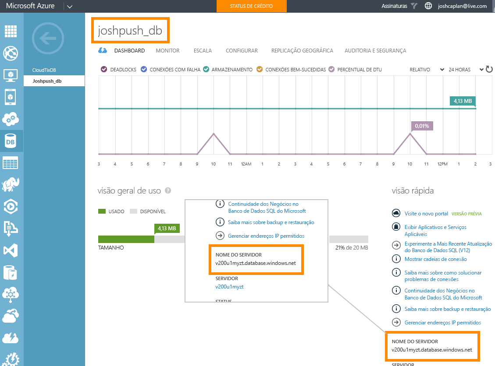

# Banco de Dados SQL do Azure com DirectQuery

Saiba como você pode se conectar diretamente ao banco de dados SQL e criar relatórios que usam dados dinâmicos. Você pode manter os dados na fonte e não no Power BI.

Com o DirectQuery, as consultas serão enviadas de volta para o Banco de Dados SQL do Azure conforme você explora os dados na exibição de relatório. Essa experiência é sugerida para usuários que estão familiarizados com os bancos de dados e as entidades aos quais eles se conectam.

**Observações:**

* Especifique o nome do servidor totalmente qualificado ao estabelecer a conexão (consulte abaixo para obter mais detalhes).
* Garanta que as regras de firewall para o banco de dados estejam configuradas para "[Permitir acesso aos serviços do Azure](https://msdn.microsoft.com/library/azure/ee621782.aspx)".
* Toda ação, como selecionar uma coluna ou adicionar um filtro, enviará uma consulta de volta ao banco de dados.
* Os blocos são atualizados a cada hora (a atualização não precisa ser agendada). Você pode ajustar a frequência de atualização nas Configurações avançadas quando você se conectar.
* P e R não estão disponíveis para conjuntos de dados do DirectQuery.
* As alterações de esquema não são selecionadas automaticamente.

Essas restrições e observações podem mudar conforme continuamos a aprimorar as experiências. As etapas para conectar são detalhadas abaixo.

> [!Important]
> Estamos aperfeiçoando nossa conectividade com o Banco de Dados SQL do Azure.  Para obter a melhor experiência para se conectar à fonte de dados do Banco de Dados SQL do Azure, use o Power BI Desktop.  Depois de criar seu modelo e relatório, você poderá publicá-los no serviço do Power BI.  O conector direto para o Banco de Dados SQL do Azure no serviço do Power BI foi preterido.

## Power BI Desktop e DirectQuery

Para se conectar ao Banco de Dados SQL do Azure usando DirectQuery, você precisa usar o Power BI Desktop. Essa abordagem fornece mais flexibilidade e funcionalidades adicionais. Os relatórios criados com o Power BI Desktop podem ser publicados no serviço do Power BI. Você pode aprender mais sobre como se conectar ao [Banco de Dados SQL do Azure usando DirectQuery](desktop-use-directquery.md) dentro do Power BI Desktop.

## Encontrar valores de parâmetros

É possível encontrar seu nome do servidor totalmente qualificado e o nome do banco de dados no portal do Azure.

[!INCLUDE [direct-query-sso](includes/direct-query-sso.md)]

## Próximas etapas

* [Usar o DirectQuery no Power BI Desktop](desktop-use-directquery.md)  
* [O que é o Power BI?](power-bi-overview.md)  
* [Obter dados para o Power BI](service-get-data.md)  

Mais perguntas? [Experimente a Comunidade do Power BI](http://community.powerbi.com/)
