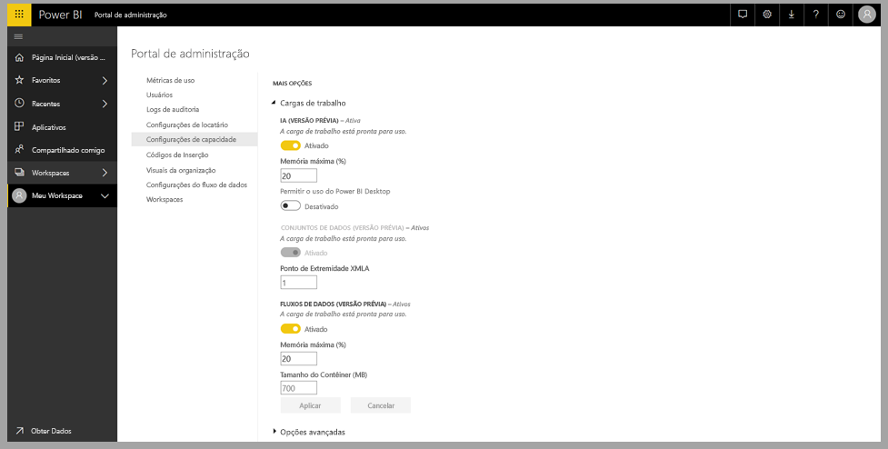
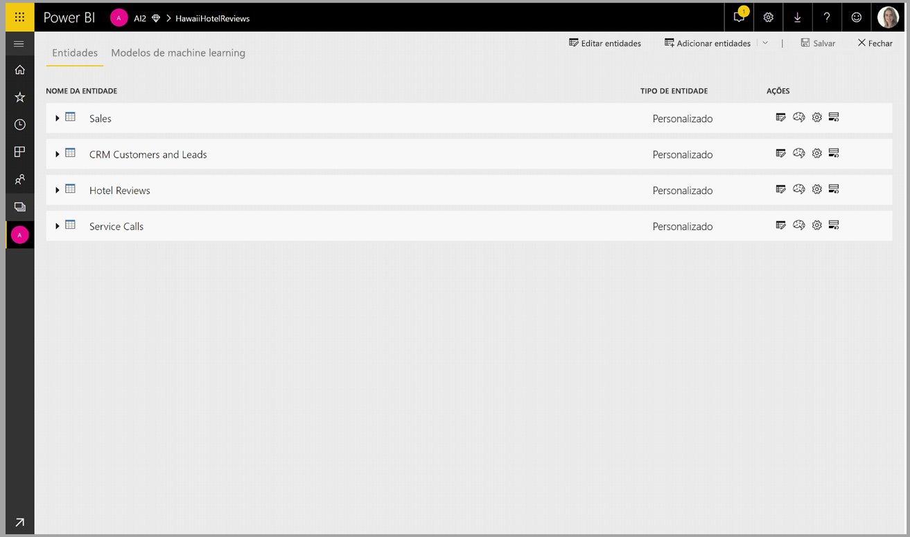
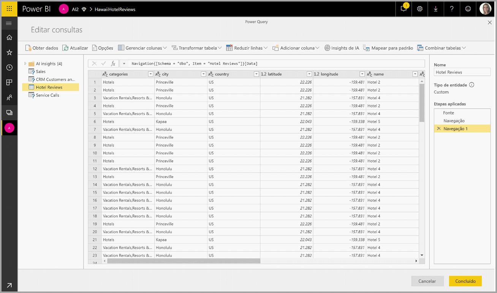
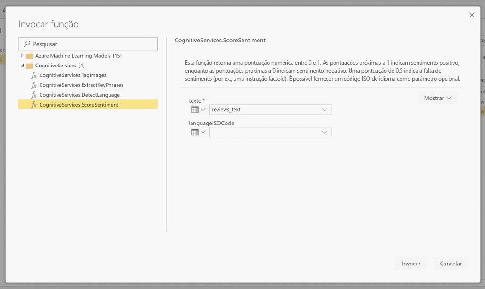
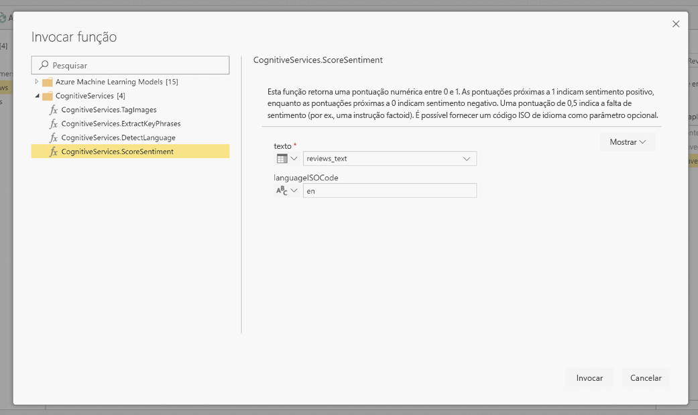
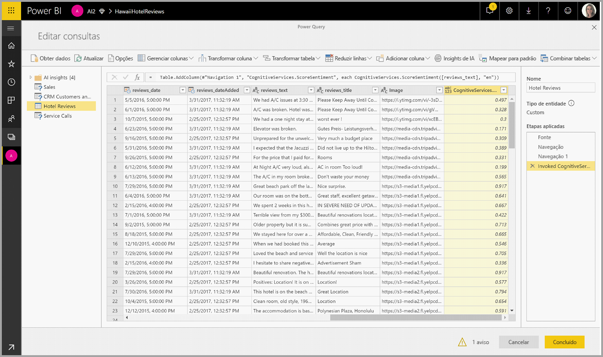
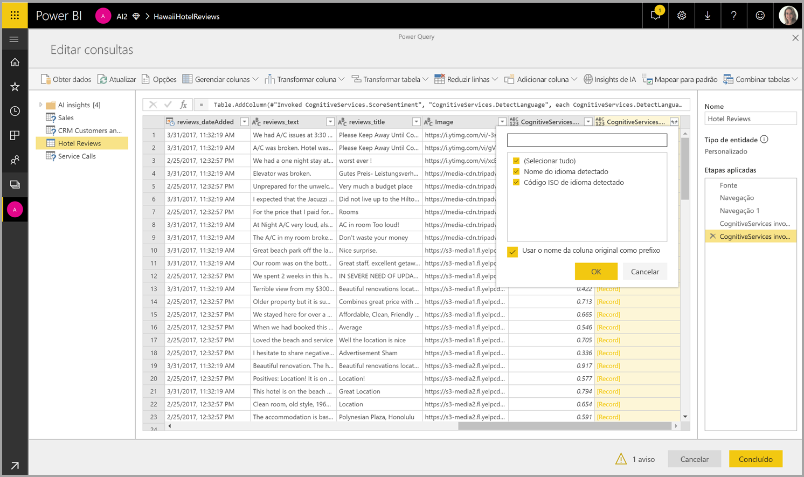

# Serviços Cognitivos no Power BI (versão prévia)

Com os Serviços Cognitivos no Power BI, você pode aplicar algoritmos diferentes dos [Serviços Cognitivos do Azure](https://azure.microsoft.com/services/cognitive-services/) para enriquecer seus dados na preparação de dados de autoatendimento para Fluxos de dados.

Os serviços atualmente com suporte são [Análise de Sentimento](https://docs.microsoft.com/azure/cognitive-services/text-analytics/how-tos/text-analytics-how-to-sentiment-analysis), [Extração de Frases-chave](https://docs.microsoft.com/azure/cognitive-services/text-analytics/how-tos/text-analytics-how-to-keyword-extraction), [Detecção de Idioma](https://docs.microsoft.com/azure/cognitive-services/text-analytics/how-tos/text-analytics-how-to-language-detection) e [Marcação de Imagem](https://docs.microsoft.com/azure/cognitive-services/computer-vision/concept-tagging-images). As transformações são executadas no serviço do Power BI e não exigem uma assinatura de Serviços Cognitivos do Azure. Este recurso requer o Power BI Premium.

## **Como habilitar recursos de IA**

Os serviços cognitivos são compatíveis com nós de capacidade Premium EM2, A2 ou P1 e acima. Uma carga de trabalho de IA separada na capacidade é usada para executar os serviços cognitivos. Durante a versão prévia pública, essa carga de trabalho é desabilitada por padrão. Antes de usar os serviços cognitivos no Power BI, a carga de trabalho de AI precisa ser habilitada nas configurações de capacidade do portal do administrador. Você pode ativar a carga de trabalho de IA na seção de cargas de trabalho e definir a quantidade máxima de memória que deseja que essa carga de trabalho consuma. O limite de memória recomendada é de 20%. Exceder esse limite faz com que a consulta seja mais lenta.

## **Introdução aos Serviços Cognitivos no Power BI**

As transformações de Serviços Cognitivos fazem parte da [Preparação de dados de autoatendimento para fluxos de dados](https://powerbi.microsoft.com/blog/introducing-power-bi-data-prep-wtih-dataflows/). Para enriquecer seus dados com os Serviços Cognitivos, inicie editando um fluxo de dados.

Selecione o botão **Insights de IA** na faixa de opções superior do Power Query Editor.

Na janela pop-up, selecione a função que deseja usar e os dados que deseja transformar. Neste exemplo, eu estou pontuando o sentimento de uma coluna que contém o texto de revisão.

**CultureInfo** é uma entrada opcional para especificar o idioma do texto. Este campo está esperando um código ISO. Você pode usar uma coluna como entrada para Cultureinfo ou um campo estático. Neste exemplo, o idioma é especificado como inglês (en) para a coluna inteira. Se você deixar esse campo em branco, o Power BI detectará automaticamente o idioma antes de aplicar a função. Em seguida, selecione **Invocar.**

Depois de invocar a função, o resultado é adicionado como nova coluna à tabela. A transformação também é adicionada como uma etapa aplicada na consulta.

Se a função retornar vários campos de saída, a invocação da função adiciona uma nova coluna com um registro de vários campos de saída.

Use a opção de expansão para adicionar um ou ambos os valores como colunas aos seus dados.

## **Funções disponíveis**

Esta seção descreve as funções disponíveis nos Serviços Cognitivos no Power BI.

### **Detectar Idioma**

A função de detecção de idioma avalia a entrada de texto e para cada campo retorna o nome do idioma e o identificador ISO. Essa função é útil para colunas de dados que coletam texto arbitrário, onde o idioma é desconhecido. A função espera dados no formato de texto como entrada.

A Análise de Texto reconhece até 120 idiomas. Saiba mais em [idiomas com suporte](https://docs.microsoft.com/azure/cognitive-services/text-analytics/text-analytics-supported-languages).

### **Extrair frases-chave**

A função **Extração de Frases-chave** avalia o texto não estruturado e para cada campo de texto, retorna uma lista de frases-chave. A função requer um campo de texto como entrada e aceita uma entrada opcional para **Cultureinfo**. (Confira a seção **Introdução** anteriormente neste artigo).

A extração de frases-chave funciona melhor quando você fornece blocos de texto maiores a serem trabalhados. Esse é o oposto da análise de sentimento, que funciona melhor em blocos de texto menores. Considere reestruturar adequadamente as entradas para obter os melhores resultados de ambas as operações.

### **Pontuação de sentimento**

A função **Pontuação de sentimento** avalia a entrada de texto e retorna uma pontuação de sentimento para cada documento, variando de 0 (negativo) a 1 (positivo). Essa função é útil para detectar o sentimento positivo e negativo em mídias sociais, nas revisões do cliente e em fóruns de discussão.

A Análise de Texto usa um algoritmo de classificação de aprendizado de máquina para gerar uma pontuação de sentimento entre 0 e 1. As pontuações mais próximas de 1 indicam sentimento positivo, as pontuações mais próximas de 0 indicam sentimento negativo. O modelo é pré-treinado com um amplo corpo de texto com associações de sentimento. No momento, não é possível fornecer seus próprios dados de treinamento. O modelo usa uma combinação de técnicas durante a análise de texto, incluindo processamento de texto, análise de parte da fala, posicionamento e associações de palavras. Saiba mais sobre o algoritmo em [Apresentação da Análise de Texto](https://blogs.technet.microsoft.com/machinelearning/2015/04/08/introducing-text-analytics-in-the-azure-ml-marketplace/).

A análise de sentimento é executada em todo o campo de entrada, em vez de extrair o sentimento de uma entidade específica no texto. Na prática, há uma tendência de melhoria da precisão de pontuação quando os documentos contêm uma ou duas sentenças, em vez de um grande bloco de texto. Durante a fase de avaliação de objetividade, o modelo determina se um campo de entrada como um todo é objetivo ou contém o sentimento. Um campo de entrada que é principalmente objetivo não progride para a frase de detecção de sentimento, resultando em uma pontuação 0,50, sem nenhum processamento adicional. Para os campos de entrada continuarem no pipeline, a próxima fase gera uma pontuação acima ou abaixo de 0,50, dependendo do grau de sentimento detectado no campo de entrada.

No momento, a Análise de Sentimento é compatível com os idiomas alemão, espanhol, francês e inglês. Outros idiomas estão em versão prévia. Saiba mais em [Idiomas com suporte](https://docs.microsoft.com/azure/cognitive-services/text-analytics/text-analytics-supported-languages).

### **Marcar imagens**

A função **Marcar imagens** retorna marcas com base em mais de 2.000 objetos reconhecíveis, seres vivos, cenários e ações. Quando as marcas são ambíguas ou não são dados de conhecimento comum, a saída fornece "dicas" para esclarecer o significado da marca no contexto de uma configuração conhecida. As marcas não são organizadas como uma taxonomia e não existe nenhuma hierarquia de herança. Uma coleção de marcas de conteúdo constitui a base para uma "descrição" da imagem exibida como linguagem legível por humanos, formatada em frases completas.

Depois de carregar uma imagem ou especificar uma URL de imagem, os algoritmos de Pesquisa Visual Computacional marcam saídas com base em objetos, seres vivos e ações identificadas na imagem. A marcação não está limitada à entidade principal, como uma pessoa em primeiro plano, mas também inclui o ambiente (interno ou externo), móveis, ferramentas, plantas, animais, acessórios, eletrônicos e assim por diante.

Essa função requer uma URL de imagem ou um campo abase-64 como entrada. Neste momento, a marcação de imagem é compatível com os idiomas inglês, espanhol, japonês, português e chinês simplificado. Saiba mais em [Idiomas com suporte](https://docs.microsoft.com/rest/api/cognitiveservices/computervision/tagimage/tagimage#uri-parameters).

## Próximas etapas

Este artigo fornece uma visão geral do uso dos Serviços Cognitivos com o serviço do Power BI. Os artigos a seguir também podem ser úteis e interessantes. 

* [Tutorial: Invocar um modelo de Machine Learning Studio no Power BI (versão prévia)](service-tutorial-invoke-machine-learning-model.md)
* [Integração do Azure Machine Learning no Power BI (versão prévia)](service-machine-learning-integration.md)
* [Tutorial: Como usar os Serviços Cognitivos no Power BI](service-tutorial-use-cognitive-services.md)

Para saber mais sobre os fluxos de dados, você pode ler estes artigos:
* [Criação e uso de fluxos de dados no Power BI](service-dataflows-create-use.md)
* [Usando entidades computadas no Power BI Premium](service-dataflows-computed-entities-premium.md)
* [Usando fluxos de dados com fontes de dados locais](service-dataflows-on-premises-gateways.md)
* [Recursos do desenvolvedor para fluxos de dados do Power BI](service-dataflows-developer-resources.md)
* [Integração entre fluxos de dados e o Azure Data Lake (versão prévia)](service-dataflows-azure-data-lake-integration.md)