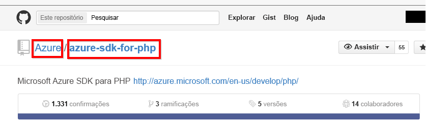

# Conectar-se ao GitHub com o Power BI
Este artigo explica a efetuar pull de seus dados de sua conta do GitHub com um aplicativo de modelo do Power BI. O aplicativo de modelo gera um espaço de trabalho com um dashboard, um conjunto de relatórios e um conjunto de dados para permitir que você explore seus dados do GitHub. O aplicativo do GitHub para o Power BI mostra percepções sobre seu repositório do GitHub, também conhecido como repositório, com dados sobre contribuições, problemas, solicitações de pull e usuários ativos.

Depois de instalar o aplicativo de modelo, você pode alterar o painel e relatório. Em seguida, você pode distribuí-lo como um aplicativo para seus colegas em sua organização.

Conectar-se para o [aplicativo de modelo do GitHub](https://app.powerbi.com/getdata/services/github) ou leia mais sobre o [integração do GitHub](https://powerbi.microsoft.com/integrations/github) com o Power BI.

Você também pode experimentar o [tutorial do GitHub](service-tutorial-connect-to-github.md). Ele instala os dados reais do GitHub sobre o repositório público para obter a documentação do Power BI.

>[!NOTE]
>O modelo de aplicativo requer que a conta do GitHub tenha acesso ao repositório. Mais detalhes sobre os requisitos abaixo.

## Como se conectar
[!INCLUDE [powerbi-service-apps-get-more-apps](./includes/powerbi-service-apps-get-more-apps.md)]
   
3. Selecione **GitHub** \> **obtê-lo agora**.
4. Na **instalar este aplicativo do Power BI?** selecionar **instalar**.
4. No **aplicativos** painel, selecione o **GitHub** lado a lado.

    

6. Na **começar com seu novo aplicativo**, selecione **Conecte dados**.

    

5. Digite o nome do repositório e também o seu proprietário. Veja detalhes sobre [como encontrar esses parâmetros](#FindingParams) abaixo.
   
    

5. Insira suas credenciais do GitHub (essa etapa pode ser ignorada se você já tiver entrado com seu navegador). 
6. Para o **Método de Autenticação**, selecione **oAuth2** \> **Entrar**. 
7. Siga as telas de autenticação do GitHub. Conceda o GitHub para permissão de aplicativo do Power BI modelo aos dados do GitHub.
   
   
   
    Power BI se conecta ao GitHub e seus dados.  Os dados são atualizados uma vez por dia. Depois que o Power BI importar os dados, você pode ver o conteúdo de seu novo espaço de trabalho do GitHub.

## Modificar e distribuir seu aplicativo

Você instalou o aplicativo de modelo do GitHub. Isso significa que você também criou o espaço de trabalho de aplicativo do GitHub. No espaço de trabalho, você pode alterar o relatório e painel de controle e, em seguida, distribuí-lo como um *aplicativo* para seus colegas em sua organização. 

1. Selecione a seta ao lado do nome do espaço de trabalho na barra de navegação à esquerda. Você ver que o espaço de trabalho contém um painel e um relatório.

    

8. Selecione a nova [dashboard do GitHub](https://powerbi.microsoft.com/integrations/github).    
    

3. Para exibir todo o conteúdo do seu espaço de trabalho novo do GitHub, na barra de navegação à esquerda, selecione **espaços de trabalho** > **GitHub**.
 
   

    Essa exibição é a lista de conteúdo para o espaço de trabalho. No canto superior direito, você verá **atualizar aplicativo**. Quando você estiver pronto para distribuir seu aplicativo para seus colegas, que é onde você começará. 

    

2. Selecione **relatórios** e **conjuntos de dados** para ver os outros elementos no espaço de trabalho.

    Leia sobre [distribuindo aplicativos](service-create-distribute-apps.md) para seus colegas.

## O que está incluído no aplicativo
Os dados a seguir estão disponíveis no GitHub no Power BI:     

| Nome da tabela | Descrição |
| --- | --- |
| Contribuições |A tabela de contribuições apresenta o total de adições, exclusões e confirmações criadas pelo Colaborador agregadas por semana. Os 100 principais colaboradores são incluídos. |
| Problemas |Lista todos os problemas do repositório selecionado e contém cálculos como os tempos total e médio para encerramento de um problema, Total de problemas em aberto e Total de problemas encerrados. Esta tabela estará vazia quando não houver nenhum problema no repositório. |
| Solicitações pull |Esta tabela contém todas as Solicitações Pull para o repositório e quem realizou a solicitação. Ele também contém cálculos de quantas solicitações pull abertas, fechadas e totais, quanto tempo demorou para as solicitações de pull e quanto tempo levou a solicitação de pull em média. Esta tabela estará vazia quando não houver nenhum problema no repositório. |
| Usuários |Esta tabela fornece uma lista de usuários do GitHub ou colaboradores que fizeram contribuições, arquivaram problemas ou resolveram solicitações Pull para o repositório selecionado. |
| Etapas |Contém todas as Etapas para o repositório selecionado. |
| DateTable |Esta tabela contém datas de hoje e anos no passado, que permitem que você analise seus dados GitHub por data. |
| ContributionPunchCard |Essa tabela pode ser usada como um cartão perfurado de colaborações para o repositório selecionado. Ele mostra as confirmações por dia da semana e horas do dia. Esta tabela não está conectada a outras tabelas presentes no modelo. |
| RepoDetails |Esta tabela fornece detalhes sobre o repositório selecionado. |

## Requisitos de sistema
* A conta do GitHub que tem acesso ao repositório.  
* Permissão concedida ao Power BI para o aplicativo GitHub durante o primeiro logon. Confira os detalhes abaixo para revogar o acesso.  
* Chamadas à API suficientes disponíveis para extrair e atualizar os dados.  

### Desautorizar Power BI
Para desautorizar a conexão do Power BI conecte-se a seu repositório do GitHub, você pode revogar o acesso no GitHub. Consulte este [Ajuda do GitHub](https://help.github.com/articles/keeping-your-ssh-keys-and-application-access-tokens-safe/#reviewing-your-authorized-applications-oauth) tópico para obter detalhes.

## Localizando parâmetros
Você pode determinar o proprietário e o repositório consultando o repositório no próprio GitHub:

A primeira parte, "Azure", é o proprietário, enquanto a segunda parte, "azure-sdk-for-php", é o repositório em si.  Você vê esses mesmos dois itens na URL do repositório:

    <https://github.com/Azure/azure-sdk-for-php> .

## Solução de problemas
Se necessário, é possível verificar suas credenciais do GitHub.  

1. Em outra janela do navegador, vá para o site do GitHub e entrar no GitHub. Você pode ver, no canto superior direito do site do GitHub, que você está conectado.    
2. No GitHub, navegue até a URL do repositório que você planeja acessar no Power BI. Por exemplo: https://github.com/dotnet/corefx.  
3. No Power BI, tente se conectar ao GitHub. Na caixa de diálogo Configurar o GitHub, use os nomes e o proprietário desse mesmo repositório.  

## Próximas etapas

* [Tutorial: Conectar-se a um repositório do GitHub com o Power BI](service-tutorial-connect-to-github.md)
* [Criar novos espaços de trabalho no Power BI](service-create-the-new-workspaces.md)
* [Instalar e usar aplicativos no Power BI](consumer/end-user-apps.md)
* [Conectar-se aos aplicativos do Power BI para serviços externos](service-connect-to-services.md)
* Dúvidas? [Experimente perguntar à Comunidade do Power BI](http://community.powerbi.com/)

