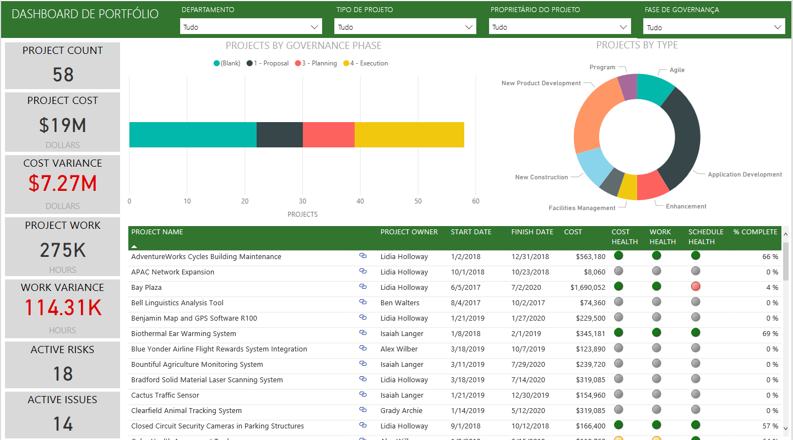
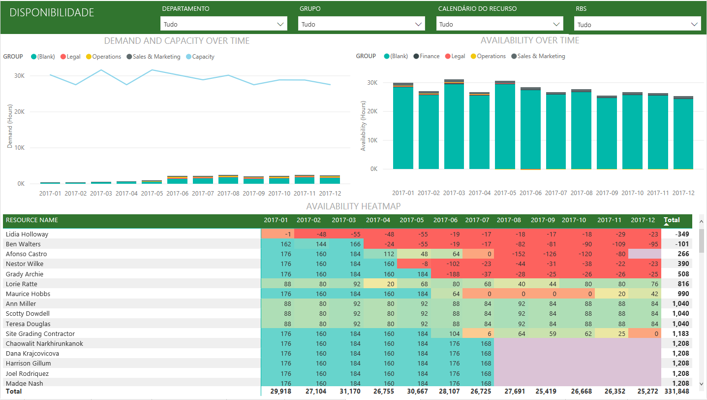
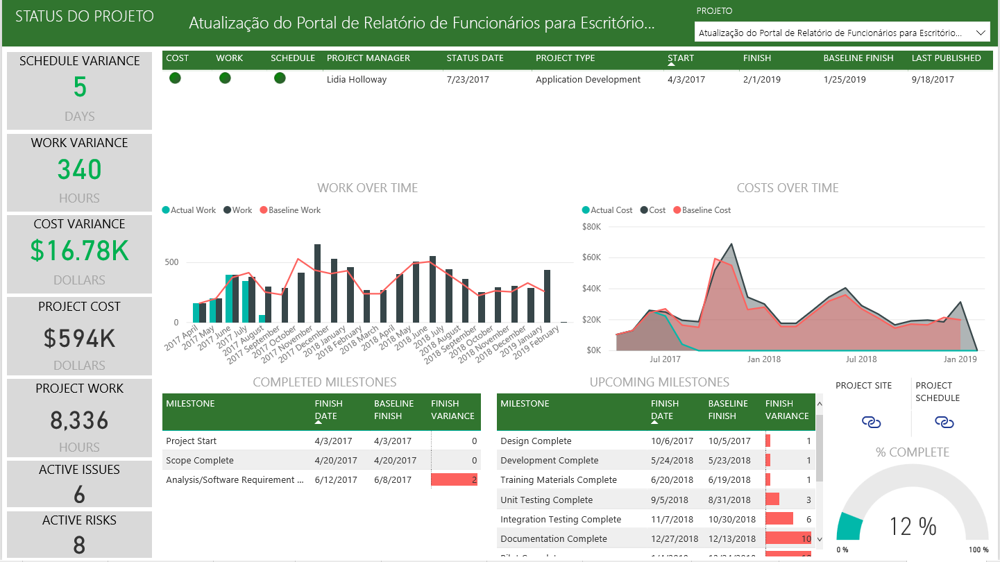

# Conectar-se ao Project Web App com o Power BI
O Microsoft Project Web App é uma solução online flexível para PPM (gerenciamento de portfólio de projetos) e para o trabalho cotidiano. O Project Web App permite que as organizações comecem, priorizem investimentos de portfólio de projetos e atinjam o valor comercial pretendido. O Aplicativo de Modelo do Project Web App para Power BI permite aproveitar informações do Project Web App para ajudar a gerenciar projetos, portfólios e recursos.

Conecte-se ao [Aplicativo de Modelo do Project Web App](https://appsource.microsoft.com/product/power-bi/pbi_msprojectonline.pbi-microsoftprojectwebapp) para Power BI.

## Como se conectar

   
1. Selecione **Aplicativos** no painel de navegação esquerdo > selecione **Obter aplicativos** no canto superior direito.
2. Na caixa **Serviços** , selecione **Obter**.
   
   
3. No AppSource, selecione a guia **Aplicativos** e pesquise/selecione **Microsoft Project Web App**.
   
4. Você receberá uma mensagem dizendo – **Instalar este Aplicativo Power BI?** . Selecione **Instalar**. 

   
5. No painel **Aplicativos**, selecione o bloco **Microsoft Project Web App**. 
   
   
6. Em **introdução a seu novo aplicativo**, selecione **Conectar dados**.
   
   
7. Na caixa de texto **URL do Project Web App**, digite a URL para o PWA (Project Web Add) à qual você deseja se conectar.  Observe que isso pode ser diferente do exemplo, caso você tenha um domínio personalizado. Na caixa de texto **Idioma do site do PWA**, digite o número que corresponde ao seu idioma de site do PWA. Digite “1” para inglês, “2” para francês, “3” para alemão, “4” para português (Brasil), “5” para português (Portugal) e “6” para espanhol. 
   
   
8. Para o Método de Autenticação, selecione **oAuth2** \> **Entrar**. Quando solicitado, insira suas credenciais do Project Web App e siga o processo de autenticação.

    
Observe que você precisa ter as permissões Visualizador de portfólio, Gerente de portfólio ou Administrador do Project Web App ao qual você está se conectando.

9. Você verá uma notificação indicando que os dados estão sendo carregados. Dependendo do tamanho de sua conta, isso pode levar algum tempo. Depois que o Power BI importa os dados, você vê os conteúdos de seu novo workspace. Talvez seja necessário atualizar o conjunto de informações para receber as atualizações mais recentes. 

Após o Power BI importar os dados, você verá o relatório com 13 páginas e um conjunto de dados no painel de navegação esquerdo. 

10. Depois que seus relatórios estiverem prontos, vá em frente e comece a explorar os dados de seu Project Web App! O Aplicativo de Modelo vem com 13 relatórios avançados e detalhados para a visão geral do portfólio (seis páginas de relatório), a visão geral de recursos (cinco páginas de relatório) e o status de projeto (duas páginas de relatório). 

   
   
   
   
   

**E agora?**

* Enquanto seu conjunto de dados será agendado para ser atualizado diariamente, você pode alterar o agendamento de atualização ou tentar atualizá-lo sob demanda usando **Atualizar Agora**

**Expandir o Aplicativo de Modelo**

Baixe o [arquivo GitHub PBIT](https://github.com/OfficeDev/Project-Power-BI-Content-Packs) para personalizar ainda mais e atualizar o pacote de conteúdo

## Próximas etapas
[Introdução ao Power BI](service-get-started.md)

[Obter dados no Power BI](service-get-data.md)

