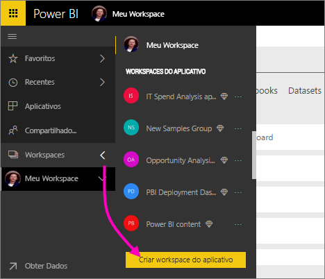
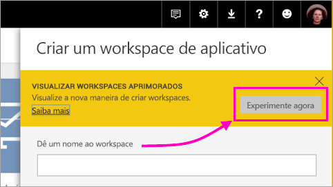
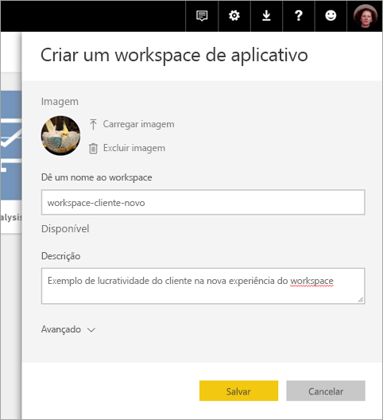
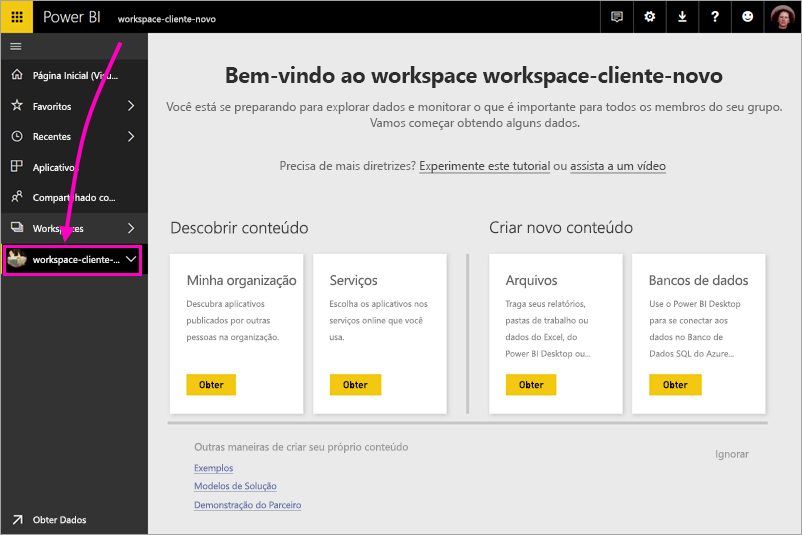
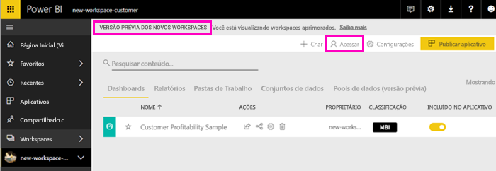
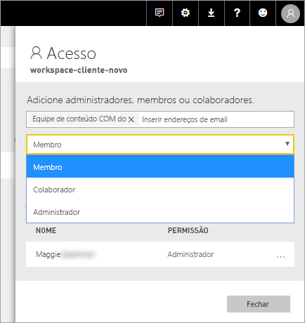
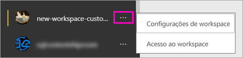

# Criar os novos espaços de trabalho (versão prévia) no Power BI

O Power BI está apresentando uma nova experiência de espaço de trabalho como versão prévia. Os espaços de trabalho ainda são locais para colaborar com colegas para criar coleções de dashboards e relatórios, que você pode agrupar em *aplicativos* e distribuir para toda a sua organização ou para pessoas ou grupos específicos. 

Com a nova versão prévia de espaços de trabalho, agora é possível:

- Atribuir funções de espaço de trabalho a grupos de usuários: grupos de segurança, listas de distribuição, grupos do Office 365 e indivíduos.
- Criar um espaço de trabalho no Power BI sem criar um grupo do Office 365.
- Usar funções de espaços de trabalho mais granulares para obter um gerenciamento de permissões mais flexível em um espaço de trabalho.
 
Quando você cria um dos novos espaços de trabalho, você não está criando um grupo do Office 365 associado e subjacente. Toda a administração do espaço de trabalho está no Power BI, não no Office 365. Ainda é possível adicionar um grupo do Office 365 ao espaço de trabalho para continuar gerenciando o acesso do usuário ao conteúdo por meio de grupos do Office 365. No entanto, também é possível usar grupos de segurança e listas de distribuição e adicionar indivíduos diretamente pelo Power BI, dando uma forma flexível de gerenciar o acesso ao espaço de trabalho. Como agora a administração de espaço de trabalho está no Power BI, os administradores do Power BI decidem quem em uma organização pode criar espaços de trabalho. Saiba mais no [artigo no portal de administração do Power BI, na seção Espaços de trabalho](service-admin-portal.md#workspace-settings). 

Adicione grupos de usuários ou indivíduos aos novos espaços de trabalho como membros, colaboradores ou administradores. Todos em um grupo de usuários obtêm a função que você definiu. Se um indivíduo estiver em vários grupos de usuário, ele obterá o nível mais alto de permissão fornecido pela função.  Consulte [Roles in the new workspaces](#roles-in-the-new-workspaces) (Funções nos novos espaços de trabalho) posteriormente neste artigo para obter uma explicação das diferentes funções.

Todos que você adicionar a um espaço de trabalho de aplicativo precisam de uma licença do Power BI Pro. No espaço de trabalho, esses usuários podem colaborar em dashboards e relatórios que você planeja publicar para um público maior ou até mesmo para toda a sua organização. Para distribuir conteúdo a outras pessoas da sua organização, atribua licenças do Power BI Pro a esses usuários ou coloque o espaço de trabalho em uma capacidade do Power BI Premium.

Com os novos espaços de trabalho, estamos recriando alguns recursos. Confira os [recursos do Espaço de trabalho do aplicativo que funcionam de forma diferente](#app-workspace-features-that-work-differently) posteriormente neste artigo para obter uma explicação das alterações que você pode esperar que se tornem permanentes, juntamente com a versão prévia. Como esse é um recurso de versão prévia, essas são algumas limitações que você deve conhecer. Confira os [Problemas conhecidos](#known-issues) posteriormente neste artigo para obter uma explicação das limitações atuais. 

## Distribuir novos espaços de trabalho de aplicativo

Durante o período de versão prévia, espaços de trabalho antigos e novos podem coexistir lado a lado, e você pode criar qualquer um deles. Quando a versão prévia para novos espaços de trabalho for encerrada e eles estiverem disponíveis para o público geral, espaços de trabalho antigos ainda podem existir por um tempo. Não será possível criá-los e será necessário se preparar para migrar seus espaços de trabalho para a nova infraestrutura de espaços de trabalho. Não se preocupe, você terá vários meses para concluir a migração.

## Criar um dos novos espaços de trabalho de aplicativo

1. Comece criando o espaço de trabalho de aplicativo. Selecione **Espaços de trabalho** > **Criar espaço de trabalho do aplicativo**.
   
     

2. Em **Visualizar espaços de trabalho aprimorados**, selecione **Experimentar agora**.
   
     

2. Nomeie o espaço de trabalho. Se o nome não estiver disponível, edite-o para criar uma ID exclusiva.
   
     O aplicativo terá o mesmo nome que o espaço de trabalho.
   
1. Adicione uma imagem, se desejar. O tamanho do arquivo deve ter menos de 45 KB.
 
    

1. Selecione **Salvar**.

    Aqui na tela de **boas-vindas** do seu novo espaço de trabalho, é possível adicionar dados. 

    

1. Por exemplo, selecione **Exemplos** > **Exemplo de rentabilidade do cliente**.

    Agora na lista de conteúdo do espaço de trabalho, você vê a **Nova versão prévia de espaços de trabalho**. Como você é administrador, também vê uma nova ação, **Acessar**.

    

1. Selecione **Acessar**.

1. Adicione grupos de segurança, listas de distribuição, grupos do Office 365 ou indivíduos nesses espaços de trabalho como membros, colaboradores ou administradores. Consulte [Roles in the new workspaces](#roles-in-the-new-workspaces) (Funções nos novos espaços de trabalho) posteriormente neste artigo para obter uma explicação das diferentes funções.

    

9. Selecione **Adicionar** > **Fechar**.

1. O Power BI cria o espaço de trabalho e o abre. Ele aparece na lista de espaços de trabalho dos quais você é um membro. Como você é um administrador, é possível selecionar as reticências (...) para voltar e fazer alterações nas configurações do espaço de trabalho, adicionar novos membros ou alterar as permissões deles.

     

## Adicionar conteúdo ao seu espaço de trabalho de aplicativo

Após criar um espaço de trabalho de aplicativo do novo estilo, será hora de adicionar conteúdo a ele. Adicionar conteúdo é semelhante nos espaços de trabalho de estilo novo e antigo, com uma exceção. Enquanto estiver em qualquer um dos espaços de trabalho de aplicativo, será possível carregar arquivos ou se conectar a eles, como você faria no seu próprio Meu espaço de trabalho. Nos novos espaços de trabalho, não é possível se conectar a pacotes de conteúdo organizacional ou a pacotes de conteúdo de terceiros como o Microsoft Dynamics CRM, Salesforce ou Google Analytics. Nos espaços de trabalho atuais, é possível se conectar a pacotes de conteúdo.

Quando você exibe conteúdo na lista de conteúdo de um espaço de trabalho de aplicativo, o nome do espaço de trabalho de aplicativo é listado como o proprietário.

### Conectando-se aos serviços de terceiros em novos espaços de trabalho (versão prévia)

Na nova experiência de espaços de trabalho, estamos fazendo uma alteração para nos concentrar em aplicativos. Os aplicativos de serviços de terceiros tornam fácil para os usuários obter dados dos serviços que usam, como o Microsoft Dynamics CRM, Salesforce ou Google Analytics.
Os aplicativos organizacionais dão aos usuários os dados internos de que precisam. Planejamos adicionar recursos aos aplicativos organizacionais para que os usuários possam personalizar o conteúdo que encontrarem dentro dos aplicativos. Isso acabará com a necessidade de pacotes de conteúdo. 

Com a nova versão prévia de espaços de trabalho, não é possível criar nem consumir pacotes de conteúdo organizacional. Em vez disso, é possível usar os aplicativos fornecidos para conectar-se aos serviços de terceiros ou pedir para suas equipes internas fornecerem aplicativos para quaisquer pacotes de conteúdo que você está usando no momento. 

## Funções nos novos espaços de trabalho

As funções permitem que você gerencie quem pode fazer o que em um espaço de trabalho para que as equipes possam colaborar. Os novos espaços de trabalho permitem que você atribua funções a indivíduos e a grupos de usuários: grupos de segurança, grupos do Office 365 e listas de distribuição. 

Ao atribuir funções a um grupo de usuários, os indivíduos no grupo têm acesso ao conteúdo. Se você aninhar grupos de usuários, todos os usuários contidos terão permissão. Um usuário que está em vários grupos de usuários com diferentes funções obtém o nível mais alto de permissão concedido a eles. 

Os novos espaços de trabalho oferecem três funções: administradores, membros e colaboradores.

**Os administradores podem:**

- Atualizar e excluir o espaço de trabalho. 
- Adicionar/remover pessoas, incluindo outros administradores.
- Fazer tudo que os membros podem fazer.

**Os membros podem:** 

- Adicionar membros ou outras pessoas com permissões inferiores.
- Publicar e atualizar um aplicativo.
- Compartilhar um item ou um aplicativo.
- Permitir que outras pessoas compartilhem novamente os itens.
- Fazer tudo que os colaboradores podem fazer.

**Os colaboradores podem:** 

- Criar, editar e excluir conteúdo no espaço de trabalho. 
- Publicar relatórios no espaço de trabalho, excluir conteúdo.
- Não é possível conceder acesso ao conteúdo a novas pessoas; não é possível compartilhar conteúdo novo, mas é possível compartilhar com alguém com quem o espaço de trabalho, o item ou o aplicativo já é compartilhado. 
- Não é possível modificar os membros do grupo.
 
Estamos criando fluxos de trabalho Solicitar acesso em todo o serviço para que os usuários que não têm acesso poderem solicitá-lo. No momento, os fluxos de trabalho Solicitar acesso existem para dashboards, relatórios e aplicativos.

## Distribuir um aplicativo

Quando o conteúdo estiver pronto, escolha quais dashboards e relatórios você deseja publicar e, em seguida, publique-o como um *aplicativo*. Você pode criar um aplicativo de cada espaço de trabalho. Seus colegas podem obter seu aplicativo de algumas maneiras diferentes. Você poderá instalá-lo automaticamente nas contas do Power BI de seus colegas, se o administrador do Power BI lhe der permissão. Caso contrário, eles podem localizar e instalar seus aplicativos do Microsoft AppSource ou você pode enviar um link direto. Eles recebem atualizações automaticamente e você pode controlar a frequência com que os dados são atualizados. Consulte [Publicar aplicativos com dashboards e relatórios no Power BI](service-create-distribute-apps.md) para obter detalhes.

## Converter espaços de trabalho de aplicativo antigos em novos

Durante o período de versão prévia, não é possível converter automaticamente seus espaços de trabalho de aplicativo antigos em novos. No entanto, é possível criar um novo espaço de trabalho de aplicativo e publicar seu conteúdo no novo local. 

Quando os novos espaços de trabalho estiverem disponíveis para o público geral (GA), será possível aceitar migrar os antigos automaticamente. Em algum momento após a disponibilidade geral, será necessário migrá-los.

## Perguntas frequentes sobre os aplicativos do Power BI

### Como os novos espaços de trabalho de aplicativo são diferentes dos espaços de trabalho de aplicativo atuais?
* A criação de espaços de trabalho de aplicativo não criará entidades correspondentes no Office 365 como os espaços de trabalho de aplicativo atuais fazem. (Ainda é possível adicionar um grupo do Office 365 ao seu espaço de trabalho atribuindo-lhe uma função). 
* Nos espaços de trabalho de aplicativo atuais, é possível apenas adicionar indivíduos aos membros e às listas de administradores. Nos novos espaços de trabalho de aplicativo, é possível adicionar vários grupos de segurança do AD, listas de distribuição ou grupos do Office 365 a essas listas para possibilitar um gerenciamento de usuários mais fácil. 
- É possível criar um pacote de conteúdo organizacional com base em um espaço de trabalho de aplicativo atual. Não é possível criar um com base nos novos espaços de trabalho de aplicativo.
- É possível consumir um pacote de conteúdo organizacional com base em um espaço de trabalho de aplicativo atual. Não é possível consumir um com base nos novos espaços de trabalho de aplicativo.
- Durante a versão prévia, alguns recursos ainda não estão habilitados para novos espaços de trabalho de aplicativo. Consulte a próxima seção, [Outros novos recursos do espaço de trabalho de planejados](service-create-the-new-workspaces.md#other-planned-new-app-workspace-preview-features), para obter detalhes.

## Novos recursos de versão prévia do espaço de trabalho de aplicativo planejados

Alguns outros novos recursos de versão prévia do espaço de trabalho de aplicativo ainda estão sendo desenvolvidos, mas não estão disponíveis ainda enquanto lançamos a versão prévia:

- Nenhum botão **Sair do espaço de trabalho**.
- Ainda não há suporte para as métricas de uso.
- Como o Premium funciona: é possível atribuir e criar espaços de trabalho em uma capacidade Premium, mas, para mover um espaço de trabalho entre capacidades, acesse as configurações do espaço de trabalho.
- Ainda não há suporte para a inserção de Web Part do SharePoint.
- Nenhum botão **OneDrive** para grupos do Office 365 em Obter dados/arquivos.

## Recursos do espaço de trabalho de aplicativo que funcionam de forma diferente

Alguns recursos funcionam de maneira diferente dos espaços de trabalho de aplicativo atuais nos novos espaços de trabalho de aplicativo. Essas diferenças são intencionais, com base nos comentários recebidos dos clientes, e permitirão uma abordagem mais flexível para colaboração com espaços de trabalho:

- Os membros podem ou não compartilhar novamente: substituídos pela função Colaborador
- Espaços de trabalho somente leitura: em vez de permitir aos usuários o acesso somente leitura a um espaço de trabalho, você atribui os usuários a uma função de visualizador que estará disponível em breve, o que permite o acesso somente leitura semelhante ao conteúdo em um espaço de trabalho.

## Problemas conhecidos

Os seguintes problemas são conhecidos, e as correções estão em desenvolvimento:

- Usuários ou grupos de usuários gratuitos adicionados como destinatários de assinaturas para emails não podem receber os emails, embora devessem. O problema ocorre quando a nova experiência de espaços de trabalho está em uma capacidade Premium, mas o Meu espaço de trabalho do usuário que cria a assinatura não está em uma capacidade Premium. Se o Meu espaço de trabalho estiver em uma capacidade Premium, os usuários e grupos de usuários gratuitos receberão os emails.
- Depois que um espaço de trabalho for movido de uma capacidade Premium para uma capacidade compartilhada, em alguns casos, os usuários e grupos de usuários gratuitos continuarão recebendo emails, embora não devessem. O problema ocorre quando o Meu espaço de trabalho do usuário que cria a assinatura está em uma capacidade Premium.

## Próximas etapas

- [Criar os espaços de trabalho atuais](service-create-workspaces.md)
* [Instalar e usar aplicativos no Power BI](service-install-use-apps.md)
* Dúvidas? [Experimente perguntar à Comunidade do Power BI](http://community.powerbi.com/)
