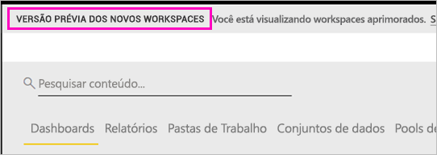
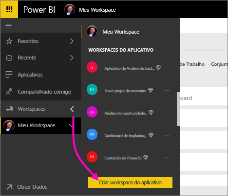
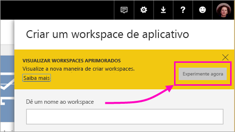
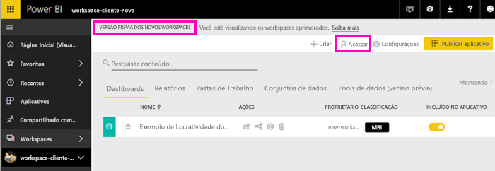
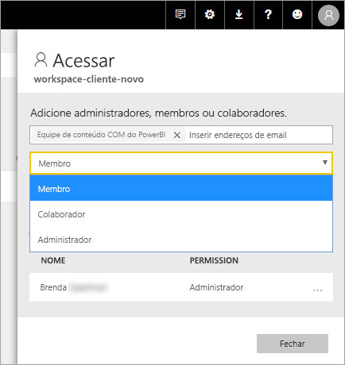

# Criar os novos workspaces (versão prévia) no Power BI

O Power BI está apresentando uma nova experiência de workspace como versão prévia. Os workspaces ainda são locais para colaborar com colegas para criar coleções de dashboards e relatórios, que você pode agrupar em *aplicativos* e distribuir para toda a sua organização ou para pessoas ou grupos específicos. 

Com a nova versão prévia de workspaces, agora é possível:

- Atribuir funções de workspace a grupos de usuários: grupos de segurança, listas de distribuição, grupos do Office 365 e indivíduos.
- Criar um workspace no Power BI sem criar um grupo do Office 365.
- Usar funções de workspaces mais granulares para obter um gerenciamento de permissões mais flexível em um workspace.

Para obter mais informações, confira o artigo [Novos workspaces (versão prévia)](service-new-workspaces.md).

## Criar um dos novos workspaces de aplicativo

1. Comece criando o workspace de aplicativo. Selecione **Workspaces** > **Criar workspace do aplicativo**.
   
     

2. Em **Visualizar workspaces aprimorados**, selecione **Experimentar agora**.
   
     

2. Nomeie o workspace. Se o nome não estiver disponível, edite-o para criar uma ID exclusiva.
   
     O aplicativo terá o mesmo nome que o workspace.
   
1. Adicione uma imagem, se desejar. O tamanho do arquivo deve ter menos de 45 KB.
 
    

1. Selecione **Salvar**.

    Aqui na tela de **boas-vindas** do seu novo workspace, é possível adicionar dados. 

    

1. Por exemplo, selecione **Exemplos** > **Exemplo de rentabilidade do cliente**.

    Agora na lista de conteúdo do workspace, você vê a **Nova versão prévia de workspaces**. Como você é administrador, também vê uma nova ação, **Acessar**.

    

1. Selecione **Acessar**.

1. Adicione grupos de segurança, listas de distribuição, grupos do Office 365 ou indivíduos nesses workspaces como membros, colaboradores ou administradores. Consulte [Funções nos novos espaços de trabalho](service-new-workspaces.md#roles-in-the-new-workspaces) para obter uma explicação das diferentes funções.

    

9. Selecione **Adicionar** > **Fechar**.

1. O Power BI cria o workspace e o abre. Ele é exibido na lista de workspaces dos quais você é membro. Como você é um administrador, é possível selecionar as reticências (...) para voltar e fazer alterações nas configurações do workspace, adicionar novos membros ou alterar as permissões deles.

     

## Adicionar conteúdo ao seu workspace de aplicativo

Após criar um workspace de aplicativo do novo estilo, será hora de adicionar conteúdo a ele. Adicionar conteúdo é semelhante nos workspaces de estilo novo e antigo, com uma exceção. Enquanto estiver em qualquer um dos workspaces de aplicativo, será possível carregar arquivos ou se conectar a eles, como você faria no seu próprio Meu workspace. Nos novos workspaces, não é possível se conectar a pacotes de conteúdo organizacional ou a pacotes de conteúdo de terceiros como o Microsoft Dynamics CRM, Salesforce ou Google Analytics. Nos workspaces atuais, é possível se conectar a pacotes de conteúdo.

Quando você exibe conteúdo na lista de conteúdo de um workspace de aplicativo, o nome do workspace de aplicativo é listado como o proprietário.

### Conectando-se aos serviços de terceiros em novos workspaces (versão prévia)

Na nova experiência de workspaces, estamos mudando o foco para *aplicativos*. Os aplicativos de serviços de terceiros facilitam para que os usuários obtenham dados dos serviços que usam, como o Microsoft Dynamics CRM, o Salesforce ou o Google Analytics.
Os aplicativos organizacionais dão aos usuários os dados internos de que precisam. Planejamos adicionar recursos aos aplicativos organizacionais para que os usuários possam personalizar o conteúdo que encontrarem dentro dos aplicativos. Essa funcionalidade elimina a necessidade de pacotes de conteúdo. 

Com a nova versão prévia de workspaces, não é possível criar nem consumir pacotes de conteúdo organizacional. Em vez disso, é possível usar os aplicativos fornecidos para conectar-se aos serviços de terceiros ou pedir para suas equipes internas fornecerem aplicativos para quaisquer pacotes de conteúdo que você está usando no momento. 

## Distribuir um aplicativo

Quando o conteúdo estiver pronto, escolha quais dashboards e relatórios você deseja publicar e, em seguida, publique-o como um *aplicativo*. Você pode criar um aplicativo de cada workspace. Seus colegas podem obter seu aplicativo de algumas maneiras diferentes. Você poderá instalá-lo automaticamente nas contas do Power BI de seus colegas, se o administrador do Power BI lhe der permissão. Caso contrário, eles podem localizar e instalar seus aplicativos do Microsoft AppSource ou você pode enviar um link direto. Eles recebem atualizações automaticamente e você pode controlar a frequência com que os dados são atualizados. Consulte [Publicar aplicativos com dashboards e relatórios no Power BI](service-create-distribute-apps.md) para obter detalhes.

## Converter workspaces de aplicativo antigos em novos

Durante o período de versão prévia, não é possível converter automaticamente seus workspaces de aplicativo antigos em novos. No entanto, é possível criar um novo workspace de aplicativo e publicar seu conteúdo no novo local. 

Quando os novos workspaces estiverem disponíveis para o público geral (GA), será possível aceitar migrar os antigos automaticamente. Em algum momento após a disponibilidade geral, será necessário migrá-los.

## Próximas etapas
* Leia sobre [Organizar o trabalho nos novos workspaces (versão prévia) no Power BI](service-new-workspaces.md)
* [Criar os workspaces atuais](service-create-workspaces.md)
* [Instalar e usar aplicativos no Power BI](service-create-distribute-apps.md)
* Dúvidas? [Experimente perguntar à Comunidade do Power BI](http://community.powerbi.com/)
