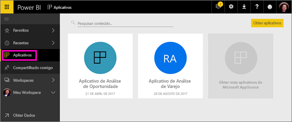

# Criar espaços de trabalho com seus colegas no Power BI

No Power BI, é possível criar *espaços de trabalho*, lugares para colaborar com colegas para criar e refinar coleções de dashboards e de relatórios. Em seguida, agrupe-os em *aplicativos* que podem ser distribuídos para toda a sua organização ou para pessoas ou grupos específicos. 

Quando você cria um espaço de trabalho, você está criando um grupo do Office 365 associado e subjacente. Toda a administração do espaço de trabalho está no Office 365. Você pode adicionar colegas a esses espaços de trabalho como membros ou administradores. No espaço de trabalho, todos podem colaborar em dashboards, relatórios e outros artigos que queiram distribuir para um público maior. Todos que você adicionar a um espaço de trabalho de aplicativo precisam de uma licença do Power BI Pro. 

**Você sabia?** O Power BI está com uma nova experiência de espaço de trabalho em versão prévia. Leia [Criar os novos espaços de trabalho (versão prévia)](service-create-the-new-workspaces.md) para ver como os espaços de trabalho mudarão no futuro. 

## Vídeo: Aplicativos e espaços de trabalho de aplicativo
<iframe width="640" height="360" src="https://www.youtube.com/embed/Ey5pyrr7Lk8?showinfo=0" frameborder="0" allowfullscreen></iframe>

## Criar um espaço de trabalho de aplicativo com base em um grupo do Office 365

Quando você cria um espaço de trabalho de aplicativo, ele é criado em um grupo do Office 365.

[!INCLUDE [powerbi-service-create-app-workspace](./includes/powerbi-service-create-app-workspace.md)]

Ao criá-lo pela primeira vez, talvez seja necessário aguardar uma hora ou mais para que o espaço de trabalho seja propagado para o Office 365. 

### Adicionar uma imagem ao seu espaço de trabalho de aplicativo do Office 365 (opcional)
Por padrão, o Power BI cria um pequeno círculo colorido com as iniciais do seu aplicativo. Mas talvez você queira personalizá-lo com uma imagem. Para adicionar uma imagem, você precisa de uma licença do Exchange Online.

1. Selecione **Espaços de Trabalho**, selecione as reticências (...) ao lado do nome do espaço de trabalho e, em seguida, **Membros**. 
   
     
   
    A conta do Office 365 Outlook do espaço de trabalho é aberta em uma nova janela do navegador.
2. Quando você focaliza sobre o círculo colorido na parte superior esquerda, ele se transforma em um ícone de lápis. Selecione-a.
   
     
3. Selecione o ícone de lápis novamente e localize a imagem que você deseja usar.
   
     

4. Selecione **Salvar**.
   
     
   
    A imagem substitui o círculo colorido na janela do Office 365 Outlook. 
   
     
   
    Em alguns minutos, ela também será exibida no aplicativo do Power BI.
   
     

## Adicionar conteúdo ao seu espaço de trabalho de aplicativo

Após criar um espaço de trabalho de aplicativo, será hora de adicionar conteúdo a ele. É tão simples quanto adicionar conteúdo ao Meu espaço de trabalho, exceto que outras pessoas também podem ver e trabalhar no espaço de trabalho. Uma grande diferença é que, quando terminar, você poderá publicar o conteúdo como um aplicativo. Quando você exibe conteúdo na lista de conteúdo de um espaço de trabalho de aplicativo, o nome do espaço de trabalho de aplicativo é listado como o proprietário.

### Conectar-se a serviços de terceiros em espaços de trabalho de aplicativo

Os aplicativos são fornecidos para todos os serviços de terceiros com os quais o Power BI é compatível, tornando fácil para você obter dados dos serviços usados, como o Microsoft Dynamics CRM, Salesforce ou Google Analytics. É possível publicar aplicativos organizacionais para dar aos seus usuários os dados de que precisam.

Nos espaços de trabalho atuais, também é possível conectar usando pacotes de conteúdo organizacional e pacotes de conteúdo de terceiros, como o Microsoft Dynamics CRM, Salesforce ou Google Analytics. Considere migrar seus pacotes de conteúdo organizacional para aplicativos.

## Distribuir um aplicativo

Quando o conteúdo estiver pronto, escolha quais dashboards e relatórios você deseja publicar e, em seguida, publique-o como um *aplicativo*. Seus colegas podem obter seus aplicativos de diferentes maneiras. Você poderá instalá-los automaticamente nas contas do Power BI dos seus colegas se o administrador do Power BI der permissão. Caso contrário, eles podem localizar e instalar seus aplicativos no Microsoft AppSource ou você pode enviar um link direto. Eles recebem atualizações automaticamente e você pode controlar a frequência com que os dados são atualizados. Consulte [Publicar aplicativos com dashboards e relatórios no Power BI](service-create-distribute-apps.md) para obter detalhes.

## Perguntas frequentes sobre os aplicativos do Power BI

### Qual a diferença entre os aplicativos e os pacotes de conteúdo organizacional?
Os aplicativos são a evolução dos pacotes de conteúdo organizacional. Se você já tem pacotes de conteúdo organizacional, eles continuarão a funcionar lado a lado com os aplicativos. Aplicativos e pacotes de conteúdo têm poucas diferenças importantes. 

* Depois que os usuários corporativos instalam um pacote de conteúdo, ele perde sua identidade agrupada: transforma-se apenas em uma lista de dashboards e relatórios intercalados com outros dashboards e relatórios. Os aplicativos, por outro lado, mantêm o agrupamento e a identidade, mesmo após a instalação. Isso facilita para que os usuários corporativos continuem a acessá-los ao longo do tempo.
* Você pode criar vários pacotes de conteúdo de qualquer espaço de trabalho, mas um aplicativo tem uma relação de 1:1 com seu espaço de trabalho. 
* Ao longo do tempo, pretendemos descontinuar os pacotes de conteúdo organizacional, portanto, é recomendável que você crie aplicativos de agora em diante.  
* Com a nova versão prévia de experiência de espaço de trabalho, seguiremos as primeiras etapas para preterir os pacotes de conteúdo organizacional. Não é possível consumi-los ou criá-los nos espaços de trabalho de versão prévia.

Consulte [How are the new app workspaces different from existing app workspaces?](service-create-the-new-workspaces.md#how-are-the-new-app-workspaces-different-from-current-app-workspaces) (Como os novos espaços de trabalho de aplicativo são diferentes dos espaços de trabalho de aplicativo existentes?) para comparar os espaços de trabalho de aplicativo atuais e novos. 

## Próximas etapas
* [Instalar e usar aplicativos no Power BI](service-create-distribute-apps.md)
- [Criar os novos espaços de trabalho (versão prévia)](service-create-the-new-workspaces.md)
* Dúvidas? [Experimente perguntar à Comunidade do Power BI](http://community.powerbi.com/)
