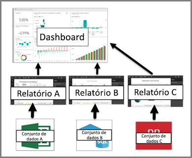

# Dashboards no serviço do Power BI

Um ***dashboard*** do Power BI é uma página única, geralmente chamada de tela, que usa as visualizações para contar uma história. Como ele é limitado a uma página, um dashboard bem projetado contém apenas os elementos mais importantes da história.

Os dashboards são um recurso do serviço do Power BI e não estão disponíveis no Power BI Desktop. Os dashboards não podem ser criados em dispositivos móveis, mas podem ser [exibidos e compartilhados](mobile-apps-view-dashboard.md).

## Criadores de dashboard e consumidores de dashboard
Dependendo da função, você pode ser alguém que cria dashboards para seu próprio uso ou para compartilhar com colegas. As suas informações podem ser encontradas nos **Dashboards para criadores**. Se você for alguém que recebe os dashboards de outras pessoas. Você deseja saber como entender e interagir com o dashboard. Este artigo é para você!

### Se você for receber e consumir dashboards

As visualizações que você vê no dashboard são chamadas de *blocos* e são *fixadas* ao dashboard, de relatórios, por *criadores* de dashboards. Se for novo no Power BI, você poderá obter uma boa base lendo [Conceitos básicos do Power BI](service-basic-concepts.md).

> [!IMPORTANT]
> O [Power BI Pro](service-free-vs-pro.md) é necessário para exibir dashboards compartilhados.

As visualizações em um dashboard vêm de relatórios e cada relatório é baseado em um conjunto de dados. Na verdade, uma maneira de pensar em um dashboard é como uma porta de entrada para os relatórios e os conjuntos de dados subjacentes. Selecionar uma visualização leva você para o relatório (e o conjunto de dados) que foi usado para criá-lo.

## Vantagens dos dashboards
Os dashboards são uma ótima maneira de monitorar seus negócios, procurar respostas e ver todas as métricas mais importantes rapidamente. As visualizações em um dashboard podem vir de um conjunto de dados subjacente, ou de muitos, e de um relatório subjacente, ou de muitos. Dashboards combinam dados locais e na nuvem, proporcionando uma exibição consolidada independentemente de onde os dados residem.

Um dashboard não é apenas uma imagem bonita. Ele é altamente interativo e os blocos são atualizados à medida que os dados subjacentes são alterados.

## Dashboards versus relatórios
Os [relatórios](service-reports.md) costumam ser confundidos com dashboards, pois eles também são telas preenchidas com visualizações. Mas existem algumas grandes diferenças para os consumidores do Power BI.

| **Funcionalidade** | **Dashboards** | **Relatórios** |
| --- | --- | --- |
| Páginas |Uma página |Uma ou mais páginas |
| Fontes de dados |Um ou mais relatórios e um ou mais conjuntos de dados por dashboard |Um único conjunto de dados por relatório |
| Disponível no Power BI Desktop |Não |Sim, ***criadores*** podem criar e exibir relatórios na área de trabalho |
| Assinar |Pode assinar um dashboard |É possível assinar páginas de relatório |
| Filtragem |Não é possível filtrar ou fatiar |Diferentes maneiras de filtrar, realçar e fatiar |
| Em destaque |Pode definir um dashboard como o dashboard "em destaque" |Não é possível criar um relatório em destaque |
| Favorito | Pode definir dashboards como *favoritos* | Pode definir relatórios como *favoritos*
| Definir alertas |Disponível para blocos de dashboard em determinadas circunstâncias |Não está disponível nos relatórios |
| Consultas de linguagem natural |Disponível no dashboard |Não está disponível nos relatórios |
| Pode ver campos e tabelas do conjunto de dados subjacentes |Não. Pode exportar dados, mas não consegue ver tabelas e campos no dashboard de controle em si. |Sim. Pode ver as tabelas de conjunto de dados e os campos e valores. |
| Personalização |Não |No modo de exibição de Leitura, é possível publicar, inserir, filtrar, exportar, baixar como .pbix, exibir conteúdo relacionado, gerar códigos QR, analisar no Excel e muito mais.  |

## Próximas etapas
* Fique à vontade com os dashboards fazendo um tour em um dos nossos [dashboards de exemplo](sample-tutorial-connect-to-the-samples.md).
* Saiba mais sobre [blocos de dashboard](service-dashboard-tiles.md) e o que acontece quando você seleciona um.
* Deseja acompanhar um bloco de dashboard individual e receber um email quando ele alcançar um certo limite? [Criar alertas em blocos](service-set-data-alerts.md).
* Divirta-se fazendo perguntas ao seu dashboard. Aprenda como usar o [Power BI Q&A](power-bi-tutorial-q-and-a.md) para fazer perguntas sobre os dados e receba uma resposta na forma de uma visualização.
