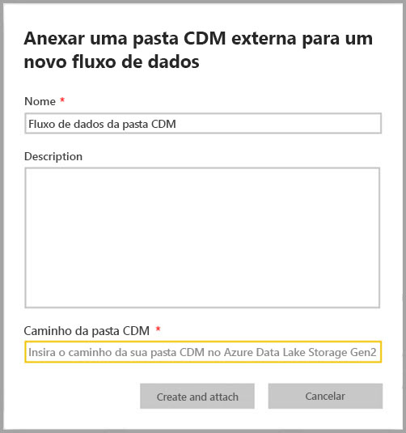
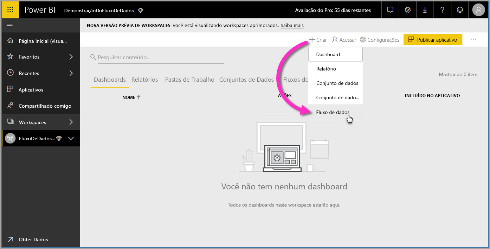
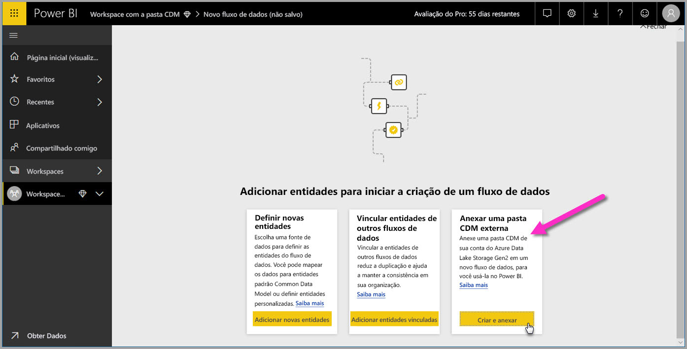
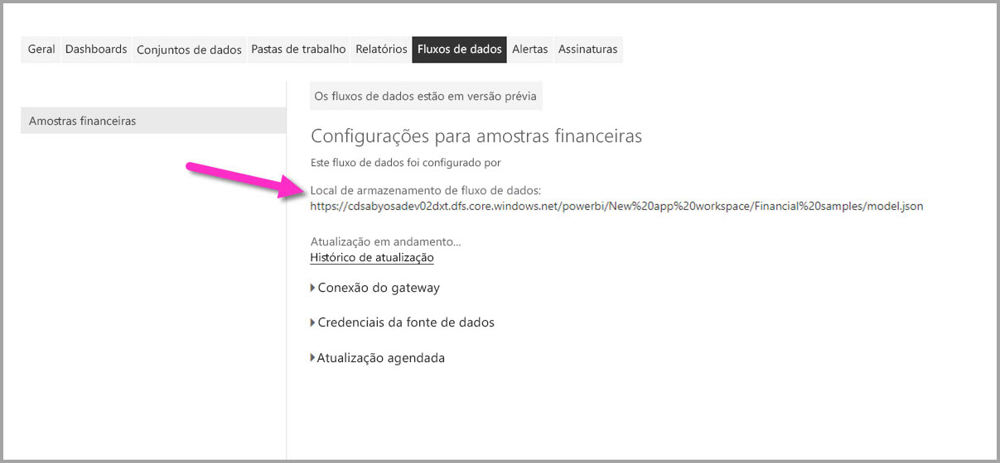

# Adicionar uma pasta do CDM ao Power BI como um fluxo de dados (versão prévia)

No Power BI, você pode adicionar pastas do Common Data Service (CDM) armazenadas no Azure Data Lake Storage Gen2 de sua organização como fluxos de dados. E depois de criar um fluxo de dados de uma pasta do CDM, você pode usar o **Power BI Desktop** e o **serviço do Power BI** para criar conjuntos de dados, relatórios, painéis e aplicativos baseados nos dados que você inseriu em pastas do CDM.

Há alguns requisitos para criar fluxos de dados a partir de pastas do CDM, conforme a lista a seguir descreve:

* A criação de fluxos de dados de pastas do CDM está disponível *somente* na [nova experiência de espaço de trabalho](service-create-the-new-workspaces.md). 
* Adicionar uma pasta do CDM ao Power BI requer que o usuário adicione a pasta para ter [autorização para a pasta do CDM e seus arquivos](https://go.microsoft.com/fwlink/?linkid=2029121).
* Você deve receber permissões de leitura e execução, em todos os arquivos e pastas da pasta do CDM, para adicioná-las ao Power BI.

As seções a seguir descrevem como criar um fluxo de dados de uma pasta do CDM.

## Criar um fluxo de dados de uma pasta do CDM

Para começar a criar um fluxo de dados a partir de uma pasta do CDM, inicie o **serviço do Power BI** e selecione um **espaço de trabalho de aplicativo** no painel de navegação esquerdo. Você também pode criar um novo espaço de trabalho, no qual você pode criar seu novo fluxo de dados.

Na tela exibida, selecione **Criar e anexar**, conforme mostrado na imagem a seguir.

A tela que aparece a seguir permite nomear seu fluxo de dados, fornecer uma descrição do fluxo de dados e fornecer o caminho para a pasta do CDM na conta do Azure Data Lake Gen2 de sua organização. Leia a seção no artigo que descreve [como obter o caminho da pasta do CDM](service-dataflows-configure-workspace-storage-settings.md#get-the-uri-of-stored-dataflow-files). 

Depois de fornecer as informações, selecione **Criar e Anexar** para criar o fluxo de dados.

Os fluxos de dados das pastas do CDM são marcados com o ícone *externo* quando exibidos no Power BI. Na próxima seção, descrevemos as diferenças entre os fluxos de dados padrão e os fluxos de dados criados nas pastas do CDM.

Depois que as permissões estiverem definidas de forma correta, conforme descrito anteriormente neste artigo, você poderá se conectar ao seu fluxo de dados no **Power BI Desktop**.

## Considerações e limitações

Ao trabalhar com permissões para um fluxo de dados criado a partir de uma pasta do CDM, o processo é semelhante às origens de dados externas no Power BI. As permissões são gerenciadas na fonte de dados e não no Power BI. As permissões devem ser definidas adequadamente na própria fonte de dados, como um fluxo de dados criado a partir de uma pasta do CDM, para funcionar corretamente com o Power BI.

As listas a seguir ajudam a esclarecer como os fluxos de dados das pastas do CDM operam com o Power BI.

Os espaços de trabalho do Power BI Pro, Premium e Embedded:
* Os fluxos de dados de pastas do CDM não podem ser editados
* As permissões para ler um fluxo de dados criado a partir de uma pasta do CDM são gerenciadas pelo proprietário da pasta do CDM e não pelo Power BI

Power BI Desktop:
* Somente usuários autorizados para o espaço de trabalho no qual o fluxo de dados foi criado e a pasta do CDM podem acessar seus dados do conector do Power BI Dataflows

Existem algumas considerações adicionais também, descritas na lista a seguir:

* A criação de fluxos de dados de pastas do CDM está disponível *somente* na [nova experiência de espaço de trabalho](service-create-the-new-workspaces.md)
* As entidades vinculadas não estão disponíveis para fluxos de dados criados a partir de pastas do CDM

Os clientes do **Power BI Desktop** não podem acessar os fluxos de dados armazenados na conta do Azure Data Lake Storage Gen2, a menos que sejam os proprietários do fluxo de dados ou tenham sido explicitamente autorizados na pasta do CDM do fluxo de dados. Considere a seguinte situação:

1.  Brenda cria um novo espaço de trabalho do aplicativo e o configura para armazenar fluxos de dados de uma pasta do CDM.
2.  Davi, que também é membro do espaço de trabalho criado por Brenda, deseja usar o Power BI Desktop e o conector de fluxo de dados para obter dados do fluxo de dados criado por Brenda.
3.  Davi recebe um erro porque não foi adicionado como usuário autorizado à pasta do CDM do fluxo de dados no data lake.

    

Para resolver esse problema, o Davi deve receber permissões de leitura para a pasta do CDM e seus arquivos. Você pode saber mais sobre como conceder acesso à pasta do CDM [neste artigo](https://go.microsoft.com/fwlink/?linkid=2029121).

## Próximas etapas

Este artigo forneceu diretrizes sobre como configurar o armazenamento de espaço de trabalho para fluxos de dados. Para saber mais, confira os seguintes artigos:

Para saber mais sobre fluxos de dados, CDM e o Azure Data Lake Storage Gen2, confira os seguintes artigos:

* [Integração entre fluxos de dados e o Azure Data Lake (versão prévia)](service-dataflows-azure-data-lake-integration.md)
* [Definir configurações de fluxo de dados de espaço de trabalho (versão prévia)](service-dataflows-configure-workspace-storage-settings.md)
* [Conectar-se ao Azure Data Lake Storage Gen2 para armazenamento de fluxo de dados (versão prévia)](service-dataflows-connect-azure-data-lake-storage-gen2.md)

Para saber mais sobre fluxos de dados em geral, confira estes artigos:

* [Criação e uso de fluxos de dados no Power BI](service-dataflows-create-use.md)
* [Usando entidades computadas no Power BI Premium](service-dataflows-computed-entities-premium.md)
* [Usando fluxos de dados com fontes de dados locais](service-dataflows-on-premises-gateways.md)
* [Recursos do desenvolvedor para fluxos de dados do Power BI](service-dataflows-developer-resources.md)

Para saber mais sobre o armazenamento do Azure, você pode ler estes artigos:
* [Guia de segurança do Armazenamento do Microsoft Azure](https://docs.microsoft.com/azure/storage/common/storage-security-guide)
* [Configuração de atualização agendada](refresh-scheduled-refresh.md)
* [Introdução às amostras do github do Serviços de Dados do Azure](https://aka.ms/cdmadstutorial)

Leia este artigo de visão geral para saber mais sobre o Common Data Service:
* [Common Data Service - visão geral ](https://docs.microsoft.com/powerapps/common-data-model/overview)
* [Pastas do CDM](https://go.microsoft.com/fwlink/?linkid=2045304)
* [Definição de arquivo de modelo do CDM](https://go.microsoft.com/fwlink/?linkid=2045521)

E você pode sempre tentar [fazer perguntas à Comunidade do Power BI](http://community.powerbi.com/).

