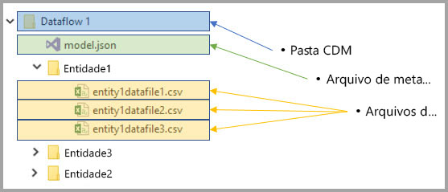
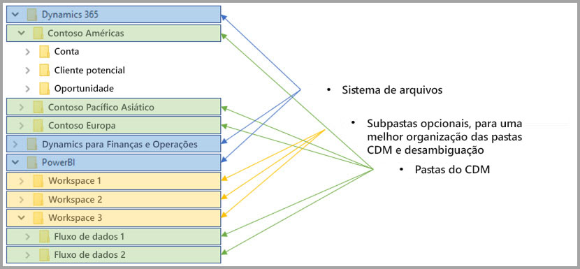

# Integração entre fluxos de dados e o Azure Data Lake (versão prévia)

Por padrão, os dados usados com o Power BI são armazenados no armazenamento interno fornecido pelo Power BI. Com a integração de fluxos de dados e o Azure Data Lake Storage Gen2 (ADLS Gen2), você pode armazenar seus fluxos de dados na conta do Azure Data Lake Storage Gen2 da sua organização. 

> [!NOTE]
> A funcionalidade de fluxo de dados está em versão prévia e está sujeita a alterações e atualizações antes da disponibilidade geral.

## Como as pastas do CDM se relacionam com os fluxos de dados

Com os **fluxos de dados**, usuários e organizações podem unificar dados de diferentes fontes e prepará-los para serem modelados. Com o Common Data Model (CDM), as organizações podem usar um formato de dados que fornece consistência semântica entre aplicativos e implantações. E, com o Azure Data Lake Storage gen2 (ADLS Gen2), um controle refinado de acesso e autorização pode ser aplicado a data lakes no Azure. Quando combinados, esses elementos fornecem dados centralizados atrativos, dados estruturados, controle de acesso refinado e consistência semântica para aplicativos e iniciativas em toda a empresa.

Dados armazenados no formato CDM fornecem consistência semântica entre aplicativos e implantações em uma organização. Com a integração do CDM com o ADLS Gen2, a mesma consistência estrutural e significado semântico podem ser aplicados aos dados armazenados (ADLS Gen2) usando pastas do CDM que contêm dados esquematizados no formato CDM padrão. Os metadados padronizados e os dados autodescritivos em um Azure Data Lake facilitam a descoberta de metadados, bem como a interoperação entre produtores e consumidores de dados, como Power BI, Azure Data Factory, Azure Data Lake, Databricks e Azure Machine Learning (ML). 

Os fluxos de dados armazenam seus dados e definição em pastas do CDM nos seguintes formatos:

**Model.json**
* O arquivo de descrição de metadados **Model.json** contém informações semânticas sobre registros e atributos de entidades, bem como links para arquivos de dados subjacentes. A existência do arquivo model.json indica a conformidade com o formato de metadados CDM e pode incluir entidades padrão que contêm metadados semânticos prontos e avançados adicionais que os aplicativos podem usar.
* O Power BI também armazena informações de cada fonte de dados junto com **a consulta e as transformações** geradas pela experiência do Editor de fluxo de dados no serviço do Power BI. As senhas para fontes de dados não são armazenadas no arquivo de modelo.

**Arquivos de dados**
* Os arquivos de dados são incluídos na pasta do CDM em estrutura e formato bem definidos (subpastas são opcionais, conforme descrito mais adiante neste artigo) e referenciados no arquivo model.json. Atualmente, os arquivos de dados devem estar no formato. csv, mas formatos adicionais podem ter suporte nas atualizações posteriores. 

O diagrama a seguir mostra uma pasta de exemplo do CDM, criada por um fluxo de dados do Power BI, que contém três entidades:

O arquivo de metadados ou model.json na imagem anterior forneceria ponteiros para os arquivos de dados de entidade em toda a pasta do CDM.

## O Power BI organiza pastas do CDM no data lake

Com os fluxos de dados do Power BI e sua integração com o ADLS Gen2, o Power BI pode produzir dados em um data lake. Como um produtor de dados, o Power BI deve criar uma pasta do CDM para cada fluxo de dados que contém o arquivo model.json e seus arquivos de dados associados. O Power BI armazena seus dados isolados de outros produtores de dados no data lake usando *sistemas de arquivos*. Você pode ler mais sobre o sistema de arquivos e namespace hierárquico do Azure Data Lake Storage Gen2 no [artigo que os descreve](https://docs.microsoft.com/azure/storage/data-lake-storage/namespace).

O Power BI usa subpastas para fazer a desambiguidade e fornecer uma melhor organização dos dados quando apresentado no **serviço do Power BI**. A nomenclatura e estrutura das pastas representam espaços de trabalho (pastas) e fluxos de dados (pastas do CDM). O diagrama a seguir mostra como um data lake compartilhado pelo Power BI e por outros produtores de dados pode ser estruturado. Cada serviço, no caso o Dynamics 365, Dynamics para Finanças e Operações e o Power BI, cria e mantém seu próprio sistema de arquivos. Dependendo da experiência em cada serviço, as subpastas são criadas para organizar melhor as pastas do CDM dentro do sistema de arquivos. 

## O Power BI protege os dados no data lake

O Power BI usa tokens de *portador OAuth do Active Directory* e funcionalidade *ACLs POSIX* fornecida pelo Azure Data Lake Storage Gen2. Esses recursos permitem definir o escopo do acesso do Power BI ao sistema de arquivos que ele gerencia no data lake, além de definir o escopo do acesso das pessoas somente aos fluxos de dados ou às pastas do CDM que elas criam. 

Para criar e gerenciar pastas do CDM no sistema de arquivos do Power BI, são necessárias permissões de leitura, gravação e execução no sistema de arquivos. Cada fluxo de dados criado no Power BI é armazenado em sua própria pasta do CDM, e o proprietário do fluxo de dados recebe acesso somente leitura à pasta do CDM e seu conteúdo. Essa abordagem protege a integridade dos dados do Power BI gera e fornece aos administradores a capacidade de monitorar quais usuários acessaram na pasta do CDM usando logs de auditoria. 

### Autorização de usuários ou serviços para pastas do CDM

O compartilhamento de pastas do CDM com consumidores de dados, como usuários ou serviços que precisam ler os dados, é simplificado com os tokens de portador de OAuth do Active Directory e as ACLs POSIX. Isso fornece aos administradores a capacidade de monitorar quem acessou a pasta do CDM. A única ação necessária é conceder acesso a um objeto do Active Directory de sua escolha (como um grupo de usuários ou serviço) à pasta do CDM. É recomendável que todo o acesso à pasta do CDM, para qualquer identidade que não seja o produtor de dados, seja concedido como somente leitura. Isso protege a integridade dos dados que o produtor gera.

Para adicionar pastas do CDM ao Power BI, o usuário que está adicionando a pasta do CDM deve ter ACLs de acesso *Ler* na pasta do CDM e em quaisquer arquivos ou pastas dentro dela. Além disso, ACLs de acesso *Executar* na pasta do CDM e em quaisquer pastas dentro dela. É recomendado conferir os artigos [Listas de controle de acesso nos arquivos e diretórios](https://docs.microsoft.com/azure/storage/blobs/data-lake-storage-access-control#access-control-lists-on-files-and-directories) e [Práticas recomendadas para usar o Azure Data Lake Storage Gen2](https://docs.microsoft.com/azure/storage/blobs/data-lake-storage-best-practices) para obter mais informações.

### Formas alternativas de autorização

Pessoas ou serviços fora do Power BI também podem usar formas alternativas de autorização. Essas alternativas permitem que os detentores do acesso principal a  *todos* os recursos da conta tenham acesso total a todos os recursos do lake e não possam ter o escopo definido para sistemas de arquivos ou pastas do CDM. Essas alternativas podem ser formas simples de conceder acesso, mas limitam a capacidade de compartilhar recursos específicos no data lake e não fornecem aos usuários uma auditoria sobre quem acessou o armazenamento. Detalhes completos dos esquemas de autorização disponíveis são fornecidos no [artigo Controle de acesso no Azure Data Lake Storage Gen2](https://docs.microsoft.com/azure/storage/blobs/data-lake-storage-access-control
).

## Próximas etapas

Este artigo forneceu uma visão geral da integração de fluxos de dados do Power BI, de pastas do CDM e do Azure Data Lake Storage Gen2. Para saber mais, confira os seguintes artigos:

Para saber mais sobre fluxos de dados, CDM e o Azure Data Lake Storage Gen2, confira os seguintes artigos:

* [Definir configurações de fluxo de dados de espaço de trabalho (versão prévia)](service-dataflows-configure-workspace-storage-settings.md)
* [Adicionar uma pasta do CDM ao Power BI como um fluxo de dados (versão prévia)](service-dataflows-add-cdm-folder.md)
* [Conectar-se ao Azure Data Lake Storage Gen2 para armazenamento de fluxo de dados (versão prévia)](service-dataflows-connect-azure-data-lake-storage-gen2.md)

Para saber mais sobre fluxos de dados em geral, confira estes artigos:

* [Criação e uso de fluxos de dados no Power BI](service-dataflows-create-use.md)
* [Uso de entidades computadas no Power BI Premium (versão prévia)](service-dataflows-computed-entities-premium.md)
* [Uso de fluxos de dados com fontes de dados locais (versão prévia)](service-dataflows-on-premises-gateways.md)
* [Recursos de desenvolvedor para fluxos de dados do Power BI (versão prévia)](service-dataflows-developer-resources.md)

Para saber mais sobre o armazenamento do Azure, você pode ler estes artigos:
* [Guia de segurança do Armazenamento do Microsoft Azure](https://docs.microsoft.com/azure/storage/common/storage-security-guide)
* [Introdução às amostras do github do Serviços de Dados do Azure](https://aka.ms/cdmadstutorial)

Leia este artigo de visão geral para saber mais sobre o Common Data Service:
* [Common Data Service - visão geral ](https://docs.microsoft.com/powerapps/common-data-model/overview)
* [Pastas do CDM](https://go.microsoft.com/fwlink/?linkid=2045304)
* [Definição de arquivo de modelo do CDM](https://go.microsoft.com/fwlink/?linkid=2045521)

E você pode sempre tentar [fazer perguntas à Comunidade do Power BI](http://community.powerbi.com/).
