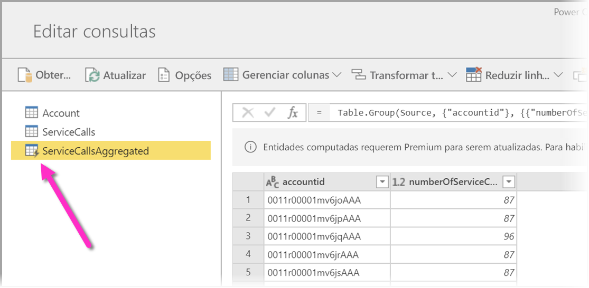
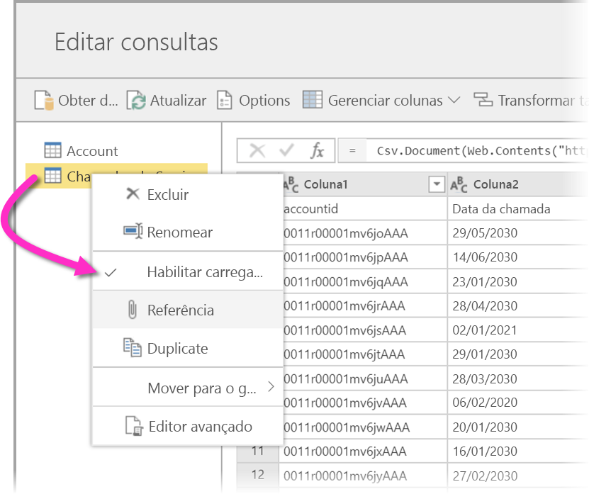
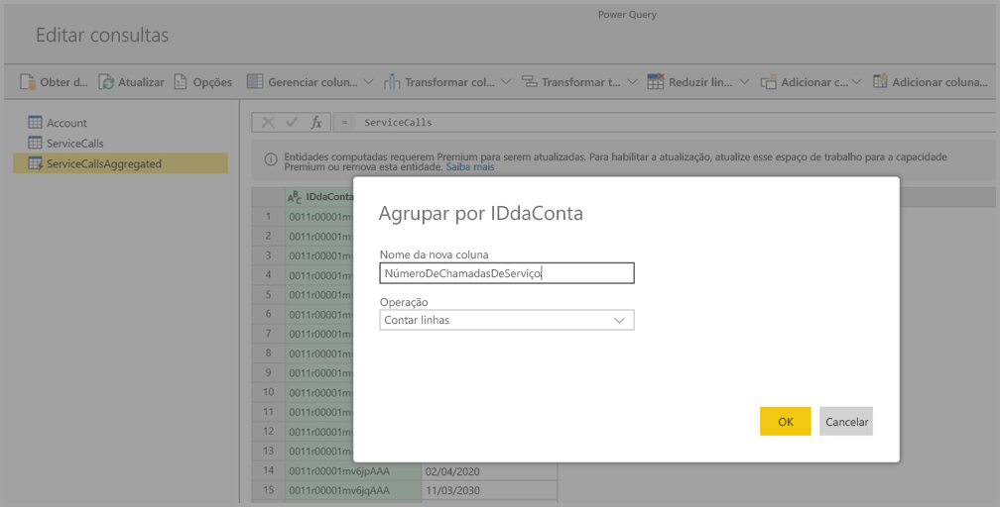
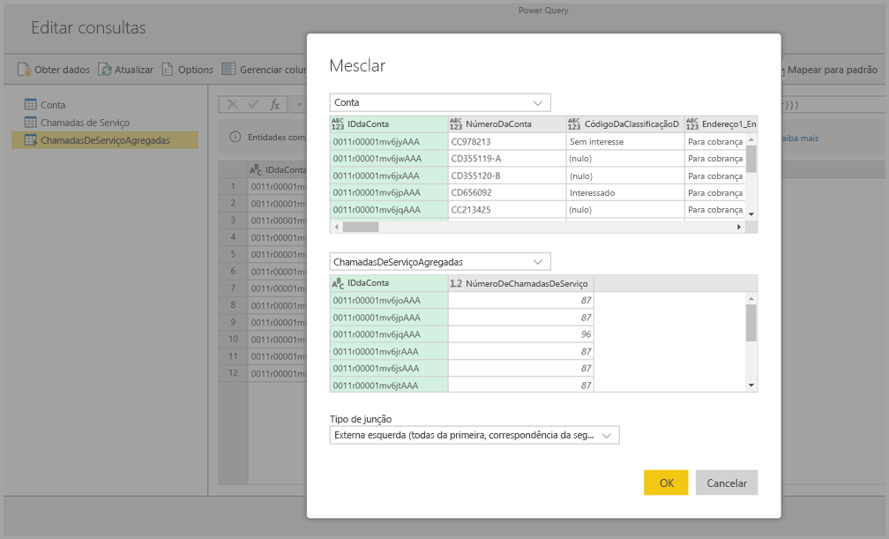
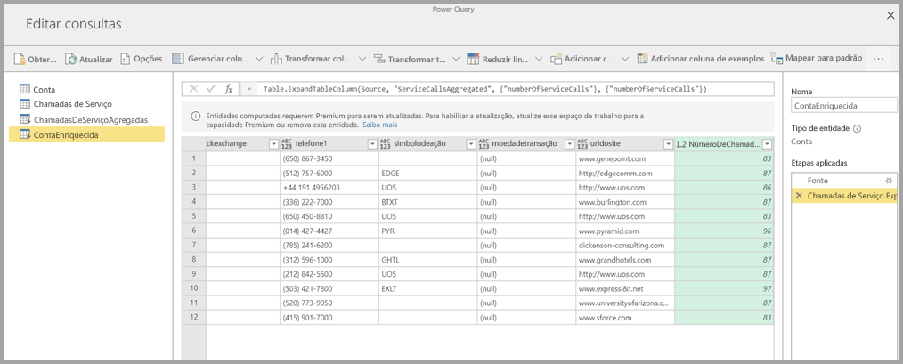

# Uso de entidades computadas no Power BI Premium (versão prévia)

Você pode executar **cálculos em armazenamento** ao usar **fluxos de dados** com uma assinatura do Power BI Premium. Isso permite que você realize cálculos em seus fluxos de dados existentes e retorne resultados que permitem que você se concentre na criação e na análise de relatórios. 

Para executar **cálculos em armazenamento**, primeiro você deve criar o fluxo de dados e trazer dados para esse armazenamento de fluxo de dados do Power BI. Depois de ter um fluxo de dados que contém dados, você pode criar **entidades computadas**, que são entidades que executam cálculos em armazenamento. 

Há duas maneiras de conectar dados do fluxo de dados ao Power BI:

* [Usar a criação de autoatendimento de um fluxo de dados](service-dataflows-create-use.md)
* Usar um fluxo de dados externo

As seções a seguir descrevem como criar entidades computadas em seus dados do fluxo de dados.

> [!NOTE]
> A funcionalidade de fluxo de dados está em versão prévia e está sujeita a alterações e atualizações antes da disponibilidade geral.

## Como criar entidades computadas 

Depois de ter um fluxo de dados com uma lista de entidades, você pode executar cálculos nessas entidades.

Na ferramenta de criação de fluxo de dados no serviço do Power BI, selecione **Editar Entidades** e, em seguida, clique com o botão direito na entidade que você deseja usar como base para sua entidade computada e na qual deseja realizar cálculos. No menu de contexto, escolha **Referência**.

Para que a entidade seja elegível como uma entidade computada, a seleção **Habilitar Carregamento** deve ser selecionada, conforme mostrado na imagem a seguir. Clique com o botão direito do mouse na entidade para exibir este menu de contexto.

Ao selecionar **Habilitar Carregamento**, você cria uma nova entidade para a qual sua fonte é a entidade referenciada. O ícone é alterado e mostra o ícone **Computado**, conforme mostrado na imagem a seguir.

Qualquer transformação realizada nessa entidade recém-criada será executada nos dados que já residem no armazenamento de fluxo de dados do Power BI. Isso significa que a consulta não será executada na fonte de dados externa da qual os dados foram importados (por exemplo, o banco de dados SQL do qual os dados foram obtidos), mas sim nos dados que residem no armazenamento do fluxo de dados.

### Exemplo de casos de uso
Que tipo de transformações podem ser realizadas com entidades computadas? Qualquer transformação que você especifica normalmente usando a interface do usuário de transformação no Power BI ou no editor M tem suporte ao executar a computação no armazenamento. 

Considere o seguinte exemplo: você tem uma entidade *Conta* que contém os dados brutos para todos os clientes da sua assinatura do Dynamics 365. Você também tem dados brutos de *ServiceCalls* do Centro de Serviços, com dados das chamadas de suporte que foram executadas na conta diferente em cada dia do ano.

Imagine que você queira enriquecer a entidade *Conta* com dados das *ServiceCalls*. 

Primeiro, você precisaria agregar os dados das ServiceCalls para calcular o número de chamadas de suporte que foram feitas para cada conta no último ano. 

Você mesclaria a entidade *Conta* com a entidade *ServiceCallsAggregated* para calcular a tabela **Conta** enriquecida.

E, em seguida, você pode ver os resultados, mostrados como *EnrichedAccount* na imagem a seguir.

E é isso — a transformação é executada nos dados no fluxo de dados que residem na assinatura do Power BI Premium, não nos dados de fonte.

## Considerações e limitações

É importante observar que, se você remover o espaço de trabalho da capacidade do Power BI Premium, o fluxo de dados associado não será mais atualizado. 

Ao trabalharem com fluxos de dados criados especificamente em uma conta do Azure Data Lake Storage Gen2 da organização, entidades vinculadas e entidades computadas só funcionam corretamente quando residem na mesma conta de armazenamento. Par obter mais informações, confira [Conectar-se ao Azure Data Lake Storage Gen2 para armazenamento de fluxo de dados (versão prévia)](service-dataflows-connect-azure-data-lake-storage-gen2.md).

Além disso, entidades vinculadas não estão disponíveis para fluxos de dados criados a partir de pastas do CDM. Confira [Adicionar uma pasta do CDM ao Power BI como um fluxo de dados (versão prévia)](service-dataflows-add-cdm-folder.md).

## Próximas etapas

Este artigo descreveu entidades e fluxos de dados computacionais disponíveis no serviço do Power BI. Confira outros artigos que podem ser úteis.

* [Preparação de dados de autoatendimento com fluxos de dados](service-dataflows-overview.md)
* [Criação e uso de fluxos de dados no Power BI](service-dataflows-create-use.md)
* [Uso de fluxos de dados com fontes de dados locais (versão prévia)](service-dataflows-on-premises-gateways.md)
* [Recursos de desenvolvedor para fluxos de dados do Power BI (versão prévia)](service-dataflows-developer-resources.md)
* [Definir configurações de fluxo de dados de espaço de trabalho (versão prévia)](service-dataflows-configure-workspace-storage-settings.md)
* [Adicionar uma pasta do CDM ao Power BI como um fluxo de dados (versão prévia)](service-dataflows-add-cdm-folder.md)
* [Conectar-se ao Azure Data Lake Storage Gen2 para armazenamento de fluxo de dados (versão prévia)](service-dataflows-connect-azure-data-lake-storage-gen2.md)

Confira mais informações sobre o Power Query e a atualização agendada nestes artigos:
* [Visão geral da Consulta no Power BI Desktop](desktop-query-overview.md)
* [Configuração de atualização agendada](refresh-scheduled-refresh.md)

Leia este artigo de visão geral para saber mais sobre o Common Data Service:
* [Common Data Service - visão geral ](https://docs.microsoft.com/powerapps/common-data-model/overview)

