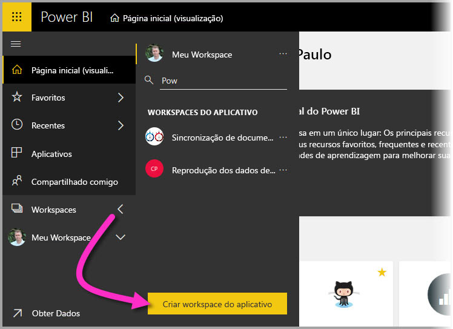
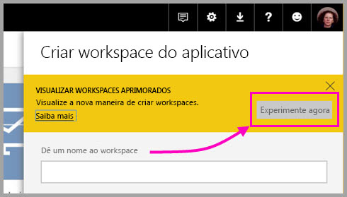
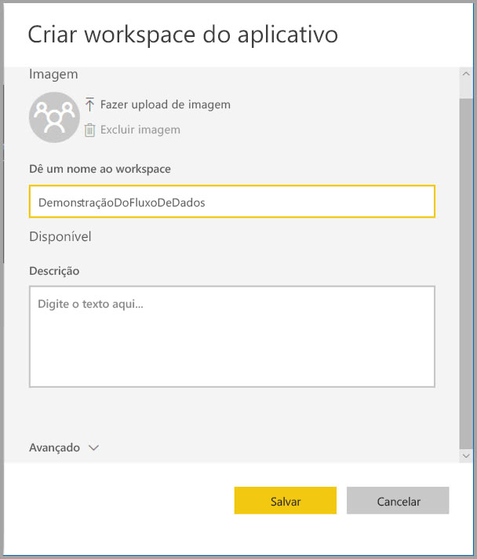
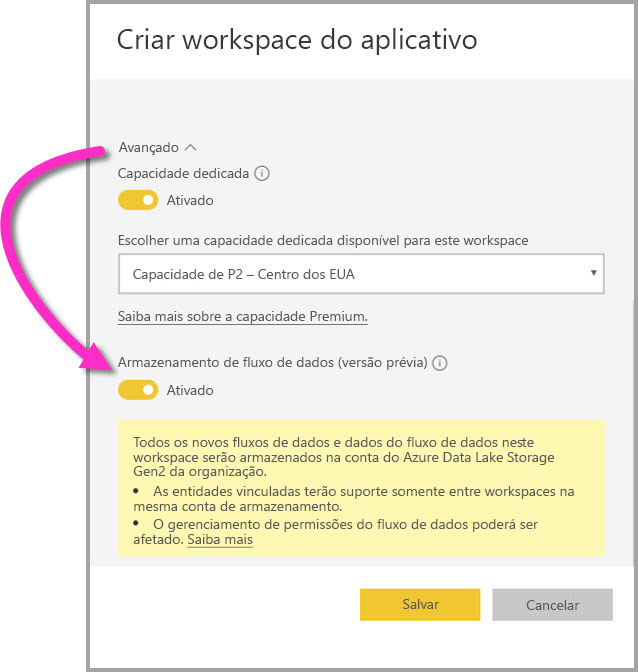
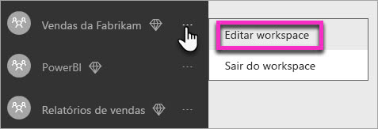
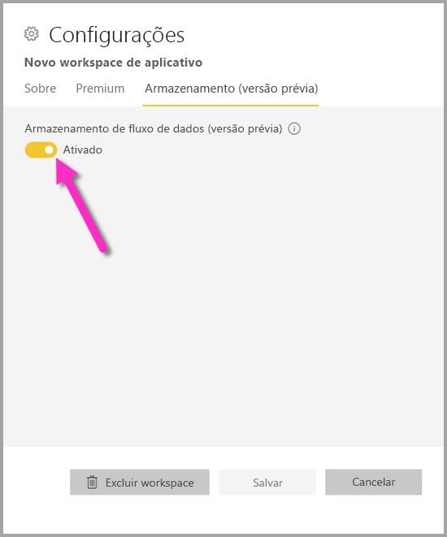
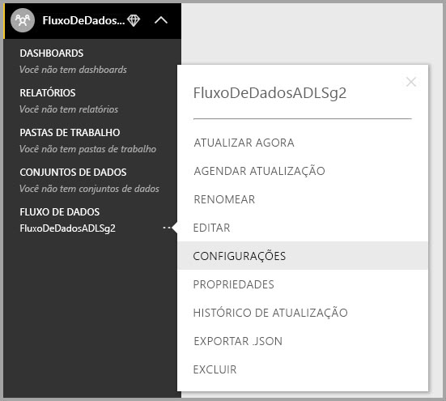

# Definir configurações de fluxo de dados de espaço de trabalho (versão prévia)

Com o Power BI e os fluxos de dados, você pode armazenar um arquivo de definição de fluxo de dados e arquivos de dados de um espaço de trabalho em sua conta do Azure Data Lake Storage Gen2. Os administradores de espaço de trabalho podem configurar o Power BI para fazer isso, e este artigo explica as etapas necessárias para chegar lá. 

Antes de configurar o local de armazenamento de fluxo de dados do espaço de trabalho, administrador global da sua empresa deve conectar a conta de armazenamento da sua organização ao Power BI e habilitar as permissões de atribuição de armazenamento para essa conta de armazenamento. *[Conectar-se ao Azure Data Lake Storage Gen2 para armazenamento de fluxo de dados (versão prévia)](service-dataflows-connect-azure-data-lake-storage-gen2.md)* 

Há duas maneiras de definir as configurações de armazenamento de fluxo de dados do espaço de trabalho: 

* Durante a criação do espaço de trabalho
* Editando um espaço de trabalho existente

Vamos dar uma olhada em cada uma nas seções a seguir. 

> [!IMPORTANT]
> A configuração de armazenamento de fluxo de dados do espaço de trabalho só poderá ser alterada se o espaço de trabalho não contiver um fluxo de dados. Além disso, esse recurso está disponível somente na nova experiência de espaço de trabalho. Você pode aprender mais sobre o novo espaço de trabalho no artigo [Criar novos espaços de trabalho (versão prévia) no Power BI](service-create-the-new-workspaces.md).

## Criar um novo espaço de trabalho, configurar seu armazenamento de fluxo de dados

Para criar um novo espaço de trabalho de aplicativo no serviço do Power BI, selecione **espaços de trabalho > Criar espaço de trabalho de aplicativo**.

Na caixa de diálogo do espaço de trabalho Criar um aplicativo, uma caixa amarela pode ser exibido, intitulada **Visualizar espaços de trabalho aprimorados**. Nessa área, selecione **Experimente agora**.

Na caixa de diálogo exibida, você pode dar um nome exclusivo seu novo espaço de trabalho. Não selecione **Salvar** ainda, pois você precisa fazer configurações avançadas.

Em seguida, expanda a área **Avançado** da caixa de diálogo **Criar um espaço de trabalho de aplicativo**, em que você pode ativar a configuração **Armazenamento de fluxo de dados (versão prévia)** .

Selecione **Salvar** para criar o novo espaço de trabalho. Qualquer fluxo de dados novo criado nesse espaço de trabalho agora armazena seu arquivo de definição (o arquivo Model.json) e os dados da conta do Azure Data Lake Storage Gen2 da sua organização. 

## Atualizar o armazenamento de fluxo de dados para um espaço de trabalho

Como alternativa à criação um novo espaço de trabalho, você pode atualizar um espaço de trabalho existente para armazenar o arquivo de definição e os dados na conta do Azure Data Lake Storage Gen2 da sua organização. Lembre-se de que a configuração de armazenamento de fluxo de dados só poderá ser alterada se o espaço de trabalho já não contiver um fluxo de dados.

Para editar um espaço de trabalho de aplicativo, selecione as reticências **(...)**  e, em seguida, selecione **Editar espaço de trabalho**. 

Na janela **Editar espaço de trabalho** exibida, expanda **Avançado**, depois ative o **armazenamento de fluxo de dados (versão prévia)** definindo como **Ativado**. 

Depois, **Salvar**, e qualquer fluxo de dados novo criado nesse espaço de trabalho agora armazena seu arquivo de definição e os dados da conta do Azure Data Lake Storage Gen2 da sua organização.

## Obter o URI de arquivos de fluxo de dados armazenados

Depois de criar um fluxo de dados em um espaço de trabalho atribuído à conta do Azure Data Lake da sua organização, você pode acessar seus arquivos de definição e de dados diretamente. A localização deles está disponível na página **Configurações de fluxo de dados**. Para chegar lá, siga estas etapas:

Selecione as reticências **(...)**  ao lado de um fluxo de dados listado em **Fluxos de dados** no espaço de trabalho. No menu que aparece, selecione **Configurações**.

Nas informações exibidas, o local da pasta do CDM do fluxo de dados aparece em **Local de armazenamento do fluxo de dados**, conforme mostrado na imagem a seguir.

> [!NOTE]
> O Power BI configura o proprietário do fluxo de dados com permissões de leitura para a pasta do CDM onde os arquivos de fluxo de dados são armazenados. Conceder acesso a outras pessoas ou serviços para o local de armazenamento do fluxo de dados exige que o proprietário da conta de armazenamento conceda acesso no Azure.

## Considerações e limitações

Determinados recursos de fluxo de dados não são compatíveis quando o armazenamento de fluxo de dados está no Azure Data Lake Storage Gen2: 

espaços de trabalho do Power BI Pro, Premium e Embedded:
* O recurso **entidades vinculadas** só tem suporte somente entre espaços de trabalho na mesma conta de armazenamento
* Permissões de espaço de trabalho não se aplicam a fluxos de dados armazenados no Azure Data Lake Storage Gen2; somente o proprietário do fluxo de dados pode acessá-lo.
* Caso contrário, todos os recursos de preparação de dados são os mesmos para fluxos de dados no armazenamento do Power BI

Existem algumas considerações adicionais também, descritas na lista a seguir:

* Depois que um local de armazenamento de fluxo de dados for configurado, ele não poderá ser alterado.
* Somente o proprietário de um fluxo de dados armazenado no Azure Data Lake Storage Gen2 pode acessar seus dados.
* Não há suporte para fontes de dados local, em capacidades compartilhadas do Power BI, em fluxos de dados armazenados no Azure Data Lake Storage Gen2 da sua organização.

Os clientes do **Power BI Desktop** não podem acessar os fluxos de dados armazenados na conta do Azure Data Lake Storage Gen2, a menos que sejam os proprietários do fluxo de dados. Considere a seguinte situação:

1.  Brenda cria um novo espaço de trabalho do aplicativo e o configura para armazenar fluxos de dados no data lake da organização.
2.  Davi, que também é membro do espaço de trabalho criado por Brenda, deseja usar o Power BI Desktop e o conector de fluxo de dados para obter dados do fluxo de dados criado por Brenda.
3.  Davi recebe um erro porque não foi adicionado como usuário autorizado à pasta do CDM do fluxo de dados no data lake.

    

## Próximas etapas

Este artigo forneceu diretrizes sobre como configurar o armazenamento de espaço de trabalho para fluxos de dados. Para saber mais, confira os seguintes artigos:

Para saber mais sobre fluxos de dados, CDM e o Azure Data Lake Storage Gen2, confira os seguintes artigos:

* [Integração entre fluxos de dados e o Azure Data Lake (versão prévia)](service-dataflows-azure-data-lake-integration.md)
* [Adicionar uma pasta do CDM ao Power BI como um fluxo de dados (versão prévia)](service-dataflows-add-cdm-folder.md)
* [Conectar-se ao Azure Data Lake Storage Gen2 para armazenamento de fluxo de dados (versão prévia)](service-dataflows-connect-azure-data-lake-storage-gen2.md)

Para saber mais sobre fluxos de dados em geral, confira estes artigos:

* [Criação e uso de fluxos de dados no Power BI](service-dataflows-create-use.md)
* [Uso de entidades computadas no Power BI Premium (versão prévia)](service-dataflows-computed-entities-premium.md)
* [Uso de fluxos de dados com fontes de dados locais (versão prévia)](service-dataflows-on-premises-gateways.md)
* [Recursos de desenvolvedor para fluxos de dados do Power BI (versão prévia)](service-dataflows-developer-resources.md)

Para saber mais sobre o armazenamento do Azure, você pode ler estes artigos:

* [Guia de segurança do Armazenamento do Microsoft Azure](https://docs.microsoft.com/azure/storage/common/storage-security-guide)
* [Introdução às amostras do github do Serviços de Dados do Azure](https://aka.ms/cdmadstutorial)

Leia este artigo de visão geral para saber mais sobre o Common Data Service:

* [Common Data Service - visão geral ](https://docs.microsoft.com/powerapps/common-data-model/overview)
* [Pastas do CDM](https://go.microsoft.com/fwlink/?linkid=2045304)
* [Definição de arquivo de modelo do CDM](https://go.microsoft.com/fwlink/?linkid=2045521)

E você pode sempre tentar [fazer perguntas à Comunidade do Power BI](http://community.powerbi.com/).
