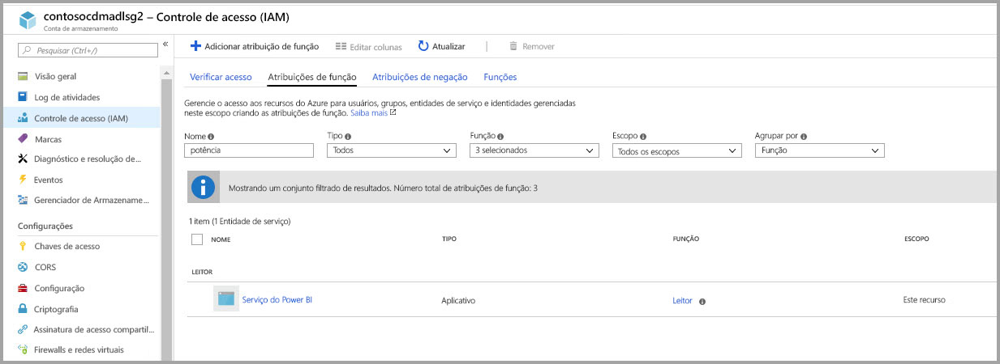
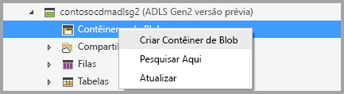
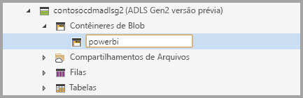
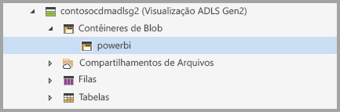
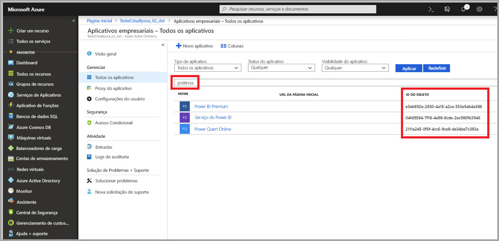
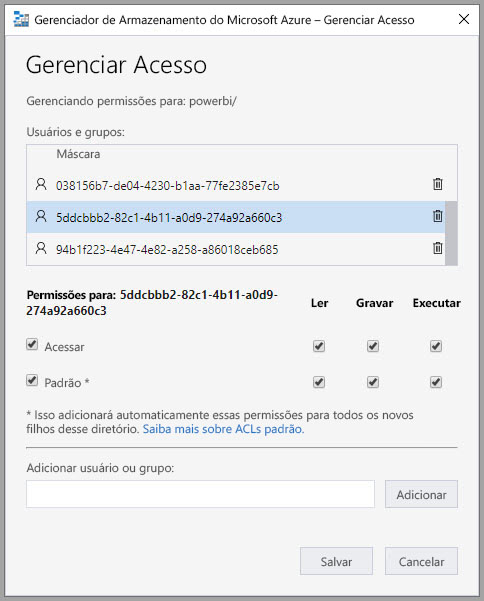
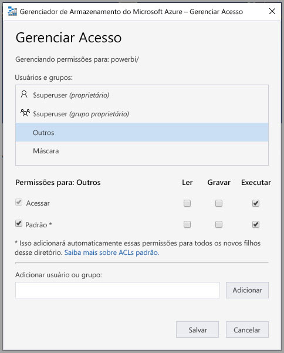
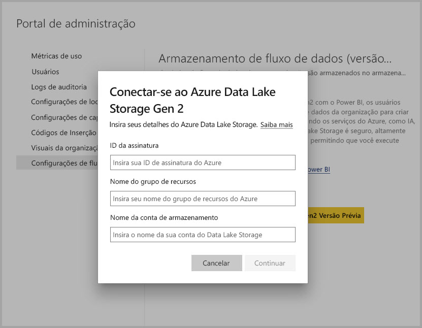
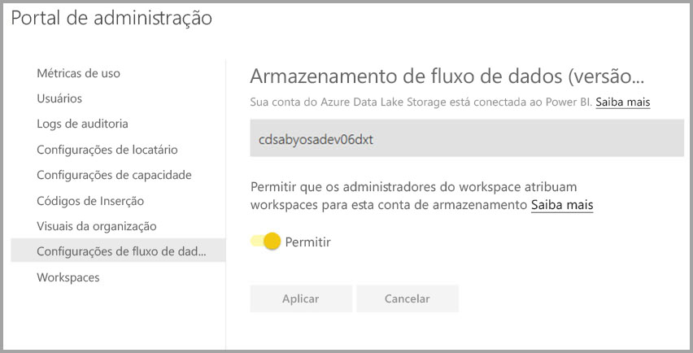

# Conectar-se ao Azure Data Lake Storage Gen2 para armazenamento de fluxo de dados (versão prévia)

Você pode configurar os workspaces do Power BI para armazenar fluxos de dados na conta do Azure Data Lake Storage Gen2 da sua organização. Este artigo descreve as etapas gerais necessárias para fazer isso e fornece diretrizes e práticas recomendadas ao longo do caminho. Há algumas vantagens em configurar espaços de trabalho para armazenar definições de fluxo de dados e arquivos de dados no data lake, incluindo as seguintes:

* O Azure Data Lake Storage Gen2 fornece um local de armazenamento extremamente escalonável para os dados
* Os arquivos de definição e de dados de fluxo de dados podem ser usados pelos desenvolvedores de seu departamento de TI para aproveitar os serviços de inteligência artificial (IA) e dados do Azure, conforme demonstrado nas [amostras do github do Serviços de Dados do Azure](https://aka.ms/cdmadstutorial)
* Permite que os desenvolvedores na sua organização integrem dados de fluxo de dados a aplicativos internos e soluções de linha de negócios, usando recursos de desenvolvedor para fluxos de dados e Azure

Para usar o Azure Data Lake Storage Gen2 para fluxo de dados, é necessário o seguinte:

* **Locatário do Power BI:** pelo menos uma conta no seu locatário do AAD (Azure Active Directory) precisa estar inscrita no Power BI
* **Uma conta de administrador global:** essa conta é necessária para conectar e configurar o Power BI para armazenar a definição e os dados de fluxo de dados na sua conta do Azure Data Lake Storage Gen2
* **Uma assinatura do Azure:** você precisa de uma assinatura do Azure para usar o Azure Data Lake Storage Gen2
* **Grupo de recursos:** use um grupo de recursos que você já tem ou crie um novo
* **Uma conta de armazenamento do Azure com o Data Lake Storage Gen2 (versão prévia) habilitado:** para se conectar ao Azure Data Lake Storage Gen2, você precisa se inscrever na versão prévia pública dele

> [!TIP]
> Se você não tiver uma assinatura do Azure, crie uma [conta gratuita](https://azure.microsoft.com/free/) antes de começar.

## Preparar seu Azure Data Lake Storage Gen2 para o Power BI

Antes de configurar o Power BI com uma conta do Azure Data Lake Storage Gen2, você deve criar e configurar uma conta de armazenamento. Vamos examinar os requisitos para o Power BI:

1. A conta de armazenamento deve ser criada no mesmo locatário do AAD que seu locatário do Power BI.
2. A conta de armazenamento deve ser criada na mesma região do AAD que seu locatário do Power BI. Para determinar onde seu locatário do Power BI está localizado, confira o artigo [Onde meu locatário do Power BI está localizado](service-admin-where-is-my-tenant-located.md).
3. A conta de armazenamento deve ter o recurso *Namespace hierárquico* habilitado.
4. O serviço do Power BI deve ter uma função de *Leitor* na conta de armazenamento.
5. Um sistema de arquivos denominado **powerbi** deve ser criado.
6. Os serviços do Power BI devem estar autorizados para o sistema de arquivos **powerbi** criado.

As seções a seguir percorrem as etapas necessárias para configurar sua conta do Azure Data Lake Storage Gen2 detalhadamente.

> [!NOTE]
> A funcionalidade de fluxo de dados está em versão prévia e está sujeita a alterações e atualizações antes da disponibilidade geral.

### Criar a conta de armazenamento

Siga as etapas do artigo [Criar uma conta de armazenamento do Azure Data Lake Storage Gen2](https://docs.microsoft.com/azure/storage/blobs/data-lake-storage-quickstart-create-account).

1. Certifique-se de selecionar o mesmo local que o do locatário do Power BI e defina seu armazenamento como **StorageV2 (uso geral v2)**
2. Não deixe de habilitar o recurso de namespace hierárquico
3. É recomendável definir a configuração de replicação como **armazenamento com redundância geográfica com acesso de leitura (RA-GRS)**

### Conceder a função de leitor ao serviço do Power BI

Em seguida, você precisa conceder ao serviço do Power BI uma função de leitor na conta de armazenamento criada. É uma função interna e, portanto, as etapas são simples. 

Siga as etapas em [Atribuir uma função RBAC interna](https://docs.microsoft.com/azure/storage/common/storage-auth-aad-rbac#assign-a-built-in-rbac-role).

Na janela **Adicionar atribuição de função**, selecione a função **Leitor** para atribuir ao serviço do Power BI. Em seguida, use a pesquisa para localizar o **serviço do Power BI**. A imagem a seguir mostra a função **Leitor** atribuída ao serviço do Power BI.

Observação: Aguarde no mínimo 30 minutos para a permissão se propagar para o Power BI do Portal. Sempre que você alterar a permissão no Portal, deverá aguardar 30 minutos para exibir o mesmo no Power BI e tentar novamente. 

### Criar um sistema de arquivos para o Power BI

Você deve criar um sistema de arquivos denominado *powerbi* antes que sua conta de armazenamento possa ser adicionada ao Power BI. Há muitas maneiras de criar esse sistema de arquivos, incluindo o uso do Azure Databricks, HDInsight, AZCopy ou Gerenciador de Armazenamento do Microsoft Azure. Esta seção mostra uma maneira simples de criar um sistema de arquivos usando o Gerenciador de Armazenamento do Microsoft Azure.

Esta etapa requer a instalação do Gerenciador de Armazenamento do Microsoft Azure versão 1.6.2 ou superior. Para instalar o Gerenciador de Armazenamento do Microsoft Azure para Windows, Macintosh ou Linux, consulte [Gerenciador de Armazenamento do Microsoft Azure](https://azure.microsoft.com/features/storage-explorer/).

1. Depois de instalar o Gerenciador de Armazenamento do Azure com sucesso, na primeira inicialização, é exibida a janela Gerenciador de Armazenamento do Microsoft Azure – Conectar. Embora o Gerenciador de Armazenamento forneça várias maneiras de se conectar às contas de armazenamento, atualmente apenas uma maneira é compatível com a configuração necessária. 

2. No painel esquerdo, localize e expanda a conta de armazenamento que você criou acima.

3. Clique com o botão direito do mouse nos contêineres de Blob e – no menu de contexto – selecione Criar contêiner de Blob.

   

4. Uma caixa de texto será exibida abaixo da pasta de Contêineres de Blob. Insira o nome *powerbi* 

   

5. Pressione Enter quando terminar de criar o contêiner de blob

   

A próxima seção, conceda à família de serviços do Power BI acesso completo ao sistema de arquivos que você criou. 

### Conceder permissões ao Power BI para o sistema de arquivos

Para conceder permissões ao sistema de arquivos,aplique configurações da Lista de controle de acesso (ACL) que concedam acesso ao serviço do Power BI. A primeira etapa para fazer isso é obter a identidade dos serviços do Power BI em seu locatário. Você pode exibir seus aplicativos do Azure Active Directory (AAD) na seção **Aplicativos empresariais** do portal do Azure.

Para localizar os aplicativos do seu locatário, execute estas etapas:

1. No [portal do Azure](https://portal.azure.com/), selecione **Azure Active Directory** no painel de navegação esquerdo.
2. Na folha Azure **Active Directory**, escolha**Aplicativos empresariais**.
3. No menu suspenso **Tipo de aplicativo**, selecione **Todos os aplicativos** e, em seguida, selecione **Aplicar**. Uma amostra dos aplicativos do seu locatário é exibida, semelhante à imagem a seguir.

    

4. Na barra de pesquisa, digite *Power*, e uma coleção de IDs de objeto para aplicativos do Power BI e do Power Query é exibida. Serão necessários todos os três valores nas etapas subsequentes.  

    

5. Selecione e copie as IDs de objeto do serviço do Power BI e do Power BI premium nos resultados da pesquisa. Esteja pronto para colar esses valores nas próximas etapas.

7. Em seguida, use o **Gerenciador de Armazenamento do Azure** para navegar até o sistema de arquivos *powerbi* criado na seção anterior. Siga as instruções na seção [Gerenciamento de acesso](https://docs.microsoft.com/azure/storage/blobs/data-lake-storage-how-to-set-permissions-storage-explorer#managing-access) do artigo [Definir permissões no nível do arquivo e diretório usando o Gerenciador de Armazenamento do Azure](https://docs.microsoft.com/azure/storage/blobs/data-lake-storage-how-to-set-permissions-storage-explorer).

8. Para cada uma das duas IDs de objeto do Power BI coletadas na etapa 5, atribua acesso para **Ler**, **Gravar** e **Executar**, bem como ACLs padrão ao sistema de arquivos *powerbi*.

   

9. Para a ID de objeto do Power Query Online coletada na etapa 4, atribua acesso para **Gravar** e **Executar**, bem como ACLs padrão ao sistema de arquivos *powerbi*.

   

10. Além disso, para as **outras**, atribua o acesso **Executar** e as ACLs padrão também.

    

## Conectar seu Azure Data Lake Storage Gen2 ao Power BI

Depois de configurar sua conta do Azure Data Lake Storage Gen2 no Portal do Azure, conecte-a ao Power BI no **portal de administração do Power BI**. Também é possível gerenciar o armazenamento de fluxo de dados do Power BI na seção de configurações do **Armazenamento de fluxo de dados (versão prévia)** do Portal de administração do Power BI. Para ver orientações detalhadas sobre inicialização e uso básico, consulte [Como chegar ao Portal de administração](service-admin-portal.md).

Conecte-se à sua conta do **Azure Data Lake Storage Gen2** com as seguintes etapas:

1. Navegue até a guia **Configurações de fluxo de dados (versão prévia)** no **Portal de administração do Power BI**

     

2. Selecione o botão **Conectar-se ao Azure Data Lake Storage Gen2 Versão Prévia**. A janela a seguir é exibida.

     

3. Forneça a **ID da assinatura** da conta de armazenamento.
4. Forneça o **nome do grupo de recursos** em que a conta de armazenamento foi criada.
5. Fornecer o **nome da conta de armazenamento**.
6. Selecione **Conectar**.

Depois que essas etapas forem concluídas com êxito, sua conta do Azure Data Lake Storage Gen2 estará conectada ao Power BI. 

> [!NOTE]
> Você precisa ter permissões de Administrador Global para configurar uma conexão do Azure Data Lake Storage Gen2 no portal de administração do Power BI. No entanto, os Administradores Globais não podem conectar o armazenamento externo no portal de administração.  

Em seguida, você precisa permitir que as pessoas da sua organização configurem os espaços de trabalho, o que possibilita que elas utilizem essa conta de armazenamento para definição de fluxo de dados e armazenamento de dados. Vamos fazer isso na próxima seção. 

## Permitir que os administradores atribuam espaços de trabalho

Por padrão, os arquivos de dados e a definição de fluxo de dados são armazenados no armazenamento fornecido pelo Power BI. Para acessar arquivos de fluxo de dados em sua própria conta de armazenamento, os administradores do espaço de trabalho devem primeiro configurar o espaço de trabalho para permitir atribuição e armazenamento de fluxos de dados na nova conta de armazenamento. Antes que um administrador do espaço de trabalho possa definir configurações de armazenamento de fluxo de dados, ele precisa receber permissões de atribuição de armazenamento no **Portal de administração do Power BI**.

Para conceder permissões de atribuição de armazenamento, vá para a guia **Configurações de fluxo de dados (versão prévia)** no **Portal de administração do Power BI**. Há um botão de opção para *Permitir que os administradores do espaço de trabalho atribuam espaços de trabalho para esta conta de armazenamento*, que deve ser definido como **permitir**. Depois de habilitar esse controle deslizante, selecione o botão **Aplicar** para que a alteração tenha efeito. 

 

Isso é tudo. Os administradores do workspace do Power BI agora podem atribuir os fluxos de trabalho ao sistema de arquivos criado.

## Considerações e limitações

Esta é uma versão prévia do recurso, e o comportamento dela pode mudar conforme o lançamento se aproxima. Há algumas considerações e limitações para ter em mente ao trabalhar com o armazenamento de fluxo de dados:

* Depois que um local de armazenamento de fluxo de dados for configurado, ele não poderá ser alterado.
* Somente os proprietários de um fluxo de dados armazenado no Azure Data Lake Storage Gen2 pode acessar seus dados por padrão. Para autorizar outras pessoas a acessarem os fluxos de dados armazenados no Azure, adicione-as à pasta do CDM do fluxo de dados 
* A criação de fluxos de dados com entidades vinculadas só é possível quando elas são armazenados na mesma conta de armazenamento
* Não há suporte para fontes de dados local, em capacidades compartilhadas do Power BI, em fluxos de dados armazenados no data lake da sua organização

Também há alguns problemas conhecidos, conforme descrito nesta seção.

Os clientes do Power BI Desktop não podem acessar os fluxos de dados armazenados em uma **conta do Azure Data Lake Storage**, a menos que sejam os proprietários do fluxo de dados ou tenham sido autorizados a acessar a pasta do CDM no lake. O cenário é descrito a seguir:

1. Brenda cria um novo espaço de trabalho do aplicativo e o configura para armazenar fluxos de dados no data lake da organização. 
2. Davi, que também é membro do espaço de trabalho criado por Brenda, deseja usar o Power BI Desktop e o conector de fluxo de dados para obter dados do fluxo de dados criado por Brenda.
3. Davi recebe um erro semelhante à imagem a seguir, porque não foi autorizado a acessar a pasta do CDM do fluxo de dados no lake

Perguntas e respostas comuns incluem as seguintes:

**Pergunta:** E se eu tivesse criado anteriormente fluxos de dados em um espaço de trabalho e quisesse alterar o local de armazenamento?

**Resposta:** Não é possível alterar o local de armazenamento de um fluxo de dados depois que ele foi criado. 

**Pergunta:** Quando posso alterar o local de armazenamento do fluxo de dados de um espaço de trabalho?

**Resposta:** A alteração do local de armazenamento do fluxo de dados de um espaço de trabalho só será permitida se o espaço de trabalho não contiver nenhum fluxo de dados.

## Próximas etapas

Este artigo fornece orientações sobre como se conectar a um Azure Data Lake Gen2 para armazenamento de fluxo de dados. Para saber mais, confira os seguintes artigos:

Para saber mais sobre fluxos de dados, CDM e o Azure Data Lake Storage Gen2, confira os seguintes artigos:

* [Integração entre fluxos de dados e o Azure Data Lake (versão prévia)](service-dataflows-azure-data-lake-integration.md)
* [Definir configurações de fluxo de dados de espaço de trabalho (versão prévia)](service-dataflows-configure-workspace-storage-settings.md)
* [Adicionar uma pasta do CDM ao Power BI como um fluxo de dados (versão prévia)](service-dataflows-add-cdm-folder.md)

Para saber mais sobre fluxos de dados em geral, confira estes artigos:

* [Criação e uso de fluxos de dados no Power BI](service-dataflows-create-use.md)
* [Uso de entidades computadas no Power BI Premium (versão prévia)](service-dataflows-computed-entities-premium.md)
* [Uso de fluxos de dados com fontes de dados locais (versão prévia)](service-dataflows-on-premises-gateways.md)
* [Recursos de desenvolvedor para fluxos de dados do Power BI (versão prévia)](service-dataflows-developer-resources.md)

Para saber mais sobre o armazenamento do Azure, você pode ler estes artigos:
* [Guia de segurança do Armazenamento do Microsoft Azure](https://docs.microsoft.com/azure/storage/common/storage-security-guide)

Leia este artigo de visão geral para saber mais sobre o Common Data Service:
* [Common Data Service - visão geral ](https://docs.microsoft.com/powerapps/common-data-model/overview)
* [Pastas do CDM](https://go.microsoft.com/fwlink/?linkid=2045304)
* [Definição de arquivo de modelo do CDM](https://go.microsoft.com/fwlink/?linkid=2045521)

E você pode sempre tentar [fazer perguntas à Comunidade do Power BI](http://community.powerbi.com/).
