# Criação e uso de fluxos de dados no Power BI (Prévia)

Com a preparação de dados avançada disponível no **Power BI**, é possível criar uma coleção de dados chamada de fluxo de dados, que você pode usar para conectar-se com dados comerciais de várias fontes, limpar os dados, transformá-los e, em seguida, carregá-los em um armazenamento do Power BI.

Um **fluxo de dados** é uma coleção de *entidades* (entidades são semelhantes às tabelas) criadas e gerenciadas em espaços de trabalho de aplicativo no serviço do Power BI. É possível adicionar e editar entidades no fluxo de dados, bem como gerenciar cronogramas de atualização de dados, diretamente no espaço de trabalho em que o fluxo de dados foi criado.

Depois de criar um fluxo de dados, você pode usar o **Power BI Desktop** e o **serviço do Power BI** para criar conjuntos de dados, relatórios, painéis e aplicativos baseados nos dados que você inseriu em fluxos de dados do Power BI e, assim, obter insights sobre suas atividades comerciais.

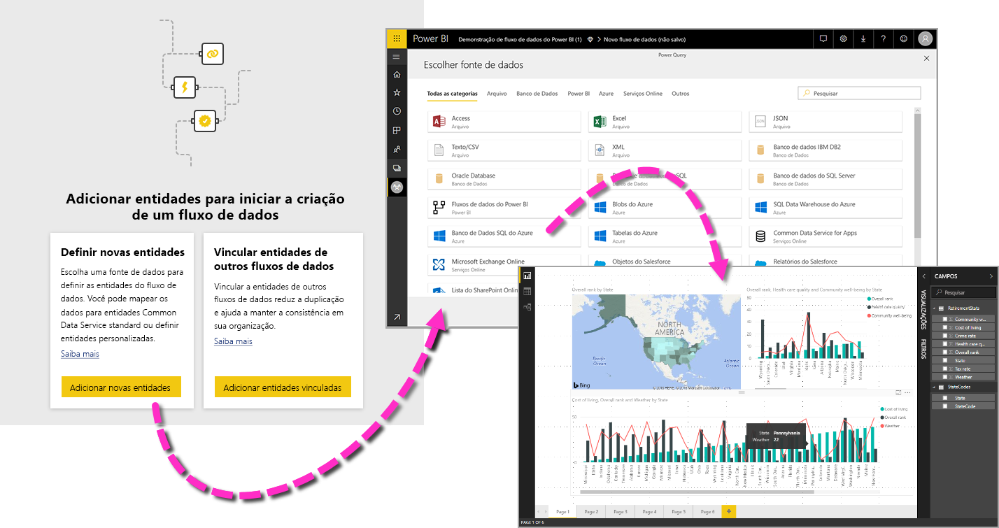

Há três etapas principais para usar um fluxo de dados:

1. Criar o fluxo de dados, usando ferramentas da Microsoft projetadas para simplificar isso
2. Agendar a frequência de atualização dos dados que você deseja trazer para o seu fluxo de dados
3. Criar o conjunto de dados usando seu fluxo de dados, por meio do Power BI Desktop 

Nas seções a seguir, examinaremos cada uma dessas etapas e nos familiarizaremos com as ferramentas fornecidas para concluir cada etapa. Vamos começar.

> [!NOTE]
> A funcionalidade de fluxo de dados está em versão prévia e está sujeita a alterações e atualizações antes da disponibilidade geral.

## Criar um fluxo de dados
Para criar um fluxo de dados, abra o serviço do Power BI em um navegador e selecione um **espaço de trabalho do aplicativo** (fluxos de dados não estão disponíveis em *meu espaço de trabalho* no serviço do Power BI) no painel de navegação à esquerda, como mostrado na tela a seguir. Você também pode criar um novo espaço de trabalho no qual criará seu novo fluxo de dados. 

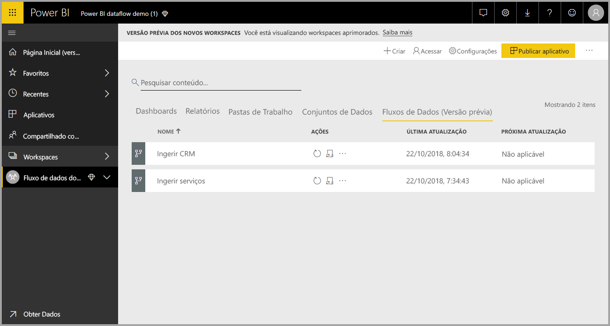

Quando você estiver em uma área de **espaço de trabalho do aplicativo** onde é possível criar um fluxo de dados, o botão **+ Criar** será exibido no canto superior direito da tela. Selecione o botão **+ Criar** e, em seguida, selecione **Fluxo de dados** na lista suspensa. 

É importante saber que há apenas *um proprietário* para qualquer fluxo de dados, que é a pessoa que o cria. Somente o proprietário pode editar o fluxo de dados. Todos os membros do **espaço de trabalho do aplicativo** que possuem permissões de leitura ou gravação no espaço de trabalho do aplicativo em que o fluxo de dados é criado podem se conectar ao fluxo de dados de dentro do **Power BI Desktop**, conforme descrito mais adiante neste artigo.

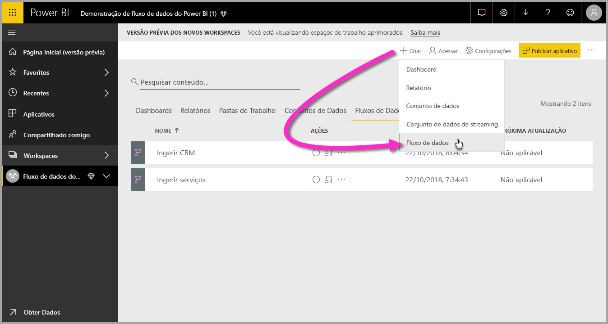

Ali, você adiciona **Entidades**, que descreveremos melhor na próxima seção.

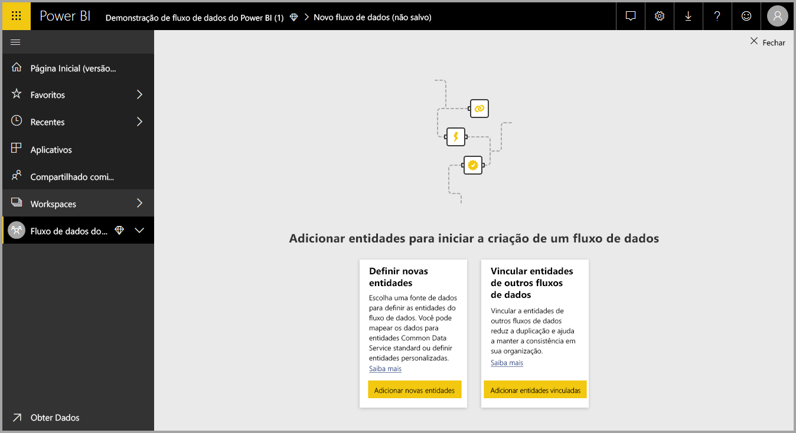

### Adicionar Entidades

Uma **entidade** é um conjunto de campos usados para armazenar dados de maneira semelhante a uma tabela em um banco de dados. Na imagem a seguir, veja a seleção de fontes de dados das quais você pode ingerir dados no Power BI.

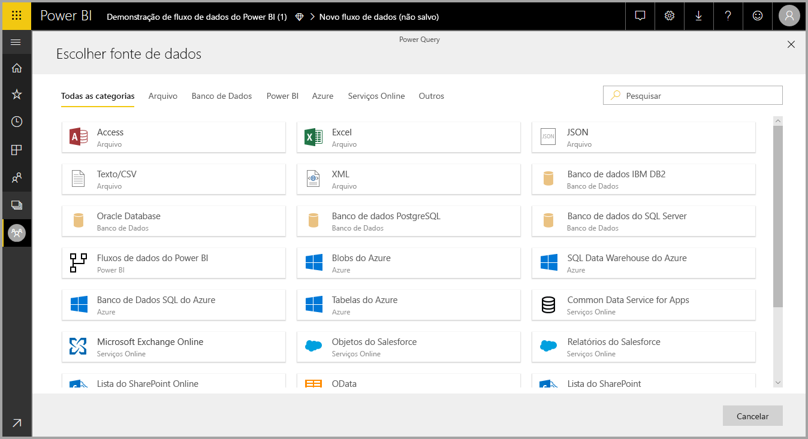

Quando você seleciona uma fonte de dados, precisa fornecer as configurações de conexão, incluindo a conta a ser usada para se conectar à fonte de dados, conforme mostrado na imagem a seguir.

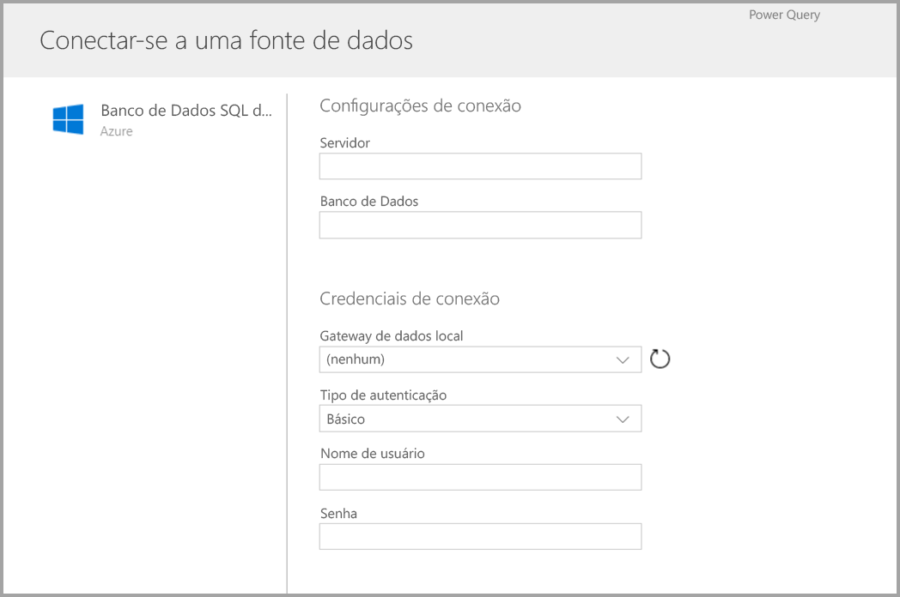

Uma vez conectado, você pode selecionar quais dados deseja usar para sua entidade. Quando você escolhe dados e uma fonte, o Power BI é subsequentemente reconectado à fonte de dados para manter os dados do seu fluxo atualizados, com a frequência que você selecionar mais tarde no processo de configuração.

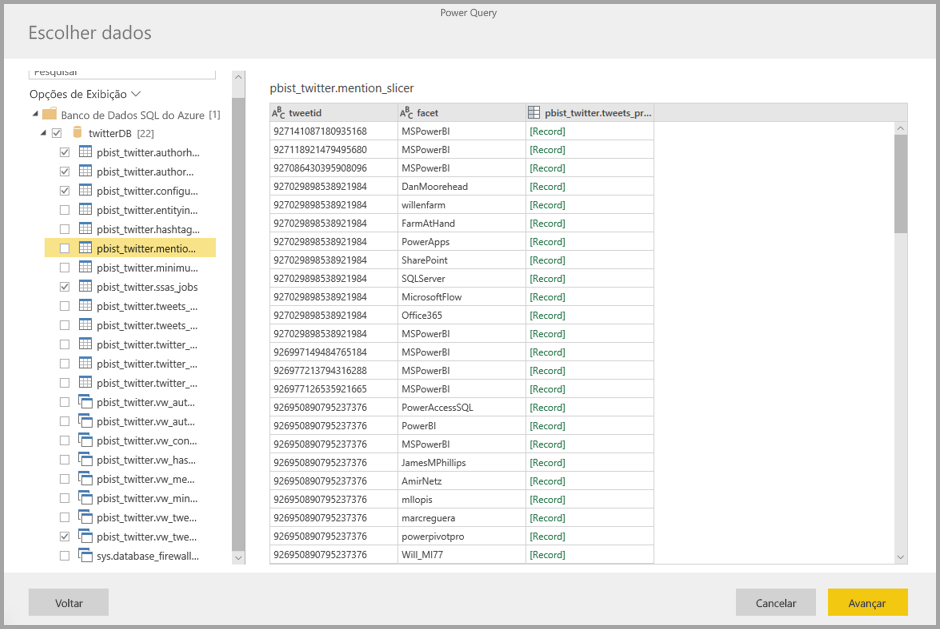

Depois de selecionar os dados a serem usados na entidade, você pode utilizar o editor de fluxo de dados para ajustar ou transformar os dados para o formato necessário para uso no seu fluxo de dados.

### Usar o editor de fluxo de dados

Depois de selecionar quais dados da sua fonte serão usados para a entidade, você pode ajustar sua seleção de dados em um formulário que funcione melhor para sua entidade, usando uma experiência de edição do Power Query, semelhante ao **Editor do Power Query** no **Power BI Desktop**. Saiba mais sobre o Power Query (o Power Query é incorporado no Power BI Desktop como o Editor do Power Query) no [Artigo de visão geral sobre consultas](desktop-query-overview.md) para Power BI Desktop. 

Se você quiser ver o código que a Consulta está criando a cada etapa ou criar seu próprio código de formatação, você pode usar o **Editor Avançado**. 

### Fluxo de dados e Common Data Service (CDM)

Entidades de fluxos de dados incluem novas ferramentas para mapear dados comerciais com facilidade para o Common Data Service (esquema padronizado da Microsoft), enriquecê-lo com dados da Microsoft e de terceiros e obter acesso simplificado ao aprendizado de máquina. Esses novos recursos podem ser utilizados para fornecer insights práticos e inteligentes sobre seus dados comerciais. Depois de concluir todas as transformações na etapa Editar Consultas, você pode mapear colunas das tabelas de fonte de dados para campos de entidade padrão conforme definido pelo Common Data Service. As entidades padrão têm um esquema conhecido definido pelo modelo de dados comum.

Obtenha mais informações sobre essa abordagem e sobre o Common Data Service no artigo [O que é o Common Data Service](https://docs.microsoft.com/powerapps/common-data-model/overview).

Para utilizar o Common Data Service no seu fluxo de dados, clique na transformação **Mapear para Padrão** na caixa de diálogo **Editar Consultas**. Na tela **Mapear Entidades**, você pode selecionar a entidade padrão para a qual você deseja mapear.

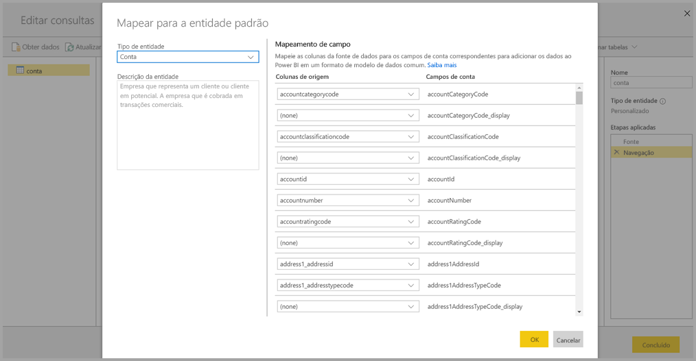

Quando você mapeia uma coluna de origem para o campo padrão, ocorre o seguinte:

1. A coluna de origem assume o nome de campo padrão (a coluna será renomeada se os nomes forem diferentes)
2. A coluna de fontes obtém o tipo de dados de campo padrão

Para manter a entidade padrão do Common Data Service, todos os campos padrão que não estão mapeados obtêm valores *Nulo*.

Todas as colunas de origem que não estão mapeadas permanecem como estão, para garantir que o resultado do mapeamento seja uma entidade padrão com campos personalizados.

Depois de concluir as seleções e sua entidade e configurações de dados estiverem prontas para serem salvas, você pode selecionar **Salvar** no menu. É possível criar várias entidades selecionando o botão **Adicionar entidades**, além de Editar entidades para refinar as consultas e entidades criadas.

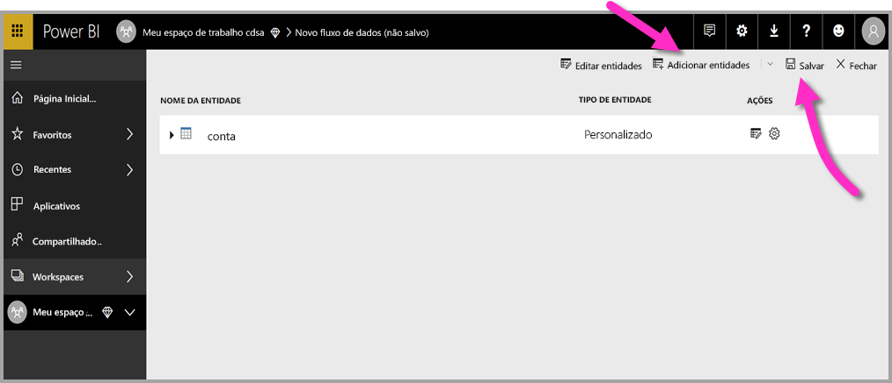

Quando você seleciona **Salvar**, é solicitado a nomear seu fluxo de dados e fornecer uma descrição.

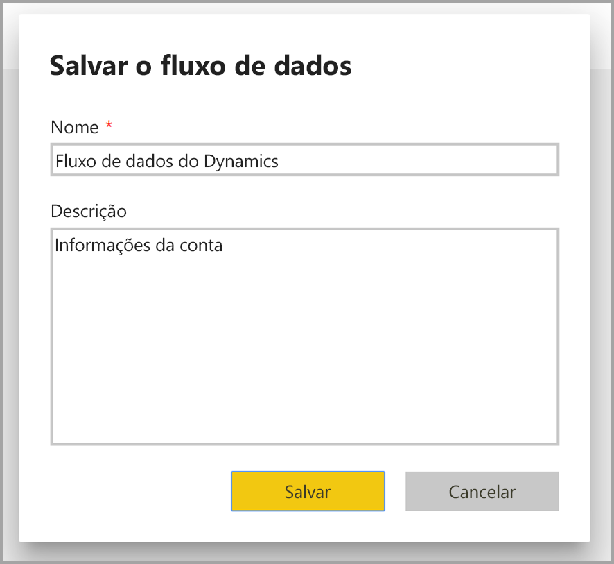

Quando você estiver pronto e selecionar o botão **Salvar**, será exibida uma janela informando que o **fluxo de dados** foi criado. 

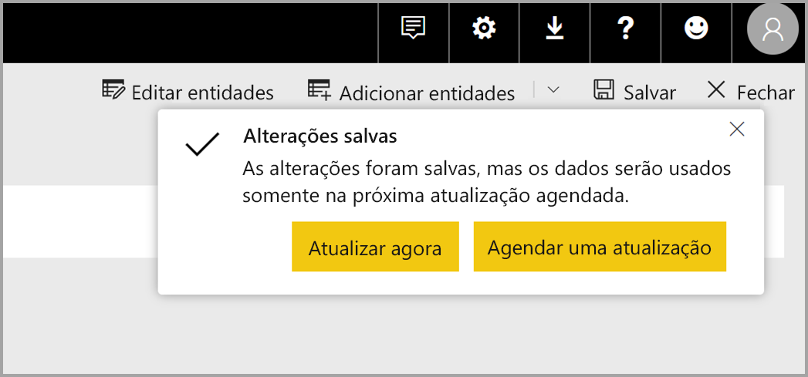

Ótimo, agora você está pronto para a próxima etapa, que é agendar a frequência de atualização de suas fontes de dados.

## Agendar a frequência de atualização

Depois que seu fluxo de dados tiver sido salvo, agende a frequência de atualização para cada uma das suas fontes de dados conectadas.

Os fluxos de dados do Power BI usam o processo de atualização de dados do Power BI para manter seus dados atualizados. No **serviço do Power BI**, na seção **espaço de trabalho do aplicativo**, há uma coleção de áreas em que suas informações podem ser listadas, incluindo fluxos de dados, conforme mostrado na imagem a seguir.

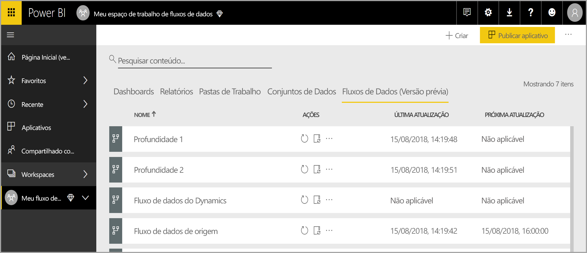

A entrada *Fluxo de dados dinâmico* na imagem anterior é o fluxo de dados que criamos na seção anterior. Para agendar a atualização, selecione o ícone **Agendar atualização**, na seção **Ações**, conforme mostrado na imagem a seguir. 

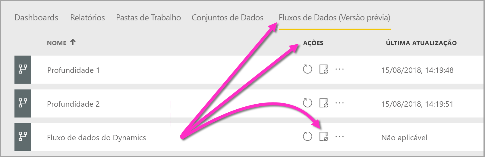

Quando você seleciona o ícone **Agendar atualização**, é levado para o painel **Agendar atualização**, que permite definir a frequência e hora de atualização do fluxo de dados.

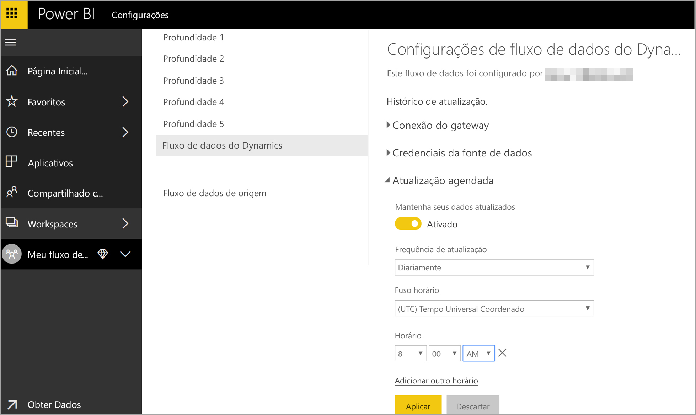

Confira mais informações sobre o agendamento de atualização no artigo sobre como [configurar a atualização agendada](refresh-scheduled-refresh.md), que descreve o comportamento de atualização de conjuntos de dados do Power BI. Os fluxos de dados comportam-se da mesma forma que os conjuntos de dados do Power BI no que diz respeito às configurações de atualização. 

## Conectar-se ao fluxo de dados no Power BI Desktop

Depois que você tiver criado seu fluxo de dados e agendado a frequência de atualização para cada fonte de dados que preencherá o modelo, estará pronto para a terceira e última etapa, que é conectar-se ao seu fluxo de dados dentro do **Power BI Desktop**. 

Para conectar-se ao fluxo de dados, no Power BI Desktop, selecione **Obter dados > Power BI > Fluxos de dados do Power BI (beta)**, conforme mostrado na imagem a seguir.

A partir daí, navegue até o **espaço de trabalho do aplicativo** em que você salvou seu fluxo de dados, selecione o fluxo de dados e, em seguida, selecione na lista as entidades criadas.

Também é possível usar a **barra de pesquisa**, na parte superior da janela, para localizar rapidamente o nome do fluxo de dados ou das entidades entre muitas entidades de fluxo de dados.

Quando você seleciona a entidade e o botão **Carregar**, as entidades aparecem no painel **Campos** no **Power BI Desktop** e são exibidas e se comportam como **tabelas** de qualquer outro conjunto de dados.

## Como usar fluxos de dados armazenados no Azure Data Lake Storage Gen2

Algumas organizações podem querer usar seu próprio armazenamento para criação e gerenciamento de fluxos de dados. Você pode integrar fluxos de dados ao Azure Data Lake Storage Gen2, se seguir os requisitos e gerenciar as permissões corretamente. A documentação de todos os requisitos para essa abordagem pode ser encontrada começando com o documento de visão geral, [Integração entre fluxos de dados e o Azure Data Lake (versão prévia)](service-dataflows-azure-data-lake-integration.md).

## Solução de problemas de conexões de dados

Pode haver ocasiões em que a conexão a fontes de dados para fluxos de dados apresenta problemas. Esta seção fornece dicas de solução de problemas para quando eles surgirem. 

* **Conector do SalesForce**: o uso de uma conta de avaliação para o Salesforce com fluxos de dados resulta em uma falha de conexão sem nenhuma informação fornecida. Para resolver esse problema, use uma conta do Salesforce de produção ou uma conta de desenvolvedor para teste.

* **Conector do SharePoint**: verifique se você forneceu o endereço da raiz do site do SharePoint, sem subpastas ou documentos. Por exemplo, use um link semelhante ao seguinte: https://microsoft.sharepoint.com/teams/ObjectModel/ 

* **Conector de arquivo JSON** – Atualmente, você pode se conectar a um arquivo JSON usando somente autenticação básica.  Conectar-se a um arquivo JSON fornecendo as credenciais dentro da URL (por exemplo, https://XXXXX.blob.core.windows.net/path/file.json?sv=2019-01-01&si=something&sr=c&sig=123456abcdefg...) **não** é atualmente compatível.  

* **SQL Data Warehouse do Azure** – No momento, os fluxos de dados não oferecem suporte à autenticação do AAD (Azure Active Directory) para o SQL Data Warehouse do Azure. Use a autenticação Básica para este cenário.

## Próximas etapas

Este artigo descreveu como criar seu próprio **fluxo de dados**, bem como um conjunto de dados e relatório no **Power BI Desktop** para tirar proveito dele. Os artigos a seguir são úteis para ver cenários e obter mais informações ao usar fluxos de dados:

* [Preparação de dados de autoatendimento com fluxos de dados](service-dataflows-overview.md)
* [Uso de entidades computadas no Power BI Premium (versão prévia)](service-dataflows-computed-entities-premium.md)
* [Uso de fluxos de dados com fontes de dados locais (versão prévia)](service-dataflows-on-premises-gateways.md)
* [Recursos de desenvolvedor para fluxos de dados do Power BI (versão prévia)](service-dataflows-developer-resources.md)
* [Integração entre fluxos de dados e o Azure Data Lake (versão prévia)](service-dataflows-azure-data-lake-integration.md)

Leia este artigo de visão geral para saber mais sobre o Common Data Service:
* [Common Data Service - visão geral ](https://docs.microsoft.com/powerapps/common-data-model/overview)
* [Saiba mais sobre o esquema Common Data Service e entidades no GitHub](https://github.com/Microsoft/CDM)

Artigos relacionados do Power BI Desktop:

* [Conectar-se a conjuntos de dados no serviço do Power BI no Power BI Desktop](desktop-report-lifecycle-datasets.md)
* [Visão geral da Consulta no Power BI Desktop](desktop-query-overview.md)

Artigos relacionados do serviço Power BI:
* [Configuração de atualização agendada](refresh-scheduled-refresh.md)
