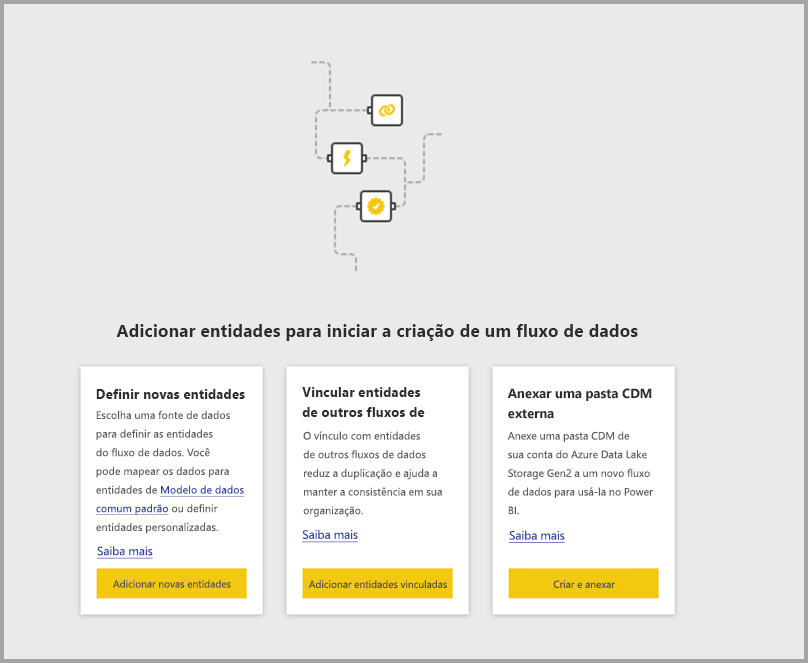
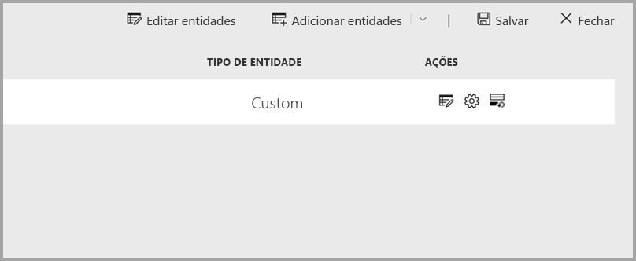
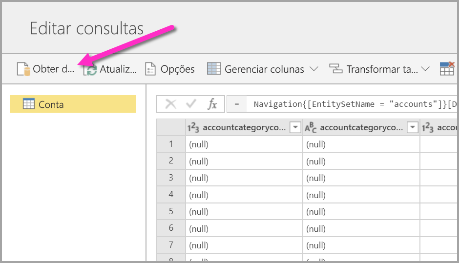
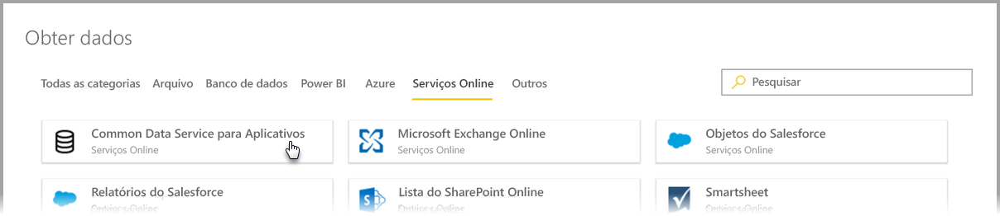
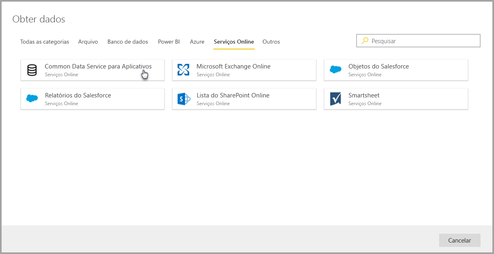
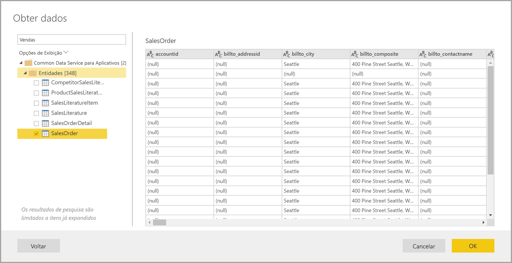
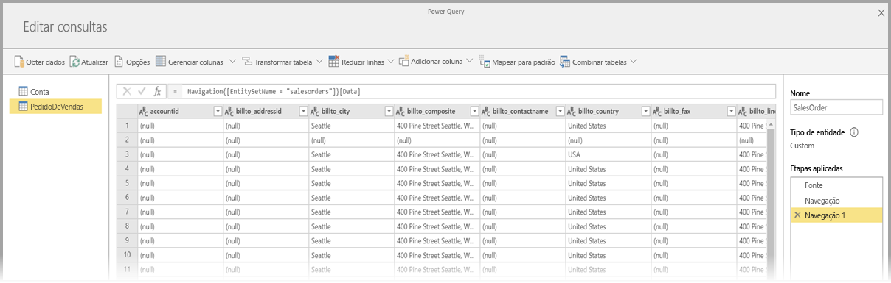
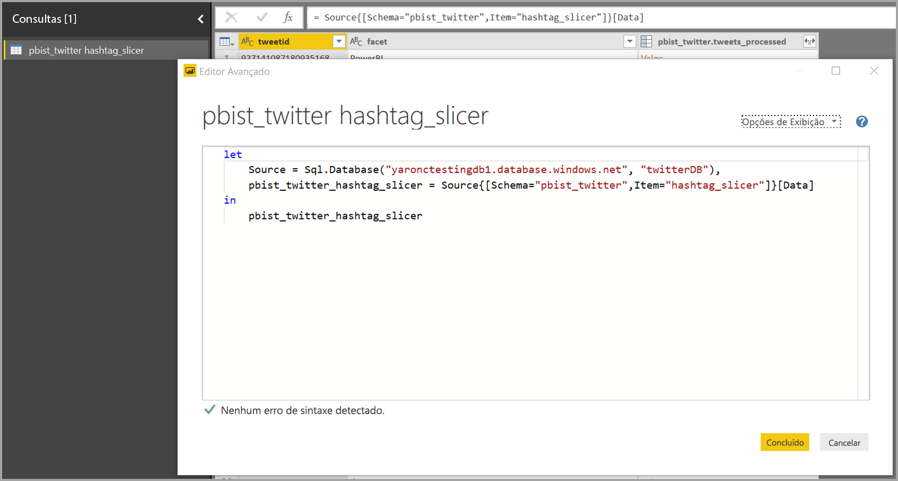
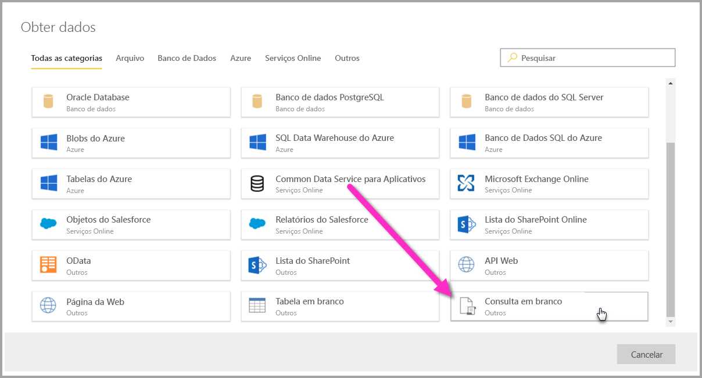
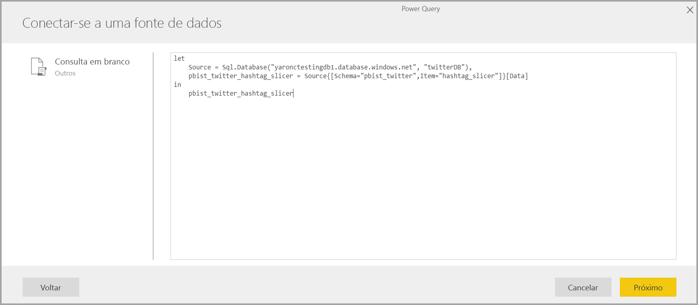

# Conectar-se a fontes de dados para fluxos de dados do Power BI

Com os fluxos de dados do Power BI, você pode se conectar a várias fontes de dados para criar fluxos de dados ou adicionar novas entidades a um fluxo de dados existente.

Este artigo lista várias fontes de dados disponíveis para criar fluxos de dados ou a serem adicionadas a eles e descreve como criar esses fluxos de dados usando essas fontes de dados.

Para obter uma visão geral de como criar e usar fluxos de dados, consulte [criando e usando fluxos de dados no Power BI](service-dataflows-create-use.md).

## Criar um fluxo de dados usando uma fonte de dados

Para conectar-se aos dados, no **serviço do Power BI** selecione o item de menu **+ Criar**, em seguida, selecione **fluxo de dados** no menu que aparece. Após a seleção, a imagem a seguir será exibida na tela do serviço do Power BI. 

Se o fluxo de dados já existir, você poderá adicionar novas entidades a ele selecionando **Adicionar entidades**, conforme mostrado abaixo, ou selecionando **Obter dados** na ferramenta de criação de fluxo de dados.

A imagem a seguir mostra o botão **Obter dados** na ferramenta de criação de fluxo de dados. 

## Fontes de dados para fluxos de dados

Você pode exibir as fontes de dados disponíveis selecionando **Obter Dados** na ferramenta de criação de fluxo de dados, que exibirá uma caixa de diálogo para selecionar as categorias e cada fonte de dados, conforme mostrado na imagem a seguir.

As fontes de dados para fluxos de dados são organizadas nas categorias a seguir, que aparecem na parte superior da caixa de diálogo **Obter dados**:

* Todas as categorias
* Arquivo
* Banco de dados
* Power BI
* Azure
* Serviços online
* Outros

A categoria **Todas as categorias** contém todas as fontes de dados de todas as categorias. 

A categoria **Arquivo** inclui as seguintes conexões de dados disponíveis para fluxos de dados:

* Acessar
* Excel
* JSON
* Texto/CSV
* XML

A categoria **Banco de dados** inclui as seguintes conexões de dados disponíveis para fluxos de dados:

* Banco de dados IBM DB2
* Banco de dados MySQL
* Banco de dados Oracle
* Banco de dados PostgreSQL
* Banco de dados do SQL Server
* Banco de dados Sybase
* Banco de dados Teradata
* Vertica

A categoria **Power BI** inclui as seguintes conexões de dados disponíveis para fluxos de dados:

* Fluxos de dados do Power BI

A categoria **Azure** inclui as seguintes conexões de dados disponíveis para fluxos de dados:

* Blobs do Azure
* Azure Data Explorer
* SQL Data Warehouse do Azure
* Banco de Dados SQL do Azure
* Tabelas do Azure

A categoria **Serviços Online** inclui as seguintes conexões de dados disponíveis para fluxos de dados:

* Amazon Redshift
* Common Data Service para Aplicativos
* Microsoft Exchange Online
* Objetos do Salesforce
* Relatórios do Salesforce
* Lista do SharePoint Online
* Smartsheet

O **outros** categoria inclui as seguintes conexões de dados disponíveis para fluxos de dados:

* Active Directory
* OData
* Lista do SharePoint
* API Web
* Página da Web
* Tabela em branco
* Consulta em Branco

## Conectando-se a uma fonte de dados

Para conectar-se a uma fonte de dados, selecione-a. Usaremos um exemplo para mostrar como funciona o processo, mas cada conexão de dados para fluxos de dados tem um processo semelhante. Conectores diferentes podem exigir credenciais específicas ou outras informações, mas o fluxo é semelhante. Em nosso exemplo, você verá na imagem a seguir que o **Common Data Service for Apps** está selecionado na categoria **Serviços online** de conexão de dados.

Uma janela de conexão para a conexão de dados selecionado é exibida. Se forem necessárias credenciais, será solicitado que você as forneça. A imagem a seguir mostra uma URL do servidor sendo inserida para conectar-se a um servidor do Common Data Service for Apps.

Depois que as informações de conexão de URL ou de recurso do servidor forem fornecidas, selecione **Entrar** para inserir as credenciais a serem usadas para o acesso a dados, em seguida, selecione **Avançar**.

O **Power Query Online** inicia e estabelece a conexão com a fonte de dados e, em seguida, apresenta as tabelas disponíveis dessa fonte de dados na janela **Navegador**, mostrada na imagem a seguir.

Você pode selecionar as tabelas e os dados a serem carregados marcando a caixa de seleção ao lado de cada um no painel esquerdo. Para carregar os dados, selecione **OK** na parte inferior do painel **Navegador**. Será exibida uma caixa de diálogo do Power Query Online, na qual você pode editar consultas e realizar outras transformações desejadas nos dados selecionados.

Isso é tudo para ela. Outras fontes de dados têm fluxos semelhantes e usam o Power Query Online para editar e transformar os dados inseridos no fluxo de dados.

## Conectando-se a fontes de dados adicionais

Há conectores de dados adicionais que não são mostrados na interface do usuário de fluxos de dados do Power BI, mas são permitidos mediante algumas etapas adicionais. 

Você pode executar as seguintes etapas para criar uma conexão com um conector que não é exibido na interface do usuário:

1. Abra o **Power BI Desktop** e selecione **Obter Dados**.
2. Abra o **Editor do Power Query** no Power BI Desktop e, em seguida, clique com o botão direito do mouse na consulta relevante e abra o **Editor Avançado**, conforme mostrado na imagem a seguir. Agora você pode copiar o script M que aparece no Editor Avançado.

     

3. Abra o fluxo de dados do Power BI e selecione **Obter dados** para uma consulta em branco, conforme mostrado na imagem a seguir.

     

4. Cole a consulta copiada na consulta em branco para o fluxo de dados.

     

E, em seguida, o script conecta-se à fonte de dados especificada. 

A lista a seguir mostra quais conectores você pode usar no momento copiando e colando a consulta M em uma consulta em branco:

* SAP Business Warehouse 
* Azure Analysis Services
* Adobe Analytics
* ODBC
* OLE DB
* Pasta
* Pasta do SharePoint Online
* Pasta do SharePoint
* HDFS do Hadoop
* Azure HDInsight (HDFS)
* Arquivo HDFS do Hadoop
* Informix (beta)

Basta fazer isso para conectar-se a fontes de dados no Power BI Desktop.

## Próximas etapas

Este artigo mostrou a quais fontes de dados você pode se conectar para fluxos de dados. Os artigos a seguir oferecem mais detalhes sobre cenários de uso comuns para fluxos de dados. 

* [Preparação de dados de autoatendimento no Power BI](service-dataflows-overview.md)
* [Criação e uso de fluxos de dados no Power BI](service-dataflows-create-use.md)
* [Usando entidades computadas no Power BI Premium](service-dataflows-computed-entities-premium.md)
* [Usando fluxos de dados com fontes de dados locais](service-dataflows-on-premises-gateways.md)
* [Recursos do desenvolvedor para fluxos de dados do Power BI](service-dataflows-developer-resources.md)
* [Integração entre fluxos de dados e o Azure Data Lake (versão prévia)](service-dataflows-azure-data-lake-integration.md)

Confira mais informações sobre o Power Query e a atualização agendada nestes artigos:
* [Visão geral da Consulta no Power BI Desktop](desktop-query-overview.md)
* [Configuração de atualização agendada](refresh-scheduled-refresh.md)

Leia este artigo de visão geral para saber mais sobre o Common Data Service:
* [Common Data Service - visão geral ](https://docs.microsoft.com/powerapps/common-data-model/overview)

